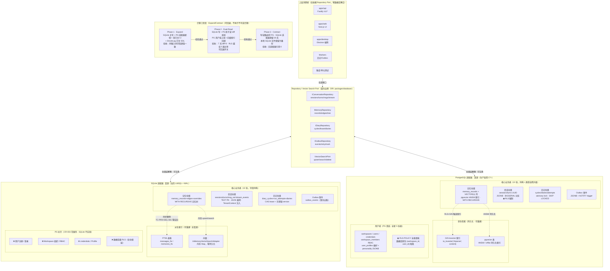

# Aervox｜思隅 数据库设计与双引擎契约（DBC）

> 文档编号：AVX-DB-001  
> 版本：v0.4（评审候选）  
> 更新日期：2026-08-25  
> 状态：Review Candidate  
> 关联：`CR-003`、`ADR-003`、`ADR-004`、`ADR-007`、`ADR-011`、`ADR-012`、`ADR-013`、`AVX-SPC-001`、`AVX-PRD-001`、`NFR-SCALE-001`、`NFR-SEC-001`

本文是持久化层的可执行契约：**数据真源、租户隔离边界、双引擎字段语义同构、派生索引生命周期、迁移 Expand/Contract 三阶段和删除传播不变量**。实现必须从同一份 `packages/database` Drizzle schema 生成双方言 DDL、Repository Port 类型和契约测试，不能只依赖本文件中的示例。

当前开发阶段（MVP 前，本地开发/集成测试优先）以 **SQLite (LibSQL) + WAL 模式** 为业务真源；待完成全部设计目标后评估启用 **PostgreSQL 17+** 为生产真源。切换仅需新增 PG 驱动适配器，不改变上层业务代码（见 [CR-003](../changes/CR-003-sqlite-primary-pg-compat.md)）。

> 范围说明：本文档的 ERD（§3/§4/§5）只承载**当前已实现或已建模的 SQLite/PG 表**，是可执行契约；PRD §8 的全生命周期数据模型覆盖清单（含阶段与实现状态）见 [§14](#14-prd-全量数据模型覆盖清单)，未落表的实体属于规划 backlog，不代表已进入实现。

## 文档变更记录

| 版本 | 日期 | 变更摘要 |
|---|---|---|
| v0.1 | 2026-08-24 | 建立数据库设计与双引擎契约：SQLite/PG ERD、迁移映射、兼容性矩阵、迁移计划、测试门禁 |
| v0.2 | 2026-08-24 | 对齐 PRD §8 全量数据模型：新增 §14 覆盖清单，逐实体标注阶段与实现状态，明确未落表规划 backlog |
| v0.3 | 2026-08-24 | MVP（R1）优先队列 22 组实体 + 独立账本全部落表：新增 24 张表与 7 个仓储 Port；§14 状态同步为已落表/已建模，覆盖度 12→35（69%） |
| v0.4 | 2026-08-25 | 统一 API / Worker 共享 SQLite 真源路径 `<repo>/data/aervox.db`：新增 §2.1 路径约定（自动建目录 / DATABASE_URL 覆盖 / WAL 多进程并发） |

---

## 1. 适用范围与不变量

1. **真源唯一**：业务事实源是各领域业务表（sessions/turns/message_versions/memory/diaries/outbox）。FTS 全文索引、向量索引、缓存和事件重放日志都是可重建的派生索引，不得承载不可再生的业务状态。
2. **租户隔离双保险**：所有业务表携带 `(workspace_id, subject_user_id)` 复合租户列；SQLite 阶段由仓储层 `assertTenantContext` 强制注入并配合数据库复合唯一/外键兜底；PostgreSQL 阶段额外启用原生 RLS 策略作为数据库级强制隔离。绕过仓储接口的裸 SQL 调用在任何阶段均属违规。
3. **删除即零召回**：业务删除或撤权必须在同一事务中删除事实源和派生索引（FTS、向量、缓存）；下游 Outbox 事件必须显式带上 redacted/reason 而非依赖异步清理。删除后立即不得通过搜索、推荐、记忆召回再现原文。
4. **外键级联不越过租户边界**：所有外键引用使用 `(tenant_cols + fk_col)` 语义对齐，防止跨租户的孤儿行误删。
5. **Port 接口是唯一消费边界**：应用代码只能依赖 `IConversationRepository`、`IMemoryRepository`、`IDiaryRepository`、`IOutboxRepository` 和 `IVectorSearchPort`。消费者不得引入方言特定类型、直接读/写 FTS 虚表或向量存储。
6. **字段名零重命名、语义零漂移**：SQLite → PostgreSQL 的迁移仅做**类型自然升级**（TEXT→UUID/TIMESTAMPTZ/JSONB/BOOLEAN），不做字段重命名或业务语义改写；新列必须可空或带默认；破坏性变更必须走版本号和 `CR-*`。
7. **SQLite 阶段不启用用户注册**：用户域（workspaces/users/credentials/workspace_members/user_profiles）5 张表仅在 PostgreSQL 阶段创建。SQLite 阶段 `subject_user_id` 视为本地标识字符串，不关联凭证或组织角色。

---

## 2. 数据库选型总览与阶段策略

| 维度 | SQLite（当前真源 · CR-003） | PostgreSQL（生产真源 · 后续启用） |
|---|---|---|
| 部署形态 | 本地单文件或内存；零外部依赖 | 独立数据库实例 / 托管服务 |
| 方言驱动 | `@libsql/client` + `drizzle-orm/sqlite-core` | `pg` / `postgres.js` + `drizzle-orm/pg-core` |
| 事务 | 单写多读、WAL 模式、保存点 | MVCC、SERIALIZABLE 可选、advisory lock |
| 递归查询 | SQLite 3.8.3+ `WITH RECURSIVE` CTE | 原生 `WITH RECURSIVE`，CTE 语义等价 |
| 全文检索 | FTS5 虚表 `messages_fts` / `memories_fts`（可重建） | 原生 `tsvector + GIN`，trigger 同步 `to_tsvector('zhparser', ...)` |
| 向量检索 | `InMemoryVectorSearchAdapter`（内存 Port，零依赖，可重建） | `pgvector` 扩展 `VECTOR(n)` + HNSW / ivfflat 持久化索引 |
| 租户隔离 | 应用层 `TenantContext` 强注入 + 唯一/外键兜底 | 应用层同等校验 + 数据库原生 `ROW LEVEL SECURITY` 双保险 |
| 用户注册 | 范围外（CR-003 明确不实现） | users / credentials / workspace_members / user_profiles 5 张表上线 |
| 并发控制 | SQLite 级联 write 串行化 + lease/fencing token；Worker 竞争 | `SELECT ... FOR UPDATE SKIP LOCKED` + advisory lock；原生并发 |
| 典型部署位置 | API / Worker / 端侧共享 `<repo>/data/aervox.db`（见 §2.1） | 云端生产实例、多端共享真源 |

> 全量覆盖：上表只描述已落库/已建模表。PRD §8 全生命周期数据模型的逐实体覆盖清单（阶段 × 实现状态）见 [§14](#14-prd-全量数据模型覆盖清单)。

### 2.1 SQLite 共享真源路径约定

- **共享真源文件**：所有进程（API、Worker、未来端侧）默认使用同一文件 `<repo>/data/aervox.db`。路径由 `packages/database/src/client.ts` 的 `createDatabase` 经 `import.meta.url` 定位仓库根后计算，源码与编译产物（`dist`）均解析到同一位置，避免各包各自落库导致数据不互通。
- **自动建目录**：`createDatabase` 在 `createClient`（libsql 构造时即打开文件）之前自动 `fs.mkdirSync(data/, { recursive: true })`，首次启动无需手工创建。
- **覆盖优先级**：`config.url` > `DATABASE_URL` 环境变量 > 默认共享路径。临时隔离/测试仍可显式传 `url` 或设 `DATABASE_URL`。
- **多进程并发**：SQLite WAL 模式（`PRAGMA journal_mode=WAL; synchronous=NORMAL; busy_timeout`）支持 API / Worker 多进程同时读写同一文件；写事务由 SQLite 串行化 + 仓储层 lease/fencing（§9）兜底。
- **初始化幂等**：`initDatabaseSchema` 使用 `CREATE TABLE IF NOT EXISTS`，多进程重复初始化安全。

---

## 3. SQLite 数据库模型图（当前开发阶段 · LibSQL）

4 个业务域 · 13 张表 · FTS5 全文检索 · WAL 模式 · 租户隔离 (workspace_id, subject_user_id)。

```mermaid
erDiagram
    %% ============ ① 会话域 Conversations ============
    sessions {
        TEXT id PK "主键"
        TEXT workspace_id "租户隔离"
        TEXT subject_user_id "租户隔离"
        TEXT title "会话标题"
        TEXT created_at "ISO8601 UTC"
        TEXT updated_at "ISO8601 UTC"
    }

    turns {
        TEXT id PK "主键"
        TEXT session_id FK "→ sessions.id (CASCADE)"
        TEXT workspace_id "租户隔离"
        TEXT subject_user_id "租户隔离"
        TEXT idempotency_key "租户内唯一"
        TEXT status "Created/Streaming/Done/Error"
        INTEGER last_sequence "最后事件序号"
        TEXT error "JSON 错误体"
        TEXT created_at ""
        TEXT updated_at ""
    }

    message_versions {
        TEXT id PK "主键"
        TEXT turn_id FK "→ turns.id (CASCADE)"
        TEXT workspace_id ""
        TEXT subject_user_id ""
        TEXT role "user/assistant/system"
        INTEGER version "同一 turn 内递增"
        TEXT content "消息内容"
        INTEGER is_redacted "0/1 脱敏标记"
        TEXT created_at ""
    }

    turn_stream_events {
        TEXT id PK "主键"
        TEXT turn_id FK "→ turns.id (CASCADE)"
        TEXT workspace_id ""
        TEXT subject_user_id ""
        INTEGER sequence "租户内 turn 有序"
        TEXT event_type "message/delta/done/error/redacted"
        INTEGER payload_version "默认 1"
        TEXT data "JSON 载荷"
        TEXT occurred_at "事件发生时间"
    }

    %% ============ ② 记忆域 Memory ============
    memory_records {
        TEXT id PK "主键"
        TEXT workspace_id ""
        TEXT subject_user_id ""
        TEXT layer "四层: ephemeral/short_term/long_term/system"
        TEXT type "user_fact / user_preference / learning_event / inference"
        TEXT content "记忆正文"
        TEXT canonical_parent_id FK "自引用 → memory_records.id (记忆树父节点)"
        TEXT source_turn_id FK "来源 → turns.id"
        INTEGER version "记忆版本号"
        INTEGER is_deleted "0/1 软删除"
        TEXT created_at ""
        TEXT updated_at ""
    }

    memory_edges {
        TEXT id PK "主键"
        TEXT workspace_id ""
        TEXT subject_user_id ""
        TEXT source_id FK "→ memory_records.id (CASCADE)"
        TEXT target_id FK "→ memory_records.id (CASCADE)"
        TEXT relation_type "parent_child / cross_topic / causal / contrast"
        TEXT created_at ""
    }

    memory_projection_overrides {
        TEXT id PK "主键"
        TEXT workspace_id ""
        TEXT subject_user_id ""
        TEXT memory_record_id FK "→ memory_records.id (CASCADE)"
        TEXT override_type "rename / reparent / lock"
        TEXT custom_title "用户自定义标题"
        TEXT custom_parent_id "用户自定义父节点"
        INTEGER is_locked "0/1 锁定"
        TEXT created_at ""
        TEXT updated_at ""
    }

    %% ============ ③ 日记域 Diary ============
    diaries {
        TEXT id PK "主键"
        TEXT workspace_id ""
        TEXT subject_user_id ""
        TEXT local_date "YYYY-MM-DD 日期标签"
        INTEGER auto_generated "1=自动 / 0=手动，条件唯一索引"
        TEXT title ""
        TEXT content "日记全文"
        INTEGER version ""
        TEXT created_at ""
        TEXT updated_at ""
    }

    diary_cycles {
        TEXT id PK "主键"
        TEXT workspace_id ""
        TEXT subject_user_id ""
        TEXT schedule_epoch_id "来自 schedule_revisions"
        TEXT local_date "归属日期"
        TEXT previous_cutoff_at "前一窗口截止 (ISO)"
        TEXT cutoff_at "本窗口截止 (ISO)"
        TEXT status "Scheduled/Claimed/Generating/Validating/Published/Skipped/Failed/Cancelled"
        INTEGER schedule_version "乐观锁"
        INTEGER fencing_token "lease 栅栏令牌"
        TEXT diary_id FK "→ diaries.id (生成后回填)"
        TEXT created_at ""
        TEXT updated_at ""
    }

    diary_schedule_revisions {
        TEXT id PK "主键"
        TEXT workspace_id ""
        TEXT subject_user_id ""
        INTEGER revision "修订号递增"
        INTEGER enabled "0/1"
        TEXT cron_time "Cron 表达式"
        TEXT timezone "时区如 Asia/Shanghai"
        TEXT initial_window_start "首个窗口起始"
        TEXT created_at ""
    }

    diary_run_attempts {
        TEXT id PK "主键"
        TEXT cycle_id FK "→ diary_cycles.id (CASCADE)"
        INTEGER schedule_version "快照时版本"
        TEXT worker_id "执行 Worker ID"
        INTEGER attempt "重试次数"
        TEXT status "Claimed/Generating/..."
        TEXT lease_expires_at "lease 过期时间"
        TEXT created_at ""
    }

    %% ============ ④ Outbox + 派生索引 ============
    outbox_events {
        TEXT id PK "主键"
        TEXT workspace_id ""
        TEXT subject_user_id ""
        TEXT control_event_id "关联 RecoveryControlLedger"
        TEXT idempotency_key "租户内唯一"
        TEXT event_type ""
        TEXT payload "JSON 事件载荷"
        TEXT status "pending/published/failed/dead_letter"
        INTEGER retry_count "重试次数"
        TEXT last_error ""
        TEXT created_at ""
        TEXT published_at ""
    }

    %% 派生 FTS5 虚表（可重建，非真源）
    messages_fts {
        TEXT id UNINDEXED "FK → message_versions.id"
        TEXT workspace_id UNINDEXED
        TEXT subject_user_id UNINDEXED
        TEXT content "分词内容"
    }
    memories_fts {
        TEXT id UNINDEXED "FK → memory_records.id"
        TEXT workspace_id UNINDEXED
        TEXT subject_user_id UNINDEXED
        TEXT content "分词内容"
    }

    %% ============ 关系 ============
    sessions ||--o{ turns : "1:N (CASCADE delete)"
    turns ||--o{ message_versions : "1:N (CASCADE)"
    turns ||--o{ turn_stream_events : "1:N (CASCADE, SSE重放)"

    memory_records ||--o{ memory_edges : "→ source (CASCADE)"
    memory_records ||--o{ memory_edges : "→ target (CASCADE)"
    memory_records ||--o{ memory_projection_overrides : "1:N 投影覆盖"
    memory_records ||--o{ memory_records : "自引用 canonical_parent_id (记忆树)"
    turns ||--o{ memory_records : "来源 source_turn_id"

    diary_schedule_revisions ||--o{ diary_cycles : "派生周期 (epoch_id)"
    diary_cycles ||--o{ diary_run_attempts : "1:N lease 尝试"
    diaries o{--|| diary_cycles : "← 生成后回填 diary_id"

    %% 派生索引引用
    message_versions }o--|| messages_fts : "同步/可重建虚表"
    memory_records }o--|| memories_fts : "同步/可重建虚表"
```

### 3.1 租户列与时间列约定

[schema/common.ts](../../packages/database/src/schema/common.ts#L6-L17) 定义的 `tenantColumns` 与 `timestampColumns` 通过 Drizzle 展开在所有业务表上，避免遗漏：

- `tenantColumns = (workspace_id TEXT NOT NULL, subject_user_id TEXT NOT NULL)`：每个仓储方法首个参数必须是 `TenantContext`；`assertTenantContext` 在执行 SQL 前先校验非空且格式合法。
- `timestampColumns = (created_at TEXT NOT NULL, updated_at TEXT NOT NULL)`：全部 ISO8601 UTC 字符串，默认通过 `$defaultFn(() => new Date().toISOString())` 在 ORM 层写入；**不得使用数据库服务器 `CURRENT_TIMESTAMP`**，避免与应用时区漂移。
- 时间类字段命名规则：生成时刻用 `created_at`、修改用 `updated_at`、发生/事件时刻用 `occurred_at`、计划窗口用 `cutoff_at`、失效用 `expires_at`、发布用 `published_at`。不可混用。

### 3.2 关键索引与唯一约束清单

| 表 | 索引名称 | 构成 | 类型 | 安全作用 |
|---|---|---|---|---|
| sessions | `sessions_tenant_idx` | `(workspace_id, subject_user_id)` | 普通 | 租户列表查询加速 |
| turns | `turns_tenant_idempotency_idx` | `(workspace_id, subject_user_id, idempotency_key)` | UNIQUE | 幂等重放底线 |
| turns | `turns_session_idx` | `(session_id)` | 普通 | 会话内 Turn 列表 |
| message_versions | `message_versions_turn_ver_idx` | `(turn_id, version)` | UNIQUE | 版本递增、避免跳号 |
| message_versions | `message_versions_tenant_idx` | `(workspace_id, subject_user_id)` | 普通 | 租户消息搜索 |
| turn_stream_events | `turn_stream_events_turn_seq_idx` | `(turn_id, sequence)` | UNIQUE | 持久化顺序、SSE 重放高水位 |
| diaries | `diaries_auto_unique_idx` | `(ws, user, local_date) WHERE auto_generated = 1` | 条件 UNIQUE | 同一天只允许 1 份自动日记 |
| diary_cycles | `diary_cycles_tenant_idx` | `(ws, user, cutoff_at)` | 普通 | 周期窗口查询 |
| memory_records | `memory_records_tenant_layer_idx` | `(ws, user, layer, is_deleted)` | 普通 | 记忆分层检索 |
| outbox_events | `outbox_tenant_idempotency_idx` | `(ws, user, idempotency_key)` | UNIQUE | Outbox 幂等底线 |
| outbox_events | `outbox_status_idx` | `(status, created_at)` | 普通 | 待发布/死信扫描 |

### 3.3 SQLite 特有实现约束

1. **WAL 模式必须开启**：`PRAGMA journal_mode=WAL; PRAGMA synchronous=NORMAL; PRAGMA foreign_keys=ON;`，防止默认 DELETE 日志的写串行化退化。
2. **FK 强制开启**：每个连接先执行 `PRAGMA foreign_keys=ON;`，否则 SQLite 默认不检查外键。
3. **单连接串行写**：`Database` 对象在 Node.js 主进程/Worker 间复用一个 `client` 并使用串行化队列，避免 `SQLITE_BUSY`；高并发写入压力时，通过 Outbox 出账再异步发布，避免业务事务过大。
4. **FTS5 删除同步**：`message_versions` / `memory_records` 的插入、更新、软删除必须在同一事务内同步 `indexMessageFts` / `deleteMessageFts`；禁止延迟异步更新，避免删除窗口期仍能被搜索召回（TC-PRIV-DEL-001）。
5. **记忆递归查询**：记忆树投影必须使用 `WITH RECURSIVE` CTE 查询 canonical_parent 层级，禁止在应用层 N+1 循环递归拼树。

---

## 4. PostgreSQL 生产数据库模型图（17+ · 含用户注册 + RLS）

5 个域 · 用户注册上线 · RLS 行级安全 · pgvector 向量 · 同构业务表 · 组织级 workspace。

```mermaid
erDiagram
    %% ============ ① 用户域 Identity（PG 阶段上线，CR-003 范围外）============
    workspaces {
        UUID id PK "组织 ID"
        TEXT name "组织名"
        TEXT slug UNIQUE "短标识"
        TEXT plan "free/pro/enterprise"
        TIMESTAMPTZ created_at ""
        TIMESTAMPTZ updated_at ""
    }

    users {
        UUID id PK "用户 ID"
        TEXT email UNIQUE "登录邮箱"
        TEXT status "active/inactive/suspended"
        BOOLEAN email_verified "邮箱验证"
        TIMESTAMPTZ last_login_at ""
        TIMESTAMPTZ created_at ""
        TIMESTAMPTZ updated_at ""
        "RLS": "subject_user_id = current_setting('app.user_id')::uuid"
    }

    user_credentials {
        UUID user_id PK,FK "→ users.id (1:1)"
        TEXT password_hash "bcrypt"
        TEXT salt "bcrypt salt"
        TEXT password_algo "bcrypt/v2"
        TIMESTAMPTZ password_changed_at ""
        TIMESTAMPTZ created_at ""
    }

    workspace_members {
        UUID id PK
        UUID workspace_id FK "→ workspaces.id"
        UUID user_id FK "→ users.id"
        TEXT role "owner/admin/member"
        TIMESTAMPTZ joined_at ""
    }

    user_profiles {
        UUID user_id PK,FK "→ users.id"
        TEXT nickname "昵称"
        TEXT avatar_url "头像"
        JSONB personality "人格问卷结果"
        JSONB preferences "偏好设置(语言/风格/通知)"
        TEXT locale "zh-CN etc"
        TEXT timezone ""
        TIMESTAMPTZ created_at ""
        TIMESTAMPTZ updated_at ""
        "RLS": "user_id = current_setting('app.user_id')::uuid"
    }

    %% ============ ② 会话域（同构 + 类型增强 + RLS）============
    sessions {
        UUID id PK
        UUID workspace_id FK "→ workspaces.id"
        UUID subject_user_id FK "→ users.id"
        TEXT title ""
        TIMESTAMPTZ created_at ""
        TIMESTAMPTZ updated_at ""
        "RLS": "workspace_id AND subject_user_id 强制匹配"
    }

    turns {
        UUID id PK
        UUID session_id FK "→ sessions.id ON DELETE CASCADE"
        UUID workspace_id ""
        UUID subject_user_id ""
        TEXT idempotency_key "租户内 UNIQUE"
        TEXT status ""
        INTEGER last_sequence ""
        JSONB error ""
        TIMESTAMPTZ created_at ""
        TIMESTAMPTZ updated_at ""
    }

    message_versions {
        UUID id PK
        UUID turn_id FK "→ turns.id CASCADE"
        UUID workspace_id ""
        UUID subject_user_id ""
        TEXT role ""
        INTEGER version "UNIQUE(turn_id, version)"
        TEXT content ""
        BOOLEAN is_redacted ""
        TIMESTAMPTZ created_at ""
    }

    turn_stream_events {
        BIGSERIAL id PK "自增替代 TEXT（分区友好）"
        UUID turn_id FK "→ turns.id CASCADE"
        UUID workspace_id ""
        UUID subject_user_id ""
        INTEGER sequence "UNIQUE(turn_id, sequence)"
        TEXT event_type ""
        INTEGER payload_version ""
        JSONB data ""
        TIMESTAMPTZ occurred_at ""
        "Partition": "BY RANGE (occurred_at)"
    }

    %% ============ ③ 记忆域（同构 + pgvector）============
    memory_records {
        UUID id PK
        UUID workspace_id ""
        UUID subject_user_id ""
        TEXT layer ""
        TEXT type ""
        TEXT content ""
        UUID canonical_parent_id FK "自引用 → memory_records.id"
        UUID source_turn_id FK "→ turns.id"
        vector embedding "pgvector(n) dim, 可空"
        INTEGER version ""
        BOOLEAN is_deleted ""
        TIMESTAMPTZ created_at ""
        TIMESTAMPTZ updated_at ""
        "Index": "USING HNSW (embedding vector_cosine_ops)"
    }

    memory_edges {
        UUID id PK
        UUID workspace_id ""
        UUID subject_user_id ""
        UUID source_id FK "→ memory_records.id CASCADE"
        UUID target_id FK "→ memory_records.id CASCADE"
        TEXT relation_type ""
        TIMESTAMPTZ created_at ""
    }

    memory_projection_overrides {
        UUID id PK
        UUID workspace_id ""
        UUID subject_user_id ""
        UUID memory_record_id FK "→ memory_records.id CASCADE"
        TEXT override_type ""
        TEXT custom_title ""
        UUID custom_parent_id ""
        BOOLEAN is_locked ""
        TIMESTAMPTZ created_at ""
        TIMESTAMPTZ updated_at ""
    }

    %% ============ ④ 日记域（同构 · SKIP LOCKED 替代 lease）============
    diaries {
        UUID id PK
        UUID workspace_id ""
        UUID subject_user_id ""
        TEXT local_date "YYYY-MM-DD"
        BOOLEAN auto_generated ""
        TEXT title ""
        TEXT content ""
        INTEGER version ""
        TIMESTAMPTZ created_at ""
        TIMESTAMPTZ updated_at ""
    }

    diary_cycles {
        UUID id PK
        UUID workspace_id ""
        UUID subject_user_id ""
        TEXT schedule_epoch_id ""
        TEXT local_date ""
        TIMESTAMPTZ previous_cutoff_at ""
        TIMESTAMPTZ cutoff_at ""
        TEXT status ""
        INTEGER schedule_version ""
        INTEGER fencing_token "advisory lock 辅助"
        UUID diary_id FK "→ diaries.id"
        TIMESTAMPTZ created_at ""
        TIMESTAMPTZ updated_at ""
    }

    diary_schedule_revisions {
        UUID id PK
        UUID workspace_id ""
        UUID subject_user_id ""
        INTEGER revision ""
        BOOLEAN enabled ""
        TEXT cron_time ""
        TEXT timezone ""
        TIMESTAMPTZ initial_window_start ""
        TIMESTAMPTZ created_at ""
    }

    diary_run_attempts {
        UUID id PK
        UUID cycle_id FK "→ diary_cycles.id CASCADE"
        INTEGER schedule_version ""
        TEXT worker_id ""
        INTEGER attempt ""
        TEXT status ""
        TIMESTAMPTZ lease_expires_at ""
        TIMESTAMPTZ created_at ""
    }

    %% ============ ⑤ Outbox + 检索层 ============
    outbox_events {
        UUID id PK
        UUID workspace_id ""
        UUID subject_user_id ""
        TEXT control_event_id ""
        TEXT idempotency_key "租户内 UNIQUE"
        TEXT event_type ""
        JSONB payload ""
        TEXT status ""
        INTEGER retry_count ""
        TEXT last_error ""
        TIMESTAMPTZ created_at ""
        TIMESTAMPTZ published_at ""
        "Trigger": "AFTER INSERT → pg_notify('outbox_new', id::text)"
    }

    %% ============ 关系 ============
    workspaces ||--o{ workspace_members : "拥有 N 成员"
    users ||--o{ workspace_members : "加入 N 组织"
    users ||--|| user_credentials : "1:1 凭证"
    users ||--|| user_profiles : "1:1 Profile"

    sessions ||--o{ turns : "1:N CASCADE"
    turns ||--o{ message_versions : "1:N"
    turns ||--o{ turn_stream_events : "1:N (分区表)"

    memory_records ||--o{ memory_edges : "→ source"
    memory_records ||--o{ memory_edges : "→ target"
    memory_records ||--o{ memory_projection_overrides : "覆盖"
    memory_records ||--o{ memory_records : "自引用 (记忆树)"
    turns ||--o{ memory_records : "来源 turn"

    diary_schedule_revisions ||--o{ diary_cycles : "派生周期"
    diary_cycles ||--o{ diary_run_attempts : "1:N lease"
    diaries o{--|| diary_cycles : "回填 diary_id"
```

### 4.1 用户域启用时机与 RLS 策略（CR-003 范围外 → PG 首启）

PostgreSQL 启用前，SQLite 阶段**不得创建**以下 5 张表以避免范围膨胀：

- `workspaces`、`users`、`user_credentials`、`workspace_members`、`user_profiles`

进入 PostgreSQL 阶段时，先运行 `0001_identity_domain.sql` 迁移脚本创建以上 5 张表，再逐条启用 RLS：

```sql
-- 示例 RLS 模板（具体以 drizzle 生成迁移为准）
ALTER TABLE sessions ENABLE ROW LEVEL SECURITY;
ALTER TABLE turns    ENABLE ROW LEVEL SECURITY;

CREATE POLICY sessions_tenant_rls ON sessions
  FOR ALL USING (
    workspace_id    = current_setting('app.workspace_id', true)::uuid AND
    subject_user_id = current_setting('app.user_id',      true)::uuid
  );
```

**应用端约定**：每个 PostgreSQL 连接在获得 `TenantContext` 后必须先 `SELECT set_config('app.workspace_id', $1, true)`，再执行查询。连接归还前调用 `RESET ALL` 或释放到连接池前显式清理自定义 GUC。审计账号只读权限连接**不执行 set_config**，从而被 RLS 默认拒绝查询——用于**越权审计**。

### 4.2 pgvector 与全文 GIN 索引

- `memory_records.embedding` 列使用 `vector(1536)` 或与模型嵌入维度一致；Expand 阶段先加**可空列**，Dual-Read 阶段后台任务 batch 回填；SQLite 适配器继续使用 `InMemoryVectorSearchAdapter`，互不干扰。
- 全文检索：PG 不使用 FTS5 虚表，改用原生 `tsvector + GIN`。新增 `content_vector tsvector GENERATED ALWAYS AS (to_tsvector('zhparser', content)) STORED` 列 + GIN 索引；trigger 或生成列自动更新，等价 SQLite 的 `indexMessageFts` 手动同步。两者均在**同一事务**内随业务行提交，删除传播必须同时清理（业务行被删除时生成列/索引自动失效，需额外在 Repository 层保证 Port.delete 被同步调用）。

---

## 5. SQLite ↔ PostgreSQL 双数据库映射与迁移契约

Repository Port 解耦边界 · 字段同构映射 · Expand/Contract 三阶段迁移 · 类型自然升级 · 消费者清单。



---

## 6. 字段兼容性矩阵（SQLite → PostgreSQL 自然升级）

| 维度 | SQLite 当前 | PostgreSQL 生产 | 兼容性分级 | 验证要点 |
|---|---|---|---|---|
| 主键 id | `TEXT` (nanoid/uuid 字符串) | `UUID` native | ✅ 兼容 (additive) | `uuid_in()` 可无损解析；SQLite id 均为 v4 格式，校验脚本对拍 |
| session_id / fk | `TEXT` | `UUID` | ✅ 兼容 | 同上 |
| created_at / 时间 | `TEXT` ISO8601 UTC | `TIMESTAMPTZ NOT NULL` | ✅ 兼容 | `to_timestamp()` 解析 UTC ISO8601 无损；所有 `_at` 均 UTC |
| error / payload / data | `TEXT JSON` | `JSONB` | ✅ 兼容 | JSONB 是 JSON 超集；语义不变、写/索引性能提升 |
| is_redacted / is_deleted / auto_generated | `INTEGER` (0/1) | `BOOLEAN` | ✅ 兼容 | SQLite 0=false 1=true；PG cast 无歧义 |
| last_sequence / version / revision / fencing_token | `INTEGER` | `INTEGER / BIGINT` | ✅ 兼容 | 32-bit 范围足够；stream_events 升 BIGSERIAL |
| layer / type / role / status / relation_type | `TEXT` enum-like | `TEXT + CHECK` | ⚠️ 条件兼容 | 建议使用 `TEXT + CHECK (col IN (...))`，避免 ENUM ALTER 锁表；当前 Drizzle schema 为 TEXT |
| tenant 列 workspace_id | `TEXT` | `UUID` | ✅ 兼容 | 与 id 同升级路径 |
| tenant 列 subject_user_id | `TEXT` | `UUID → users.id` | ✅ 兼容 | SQLite 阶段为本地标识；PG 映射 users.id，仓储层统一返回字符串，签名不变 |
| **新域：用户/凭证/Profile/Workspace/Member** | 不存在（CR-003 范围外） | 新增 5 张表 | 🆕 新增（不影响旧消费者） | SQLite 阶段完全不创建；PG 启用时 DDL migrations 补齐 |
| memory_records.embedding | 不在表（走内存向量 Port） | `VECTOR(n)` pgvector | 🆕 新增可空列 | Expand 阶段先加可空列，PG 后台回填；SQLite 适配器继续走内存 Port |
| 全文检索 | FTS5 虚表（可重建） | tsvector GIN 索引 | 🆕 派生索引（零契约影响） | 删除传播均走仓储层 API 双删；TC-PRIV-DEL-001 验证零召回 |

分级：

- ✅ **兼容**：语义不变，类型自然升级，消费者代码零改动
- ⚠️ **条件兼容**：选型影响运维，不影响读取语义
- 🆕 **新增**：仅 PG 存在，SQLite 不建，不破坏旧结构
- ❌ **破坏性**：本表零项

---

## 7. Repository / Vector Search Port 接口签名契约

严禁破坏性变更；新增参数必须带默认值，新增方法必须与旧方法共存至少一个阶段。签名定义见 [packages/database/src/repositories/types.ts](../../packages/database/src/repositories/types.ts#L1-L242)：

| Port 接口 | 关键方法 | 不变量 |
|---|---|---|
| `IConversationRepository` | `getOrCreateSession(tenant, sessionId, title?)`<br/>`createTurnWithOutbox(tenant, turn, userMsg, outboxEvent?)`<br/>`updateTurnStatus(...)`<br/>`appendStreamEvent(...)`<br/>`deleteMessage(tenant, messageId)` | 原子写 Turn 必须事务内同时写 User `MessageVersion` + Outbox（如有）；`getOrCreateSession` 幂等且不重复创建 |
| `IMemoryRepository` | `createRecord / createEdge / getTreeProjection`<br/>`softDeleteRecord` | `getTreeProjection` 使用 `WITH RECURSIVE`；软删除同步清向量索引、FTS 和下游派生 |
| `IDiaryRepository` | `createCycle / claimCycleWithLease`<br/>`publishDiaryWithCycle(..., outboxEvent?)` | `claimCycleWithLease` 通过 schedule_version CAS；发布必须同一事务更新 diary + cycle + 可选 outbox |
| `IOutboxRepository` | `insertEvent / fetchPendingEvents`<br/>`markPublished / markFailed` | fetchPending 不按租户过滤（跨租户处理），但每个 Event 自身携带 ws/user；必须重试上限后进入 dead_letter |
| `IVectorSearchPort` | `upsert / search / delete / clearTenant` | 派生索引、可重建；删除传播必须在事务外部紧随业务事务提交后显式调用，或在同一事务内同步（SQLite） |

---

## 8. 敏感数据与删除传播规则

| 敏感字段 | 所在表 | 处理策略 | 验证测试 |
|---|---|---|---|
| `content`（消息/记忆/日记全文） | `message_versions` / `memory_records` / `diaries` | 支持 `is_redacted` / `is_deleted`；删除时同步清 FTS + Vector Port；Outbox 事件发 redacted 而非原文 | `TC-PRIV-DEL-001` 删除后搜索/向量/API 零召回 |
| `password_hash` / `salt` | `user_credentials`（PG 新域） | bcrypt；独立表；RLS 禁止应用层 `SELECT credentials.*`；只读审计账号无 SELECT 权限 | RLS + 权限审计脚本 |
| `email` / `user_profiles` PII | `users` / `user_profiles`（PG 新域） | RLS 按 `user_id` 隔离；`status=deactivated` 触发删除账本（RecoveryControlLedger），保留最小元数据 | 合规：GDPR 删除请求 → 删除账本 + 审计导出 |
| `(workspace_id, subject_user_id)` | 所有表 | 仓储层 `assertTenantContext` 强注入 + SQLite 唯一/外键兜底 + PG RLS 双保险 | `TC-SEC-TENANT-001` 租户越权 0 通过 |

---

## 9. 迁移 Expand/Contract 三阶段（可回退 + 不执行不可逆）

### Phase 1 · Expand（不切流，只加不减）

- 新增 `PostgresConversationRepository` / `PostgresMemoryRepository` / `PostgresDiaryRepository` / `PostgresOutboxRepository` / `PgVectorAdapter` 五个 PG 适配器，不替换现有 SQLite 适配器。
- 新增 drizzle 多方言输出：`pnpm db:generate:pg` 生成 PG DDL；CI 同步跑 `typecheck` 双方言、单元测试同输入对拍（SQLite 适配器结果 vs PG 适配器结果）。
- 验收：`same_tenant_input → 100% same_field_value_match`（id 差异、时间精度差异列入 ignore 字段白名单）。

### Phase 2 · Dual-Read（影子读 + 数据校验）

- 写：SQLite 真源 → 同事务后异步选路径双写 PG；失败写 diff_log 不影响用户主链路。
- 读：SQLite 主路径返回，后台同查询跑 PG，按 tenant 记录计数 diff / MD5 diff / 抽样逐行比对。
- 用户域上线：迁移 `0001_identity_domain.sql` 创建 workspaces/users/credentials/workspace_members/user_profiles + RLS；注册/登录只在 PG 路径提供，SQLite 客户端继续沿用本地 subject_user_id。
- 向量回填：后台 Worker 按 tenant chunk 批处理 `memory_records.embedding` 可空列。
- 验收条件（触发切流前全部满足）：
  1. 连续 7 天 diff=0（按表、按 tenant 的 5% 抽样逐行一致）；
  2. `memory_records.embedding` 回填率 ≥ 99.5%；
  3. RLS 越权审计账号 100% 全表查询被拒绝（TC-SEC-TENANT-001）；
  4. 删除传播 TC-PRIV-DEL-001 双引擎同时通过。
- 回退触发器：Phase 2 内 diff > 0.1% / RLS 有通过 / PG 写入 P99 > 100ms 任一命中 → **立即回退到 Phase 1**，只读 SQLite，0 数据损失。

### Phase 3 · Contract（切流，保留适配器 30 天）

- 路由开关：全量写 + 读走 PG。
- SQLite 适配器保留 30 天，所有调用打印 `logger.warn("DEPRECATED: SQLite adapter scheduled for removal. PG is now the source of truth.")`。
- **不执行不可逆物理数据迁移**：端侧本地 `.sqlite` 文件保留作为本地备份，用户可主动导出；云端不做 SQLite 文件直接导入 PG 的强制 ETL，避免数据损失。
- 验收：`grep -r "new SqliteConversation"` = 0 生产代码引用；只读审计账号 0 越权；死信队列低于 0.01%。

---

## 10. 消费者清单与 unknown-consumer 风险

**生产者（写入侧）**：

- `apps/api` — 写 sessions/turns/messages/memory/diaries/outbox（[apps/api/src/index.ts](../../apps/api/src/index.ts#L58-L59) 已实现 `getOrCreateSession`）
- 日记 Worker — `claimCycleWithLease` / `publishDiaryWithCycle`
- apps/desktop 端侧 — 本地同仓储（Electron）

**消费者（只读侧）**：

- `apps/web` Next.js UI — 会话列表、记忆树、日记列表
- 搜索/检索管线 — 依赖 FTS5 / GIN / Vector Port 做召回（**派生索引，可重建**）
- 审计 / 合规读取器 — 依赖 message_versions 历史 + outbox_events + 红acted 标记
- BI / 报表（未来接入）— 待定，属于 unknown-consumer 中风险项

**unknown-consumer 处置**：PG 启用前在 outbox_events 新增 `recovery_event_type TEXT` 列（可空），为未来 BI + RecoveryControlLedger 删除账本预留挂钩；不阻塞当前开发。

---

## 11. 测试门禁（进入 G2 前必须完成）

| TC 编号 | 名称 | 覆盖表面 |
|---|---|---|
| `TC-SEC-TENANT-001` | 租户越权防护：跨 workspace / 跨 user 的 CURD 必须 0 命中 | 隔离、RLS、裸连接池审计 |
| `TC-PRIV-DEL-001` | 删除后 FTS + 向量 + API + 缓存 零召回 | 删除传播、派生索引同步、Outbox redacted |
| `TC-MEM-TREE-001` | 记忆树 `WITH RECURSIVE`：多层父节点、环保护、投影 override 覆盖正确 | CTE、自引用、soft delete |
| `TC-DIA-CAS-001` | 日记周期 CAS：并发 Worker 同 cycle 只有 1 个 successful claim | fence_token、SKIP LOCKED、advisory lock |
| `TC-OUT-IDEM-001` | Outbox 同 tenant 同 idempotency_key 重插入唯一冲突 & 幂等读取 | 唯一索引、重试 dead_letter |
| `TC-STOR-COMPAT-001` | SQLite ↔ PG 同输入仓储对拍，字段逐值一致 ignore_whitelist={created_at ms} | 双引擎契约 |

---

## 12. 兼容与变更

- 新增可空列或带默认值的列视为**兼容**；只需更新 Drizzle schema 和双方言迁移，无需 `payloadVersion` 提升。
- 删除字段或改变字段语义必须**提升双方言 schema_version**，创建 `CR-*` 并走 30 天兼容窗口；窗口内新旧 Repository 同时测试通过方可 Contract。
- 替换数据库方言、切换 FTS/向量引擎不改变 Port 接口签名；不得把方言特定错误码、连接池状态、SQL 方言泄露给上层消费者。
- `TenantContext` 字段名 (`workspaceId`, `subjectUserId`) 与含义是**不可变契约**。任何阶段不得重命名或改为可选。

---

## 13. 参考与落地代码

- 真源 schema：[packages/database/src/schema/](../../packages/database/src/schema/)
- 连接与共享库路径：[client.ts](../../packages/database/src/client.ts#L21-L23)（`createDatabase` 默认 `<repo>/data/aervox.db`，见 §2.1）
- 公共列定义：[common.ts](../../packages/database/src/schema/common.ts#L6-L17)
- DDL 初始化脚本：[init.ts](../../packages/database/src/schema/init.ts#L9-L219)
- Repository Port 签名：[repositories/types.ts](../../packages/database/src/repositories/types.ts#L1-L242)
- SQLite 对话仓储：[conversation-repository.ts](../../packages/database/src/repositories/sqlite/conversation-repository.ts#L59-L80)
- FTS5 集成：[search/fts.ts](../../packages/database/src/search/fts.ts#L12-L104)
- 向量检索 Port：[search/vector-port.ts](../../packages/database/src/search/vector-port.ts#L8-L109)
- 变更请求：[CR-003 SQLite 真源 + PG 兼容](../changes/CR-003-sqlite-primary-pg-compat.md)
- 架构决策：[ADR-003 仓储抽象与 PostgreSQL 检索](../architecture/adr/ADR-003-postgres-retrieval.md)
- Outbox 契约：[ADR-004 Outbox + 幂等作业](../architecture/adr/ADR-004-outbox-idempotent-jobs.md)
- 流式协议：[STREAMING_PROTOCOL.md](./STREAMING_PROTOCOL.md)
- 产品需求数据模型：[PRD §8 数据模型](../PRD.md#prd-data)

---

## 14. PRD 全量数据模型覆盖清单

> 本清单以 [PRD §8](../PRD.md#prd-data) 为全生命周期基线，逐实体标注**交付阶段**与**实现状态**，用于追踪数据库设计对 PRD 的覆盖。约定：
>
> - **阶段**：`MVP`（R1）/ `MVP+`（R1.5）/ `P1`（R2）/ `P2`（R4）/ `P3`（R5）/ `PG`（PostgreSQL 启用后，CR-003 范围外）。
> - **实现状态**：`已落表`（当前 SQLite schema 已有）／ `已建模`（本文档 §3/§4/§5 有规划表或规划列）／ `未落表`（仅 PRD 定义，进入规划 backlog）。
> - 当前 SQLite 真源已落 12 张初版业务表 + 24 张 MVP 补齐表（共 36 张，含独立账本 recovery_control_ledger）+ 2 张 FTS5 虚表；其余实体上线前必须先按阶段补齐 Drizzle schema、Repository Port 与 TC 门禁（§11），并走 `CR-*`。

### 14.1 用户域 Identity（PG 启用后 · CR-003 范围外）

| PRD 实体 | 阶段 | 实现状态 | 说明 / 对应表 |
|---|---|---|---|
| User | PG | 已建模 | §4 `users`；`subject_user_id` 在 SQLite 阶段为本地标识字符串 |
| Workspace | PG | 已建模 | §4 `workspaces`；组织级 workspace，SQLite 阶段不建 |
| WorkspaceMember | PG | 已建模 | §4 `workspace_members`；RBAC 角色边界，P3 组织模式复用 |
| ConsentGrant | MVP | 已落表 | `consent_grants`（未撤销授权条件唯一）；SQLite 阶段先建，PG 阶段升级 |
| UserPreference | PG | 未落表 | 时区/语言/人格/提醒/日记/无障碍偏好，独立可版本化；安全规则不可覆盖 |
| user_profiles | PG | 已建模 | 本文档 §4 新增规划表（PRD 无独立实体），承载人格问卷/偏好 JSONB，不与 PRD §8 冲突 |

### 14.2 会话域 Conversations

| PRD 实体 | 阶段 | 实现状态 | 说明 / 对应表 |
|---|---|---|---|
| Session | MVP | 已落表 | `sessions` |
| Message | MVP | 已落表 | `messages` 身份表（currentVersionId/label/deletedAt）；`message_versions.message_id` 已加可空列，存量数据待迁移 |
| MessageVersion | MVP | 已落表 | `message_versions`（已补 messageId/supersededAt，可空待迁移） |
| Turn | MVP | 已落表 | `turns`（缺 requestHash/acceptedAt/cancelledAt/completedAt） |
| TurnAttempt | MVP | 已落表 | `turn_attempts`（leaseId/fencingToken，turn+attempt 唯一） |
| TurnStreamEvent | MVP | 已落表 | `turn_stream_events`（已补 attemptId/safetyDecision/visibilityRevision/committedAt） |

### 14.3 学习 · 练习 · 复习域

| PRD 实体 | 阶段 | 实现状态 | 说明 / 对应表 |
|---|---|---|---|
| LearningGoal | MVP | 已落表 | `learning_goals`（topic/level/availableMinutes/status） |
| Question | MVP | 已落表 | `questions`（sourceArtifactId 应用层维护；可选 knowledgeId 关联知识点） |
| QuestionAttempt | MVP | 已落表 | `question_attempts` 不可变事实（judgement/evidence/idempotencyKey，仅追加；非空幂等键按工作区/数据主体/题目唯一） |
| KnowledgeItem | MVP | 已落表 | `knowledge_items`（sourceStatus/masteryState、correctCount/wrongCount/correctStreak/mastery、masteryBasis） |
| ReviewItem | MVP | 已落表 | `review_items`（活动项条件唯一，status='active'） |
| Feedback | MVP | 已落表 | `feedback`（actorId 与数据主体分离） |
| ConversationBranch | P1 | 未落表 | CAP-014 会话地图与替代解法分支 |
| KnowledgeRelation | P1 | 未落表 | CAP-015 思维宇宙知识关系（来源/置信/状态） |

### 14.4 记忆域 Memory

| PRD 实体 | 阶段 | 实现状态 | 说明 / 对应表 |
|---|---|---|---|
| MemoryRecord | MVP/MVP+ | 已落表 | `memory_records`（layer=ephemeral/short_term 属 MVP，long_term 属 MVP+）；已补 currentRevisionId/sensitivityClass/aiRecallUntil/userRetentionUntil/verificationStatus |
| MemoryRevision | MVP | 已落表 | `memory_revisions`（content/confidence/importance/algorithmVersion，不物理覆盖） |
| SourceArtifact / SourceRevision | MVP | 已落表 | `source_artifacts` + `source_revisions`（真实外键，occurredAt 与 ingestedAt 分离，删除保留 tombstone） |
| MemoryEvidence | MVP | 已落表 | `memory_evidence`（memoryRevision ↔ source，来源删除不级联保留 tombstone） |
| MemoryEvent | MVP | 已落表 | `memory_events`（生成/晋升/衰减/锁定/冲突/失效/删除审计） |
| MemoryNode | P1 | 未落表 | 系统记忆树投影节点；当前以 memory_records 自引用内联，待分离为独立投影表 |
| MemoryProjectionOverride | P1 | 已落表 | `memory_projection_overrides`（当前挂 memory_records，待挂 memory_node） |
| MemoryEdge | P1 | 已落表 | `memory_edges`（当前挂 memory_records，待挂 memory_node；缺 MemoryEdgeEvidence） |
| MemoryEdgeEvidence | P1 | 未落表 | 关系边 → 长期记忆证据外键 |
| EmbeddingIndex | MVP+ | 未落表 | 向量/全文派生索引元数据；当前仅 memory_records.embedding 规划列 |
| MemoryAlgorithm | P1 | 未落表 | 压缩/晋升/衰减规则版本（thresholds/promptVersionId） |

### 14.5 日记域 Diary

| PRD 实体 | 阶段 | 实现状态 | 说明 / 对应表 |
|---|---|---|---|
| Diary | MVP+ | 已落表 | `diaries`（缺 currentVersionId/cycleId/status） |
| DiarySchedule | MVP+ | 未落表 | 计划主实体（scheduleEpochId/nextRunAt/lastCutoffAt/cutoffRule/bufferMinutes/contentScopes/quietHours）；当前仅修订表 |
| DiaryScheduleRevision | MVP+ | 已落表 | `diary_schedule_revisions`（缺 scheduleId/contentScopes/quietHours/effectiveAt） |
| DiaryCycle | MVP+ | 已落表 | `diary_cycles`（缺 sourceWindowStart/sourceWindowEnd/timezoneSnapshot/bufferClosedAt/cursorCommittedAt） |
| DiaryRunAttempt | MVP+ | 已落表 | `diary_run_attempts`（缺 leaseId/fencingToken/idempotencyKey/errorCode） |
| DiaryVersion | MVP+ | 未落表 | 日记版本表；当前版本号内联在 diaries.version，待抽离 |
| DiaryParagraphSource | MVP+ | 未落表 | 段落级来源/版本/权限快照 |
| DiaryMaterialBuffer | MVP+ | 未落表 | 用途受限滚动窗口素材缓冲（occurredAt/ingestedAt/expiresAt），不可被普通对话召回 |

### 14.6 内容 · 资源 · 生态域

| PRD 实体 | 阶段 | 实现状态 | 说明 / 对应表 |
|---|---|---|---|
| Attachment | MVP+ | 未落表 | CAP-012 图片/论文/试卷/导出文件元数据（objectKey/scanStatus/sourceLicense），大对象存 S3 |
| ExternalSource | P2 | 未落表 | CAP-023 第三方题库/文献同步（permissionScope/syncState/revokedAt） |
| Plugin / PluginGrant | P2 | 未落表 | CAP-020 技能插件生命周期与逐项授权/撤销 |
| CommunityContent | P3 | 未落表 | CAP-028/029 社区内容与公开知识网页（审核/版本/下架） |
| Organization | P3 | 未落表 | CAP-032 机构/监护模式（成员范围/policyVersion） |

### 14.7 运营 · 平台域

| PRD 实体 | 阶段 | 实现状态 | 说明 / 对应表 |
|---|---|---|---|
| OutboxEvent | MVP | 已落表 | `outbox_events` |
| Notification | MVP | 已落表 | `notifications`（复习/日记/计划提醒，受免打扰与撤销约束） |
| ScheduledJob | MVP | 已落表 | `scheduled_jobs`（日记/记忆/OCR/嵌入/通知任务可见状态） |
| ModelRun | MVP | 已落表 | `model_runs`（provider/modelId/promptVersionId/contextManifestId/latency/tokenUsage/cost，不复制敏感 Prompt） |
| PromptVersion | MVP | 已落表 | `prompt_versions`（系统级无租户列，purpose+version 唯一） |
| ContextManifest | MVP | 已落表 | `context_manifests`（sourceArtifact/sourceRevision 外键 + permissionSnapshot） |
| ToolPolicy | MVP | 未落表 | 服务端工具权限/限额/审批策略 |
| EvalSet | MVP+ | 未落表 | 教学/记忆/日记/安全评估集元数据 |
| AnalyticsEvent | MVP | 未落表 | 埋点事件 schema（analyticsSubjectId 伪名化） |
| SafetyIncident | MVP | 已落表 | `safety_incidents`（访问受限，不写入普通记忆/分析明细） |
| AuditRecord | MVP | 已落表 | `audit_records`（actorType/actorId 与数据主体分离） |
| DeletionRequest | MVP | 已落表 | `deletion_requests`（scope/idempotencyKey/ownerModule/lastVerifiedAt） |
| DeletionTarget | MVP | 已落表 | `deletion_targets`（requestId+targetType+targetId 复合主键，不含正文） |
| RecoveryControlLedger | MVP | 已落表 | `recovery_control_ledger`（独立故障域账本，独立 client/文件，sequence 单调 + idempotency 唯一） |

### 14.8 未覆盖结论与下一步

- 当前已落表 36 张业务表（含独立账本 recovery_control_ledger）+ 2 张 FTS5 虚表，覆盖 PRD §8 **51 个核心实体中的 35 个（约 69%）**；扩展实体 7 个全部未落表。
- **MVP（R1）优先补齐队列已完成**：`LearningGoal`、`Question`、`QuestionAttempt`、`KnowledgeItem`、`ReviewItem`、`Feedback`、`Message`（身份表分离）、`TurnAttempt`、`SourceArtifact/SourceRevision`、`MemoryEvidence`、`MemoryRevision`、`MemoryEvent`、`ConsentGrant`、`ScheduledJob`、`Notification`、`ModelRun`、`PromptVersion`、`ContextManifest`、`SafetyIncident`、`AuditRecord`、`DeletionRequest/DeletionTarget`、`RecoveryControlLedger` 已全部落表（对应 Port 见 §7 新增接口）。
- **MVP 剩余（R1 收尾）**：`ToolPolicy`、`AnalyticsEvent`。
- **MVP+（R1.5）**：日记域补 `DiarySchedule`/`DiaryVersion`/`DiaryParagraphSource`/`DiaryMaterialBuffer` 与 DiaryCycle 窗口字段；`Attachment`；`EmbeddingIndex`；`EvalSet`；`UserPreference`。
- **P1（R2）**：`MemoryNode`/`MemoryEdgeEvidence`/`MemoryAlgorithm`（记忆树投影独立化）、`ConversationBranch`、`KnowledgeRelation`。
- **P2/P3 扩展实体**：`ExternalSource`、`Plugin`/`PluginGrant`、`CommunityContent`、`Organization`（PRD 标注不要求 MVP 首次实现）。
- 每张新表上线前必须在 [schema/](../../packages/database/src/schema/) 建表、在 [repositories/types.ts](../../packages/database/src/repositories/types.ts) 补 Port 签名、在 §11 登记 TC，并同步更新本文档 ERD 与本文清单状态。
