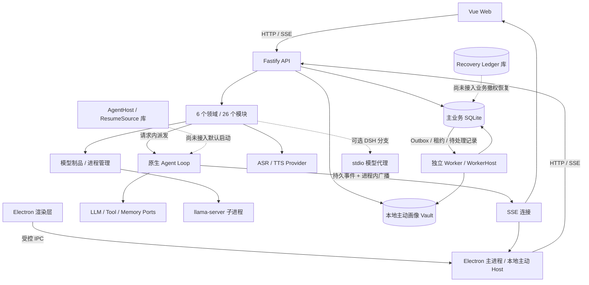

# 当前架构实现与演进评估

- 提出人：3yearszhuang · 2026-09-18
- 修改人：3yearszhuang · 2026-09-18

关联：[第一轮底层评估](foundation-optimization-review.md)、[架构事实源](../reference/ARCHITECTURE.md)、[数据库契约](../reference/DATABASE.md)、[数据隐私](../reference/DATA_PRIVACY.md)、[Agent 执行契约](../reference/agent-harness-loop.md)、[硬件方向](companion-hardware-directions.md)、[变更流程](../how-to/cr-workflow.md)

## 1. 结论与使用范围

当前架构适合继续沿“本地单用户、模块化单体、独立后台 Worker、可替换 Provider”演进。主要限制来自实现链路中的缺口：接单与领取之间存在无法恢复的窗口；统一删除流程可以在没有清理数据时报告完成；部分版本变更没有原子事务；运行时工具没有进入真实模型的工具清单；模型下载、进程管理及分发验证尚未形成完整边界。更换 SQLite 或拆分业务服务不会自动消除这些问题。

因此应先投入正确性和恢复能力，再优化延迟、内存与吞吐。对配套硬件，优先证明断连、取消、断电恢复、制品更新和资源不足时行为可控，之后再决定设备规格。现阶段不能仅凭包构建成功、局部测试通过或健康端点返回 200，推断独立设备可长期稳定运行。

本文件是对 [FND-01～10](foundation-optimization-review.md) 的深入补充，新增 `ARC-01～14` 作为评估定位编号，不新增 CAP，不修改已接受的 ADR，不表示建议获批或修复完成。采用建议后，行为修复分别交付；改变执行、权限、恢复或部署契约的部分先建立 CR。

证据基于 2026-09-18 工作区与 Git 基线 `6b20e7e317940eb0027c5a664b9e07d0c986372b`。工作区已有其它变动，本轮只编辑文档。核查包括源代码追踪、AST 依赖统计、临时文件 SQLite 故障注入、Fake Provider/子进程、内存 HTTP 注入和 Turbo dry-run。未访问真实用户库，未下载模型，未执行真实推理、生产搬库、硬件实验或负载基准。下文性能方案和验收指标均为待验证建议。

## 2. 当前系统实际如何运行

### 2.1 进程与数据拓扑

下图表示当前源码接线；虚线表示可选路径或尚未接入默认启动链路的组件。它是实现快照，不替代架构契约。

| 边界 | 当前实现 | 实际含义 |
|---|---|---|
| API 组合根 | [app.ts](../../apps/api/src/app.ts) 注册领域模块并注入数据库、配置与服务 | 默认 Agent 执行、插件安装、模型管理、语音适配都在 API 进程发起；局部耗时会影响同进程其它请求 |
| 后台任务 | [Worker 入口](../../apps/worker/src/index.ts) 注册 Outbox、删除、复习、日记、主动智能和 Attempt 恢复等 Job | 已有独立周期、错峰和单 Job 防重叠；不等于所有任务已有持久重试或业务完成验证 |
| 桌面宿主 | [主进程](../../apps/desktop/src/main/index.ts) 默认请求 `127.0.0.1:3000`，承载 IPC、窗口和主动 Host | Electron 不是 API/Worker 的默认启动主管；桌面退出与后端退出是不同生命周期 |
| 数据文件 | [client.ts](../../packages/repositories/src/client.ts) 默认主库为 `data/aervox.db`，Vault 为 `data/proactive-vault.db` | 本地单用户不等于只有一个物理文件；测试注入主库时复用 Vault 的做法不代表生产默认拓扑 |
| 数据访问 | `@aervox/schema` + `@aervox/repositories`，WAL、外键、忙等待、部分写入退避 | 基础设施已存在；短事务、业务 CAS、删除传播和跨库恢复仍需逐命令证明 |
| 实时输出 | 原生 Loop 写持久事件，经 [broadcasting-store](../../apps/api/src/modules/companion/conversation/broadcasting-store.ts) 和 [stream-hub](../../apps/api/src/modules/companion/conversation/stream-hub.ts) 通知 SSE | 进程内通知可降低空轮询；独立 Worker 写入不会自动触发 API 进程广播 |
| 模型与声音 | 本地模型进程、远程兼容 Provider、真实 SenseVoice ASR 和多个语音 Provider 并存 | 必须逐 Provider 区分实现、占位与真实就绪，不能将一个 Provider 的能力推广到全部路径 |

[根脚本](../../package.json)的 `dev:desktop` 只选择 API 与 Desktop；独立 Worker 需要相应启动入口。`dist:desktop` 构建 Desktop，[打包配置](../../apps/desktop/electron-builder.yml)列出的应用产物为 `out/**`，额外资源为图标，没有 API/Worker 运行包。它证明桌面壳可分发，尚不能证明“安装后无需其它服务即可完整运行”。

### 2.2 声明、库能力与生产接线的差别

| 主题 | 已有基础 | 本轮核对到的实现差距 |
|---|---|---|
| 持久执行 | Turn/Outbox 事务、Attempt claim、lease/fencing、AgentHost 库 | API 默认以进程内闭包派发；Host 并发槽和自动续跑未进入默认路径 |
| 模块化单体 | 六域目录、模块注册、包层 AST 边界检查 | API 模块内部仍可跨域直接引用；共享 `ModuleContext` 暴露原始连接和可变服务槽 |
| 跨模块通信 | 同步服务、持久 Outbox、SSE 通知各有实现 | [ADR-014](../reference/adr/ADR-014-modular-monolith-structure.md)声明的 `shared/event-bus` 规则与现行接线不一致；该总线没有领域调用者 |
| 删除与恢复 | 请求/目标表、软删过滤、控制账本类型和恢复库 | 统一删除 Worker 仍是完成标记骨架；账本没有生产写入与恢复水位追平链路 |
| 流式输出 | Provider 流、持久 delta、SSE 重放 | 原生普通文本等整 Step 收齐后才落库；不能把上游流接口等同首段已实时展示 |
| 外部 Driver | DSH 分支、stdio 协议、准入和超时；Pi 有适配资料与测试 | DSH 当前 runner 是单次模型请求代理；没有证据表明已接完整 DSH Agent 循环或 Pi 生产执行入口 |
| 可观测性 | API 已有受认证的 `/v1/metrics`、结构化日志与有界直方图 | Host 专用观测实现和 Worker 信号并未自动汇入同一注册表；需核对每条生产路径实际 emit 什么 |

其中 ADR 与实现的差异需作为评审事项登记。本文没有用实现中的缺口反向降低契约要求，也没有把未接线组件当作默认生产故障。

## 3. 优先级总览

以下保留评估时的风险级别；当前迭代顺序、依赖与认领以根目录 [plan.md](../../plan.md) 为唯一入口。

P1 表示优先修复或对应能力开放前必须通过的验证；P2 表示随后补齐或按测量推进。它们是本轮工程建议优先级，与 PRD 的 CAP 优先级、发布阶段无关，也不表示已经发生生产事故。

| 编号 | 评估方向 | 优先级与生效范围 | 与第一轮关系 |
|---|---|---|---|
| ARC-01 | 接单、调度与未领取任务恢复 | P1；默认 API | 深化 FND-01/05，优先修实际入口 |
| ARC-02 | 执行树取消、预算和本地处理策略 | P1 策略继承；P2 全树计量；Subagent/可选 Driver | 补充 FND-08 的执行控制层 |
| ARC-03 | 模型工具发现 | P1；原生动态工具接线 | 新发现 |
| ARC-04 | 自动恢复与互动续跑 | P1 在启用自动恢复前；当前库级 | 深化 FND-05/06 |
| ARC-05 | 上游文本到下游 SSE 的流式边界 | P2；原生/适配路径分开验收 | 深化 FND-06 |
| ARC-06 | 删除完成证明与撤权恢复 | P1；统一删除活动路径，账本未接线 | 新发现 |
| ARC-07 | 消息版本原子性与业务工作单元 | P1；默认消息编辑 API | 扩展 FND-02 的 CAS 问题 |
| ARC-08 | 检索资格、索引版本和中文质量 | P1 资格及回填启用前；P2 性能/质量 | 新发现 |
| ARC-09 | Schema 版本与完整库迁移 | P1 在下一次搬库前；迁移库路径 | 深化 FND-07 的数据生命周期 |
| ARC-10 | 模块所有权与边界可执行性 | P2；先评审 ADR 差量 | 深化当前单体结构 |
| ARC-11 | 模型制品接收与续传 | P1；默认注册、下载操作时触发 | 新发现 |
| ARC-12 | 模型进程和多模态资源生命周期 | P1 进程正确性；P2 资源协调 | 深化 FND-04/05/09 |
| ARC-13 | 部署完整性与客户端认证 | P1 已有认证路径修复；P2 部署主管 | 面向独立设备的运行边界 |
| ARC-14 | 冷环境 CI 与真实依赖输入 | P1；代码门禁及插件验证 | 补充 FND-10 |

## 4. 分项实现评估

### 4.1 ARC-01：从接单成功到可恢复执行

**现状与证据。** [对话路由](../../apps/api/src/modules/companion/conversation/routes.ts)的 POST Turn 先确认 next-turn Inbox，再通过 `createTurnWithOutbox` 提交 Turn/消息/事件，随后单独创建 Attempt，最后执行 `runLoop` 闭包。默认 background 分支使用 `void runLoop().catch(() => undefined)`；Persona/Skill 预加载发生在 `executeTurn` claim 之前。[AttemptStore](../../packages/repositories/src/repositories/sqlite/conversation/attempt-store.ts)新记录为 `Running`、lease 为空，而恢复扫描只选择 lease 非空且过期的 Running 记录。

**已复现。** 在临时 SQLite 注册真实路由，仅让 `skillLoader` 抛出合成错误：请求返回 201，随后查得 `Turn=Created`、`Attempt=Running`、`lease=null`、`fencing=0`；`recoverExpiredAttempts` 返回 0；同一幂等键重试返回 200，Turn 仍为 Created。已有 Turn 事务、幂等键和 claim fencing 无法覆盖这个领取前窗口。默认 API 也未使用 AgentHost 的并发槽，不能以 Host 库有限流来证明 API 接单有界。

**建议。** 先在 API 内建立一个受控调度入口。成功接单时，以短事务持久化可查询的待执行状态和足够重放的执行输入，关联 Inbox 消费；预加载失败也必须推进可见状态。重放输入至少保留原请求模式、必要 metadata 和策略修订，恢复时重新验证授权，不能只按 `turnId/sessionId` 猜测。明确 `turn.created` 是事实通知还是执行命令，并与 FND-01 的消费归属统一；不能让审计消费者确认“已执行”。

**验收与代价。** 在 Inbox 确认、Turn 提交、Attempt 创建、预加载、claim 各点注入故障；每个已返回成功的请求都可被重新发现并进入执行或明确失败，同一幂等键不重复消费消息和副作用。排队容量、拒绝/等待语义需显式定义。先接入进程内有界执行，恢复输入与状态可靠后，再评估独立执行进程；增加进程本身不能补回未持久化输入。

### 4.2 ARC-02：执行控制必须沿父子任务与 Driver 传递

**现状与证据。** [原生执行器](../../packages/agent-loop/src/executor.ts)已有工具 AbortSignal、租约心跳、默认 8 Step 和通常 5 秒工具超时；API 没有注入总 Turn 时长，相关默认值为 0。[OpenAI 兼容 Provider](../../packages/agent-loop/src/openai-compat-provider.ts)的默认 45 秒是随上游数据重置的空闲超时。持续输出不受它约束为固定总时长。

[Subagent/Workflow Contribution](../../packages/agent-loop/src/subagent-contribution.ts)没有把工具信号传入 delegate/WorkflowContext。[子任务执行器](../../packages/host-agent/src/subagent-executor.ts)另起 lease、仅限制 4 Step；[API 组合根](../../apps/api/src/modules/companion/conversation/index.ts)为子任务构造 Provider 时，没有传入父执行器使用的 `requireLocalOnly`、路由和会话上下文。父本地处理约束不能据此推断子任务已继承。Workflow 需注入定义才出现；Subagent 已在生产组合根注册，默认子任务无工具且禁止递归委托，这些保护应保留。

**已复现与限制。** 两步 Fake Workflow 在第一步取消信号后仍执行第二步并返回成功；Fake Subagent 收到的 delegate 输入不含 signal。实验没有运行真实模型或外部副作用。父工具超时后子模型是否继续写入属于这条接线导致的风险，不是本轮已观察到的用户数据事件。

**建议。** 用窄的执行控制对象传递根/父任务身份、取消、绝对截止时间、删除/授权修订和本地处理约束；子任务只能收紧父策略。预算先覆盖墙钟、调用数与并发，再按真实 usage 增加 token/成本；恢复不能重置已消耗预算。没有取消能力的 Provider 应停止新派发、丢弃已取消结果，必要时依赖受限进程终止。已发出的外部动作仍可能结果未知，取消不等于副作用撤回。

**Driver 边界。** [API 执行器](../../apps/api/src/modules/companion/conversation/agent-executor.ts)的 DSH 分支在原生本地策略检查之前返回；[Adapter](../../packages/host-agent/src/adapter-turn.ts)与[当前 runner](../../packages/host-agent/test/fixtures/dsh-turn-runner.mjs)没有自动继承原生全部控制合同。当前 runner 是 `stream:false` 的单次兼容请求，库模式仅探测 DSH 导出；推广完整外部 Agent 前，应逐项验证本地策略、取消、删除、租约、工具账本与终态原子性，不能凭名称认为实现等价。

**验收。** 父取消后子任务不再进入下一步；总截止时间覆盖持续输出；本地处理任务委托时拒绝 Fake 远程 Provider；重启后累计预算连续。Driver 使用同一合同夹具，但可以明确声明不同能力等级；当前没有证据支持宣布 DSH/Pi 与原生执行完全等价。

### 4.3 ARC-03：动态工具的可执行性与可发现性

**现状与证据。** [createRuntimeToolProvider](../../apps/api/src/modules/companion/conversation/tool-providers.ts)返回 `tools: []`，执行时才读取注册表。[组合器](../../packages/agent-loop/src/subagent-contribution.ts)只合并已有清单，模型 Provider 又只将 `request.tools` 转成 function Schema。因此静态 Subagent/Question/Practice/已配置 Workflow 可见，Memory、MCP 和插件注册工具不会自动进入真实模型请求。

**已复现。** Fake 注册表包含一个只读 `fake_memory`，静态 Provider 包含 `fake_static`。捕获真实 OpenAI 兼容序列化生成的请求体，只看到 `avx_fake_static`；直接调用动态 `fake_memory` 却成功。这个实验解释了为什么手写 ToolCall 的执行测试可以通过，同时真实模型无法自然选择该工具。

**建议与验收。** 在上下文构建前产生经过可见性与能力级别过滤的工具 Schema 快照，记录注册修订；执行时仍重查启用状态和授权。先实现每 Turn 清单，再根据注册版本失效缓存；工具很多时才评估按任务筛选。验证应捕获模型 HTTP 请求体，覆盖安装/启用/禁用与在途旧快照；不能把发现缓存变成授权真源。此项会增加 Prompt 开销，应与 FND-08 的完整上下文预算一起测量。

### 4.4 ARC-04：自动恢复与互动等待的连续性

**接线边界。** 当前 [Attempt Recovery Worker](../../apps/worker/src/attempt-recovery.ts)主要将过期 Running 收敛为 Interrupted，并处理未知工具结果；`createAgentHost` 和 `createSqliteResumeSource` 尚未接入默认生产启动。已提交答案、已批准工具与已恢复执行是三个不同事实。

**库级已复现。** [decideResume](../../packages/agent-loop/src/resume.ts)在同一 Step 的事件为 `request1(seq=1) → result1(seq=2) → request2(seq=3)`、账本只有第一个执行完成时，返回 `resume=true,lastSequence=2`。它没有证明所有请求都具备账本，而且游标低于持久最大序号 3。[ResumeSource](../../packages/host-agent/src/sqlite-resume-source.ts)还需要按 executionId 正确关联多工具结果与互动事件。当前未接线，不能把这个实验描述为默认 API 已重复执行副作用。

**互动语义。** 当前审批结束主要依赖新 Turn 命中已有授权，不是原 Attempt 自动续跑；授权查询按工具名、参数和 granted 匹配，虽记录 `toolVersion`，查询未校验该版本，一次性消费与有效期语义也未闭环。这是需要明确的持续授权语义，不能直接用“一次批准”概括。[问题协调器](../../apps/api/src/modules/companion/conversation/user-question-coordinator.ts)能持久接收恢复后的答案，但原进程 Promise 消失后仍需后续执行消费者。

**建议与验收。** 自动恢复启用前，先固定完整请求/账本覆盖、全体持久事件高水位、当前 Attempt 归属和原子接管规则；未知外部结果保持人工处理或明确补偿。将等待审批/答案与续跑意图关联，区分一次动作批准和持续规则授权。覆盖每个工具崩溃边界、多工具、缺账本、审批中重启、答案由另一进程提交和 Worker/Host 同时接管；不复用事件序号、不重复副作用、不吞答案。持久续跑语义及授权范围应先由 CR 冻结。

### 4.5 ARC-05：流式输出需要贯通整个链路

**现状与证据。** [collectStep](../../packages/agent-loop/src/executor.ts)将普通文本 chunk 收进数组，等待 Provider 当前 Step 完成后才批量 `recordSafeSegments`。reasoning 会在流中节流持久化；普通文本不会随上游首段立即可见。批量落库减少事务开销是已有收益，但整个 Step 并没有按字节数或时间切成有界窗口。DSH Adapter 则先收齐事件，runner 本身也未使用流式请求。

**影响。** 长文本可能表现为持续等待后集中出现；进程中途退出时，已接收但未落库的普通文本没有重放依据。FND-06 处理 SSE 的下游慢连接，无法单独解决这个上游等待。本轮是源码审阅，没有测量真实首字延迟或内存峰值。

**建议。** 采用“Provider → 有界安全分段 → 批量持久提交 → 广播 → 有界 SSE”的链路。窗口由字节/时间双阈值控制，只有通过检查并提交的内容才可见；一旦输出已提交，Provider 重试要遵守已提交水位，不能重新播放整段。保留批量事务，不退回逐 token 写事务。Driver 的能力声明应说明真实增量输出还是整次响应后转事件。

**验收。** Fake Provider 慢速产生多段文本时，后段未到达前首个已批准窗口即可重放；中断只损失未提交窗口。对慢客户端同时验证 FND-06 的背压、分页重放与断连释放。分别记录上游首 chunk、首个安全持久段、客户端首渲染时间，避免用一个 TTFT 数字掩盖等待位置。

### 4.6 ARC-06：删除完成证明和恢复后的撤权保留

**活动路径的缺口。** [隐私路由](../../apps/api/src/modules/platform/privacy/routes.ts)创建 DeletionRequest，但没有物化目标；[删除 Worker](../../apps/worker/src/deletion-worker.ts)的 owner 清理仍是骨架，直接将目标标 completed 并生成 evidenceRef。空目标数组也可通过 `every(completed)`。已有消息/记忆软删与读取过滤有效，本项限定为统一删除编排，不能概括为所有删除入口无效。

**已复现。** 临时库创建一条记忆和对应删除请求/目标，执行真实 `runDeletionCycle` 后，请求与目标 completed、`verified_at` 已写、删除闸门由 true 变为 false，但记忆原文仍可通过仓储读取。[隐私仓储](../../packages/repositories/src/repositories/sqlite/privacy-repository.ts)的闸门只看 pending/in_progress，failed 也不继续阻断。完成状态不是零召回证明。

**建议。** 删除先形成范围化 deny/tombstone，再由数据所有者物化目标、幂等清理，最后独立核对真源、FTS/向量、附件及派生关系。只有验证成功才推进完成水位；空目标必须有范围确实为空的证据；失败或未知继续禁止受影响范围。先交付 Memory 与其索引的完整切片，再扩大到消息和派生数据，不把全局永久停用当作最终设计。

**恢复账本的区别。** [RecoveryLedgerRepository](../../packages/repositories/src/repositories/sqlite/recovery-ledger-repository.ts)目前仅见库/测试调用；撤权路由没有独立账本确认及恢复追平。[账本 Schema](../../packages/schema/src/ledger.ts)的 sequence 索引非唯一，追加使用 `MAX+1`；临时库并发追加得到 `[1,1]`，这是未接线库级问题。`tamperEvidence` 接收调用方值也不等于实现了防篡改链。

**演进与代价。** 基于既有恢复契约建立原子单调序列、幂等追加、账本确认后投影 deny、恢复水位追平。当前主库、Vault 与账本使用独立连接，不能据此获得跨库原子提交保证，应采用持久事件与幂等投影。独立文件也不自动具备独立故障域或防回滚能力；保留、密钥与备份部署按 CR 明确。

**验收。** 删除中断、清理失败、并发新写、重复投递和旧备份恢复均不得让已删除/撤权内容重新可用；每个 completed 都有可重做的验证证据。账本不可读或水位不足时，受影响操作保持关闭。物理清理不应破坏用户数据恢复包的既定保留政策，继续遵循[数据隐私契约](../reference/DATA_PRIVACY.md)。

### 4.7 ARC-07：消息版本变更需要一个业务工作单元

**现状与已复现。** [MessageStore.editMessage](../../packages/repositories/src/repositories/sqlite/conversation/message-store.ts)被 PATCH 消息路径直接调用。它先检查 expectedVersion，再依次标旧版本 superseded、插入新版本、更新当前指针，三步不在同一事务，写条件也没有真正的版本 CAS。临时库用触发器在插入第二版时抛错，结果是当前指针仍指第一版、第一版已 superseded、未被替代版本数为 0。

**建议。** 将“一个活动消息恰有一个当前版本”作为仓储命令不变量，以短写事务完成创建版本、版本条件更新和旧版本推进；核对影响行数。与编辑相关的索引失效或派生重建意图可同事务进入 Outbox，文件/模型 I/O 留在事务外。复用现有 Turn、工具结果和安全片段的原子实现经验，不为所有仓储强行增加泛型事务层。

**验收。** 每个写点失败只允许完整旧版或完整新版；两个相同 expectedVersion 并发最多一个成功；编辑与删除竞争不能复活消息。由写者连接验证不变量。若已有历史不一致，先报告并显式修复，不能按最大行号静默选择。此模式随后可用于审查 FND-02 的配置 CAS，而不是仅加一个全局锁掩盖多步写问题。

### 4.8 ARC-08：检索资格与派生索引生命周期

**当前读路径。** [createSqliteMemoryRecall](../../apps/api/src/modules/companion/conversation/memory-recall.ts)进行混合检索，再核对软删、verified 和 long_term；尚未统一执行 `aiRecallUntil`、用途与分类资格检查。临时夹具把记忆设为已过期且 Restricted，该条仍进入 recall。生产创建路径尚未见这些字段赋值，所以这是资格边界验证，不是已发现真实敏感数据泄露。按[隐私授权](../reference/DATA_PRIVACY.md)，Restricted 默认不进入普通记忆；`restricted.profile` 仅授权 CAP-033 指定范围的本地处理，不自动授权普通长期记忆召回，不能增加一个通用授权开关就放行。

**当前索引。** [记忆写工具](../../apps/api/src/modules/ecosystem/tools/memory-store-tool.ts)先写业务记录，再更新 FTS，再调用 embedding；任一步失败不代表前一步已撤销。[FTS](../../packages/repositories/src/search/fts.ts)默认 `unicode61`，临时中文样本“今天学习数学”全文命中 1 条、子词“学习”命中 0 条；这说明需中文检索质量基线，不代表所有中文查询都失败。

**可选回填的缺口。** [Embedding Worker](../../apps/worker/src/embedding-migration.ts)默认没有注入 Provider，直接返回 0。注入最小 Provider 后，真实临时库报 `no such column: r.workspace_id`，说明扫描仍引用已移除的历史列；修复应采用当前 LocalContext，不能重新加入旧隔离列。扫描也未按模型区分缺失；[向量适配器](../../packages/repositories/src/repositories/sqlite/memory-embedding-repository.ts)的通用 upsert 使用 `vec_<memoryId>`，不符合多个模型版本共存方向。后者是库级静态风险，当前主要生产调用是 search，不能声称已经覆盖了用户旧向量。

**建议与权衡。** 业务记录继续是真源；FTS/向量是可删除重建的投影，携带来源修订、索引版本、模型/维度与资格水位。返回模型上下文前做权威资格检查，必要时过采样以补足合格 topK；写入通过 dirty/reindex 意图可恢复追平。新模型使用独立版本构建、验证再切换，避免就地覆盖。中文分词或字符 n-gram 需比较 Recall@K、空间与构建成本，不能只看返回条数。

当前向量检索读取模型下的向量，在 JavaScript 做余弦和全排序，适合轻量数据量；尚未测出瓶颈。先考虑候选过滤、局部 topK 与批次，再在固定负载超过延迟/RSS 预算时评估本地 SQLite 向量扩展。没有证据要求引入外置向量服务。

**验收。** 正常、过期、撤权、软删与 Restricted 数据混合，越权结果必须为零，且无资格旧索引不能挤掉合格结果；索引失败后可追平；模型 A→B→A 能切换并保持来源版本。权限验证、中文质量和检索性能分别报告，不能用一项通过代替另外两项。

### 4.9 ARC-09：启动建表、Schema 迁移和索引重建分工

**现状与已复现。** API 与 Worker 默认启动均调用 `initDatabaseSchema`，已有索引等价性测试；现有 [runMigrations](../../packages/repositories/src/migration/migration-service.ts)提供名称/时间 journal，但本轮只见测试调用，未接入默认启动，也没有校验和或恢复状态。这些基础不等于完整旧版本升级已经验证。[buildCr030Staging](../../packages/repositories/src/migration/staging-migration.ts)只识别虚表 SQL，仍会复制 FTS shadow 表。两个当前完整 Schema 的临时库执行该流程，报 `UNIQUE constraint failed: memories_fts_config.k`；现有 staging 测试主要使用简单父子表。此路径属于迁移库/演练，正常启动不自动执行搬库，不能描述成线上搬库事故。

**建议。** 明确主库、Vault、账本各自的受支持 Schema 版本和迁移计划，业务表按清单迁移；排除虚表及其 shadow 表，FTS/向量从有效源记录重建。完善并接线现有迁移 Runner，记录步骤、校验和与恢复状态；服务启动只在兼容性检查和受控协调后放行，避免多个进程同时尝试未版本化 DDL。主库和 Vault 使用完整初始化的表集合可以后续收窄，不应因此合并隐私边界。

**验收。** 使用包含 FTS、外键、软删、多模型投影的完整小库，从每个受支持旧版本升级；核对权威行/哈希、查询结果、删除水位和失败后的连接设置。保持已有索引 parity 测试并扩展列默认值、外键与数据转换。生产操作仍按[停写、备份、范围选择、staging、校验、换库与回滚](../how-to/run-database-migration-drill.md)执行，不能用简单文件 rename 测试替代数据库恢复演练。

### 4.10 ARC-10：领域目录需要可执行的所有权边界

**实测结构。** 对 `apps/api/src/modules/<domain>/<module>/` 下 130 个 TypeScript 文件做只读 AST 统计，得到 6 域、26 模块、14 条不同的模块间有向边，其中 10 条跨域；语法层面 10 处 value import、19 处显式 type-only 引用，解析失败和未解析相对路径均为 0。统计仅含顶层静态相对 import/export，不包含动态导入、ModuleContext 服务调用或真实调用图；value import 不保证最终保留在编译产物中。

代表依赖为 conversation→proactive 的画像/授权实现、conversation→plugins 的 Turn 插件、plugins→conversation 的 `stream-hub`、persona→skills。模块图中 conversation 与 plugins 双向相依，不等于已证明文件级 ESM 初始化环。真正的问题是内部实现路径成为其它模块的依赖，而重构时没有稳定公开边界。

**门禁覆盖。** [边界脚本](../../scripts/import-boundary.mjs)有 5 条包层规则；本轮现有检查与 14 项脚本测试全部通过。用纯内存 fixture 让 conversation 导入另一个领域的 `routes.ts`，检查结果仍为 `[]`。另一个语法错误 fixture 也因 parser catch 返回空结果；Typecheck 可另行发现语法错误，这只说明边界工具没有报告漏检，不代表整个 CI 会接受非法代码。

**与 ADR 的差异。** [ADR-014](../reference/adr/ADR-014-modular-monolith-structure.md)要求模块仅 `index.ts` 对外、跨模块经 shared 总线，而 `event-bus.ts` 没有领域调用者（已在卫生清理中移除）；[ModuleContext](../../apps/api/src/modules/context.ts)仍提供 raw db/client 和按顺序填入的可选服务。对话模块也直接创建多个领域仓储。目录分组已经完成，数据所有权与接口强制还没有同等程度的保证。

**候选演进，需 CR。** 同步查询/命令使用明确类型的公开 Port，异步业务副作用走有归属的持久 Outbox，短暂 UI 通知走进程内广播；三者各自声明失败和重放语义。先冻结实际需要的公开接口，再增加 API 内部深层引用限制、数据写入所有权和解析失败报告。已有违规用带 owner/退出条件的迁移清单逐步收敛，不一次性把所有业务塞进 shared，也不机械改成异步事件调用。

**验收与代价。** 注入跨模块私有路径必须失败；批准的公开 Port 必须通过；模块可在 Fake Port 下独立测试。将可变全局槽替换为每模块所需的窄依赖对象，组合根在启动时检查必需依赖。此举增加接口维护成本，但能让后续变更范围可预测；它不要求拆服务，也不需要立即改造所有 26 个模块。

### 4.11 ARC-11：模型制品接收需要受限且可验证

**生产范围。** [Model Runtime](../../apps/api/src/modules/ecosystem/model-runtime/index.ts)默认注册；下载端点受全局认证，生产/strict 要求 Token，开发 open 模式仅允许 loopback 监听。它不是未认证的公网接口，但仍需对已接收请求做路径和内容验证。

[请求 Schema](../../packages/contracts/src/model-runtime-schemas.ts)的 `fileName` 仅为可选字符串；[服务](../../apps/api/src/modules/ecosystem/model-runtime/service.ts)直接 `path.join(modelsDir, fileName)`。[下载器](../../apps/api/src/modules/ecosystem/model-runtime/downloader.ts)在 416/405 后重新全量请求，没有再次检查响应成功；206 续传没有核对 Content-Range 与实体版本。已有并发 2、`.part`、流式写入、rename、可选 SHA-256 和活动任务去重，应保留。

**三个安全复现。** 实验仅使用自建临时目录和 Fake fetch：`../escaped.gguf` 覆盖了模型目录外的临时哨兵文件且未被扫描注册；416 后返回的 500 错误正文仍保存为正式模型；旧前缀 `OLD` 遇到错误起点的 206 响应仍追加为 `OLDNEW`。没有访问下载源，也未读写真实用户数据或仓库文件。

**建议。** 请求规范化后进入私有 staging，服务端拒绝路径分隔/编码越界，最终 resolve 并检查根目录与 symlink 边界；逐次请求验证状态、范围、实体标识、总长和截断。内容验证后再原子提升并注册。可信摘要校验与“计算出了摘要”应区分，未验证来源应有明确状态。续传前缀哈希目前整段读入内存，可改为流式，并增加磁盘、大小与总时限配额。

**验收与代价。** 越界、符号链接、错误响应、内容变化和重启不得写出模型根或注册坏文件；成功下载与 autoStart 失败分开可见。代价是校验 I/O、侧车状态和失败恢复逻辑，收益首先是正确性；制品信任策略变更再走 CR，无需新增下载服务。

### 4.12 ARC-12：进程代际、资源准入与真实就绪

**模型进程问题。** [LlamaServerManager](../../apps/api/src/modules/ecosystem/model-runtime/llama-server.ts)的启动 deadline 只在循环外计算，等待 `/health` 的 fetch 没有单次超时；旧 child 的 exit/error 回调可修改当前全局状态。Fake 实验中，设置 20 ms 超时后观察到 136 ms 仍在 starting，说明等待未受总截止控制，136 ms 不是性能基准。另一实验在新 child 已 running 后触发旧 child exit，状态变成 error、PID 为空。

可见日志虽有上限，内部 stderr chunks/无换行 partial 仍可增长；指标 fetch 无时限，2 秒采样无在途锁。这些是静态资源风险。已有 busy 拒绝、SIGTERM→SIGKILL、健康探测和 Fastify onClose dispose，不应重新实现一套接口。

**建议。** 每次启动分配 epoch，child、探针、取消与日志归属于同一运行对象；只有当前 epoch 可修改当前状态。start/stop/delete 控制串行化；stop 返回应区分确认退出和仍在清理，不能在旧进程状态未知时启动第二个模型。健康与指标 I/O 都继承总截止时间，探针最多一个在途，内部日志按字节限额。

**多模态资源事实。** [SenseVoice](../../apps/api/src/modules/platform/voice/asr-providers.ts)已缓存识别器、使用异步初始化/解码并串行 decode；不是每次都同步重载模型。但队列无长度/等待预算，语音请求 Port 没有统一取消和 dispose。模型状态/重配置路径存在约 227 MB 权重同步读取校验；远程 ASR/TTS 的 fetch 和整段音频读取也需时限/大小边界。内置 llama-server 默认 4 线程、SenseVoice 配置 2 线程、下载 2 并发只是局部配置，不能证明全机资源预算合适。

**资源演进。** 先给每个 Provider 有界队列、优先级、取消和等待上限，再以轻量协调器管理交互推理与后台下载/校验的竞争；模型切换执行停接单、drain/取消、释放、加载的生命周期。原生库难以取消或初始化显著阻塞时，再选择 Worker Thread/受限子进程隔离。不要因需要隔离计算而拆分全部业务服务。

**就绪等级。** [通用 LLM 探活](../../apps/api/src/modules/ecosystem/llm/health-prober.ts)已有 5 秒超时，但 `/models=200` 不证明目标模型存在或可推理；404/405 也不会触发其仅在异常分支实现的 fallback。建议区分配置有效、制品验证、进程存活、模型加载、推理可用。`GptSovitsLocalProvider` 与默认 `ocr.mock` 的占位问题仍见 FND 评估与硬件文档；HTTP TTS 可指向同机真实服务，应单独验收，不能由一个占位 Provider 推断全部本地语音不可用。

**验收。** 永不返回的探针、旧 exit、取消队列项、旧初始化迟到、日志洪泛和模型切换都保持有界；`/models` 不含目标模型时不标 ready。先用 Fake 资源预算验证控制，再用固定设备测 CPU、RSS、排队和 event-loop delay；本轮没有给出任何实际性能提升比例。

### 4.13 ARC-13：部署主管与客户端访问边界

**认证组合已验证。** 按 [app.ts](../../apps/api/src/app.ts)的顺序装配真实 [auth hook](../../apps/api/src/shared/auth.ts) 与 CORS，用内存 `/probe` 路由注入请求：open 模式对未知 Origin 返回 200 并反射允许源；Token 模式对标准浏览器 OPTIONS 预检返回 401，而直接带正确 Bearer 的 POST 返回 200。实验只证明服务端配置，不代表已经绕过具体浏览器的本地网络权限策略。

[Desktop 主进程](../../apps/desktop/src/main/index.ts)的 JSON 代理与 SSE 带 Bearer，但活动 `uploadAttachment` 路径只设置 Content-Type。该项为静态接线核查，未启动 Electron。FND-03 的 iframe 资源认证属于同一客户端类型矩阵，不能通过关闭 Token 来修复。

**建议。** 明确合法 Web 来源及桌面 IPC，严格验证的预检交给 CORS，真实业务继续认证。统一受限 transport 为 JSON、SSE、附件注入凭据、取消和超时，长期 Token 不出现在 URL 或插件页面。新来源策略按信任边界评审；漏发已有认证头可独立修复。

**部署需要解决的事实。** 现有桌面打包没有后端运行包；API 入口没有信号到 `app.close()` 的完整链路，Worker stop 不 drain，默认数据路径仍从仓库定位。模块 `onClose` 存在不代表操作系统退出时一定被调用。完整单机分发需明确谁拥有 API/Worker/模型子进程、数据目录、端口、Token、启动就绪、版本兼容与退出顺序。

**候选方案与验收。** 开发环境可继续独立启动各进程；桌面产品可由 Electron 管理受限后端子进程；无屏硬件则可由系统服务主管托管同一后端。两种产品部署应复用服务协议，避免把硬件固件直接接 SQLite。新的主管以 CR 冻结。用干净用户目录安装、启动、升级、端口占用、磁盘满、后端异常退出和卸载保留数据逐项验收，桌面签名/公证与真实设备恢复另列发布门禁。

### 4.14 ARC-14：CI 必须证明冷启动和真实输入

**冷环境问题。** [CI 工作流](../../.github/workflows/ci.yml)的 build/e2e 两个 Job 安装 mise 工具并恢复 pnpm store，但没有 `pnpm install`；build 调用的 [ci-code](../../mise.toml)刻意不含安装，带安装的是 `ci-code-full`。恢复 store 不会生成项目 `node_modules`。这属于工作流静态缺口，未在本轮触发远程 CI，不报告虚构的运行失败记录。

**2026-09-18 状态。** 以上静态缺口已由 [ITER-001](../../plan.md) 受理并在 PR [#221](https://github.com/3yearsZhuang/Aervox-harness/pull/221) 修复：两个 Job 增加显式 `pnpm install --frozen-lockfile`，冷 CI 复跑通过（该 Job 5m23s 全绿）。本段保留为评估当时的核对记录，不再代表当前状态；实现位置与验证证据见[§4.2](../reference/REQUIREMENTS_TRACEABILITY.md#42-落地实现登记)。

**输入遗漏已核对。** 工作流 path filter 没有根 `plugins/**` 和 `vitest.shared.ts`；[插件集市测试](../../apps/api/test/builtin-plugins-market.test.ts)实际读取根插件源与 `dist-plugins`。Turbo dry-run 显示 `@aervox/api#test` 有 211 项输入，唯一包外显式文件是 `../../vitest.shared.ts`，没有根插件源/分发包，global 文件仅 `.gitattributes`。因此共享测试配置会影响 Turbo hash，却可能不触发工作流；插件源变化既可能不触发代码 CI，也未表达为 API 测试输入。

**2026-09-18 状态。** 三层缺口（工作流触发、Turbo 失效、本地增量选择）已一并修复并有回归守住：`ci.yml` 触发路径补齐 `plugins/**`、`vitest.shared.ts`、`tsconfig.base.node.json`，根级 tsconfig 进入 `globalDependencies`，`scripts/ci-scope.mjs` 把包外输入显式映射回受影响包；抽取任何一条触发路径都会让 `scripts/ci-scope.test.mjs` 变红。未开启任何此前禁用的缓存。

**制品前置条件。** 当前插件包生成脚本是 `package:plugins`，`dist-plugins` 未纳入 Git 跟踪；测试直接读该目录的分发包。冷 CI 除安装依赖外，还需要显式生成制品，不能依赖开发机上已有文件。FND-10 的静态资产 `cache:false` 已经保护另一类产物副作用，不应为解决本项直接开启其缓存。

**2026-09-18 状态。** 测试已改为经产品导出端点现场生成分发包，不再读 `dist-plugins/`；冷 CI 由声明任务 `mise tasks run package-plugins` 重建制品并断言数量，同一任务的分发包字节已改为可重现（固定 ZIP 时间戳、目录与条目排序，回归见 `scripts/export-plugins.test.mjs`）。`cache:false` 未改动。产品侧导出端点自身的打包仍不可重现，属插件生命周期范围（见 plan.md ITER-005）。

**建议与验收。** 修复每个独立 Job 的锁文件安装与制品构建前置条件，将根插件源映射到验证任务和缓存输入，统一工作流触发、增量选择、Turbo 输入与输出归属。干净 checkout 必须能跑通；只改一个插件也必须重新验证其契约和分发包；删除生成物后可由声明的任务重建。缓存只是加速，不能承担缺失的构建步骤。保留受控测试并发和临时库模板，不用扩大数据库测试并发换表面速度。

## 5. 推荐的演进结构与备选比较

### 5.1 先统一边界与生命周期

推荐目标是继续保持单体业务部署，用现有 Port 逐步收敛五个责任边界：

1. **业务命令边界**：模块拥有数据写入命令、短事务和版本 CAS；跨域使用公开 Port，外部 I/O 不进入数据库事务。
2. **执行边界**：接单生成持久执行意图；调度统一容量、claim、取消与预算；子任务和 Driver 继承根策略。
3. **投影与恢复边界**：Outbox 有明确消费者和完成证据；检索、UI 通知和派生资料各有水位；删除和撤权先禁止使用，再完成清理与恢复追平。
4. **资源边界**：模型、ASR/TTS、下载和大文件校验有队列、时限、生命周期与就绪等级；需要硬隔离的计算再移入受限进程。
5. **部署与验证边界**：主管负责进程、目录、凭据和版本；CI 从冷环境重建所有测试依赖；指标覆盖实际生产入口。

这些边界可分批建立。禁止把所有问题浓缩成一个通用 Service Manager、全局事务包装器或万能事件总线；它们的失败语义不同。

### 5.2 哪些替代方案值得保留

| 方案 | 适用条件 | 收益 | 成本与当前判断 |
|---|---|---|---|
| 单体内受控执行调度 | 先解决接单恢复、取消和容量 | 改动小，可复用现有仓储与 Loop | 与 API 共享事件循环；推荐作为第一步 |
| 同机独立 Agent 执行进程 | 执行输入已可恢复；推理/工具干扰 API 或需要独立重启 | 故障与资源隔离 | 增加跨进程通知、生命周期、取消和接管；完成 ARC-01/04 后再评估 |
| 局部计算 Worker/子进程 | 原生推理或大文件处理阻塞/不可取消 | 隔离最重资源，可硬终止 | 启动、IPC、数据复制和平台打包成本；优先针对具体 Provider |
| 每进程短事务调度 | 同一进程大量竞争写入且测量超预算 | 可控排队、批次与公平性 | 不解决跨进程竞争，不能替代正确 CAS；先测量 |
| 全局单写者进程 | 正确事务后仍持续出现跨进程忙错误/尾延迟 | 统一写入顺序与公平性 | 增加 IPC 单点、恢复、幂等和权限协议；当前证据不足以直接采用 |
| 本地 FTS/向量扩展 | 中文质量或向量规模超过已批准预算 | 提高质量或减少扫描成本 | 索引迁移、平台二进制和重建成本；保留现有 Port 后按基准选择 |
| 微服务/外置数据库/外置队列 | 真正出现独立部署、多团队或容量需求 | 可独立扩展 | 当前本地单用户产品无相应证据，且不修复本轮正确性缺口 |

主库与 Vault 应继续按现有数据边界分工。账本的可靠保留是恢复协议问题，不应被“减少文件数”或“全部改成同一事务”的优化目标破坏。

## 6. 分批交付建议与决策门槛

跨专题批次、依赖和待决策项已收敛到根目录 [plan.md](../../plan.md)，本节不再维护活动排期。本报告保留实现证据、方案权衡和下面的测量设计；问题编号 ARC/FND 不替代计划条目 ID。

采纳建议后，现有行为修复按独立切片交付；恢复账本、授权、部署主管、公开 Port 等架构差量先走 CR。每项分别记录相关 CAP、验证和回滚并移交[追踪基线 §4.2](../reference/REQUIREMENTS_TRACEABILITY.md#42-落地实现登记)。文档交付、代码验证和产品发布继续分开。

## 7. 如何测量优化是否值得

### 7.1 建立可复用的负载矩阵

首先固定设备 CPU/RAM、操作系统、磁盘、工具版本、模型文件/量化、线程数、数据库规模和配置；Fake Provider 的结果仅用于衡量本地调度，不与真实模型速度混为一个指标。建议先用纯合成数据的小/中/大三个档位，例如记忆 1 千/1 万/10 万条，再根据用户实际规模调整。这些是实验设计值，不是容量承诺。

| 负载 | 核心测量 | 能回答的问题 |
|---|---|---|
| 短对话与长文本流，单路/多会话 | 接单到 claim、上游首段、安全段落库、首渲染、取消耗时、在途数 | 慢在模型、调度、持久化还是 SSE；ARC-01/05 是否改善体验 |
| API 写入 + Worker 到期任务 + 插件安装/模拟设备事件 | BEGIN/提交 P50/P95/P99、忙错误/重试、队列最老年龄、WAL 大小、事件循环延迟 | 是否真的需要写调度或计算隔离，后台工作是否饿死 |
| 冷加载/热 ASR + LLM + TTS + 下载校验 | 各进程 CPU/RSS、排队时间、拒绝数、音频延迟、取消后内存、模型切换耗时 | 设备规格、并发预算与资源优先级是否合理 |
| 中文/英文/代码检索和模型切换 | Recall@K、合格结果数、越权结果数、P95、峰值 RSS、重建耗时 | 是质量、资格过滤还是向量计算瓶颈 |
| 慢 SSE 与长历史重连 | 待发送字节、每批事件数、断连释放、恢复游标与跨进程可见延迟 | 缓冲是否有界，重连是否完整 |
| 持续运行与随机退出 | 内存趋势、句柄/子进程数、孤儿任务、未知副作用、删除积压和恢复水位 | 能否进入硬件常驻试点，而非只在演示中成功 |
| 冷/热构建、仅插件变化、产物删除 | 实际执行任务、缓存失效、制品完整性、总耗时 | CI 缓存是否可信，构建优化是否值得 |

### 7.2 观测与判定方法

优先扩展现有 [Metrics Registry](../../packages/observability/src/metrics-registry.ts)和 API `/v1/metrics`；不是重新建设监控平台。为实际 API 调度、Worker、模型进程分别记录指标，带上组件/任务类型等低基数维度，通过 Turn/Attempt/Job 关联脱敏日志。FND-09 中 Host 私有样本不可读的问题不等于 API 没有指标端点。

先记录预热与测量窗口、重复次数和异常样本，再由产品/设备预算确定门槛。性能比较至少报告 P50/P95/P99、失败率、峰值/稳态内存和任务质量；使用同一数据与配置，仅改变被评估因素。持续运行可先安排 24 小时合成负载，再做目标硬件 72 小时试点；这两项尚未执行。

任何优化都有不可退让的不变量：已接单任务可追踪；未确认副作用不盲重放；过期/撤权内容不回流；版本变更原子；文件不越界；资源有界。事务更少、队列更短或吞吐更高不能抵消这些约束。达到这些条件后，才比较增加进程、索引扩展或缓存重构的实际收益。

## 8. 本轮验证与剩余限制

| 验证方式 | 已取得的结果 | 不能据此推断 |
|---|---|---|
| 临时 SQLite 与真实 Repository/路由/Worker | 接单孤儿、删除完成但数据仍在、消息编辑中断、过期资格、中文 FTS、可选回填旧列、完整 Schema staging、账本并发序列等结果见对应专题 | 发生了生产数据事故，或完成了迁移/恢复发布演练 |
| Fake Provider、HTTP body 捕获、纯函数 | 取消信号丢失、工具发现缺失、恢复覆盖/游标缺口 | 真实模型的任务成功率、token 成本或完整 Agent 恢复已验证 |
| 临时模型目录与 Fake 子进程/fetch | 越界写、错误响应落盘、错位续传、探针未截止、旧进程事件污染 | 下载源真实性、真实进程性能或实际内存峰值 |
| Fastify 内存注入 | open Origin 反射、Token 预检 401 与业务 Bearer 200 | 绕过具体浏览器安全机制或完成 Electron 端到端测试 |
| AST、边界 fixtures、Turbo dry-run | 模块依赖快照、边界覆盖缺口、测试输入清单；现有边界检查及 14 测试通过 | 所有运行时调用边都已枚举，或远程冷 CI 已跑通 |

实验均由 mise 管理的 Node 执行；数据库断言使用写者连接，临时数据库与文件已清理。模型运行时及认证组合使用源码临时副本，仅调整本地导入扩展以执行 TypeScript；认证实验是 auth hook/CORS 的最小 Fastify 路由，不是完整 `buildApp`。其余按真实模块或本轮已构建产物调用。实施阶段应将这些最小场景转成相关组件的持久回归测试，本轮没有为文档交付修改产品代码或新增测试套件。

2026-09-18 已完成 `docs-sync`、`docs-catalog` 与全量 `ci-docs`：74 份 Markdown 的 Markdownlint/Vale 通过，治理、链接、锚点和登记日期校验零错误；`git diff --check` 通过。本轮没有运行全量代码构建/测试或远程 CI，现有边界测试通过仅证明其当前覆盖范围。

后续每项修复必须重新验证对应源码与默认接线，尤其不能继续引用本文的“当前缺口”作为修复后状态，也不能把历史局部测试结果当作完整系统发布凭证。
