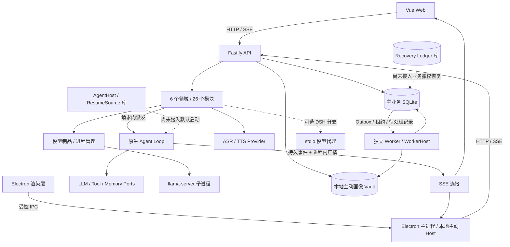

# 当前架构实现与演进评估

关联：第一轮底层评估（FND-01～10，已并入本文 §9）、[架构事实源](../reference/ARCHITECTURE.md)、[数据库契约](../reference/DATABASE.md)、[数据隐私](../reference/DATA_PRIVACY.md)、[Agent 执行契约](../reference/agent-harness-loop.md)、[硬件方向](companion-hardware-directions.md)、[变更流程](../how-to/cr-workflow.md)

> [!NOTE]
> 本文分开保存当前复核与历史证据：2026-10-08 的审计见 [§10](#10-2026-10-08-仓库审计)。§2～§9 是 2026-09-18 基线 `6b20e7e` 的评估快照，除明确标注的闭环摘要外，不宣称全部反映当前实现。当前排期只读 [plan.md](../../plan.md)，生产接线以源码与测试核实。

## 1. 结论与使用范围

本地单用户 SQLite、模块化单体与独立 Worker 仍是当前基线。应先修复可证明的正确性、权限和恢复问题，再按固定负载决定性能优化；本评估不批准数据库替换、微服务拆分或新的设备范围。

FND-01 的 Outbox、ARC-01 的预加载失败/已有 Attempt 恢复切片、ARC-14 的冷 CI 已分别通过 PR [#228](https://github.com/3yearsZhuang/Aervox-harness/pull/228) 和 [#221](https://github.com/3yearsZhuang/Aervox-harness/pull/221) 合入。FND-10 的资源复制仍由禁用缓存保护正确性，是否重构取决于测量。ARC-01 的分离提交窗口已由 PR #258 的原子接单修复，验证与范围见 §10；其它发现逐项复核后进入已有队列，不能从旧文中的“现状”直接推导新缺陷。

历史评估使用临时 SQLite、Fake Provider/子进程与静态检查。真实推理、生产搬库、平台签名、硬件和持续负载不在其验证范围内；当前审计的范围与证据见 §10。所有性能数字与工期估算均是原评估建议，不是实测或交付承诺。

## 2. 当前系统实际如何运行

### 2.1 进程与数据拓扑

下图表示 2026-09-18 的源码接线；虚线表示可选路径或尚未接入默认启动链路的组件。它是实现快照，不替代架构契约。

```mermaid
flowchart TD
  Web[Vue Web] -->|HTTP / SSE| API[Fastify API]
  UI[Electron 渲染层] -->|受控 IPC| Desktop[Electron 主进程 / 本地主动 Host]
  Desktop -->|HTTP / SSE| API
  API --> Modules[6 个领域 / 26 个模块]
  Modules -->|请求内派发| Loop[原生 Agent Loop]
  Loop --> Providers[LLM / Tool / Memory Ports]
  Modules --> Runtime[模型制品 / 进程管理]
  Runtime --> Llama[llama-server 子进程]
  Modules --> Voice[ASR / TTS Provider]
  API --> Main[(主业务 SQLite)]
  API --> Vault[(本地主动画像 Vault)]
  Worker[独立 Worker / WorkerHost] --> Main
  Worker --> Vault
  Main -->|Outbox / 租约 / 待处理记录| Worker
  Loop -->|持久事件 + 进程内广播| SSE[SSE 连接]
  SSE --> Web
  SSE --> Desktop
  Host[AgentHost / ResumeSource 库] -.尚未接入默认启动.-> Loop
  Ledger[(Recovery Ledger 库)] -.尚未接入业务撤权恢复.-> Main
  Modules -.可选 DSH 分支.-> Adapter[stdio 模型代理]
```

| 边界 | 当前实现 | 实际含义 |
|---|---|---|
| API 组合根 | [app.ts](../../apps/api/src/app.ts) 注册领域模块并注入数据库、配置与服务 | 默认 Agent 执行、插件安装、模型管理、语音适配都在 API 进程发起；局部耗时会影响同进程其它请求 |
| 后台任务 | [Worker 入口](../../apps/worker/src/index.ts) 注册 Outbox、删除、复习、日记、主动智能和 Attempt 恢复等 Job | 已有独立周期、错峰和单 Job 防重叠；不等于所有任务已有持久重试或业务完成验证 |
| 桌面宿主 | [主进程](../../apps/desktop/src/main/index.ts) 默认请求 `127.0.0.1:3000`，承载 IPC、窗口和主动 Host | Electron 不是 API/Worker 的默认启动主管；桌面退出与后端退出是不同生命周期 |
| 数据文件 | [client.ts](../../packages/repositories/src/client.ts) 默认主库为 `data/aervox.db`，Vault 为 `data/proactive-vault.db` | 本地单用户不等于只有一个物理文件；测试注入主库时复用 Vault 的做法不代表生产默认拓扑 |
| 数据访问 | `@aervox/schema` + `@aervox/repositories`，WAL、外键、忙等待、部分写入退避 | 基础设施已存在；短事务、业务 CAS、删除传播和跨库恢复仍需逐命令证明 |
| 实时输出 | 原生 Loop 写持久事件，经 [broadcasting-store](../../apps/api/src/modules/companion/conversation/broadcasting-store.ts) 和 [stream-hub](../../apps/api/src/modules/companion/conversation/stream-hub.ts) 通知 SSE | 进程内通知可降低空轮询；独立 Worker 写入不会自动触发 API 进程广播 |
| 模型与声音 | 本地模型进程、远程兼容 Provider、真实 SenseVoice ASR 和多个语音 Provider 并存 | 必须逐 Provider 区分实现、占位与真实就绪，不能将一个 Provider 的能力推广到全部路径 |

[根脚本](../../package.json)的 `dev:desktop` 只选择 API 与 Desktop；独立 Worker 需要相应启动入口。`dist:desktop` 构建 Desktop，[打包配置](../../apps/desktop/electron-builder.yml)列出的应用产物为 `out/**`，额外资源为图标，没有 API/Worker 运行包。它证明桌面壳可分发，尚不能证明“安装后无需其它服务即可完整运行”。

### 2.2 声明、库能力与生产接线的差别

| 主题 | 已有基础 | 本轮核对到的实现差距 |
|---|---|---|
| 持久执行 | Turn/Outbox 事务、Attempt claim、lease/fencing、AgentHost 库 | API 默认以进程内闭包派发；Host 并发槽和自动续跑未进入默认路径 |
| 模块化单体 | 六域目录、模块注册、包层 AST 边界检查 | API 模块内部仍可跨域直接引用；共享 `ModuleContext` 暴露原始连接和可变服务槽 |
| 跨模块通信 | 同步服务、持久 Outbox、SSE 通知各有实现 | [ADR-014](../reference/adr/ADR-014-modular-monolith-structure.md)声明的 `shared/event-bus` 规则与现行接线不一致；该总线没有领域调用者 |
| 删除与恢复 | 请求/目标表、软删过滤、控制账本类型和恢复库 | 统一删除 Worker 仍是完成标记骨架；账本没有生产写入与恢复水位追平链路 |
| 流式输出 | Provider 流、持久 delta、SSE 重放 | 原生普通文本等整 Step 收齐后才落库；不能把上游流接口等同首段已实时展示 |
| 外部 Driver | DSH 分支、stdio 协议、准入和超时；Pi 有适配资料与测试 | DSH 当前 runner 是单次模型请求代理；没有证据表明已接完整 DSH Agent 循环或 Pi 生产执行入口 |
| 可观测性 | API 已有受认证的 `/v1/metrics`、结构化日志与有界直方图 | Host 专用观测实现和 Worker 信号并未自动汇入同一注册表；需核对每条生产路径实际 emit 什么 |

其中 ADR 与实现的差异需作为评审事项登记。本文没有用实现中的缺口反向降低契约要求，也没有把未接线组件当作默认生产故障。

## 3. 优先级总览

以下保留评估时的风险级别；当前迭代顺序、依赖与认领以根目录 [plan.md](../../plan.md) 为唯一入口。

P1 表示优先修复或对应能力开放前必须通过的验证；P2 表示随后补齐或按测量推进。它们是本轮工程建议优先级，与 PRD 的 CAP 优先级、发布阶段无关，也不表示已经发生生产事故。

| 编号 | 评估方向 | 优先级与生效范围 | 与第一轮关系 |
|---|---|---|---|
| ARC-01 | 接单、调度与未领取任务恢复 | P1；接单切片已修复 | ITER-002 / PR #228、#258 / §10 |
| ARC-02 | 执行树取消、预算和本地处理策略 | P1 策略继承；P2 全树计量；Subagent/可选 Driver | 补充 FND-08 的执行控制层 |
| ARC-03 | 模型工具发现 | P1；原生动态工具接线 | 新发现 |
| ARC-04 | 自动恢复与互动续跑 | P1 在启用自动恢复前；当前库级 | 深化 FND-05/06 |
| ARC-05 | 上游文本到下游 SSE 的流式边界 | P2；原生/适配路径分开验收 | 深化 FND-06 |
| ARC-06 | 删除完成证明与撤权恢复 | P1；统一删除活动路径，账本未接线 | 新发现 |
| ARC-07 | 消息版本原子性与业务工作单元 | P1；默认消息编辑 API | 扩展 FND-02 的 CAS 问题 |
| ARC-08 | 检索资格、索引版本和中文质量 | P1 资格及回填启用前；P2 性能/质量 | 新发现 |
| ARC-09 | Schema 版本与完整库迁移 | P1 在下一次搬库前；迁移库路径 | 深化 FND-07 的数据生命周期 |
| ARC-10 | 模块所有权与边界可执行性 | P2；先评审 ADR 差量 | 深化当前单体结构 |
| ARC-11 | 模型制品接收与续传 | P1；默认注册、下载操作时触发 | 新发现 |
| ARC-12 | 模型进程和多模态资源生命周期 | P1 进程正确性；P2 资源协调 | 深化 FND-04/05/09 |
| ARC-13 | 部署完整性与客户端认证 | P1 已有认证路径修复；P2 部署主管 | 面向独立设备的运行边界 |
| ARC-14 | 冷环境 CI 与真实依赖输入 | 历史 P1；已移交 | ITER-001 / PR #221 |

## 4. 分项实现评估

### 4.1 ARC-01：从接单成功到可恢复执行

原评估复现了领取前失败留下无租约 Running Attempt 的问题。消费隔离、死信、预加载失败与已有无租约 Attempt 恢复已由 [ITER-002](../../plan.md#iter-002) / PR [#228](https://github.com/3yearsZhuang/Aervox-harness/pull/228) 修复，回归入口为[对话派发恢复测试](../../apps/api/test/conversation-dispatch-resilience.test.ts)及 [Outbox 测试](../../apps/worker/test/outbox-worker.test.ts)。历史过程见 Git。PR #258 随后以原子接单闭合提前确认 Inbox 和尚未创建 Attempt 的窗口，故障与并发回归见 §10。

已受理任务须可追踪、重试不得重复消费或产生副作用，这些约束继续有效。容量准入、独立 Host 与完整互动恢复不由此切片自动证明，分别按 ITER-013/010 继续核验。

### 4.2 ARC-02：执行控制必须沿父子任务与 Driver 传递

**现状与证据。** [原生执行器](../../packages/core/src/executor.ts)已有工具 AbortSignal、租约心跳、默认 8 Step 和通常 5 秒工具超时；API 没有注入总 Turn 时长，相关默认值为 0。[OpenAI 兼容 Provider](../../packages/core/src/openai-compat-provider.ts)的默认 45 秒是随上游数据重置的空闲超时。持续输出不受它约束为固定总时长。

[Subagent/Workflow Contribution](../../packages/core/src/subagent-contribution.ts)没有把工具信号传入 delegate/WorkflowContext。[子任务执行器](../../packages/host-agent/src/subagent-executor.ts)另起 lease、仅限制 4 Step；[API 组合根](../../apps/api/src/modules/companion/conversation/index.ts)为子任务构造 Provider 时，没有传入父执行器使用的 `requireLocalOnly`、路由和会话上下文。父本地处理约束不能据此推断子任务已继承。Workflow 需注入定义才出现；Subagent 已在生产组合根注册，默认子任务无工具且禁止递归委托，这些保护应保留。

**已复现与限制。** 两步 Fake Workflow 在第一步取消信号后仍执行第二步并返回成功；Fake Subagent 收到的 delegate 输入不含 signal。实验没有运行真实模型或外部副作用。父工具超时后子模型是否继续写入属于这条接线导致的风险，不是本轮已观察到的用户数据事件。

**建议。** 用窄的执行控制对象传递根/父任务身份、取消、绝对截止时间、删除/授权修订和本地处理约束；子任务只能收紧父策略。预算先覆盖墙钟、调用数与并发，再按真实 usage 增加 token/成本；恢复不能重置已消耗预算。没有取消能力的 Provider 应停止新派发、丢弃已取消结果，必要时依赖受限进程终止。已发出的外部动作仍可能结果未知，取消不等于副作用撤回。

**Driver 边界。** [API 执行器](../../apps/api/src/modules/companion/conversation/agent-executor.ts)的 DSH 分支在原生本地策略检查之前返回；[Adapter](../../packages/host-agent/src/adapter-turn.ts)与[当前 runner](../../packages/host-agent/test/fixtures/dsh-turn-runner.mjs)没有自动继承原生全部控制合同。当前 runner 是 `stream:false` 的单次兼容请求，库模式仅探测 DSH 导出；推广完整外部 Agent 前，应逐项验证本地策略、取消、删除、租约、工具账本与终态原子性，不能凭名称认为实现等价。

**验收。** 父取消后子任务不再进入下一步；总截止时间覆盖持续输出；本地处理任务委托时拒绝 Fake 远程 Provider；重启后累计预算连续。Driver 使用同一合同夹具，但可以明确声明不同能力等级；当前没有证据支持宣布 DSH/Pi 与原生执行完全等价。

### 4.3 ARC-03：动态工具的可执行性与可发现性

**现状与证据。** [createRuntimeToolProvider](../../apps/api/src/modules/companion/conversation/tool-providers.ts)返回 `tools: []`，执行时才读取注册表。[组合器](../../packages/core/src/subagent-contribution.ts)只合并已有清单，模型 Provider 又只将 `request.tools` 转成 function Schema。因此静态 Subagent/Question/Practice/已配置 Workflow 可见，Memory、MCP 和插件注册工具不会自动进入真实模型请求。

**已复现。** Fake 注册表包含一个只读 `fake_memory`，静态 Provider 包含 `fake_static`。捕获真实 OpenAI 兼容序列化生成的请求体，只看到 `avx_fake_static`；直接调用动态 `fake_memory` 却成功。这个实验解释了为什么手写 ToolCall 的执行测试可以通过，同时真实模型无法自然选择该工具。

**建议与验收。** 在上下文构建前产生经过可见性与能力级别过滤的工具 Schema 快照，记录注册修订；执行时仍重查启用状态和授权。先实现每 Turn 清单，再根据注册版本失效缓存；工具很多时才评估按任务筛选。验证应捕获模型 HTTP 请求体，覆盖安装/启用/禁用与在途旧快照；不能把发现缓存变成授权真源。此项会增加 Prompt 开销，应与 FND-08 的完整上下文预算一起测量。

### 4.4 ARC-04：自动恢复与互动等待的连续性

**接线边界。** 当前 [Attempt Recovery Worker](../../apps/worker/src/attempt-recovery.ts)主要将过期 Running 收敛为 Interrupted，并处理未知工具结果；`createAgentHost` 和 `createSqliteResumeSource` 尚未接入默认生产启动。已提交答案、已批准工具与已恢复执行是三个不同事实。

**库级已复现。** [decideResume](../../packages/core/src/resume.ts)在同一 Step 的事件为 `request1(seq=1) → result1(seq=2) → request2(seq=3)`、账本只有第一个执行完成时，返回 `resume=true,lastSequence=2`。它没有证明所有请求都具备账本，而且游标低于持久最大序号 3。[ResumeSource](../../packages/host-agent/src/sqlite-resume-source.ts)还需要按 executionId 正确关联多工具结果与互动事件。当前未接线，不能把这个实验描述为默认 API 已重复执行副作用。

**互动语义。** 当前审批结束主要依赖新 Turn 命中已有授权，不是原 Attempt 自动续跑；授权查询按工具名、参数和 granted 匹配，虽记录 `toolVersion`，查询未校验该版本，一次性消费与有效期语义也未闭环。这是需要明确的持续授权语义，不能直接用“一次批准”概括。[问题协调器](../../apps/api/src/modules/companion/conversation/user-question-coordinator.ts)能持久接收恢复后的答案，但原进程 Promise 消失后仍需后续执行消费者。

**建议与验收。** 自动恢复启用前，先固定完整请求/账本覆盖、全体持久事件高水位、当前 Attempt 归属和原子接管规则；未知外部结果保持人工处理或明确补偿。将等待审批/答案与续跑意图关联，区分一次动作批准和持续规则授权。覆盖每个工具崩溃边界、多工具、缺账本、审批中重启、答案由另一进程提交和 Worker/Host 同时接管；不复用事件序号、不重复副作用、不吞答案。持久续跑语义及授权范围应先由 CR 冻结。

### 4.5 ARC-05：流式输出需要贯通整个链路

**现状与证据。** [collectStep](../../packages/core/src/executor.ts)将普通文本 chunk 收进数组，等待 Provider 当前 Step 完成后才批量 `recordSafeSegments`。reasoning 会在流中节流持久化；普通文本不会随上游首段立即可见。批量落库减少事务开销是已有收益，但整个 Step 并没有按字节数或时间切成有界窗口。DSH Adapter 则先收齐事件，runner 本身也未使用流式请求。

**影响。** 长文本可能表现为持续等待后集中出现；进程中途退出时，已接收但未落库的普通文本没有重放依据。FND-06 处理 SSE 的下游慢连接，无法单独解决这个上游等待。本轮是源码审阅，没有测量真实首字延迟或内存峰值。

**建议。** 采用“Provider → 有界安全分段 → 批量持久提交 → 广播 → 有界 SSE”的链路。窗口由字节/时间双阈值控制，只有通过检查并提交的内容才可见；一旦输出已提交，Provider 重试要遵守已提交水位，不能重新播放整段。保留批量事务，不退回逐 token 写事务。Driver 的能力声明应说明真实增量输出还是整次响应后转事件。

**验收。** Fake Provider 慢速产生多段文本时，后段未到达前首个已批准窗口即可重放；中断只损失未提交窗口。对慢客户端同时验证 FND-06 的背压、分页重放与断连释放。分别记录上游首 chunk、首个安全持久段、客户端首渲染时间，避免用一个 TTFT 数字掩盖等待位置。

### 4.6 ARC-06：删除完成证明和恢复后的撤权保留

**活动路径的缺口。** [隐私路由](../../apps/api/src/modules/platform/privacy/routes.ts)创建 DeletionRequest，但没有物化目标；[删除 Worker](../../apps/worker/src/deletion-worker.ts)的 owner 清理仍是骨架，直接将目标标 completed 并生成 evidenceRef。空目标数组也可通过 `every(completed)`。已有消息/记忆软删与读取过滤有效，本项限定为统一删除编排，不能概括为所有删除入口无效。

**已复现。** 临时库创建一条记忆和对应删除请求/目标，执行真实 `runDeletionCycle` 后，请求与目标 completed、`verified_at` 已写、删除闸门由 true 变为 false，但记忆原文仍可通过仓储读取。[隐私仓储](../../packages/repositories/src/repositories/sqlite/privacy-repository.ts)的闸门只看 pending/in_progress，failed 也不继续阻断。完成状态不是零召回证明。

**建议。** 删除先形成范围化 deny/tombstone，再由数据所有者物化目标、幂等清理，最后独立核对真源、FTS/向量、附件及派生关系。只有验证成功才推进完成水位；空目标必须有范围确实为空的证据；失败或未知继续禁止受影响范围。先交付 Memory 与其索引的完整切片，再扩大到消息和派生数据，不把全局永久停用当作最终设计。

**恢复账本的区别。** [RecoveryLedgerRepository](../../packages/repositories/src/repositories/sqlite/recovery-ledger-repository.ts)目前仅见库/测试调用；撤权路由没有独立账本确认及恢复追平。[账本 Schema](../../packages/schema/src/ledger.ts)的 sequence 索引非唯一，追加使用 `MAX+1`；临时库并发追加得到 `[1,1]`，这是未接线库级问题。`tamperEvidence` 接收调用方值也不等于实现了防篡改链。

**演进与代价。** 基于既有恢复契约建立原子单调序列、幂等追加、账本确认后投影 deny、恢复水位追平。当前主库、Vault 与账本使用独立连接，不能据此获得跨库原子提交保证，应采用持久事件与幂等投影。独立文件也不自动具备独立故障域或防回滚能力；保留、密钥与备份部署按 CR 明确。

**验收。** 删除中断、清理失败、并发新写、重复投递和旧备份恢复均不得让已删除/撤权内容重新可用；每个 completed 都有可重做的验证证据。账本不可读或水位不足时，受影响操作保持关闭。物理清理不应破坏用户数据恢复包的既定保留政策，继续遵循[数据隐私契约](../reference/DATA_PRIVACY.md)。

### 4.7 ARC-07：消息版本变更需要一个业务工作单元

**现状与已复现。** [MessageStore.editMessage](../../packages/repositories/src/repositories/sqlite/conversation/message-store.ts)被 PATCH 消息路径直接调用。它先检查 expectedVersion，再依次标旧版本 superseded、插入新版本、更新当前指针，三步不在同一事务，写条件也没有真正的版本 CAS。临时库用触发器在插入第二版时抛错，结果是当前指针仍指第一版、第一版已 superseded、未被替代版本数为 0。

**建议。** 将“一个活动消息恰有一个当前版本”作为仓储命令不变量，以短写事务完成创建版本、版本条件更新和旧版本推进；核对影响行数。与编辑相关的索引失效或派生重建意图可同事务进入 Outbox，文件/模型 I/O 留在事务外。复用现有 Turn、工具结果和安全片段的原子实现经验，不为所有仓储强行增加泛型事务层。

**验收。** 每个写点失败只允许完整旧版或完整新版；两个相同 expectedVersion 并发最多一个成功；编辑与删除竞争不能复活消息。由写者连接验证不变量。若已有历史不一致，先报告并显式修复，不能按最大行号静默选择。此模式随后可用于审查 FND-02 的配置 CAS，而不是仅加一个全局锁掩盖多步写问题。

### 4.8 ARC-08：检索资格与派生索引生命周期

**当前读路径。** [createSqliteMemoryRecall](../../apps/api/src/modules/companion/conversation/memory-recall.ts)进行混合检索，再核对软删、verified 和 long_term；尚未统一执行 `aiRecallUntil`、用途与分类资格检查。临时夹具把记忆设为已过期且 Restricted，该条仍进入 recall。生产创建路径尚未见这些字段赋值，所以这是资格边界验证，不是已发现真实敏感数据泄露。按[隐私授权](../reference/DATA_PRIVACY.md)，Restricted 默认不进入普通记忆；`restricted.profile` 仅授权 CAP-033 指定范围的本地处理，不自动授权普通长期记忆召回，不能增加一个通用授权开关就放行。

**当前索引。** [记忆写工具](../../apps/api/src/modules/companion/memory/memory-store-tool.ts)先写业务记录，再更新 FTS，再调用 embedding；任一步失败不代表前一步已撤销。[FTS](../../packages/repositories/src/search/fts.ts)默认 `unicode61`，临时中文样本“今天学习数学”全文命中 1 条、子词“学习”命中 0 条；这说明需中文检索质量基线，不代表所有中文查询都失败。

**可选回填的缺口。** [Embedding Worker](../../apps/worker/src/embedding-migration.ts)默认没有注入 Provider，直接返回 0。注入最小 Provider 后，真实临时库报 `no such column: r.workspace_id`，说明扫描仍引用已移除的历史列；修复应采用当前 LocalContext，不能重新加入旧隔离列。扫描也未按模型区分缺失；[向量适配器](../../packages/repositories/src/repositories/sqlite/memory-embedding-repository.ts)的通用 upsert 使用 `vec_<memoryId>`，不符合多个模型版本共存方向。后者是库级静态风险，当前主要生产调用是 search，不能声称已经覆盖了用户旧向量。

**建议与权衡。** 业务记录继续是真源；FTS/向量是可删除重建的投影，携带来源修订、索引版本、模型/维度与资格水位。返回模型上下文前做权威资格检查，必要时过采样以补足合格 topK；写入通过 dirty/reindex 意图可恢复追平。新模型使用独立版本构建、验证再切换，避免就地覆盖。中文分词或字符 n-gram 需比较 Recall@K、空间与构建成本，不能只看返回条数。

当前向量检索读取模型下的向量，在 JavaScript 做余弦和全排序，适合轻量数据量；尚未测出瓶颈。先考虑候选过滤、局部 topK 与批次，再在固定负载超过延迟/RSS 预算时评估本地 SQLite 向量扩展。没有证据要求引入外置向量服务。

**验收。** 正常、过期、撤权、软删与 Restricted 数据混合，越权结果必须为零，且无资格旧索引不能挤掉合格结果；索引失败后可追平；模型 A→B→A 能切换并保持来源版本。权限验证、中文质量和检索性能分别报告，不能用一项通过代替另外两项。

### 4.9 ARC-09：启动建表、Schema 迁移和索引重建分工

**现状与已复现。** API 与 Worker 默认启动均调用 `initDatabaseSchema`，已有索引等价性测试；现有 [runMigrations](../../packages/repositories/src/migration/migration-service.ts)提供名称/时间 journal，但本轮只见测试调用，未接入默认启动，也没有校验和或恢复状态。这些基础不等于完整旧版本升级已经验证。[buildCr030Staging](../../packages/repositories/src/migration/staging-migration.ts)只识别虚表 SQL，仍会复制 FTS shadow 表。两个当前完整 Schema 的临时库执行该流程，报 `UNIQUE constraint failed: memories_fts_config.k`；现有 staging 测试主要使用简单父子表。此路径属于迁移库/演练，正常启动不自动执行搬库，不能描述成线上搬库事故。

**建议。** 明确主库、Vault、账本各自的受支持 Schema 版本和迁移计划，业务表按清单迁移；排除虚表及其 shadow 表，FTS/向量从有效源记录重建。完善并接线现有迁移 Runner，记录步骤、校验和与恢复状态；服务启动只在兼容性检查和受控协调后放行，避免多个进程同时尝试未版本化 DDL。主库和 Vault 使用完整初始化的表集合可以后续收窄，不应因此合并隐私边界。

**验收。** 使用包含 FTS、外键、软删、多模型投影的完整小库，从每个受支持旧版本升级；核对权威行/哈希、查询结果、删除水位和失败后的连接设置。保持已有索引 parity 测试并扩展列默认值、外键与数据转换。生产操作仍按[停写、备份、范围选择、staging、校验、换库与回滚](../how-to/run-database-migration-drill.md)执行，不能用简单文件 rename 测试替代数据库恢复演练。

### 4.10 ARC-10：领域目录需要可执行的所有权边界

**实测结构。** 对 `apps/api/src/modules/<domain>/<module>/` 下 130 个 TypeScript 文件做只读 AST 统计，得到 6 域、26 模块、14 条不同的模块间有向边，其中 10 条跨域；语法层面 10 处 value import、19 处显式 type-only 引用，解析失败和未解析相对路径均为 0。统计仅含顶层静态相对 import/export，不包含动态导入、ModuleContext 服务调用或真实调用图；value import 不保证最终保留在编译产物中。

代表依赖为 conversation→proactive 的画像/授权实现、conversation→plugins 的 Turn 插件、plugins→conversation 的 `stream-hub`、persona→skills。模块图中 conversation 与 plugins 双向相依，不等于已证明文件级 ESM 初始化环。真正的问题是内部实现路径成为其它模块的依赖，而重构时没有稳定公开边界。

**门禁覆盖。** [边界脚本](../../scripts/import-boundary.mjs)有 5 条包层规则；本轮现有检查与 14 项脚本测试全部通过。用纯内存 fixture 让 conversation 导入另一个领域的 `routes.ts`，检查结果仍为 `[]`。另一个语法错误 fixture 也因 parser catch 返回空结果；Typecheck 可另行发现语法错误，这只说明边界工具没有报告漏检，不代表整个 CI 会接受非法代码。

**与 ADR 的差异。** [ADR-014](../reference/adr/ADR-014-modular-monolith-structure.md)要求模块仅 `index.ts` 对外、跨模块经 shared 总线，而 `event-bus.ts` 没有领域调用者（已在卫生清理中移除）；[ModuleContext](../../apps/api/src/modules/context.ts)仍提供 raw db/client 和按顺序填入的可选服务。对话模块也直接创建多个领域仓储。目录分组已经完成，数据所有权与接口强制还没有同等程度的保证。

**候选演进，需 CR。** 同步查询/命令使用明确类型的公开 Port，异步业务副作用走有归属的持久 Outbox，短暂 UI 通知走进程内广播；三者各自声明失败和重放语义。先冻结实际需要的公开接口，再增加 API 内部深层引用限制、数据写入所有权和解析失败报告。已有违规用带 owner/退出条件的迁移清单逐步收敛，不一次性把所有业务塞进 shared，也不机械改成异步事件调用。

**验收与代价。** 注入跨模块私有路径必须失败；批准的公开 Port 必须通过；模块可在 Fake Port 下独立测试。将可变全局槽替换为每模块所需的窄依赖对象，组合根在启动时检查必需依赖。此举增加接口维护成本，但能让后续变更范围可预测；它不要求拆服务，也不需要立即改造所有 26 个模块。

### 4.11 ARC-11：模型制品接收需要受限且可验证

**生产范围。** [Model Runtime](../../apps/api/src/modules/ecosystem/model-runtime/index.ts)默认注册；下载端点受全局认证，生产/strict 要求 Token，开发 open 模式仅允许 loopback 监听。它不是未认证的公网接口，但仍需对已接收请求做路径和内容验证。

[请求 Schema](../../packages/contracts/src/model-runtime-schemas.ts)的 `fileName` 仅为可选字符串；[服务](../../apps/api/src/modules/ecosystem/model-runtime/service.ts)直接 `path.join(modelsDir, fileName)`。[下载器](../../apps/api/src/modules/ecosystem/model-runtime/downloader.ts)在 416/405 后重新全量请求，没有再次检查响应成功；206 续传没有核对 Content-Range 与实体版本。已有并发 2、`.part`、流式写入、rename、可选 SHA-256 和活动任务去重，应保留。

**三个安全复现。** 实验仅使用自建临时目录和 Fake fetch：`../escaped.gguf` 覆盖了模型目录外的临时哨兵文件且未被扫描注册；416 后返回的 500 错误正文仍保存为正式模型；旧前缀 `OLD` 遇到错误起点的 206 响应仍追加为 `OLDNEW`。没有访问下载源，也未读写真实用户数据或仓库文件。

**建议。** 请求规范化后进入私有 staging，服务端拒绝路径分隔/编码越界，最终 resolve 并检查根目录与 symlink 边界；逐次请求验证状态、范围、实体标识、总长和截断。内容验证后再原子提升并注册。可信摘要校验与“计算出了摘要”应区分，未验证来源应有明确状态。续传前缀哈希目前整段读入内存，可改为流式，并增加磁盘、大小与总时限配额。

**验收与代价。** 越界、符号链接、错误响应、内容变化和重启不得写出模型根或注册坏文件；成功下载与 autoStart 失败分开可见。代价是校验 I/O、侧车状态和失败恢复逻辑，收益首先是正确性；制品信任策略变更再走 CR，无需新增下载服务。

### 4.12 ARC-12：进程代际、资源准入与真实就绪

**模型进程问题。** [LlamaServerManager](../../apps/api/src/modules/ecosystem/model-runtime/llama-server.ts)的启动 deadline 只在循环外计算，等待 `/health` 的 fetch 没有单次超时；旧 child 的 exit/error 回调可修改当前全局状态。Fake 实验中，设置 20 ms 超时后观察到 136 ms 仍在 starting，说明等待未受总截止控制，136 ms 不是性能基准。另一实验在新 child 已 running 后触发旧 child exit，状态变成 error、PID 为空。

可见日志虽有上限，内部 stderr chunks/无换行 partial 仍可增长；指标 fetch 无时限，2 秒采样无在途锁。这些是静态资源风险。已有 busy 拒绝、SIGTERM→SIGKILL、健康探测和 Fastify onClose dispose，不应重新实现一套接口。

**建议。** 每次启动分配 epoch，child、探针、取消与日志归属于同一运行对象；只有当前 epoch 可修改当前状态。start/stop/delete 控制串行化；stop 返回应区分确认退出和仍在清理，不能在旧进程状态未知时启动第二个模型。健康与指标 I/O 都继承总截止时间，探针最多一个在途，内部日志按字节限额。

**多模态资源事实。** [SenseVoice](../../apps/api/src/modules/platform/voice/asr-providers.ts)已缓存识别器、使用异步初始化/解码并串行 decode；不是每次都同步重载模型。但队列无长度/等待预算，语音请求 Port 没有统一取消和 dispose。模型状态/重配置路径存在约 227 MB 权重同步读取校验；远程 ASR/TTS 的 fetch 和整段音频读取也需时限/大小边界。内置 llama-server 默认 4 线程、SenseVoice 配置 2 线程、下载 2 并发只是局部配置，不能证明全机资源预算合适。

**资源演进。** 先给每个 Provider 有界队列、优先级、取消和等待上限，再以轻量协调器管理交互推理与后台下载/校验的竞争；模型切换执行停接单、drain/取消、释放、加载的生命周期。原生库难以取消或初始化显著阻塞时，再选择 Worker Thread/受限子进程隔离。不要因需要隔离计算而拆分全部业务服务。

**就绪等级。** [通用 LLM 探活](../../apps/api/src/modules/ecosystem/llm/health-prober.ts)已有 5 秒超时，但 `/models=200` 不证明目标模型存在或可推理；404/405 也不会触发其仅在异常分支实现的 fallback。建议区分配置有效、制品验证、进程存活、模型加载、推理可用。`GptSovitsLocalProvider` 与默认 `ocr.mock` 的占位问题仍见 FND 评估与硬件文档；HTTP TTS 可指向同机真实服务，应单独验收，不能由一个占位 Provider 推断全部本地语音不可用。

**验收。** 永不返回的探针、旧 exit、取消队列项、旧初始化迟到、日志洪泛和模型切换都保持有界；`/models` 不含目标模型时不标 ready。先用 Fake 资源预算验证控制，再用固定设备测 CPU、RSS、排队和 event-loop delay；本轮没有给出任何实际性能提升比例。

### 4.13 ARC-13：部署主管与客户端访问边界

**认证组合已验证。** 按 [app.ts](../../apps/api/src/app.ts)的顺序装配真实 [auth hook](../../apps/api/src/shared/auth.ts) 与 CORS，用内存 `/probe` 路由注入请求：open 模式对未知 Origin 返回 200 并反射允许源；Token 模式对标准浏览器 OPTIONS 预检返回 401，而直接带正确 Bearer 的 POST 返回 200。实验只证明服务端配置，不代表已经绕过具体浏览器的本地网络权限策略。

[Desktop 主进程](../../apps/desktop/src/main/index.ts)的 JSON 代理与 SSE 带 Bearer，但活动 `uploadAttachment` 路径只设置 Content-Type。该项为静态接线核查，未启动 Electron。FND-03 的 iframe 资源认证属于同一客户端类型矩阵，不能通过关闭 Token 来修复。

**建议。** 明确合法 Web 来源及桌面 IPC，严格验证的预检交给 CORS，真实业务继续认证。统一受限 transport 为 JSON、SSE、附件注入凭据、取消和超时，长期 Token 不出现在 URL 或插件页面。新来源策略按信任边界评审；漏发已有认证头可独立修复。

**部署需要解决的事实。** 现有桌面打包没有后端运行包；API 入口没有信号到 `app.close()` 的完整链路，Worker stop 不 drain，默认数据路径仍从仓库定位。模块 `onClose` 存在不代表操作系统退出时一定被调用。完整单机分发需明确谁拥有 API/Worker/模型子进程、数据目录、端口、Token、启动就绪、版本兼容与退出顺序。

**候选方案与验收。** 开发环境可继续独立启动各进程；桌面产品可由 Electron 管理受限后端子进程；无屏硬件则可由系统服务主管托管同一后端。两种产品部署应复用服务协议，避免把硬件固件直接接 SQLite。新的主管以 CR 冻结。用干净用户目录安装、启动、升级、端口占用、磁盘满、后端异常退出和卸载保留数据逐项验收，桌面签名/公证与真实设备恢复另列发布门禁。

### 4.14 ARC-14：CI 必须证明冷启动和真实输入

锁文件安装、包外输入触发、插件制品恢复与可重现导出任务已由 [ITER-001](../../plan.md#iter-001) / PR [#221](https://github.com/3yearsZhuang/Aervox-harness/pull/221) 交付。回归入口为 [ci-scope](../../scripts/ci-scope.test.mjs) 与 [export-plugins](../../scripts/export-plugins.test.mjs)，实际 Job 步骤见 [CI 工作流](../../.github/workflows/ci.yml)。

冷检出可恢复产物、仅插件变动仍触发验证、缓存不替代构建前置条件，这三项仍是验收要求。产品导出端点的可重现性属于 ITER-005，不能以构建脚本通过推定它已完成；静态资源缓存归属见 FND-10。

## 5. 推荐的演进结构与备选比较

### 5.1 先统一边界与生命周期

推荐目标是继续保持单体业务部署，用现有 Port 逐步收敛五个责任边界：

1. **业务命令边界**：模块拥有数据写入命令、短事务和版本 CAS；跨域使用公开 Port，外部 I/O 不进入数据库事务。
2. **执行边界**：接单生成持久执行意图；调度统一容量、claim、取消与预算；子任务和 Driver 继承根策略。
3. **投影与恢复边界**：Outbox 有明确消费者和完成证据；检索、UI 通知和派生资料各有水位；删除和撤权先禁止使用，再完成清理与恢复追平。
4. **资源边界**：模型、ASR/TTS、下载和大文件校验有队列、时限、生命周期与就绪等级；需要硬隔离的计算再移入受限进程。
5. **部署与验证边界**：主管负责进程、目录、凭据和版本；CI 从冷环境重建所有测试依赖；指标覆盖实际生产入口。

这些边界可分批建立。禁止把所有问题浓缩成一个通用 Service Manager、全局事务包装器或万能事件总线；它们的失败语义不同。

### 5.2 哪些替代方案值得保留

| 方案 | 适用条件 | 收益 | 成本与当前判断 |
|---|---|---|---|
| 单体内受控执行调度 | 先解决接单恢复、取消和容量 | 改动小，可复用现有仓储与 Loop | 与 API 共享事件循环；推荐作为第一步 |
| 同机独立 Agent 执行进程 | 执行输入已可恢复；推理/工具干扰 API 或需要独立重启 | 故障与资源隔离 | 增加跨进程通知、生命周期、取消和接管；完成 ARC-01/04 后再评估 |
| 局部计算 Worker/子进程 | 原生推理或大文件处理阻塞/不可取消 | 隔离最重资源，可硬终止 | 启动、IPC、数据复制和平台打包成本；优先针对具体 Provider |
| 每进程短事务调度 | 同一进程大量竞争写入且测量超预算 | 可控排队、批次与公平性 | 不解决跨进程竞争，不能替代正确 CAS；先测量 |
| 全局单写者进程 | 正确事务后仍持续出现跨进程忙错误/尾延迟 | 统一写入顺序与公平性 | 增加 IPC 单点、恢复、幂等和权限协议；当前证据不足以直接采用 |
| 本地 FTS/向量扩展 | 中文质量或向量规模超过已批准预算 | 提高质量或减少扫描成本 | 索引迁移、平台二进制和重建成本；保留现有 Port 后按基准选择 |
| 微服务/外置数据库/外置队列 | 真正出现独立部署、多团队或容量需求 | 可独立扩展 | 当前本地单用户产品无相应证据，且不修复本轮正确性缺口 |

主库与 Vault 应继续按现有数据边界分工。账本的可靠保留是恢复协议问题，不应被“减少文件数”或“全部改成同一事务”的优化目标破坏。

## 6. 分批交付建议与决策门槛

跨专题批次、依赖和待决策项已收敛到根目录 [plan.md](../../plan.md)，本节不再维护活动排期。本报告保留实现证据、方案权衡和下面的测量设计；问题编号 ARC/FND 不替代计划条目 ID。

采纳建议后，现有行为修复按独立切片交付；恢复账本、授权、部署主管、公开 Port 等架构差量先走 CR。每项分别记录相关 CAP、验证和回滚并移交[追踪基线 §4.2](../reference/REQUIREMENTS_TRACEABILITY.md#42-落地实现登记)。文档交付、代码验证和产品发布继续分开。

## 7. 如何测量优化是否值得

### 7.1 建立可复用的负载矩阵

首先固定设备 CPU/RAM、操作系统、磁盘、工具版本、模型文件/量化、线程数、数据库规模和配置；Fake Provider 的结果仅用于衡量本地调度，不与真实模型速度混为一个指标。建议先用纯合成数据的小/中/大三个档位，例如记忆 1 千/1 万/10 万条，再根据用户实际规模调整。这些是实验设计值，不是容量承诺。

| 负载 | 核心测量 | 能回答的问题 |
|---|---|---|
| 短对话与长文本流，单路/多会话 | 接单到 claim、上游首段、安全段落库、首渲染、取消耗时、在途数 | 慢在模型、调度、持久化还是 SSE；ARC-01/05 是否改善体验 |
| API 写入 + Worker 到期任务 + 插件安装/模拟设备事件 | BEGIN/提交 P50/P95/P99、忙错误/重试、队列最老年龄、WAL 大小、事件循环延迟 | 是否真的需要写调度或计算隔离，后台工作是否饿死 |
| 冷加载/热 ASR + LLM + TTS + 下载校验 | 各进程 CPU/RSS、排队时间、拒绝数、音频延迟、取消后内存、模型切换耗时 | 设备规格、并发预算与资源优先级是否合理 |
| 中文/英文/代码检索和模型切换 | Recall@K、合格结果数、越权结果数、P95、峰值 RSS、重建耗时 | 是质量、资格过滤还是向量计算瓶颈 |
| 慢 SSE 与长历史重连 | 待发送字节、每批事件数、断连释放、恢复游标与跨进程可见延迟 | 缓冲是否有界，重连是否完整 |
| 持续运行与随机退出 | 内存趋势、句柄/子进程数、孤儿任务、未知副作用、删除积压和恢复水位 | 能否进入硬件常驻试点，而非只在演示中成功 |
| 冷/热构建、仅插件变化、产物删除 | 实际执行任务、缓存失效、制品完整性、总耗时 | CI 缓存是否可信，构建优化是否值得 |

### 7.2 观测与判定方法

优先扩展现有 [Metrics Registry](../../packages/observability/src/metrics-registry.ts)和 API `/v1/metrics`；不是重新建设监控平台。为实际 API 调度、Worker、模型进程分别记录指标，带上组件/任务类型等低基数维度，通过 Turn/Attempt/Job 关联脱敏日志。FND-09 中 Host 私有样本不可读的问题不等于 API 没有指标端点。

先记录预热与测量窗口、重复次数和异常样本，再由产品/设备预算确定门槛。性能比较至少报告 P50/P95/P99、失败率、峰值/稳态内存和任务质量；使用同一数据与配置，仅改变被评估因素。持续运行可先安排 24 小时合成负载，再做目标硬件 72 小时试点；这两项尚未执行。

任何优化都有不可退让的不变量：已接单任务可追踪；未确认副作用不盲重放；过期/撤权内容不回流；版本变更原子；文件不越界；资源有界。事务更少、队列更短或吞吐更高不能抵消这些约束。达到这些条件后，才比较增加进程、索引扩展或缓存重构的实际收益。

## 8. 本轮验证与剩余限制

2026-09-18 评估的执行过程由 Git 基线与后续 PR 保留，当前测试入口以[测试策略](../reference/TEST_STRATEGY.md)、[工具任务](../../mise.toml)及关联测试为准。本文不复制测试耗时和终端日志，也不把历史绿色结果当作当前版本的发布证据。

## 9. 底层优化评估（FND-01～10，自 AVX-EXPL-010 并入）

> [!NOTE] 本节自独立文档《底层优化评估》（AVX-EXPL-010，2026-10-04 并入并删除原文件）整体迁入：FND-01（Outbox 消费隔离）与 FND-05（调度切片）已在 ITER-002 闭环，其余条目作为演进凭据留存，承接状态统一见根 [plan.md](../../plan.md)。

### 9.1 结论与证据范围

当前仍有优化空间，最先值得投入的是异步任务的正确投递、插件升级的失败恢复和插件 Page 的权限边界。现有本地 SQLite、模块化单体和内部 Port 已提供合适基础；此次检查没有发现需要替换数据库、引入微服务或外部消息队列的证据。

本评估基于 2026-09-18 工作区、Git 基线 `6b20e7e` 的源代码阅读。工作区存在其它未提交变动，本次只交付评估文档。FND 结论除 9.3.1、9.3.7 节的两项纯内存最小复现外，属于静态审阅；未运行性能基准、压力测试、真实设备试验或生产恢复演练。文中的验收数值是建议建立的目标，均不是已测结果。工作量按一位熟悉仓库的开发者估计，仅供排序，包含相应回归验证，不构成交付承诺。

ARC 深入评估（本文 §1～§8）在此基础上补充进程/数据拓扑、14 个 ARC 专题、临时 SQLite 与 Fake Provider 故障实验、架构选项和测量计划。FND 编号继续保留；跨两轮的当前实施顺序统一见根目录 [plan.md](../../plan.md)。两轮评估都不表示代码修复完成。

代码链接指向事实来源，行号表示本次快照中的定位辅助；后续移动代码时以所列符号为准。本节解释问题、权衡和建议，不重新定义 API、数据库或插件契约，也不表示建议已经获批实施。

### 9.2 已存在的基础与优先级

本次检查确认下列机制已经存在，后续工作应补齐其边界：

- SQLite 已启用 WAL、外键、忙等待及部分写操作退避；流事件、安全片段和工具结果已有事务、租约与 fencing 保护，安全片段已有批量落库方法。
- Worker 已按任务设置独立频率、错峰启动、避免单任务重叠并隔离任务异常；不是所有任务共享一个高频扫描周期。
- SSE 已先订阅进程内总线再重放持久事件、按序号去重、终态排空及断开注销，不再依赖高频数据库空轮询。
- Agent 已有工具超时取消、租约续期、流内检查点、恢复和上下文组合 Port；历史读取已有 20 轮、32,000 字符上限及删除过滤。
- 插件已有 Manifest 校验、路径检查、Config Schema、Secret Port、受限 iframe、CSP 和部分 Bridge 权限检查。
- 共享静态资产的跨包复制任务已经关闭 Turbo 缓存；测试已有受控并发、数据库模板克隆与增量选择。

| 编号 | 优先级 | 性质 | 建议 | 粗估 |
|---|---|---|---|---|
| FND-01 | 历史 P1 | 已移交切片 | ITER-002 / PR #228 | 不再估算 |
| FND-02 | P1 | 静态故障路径 | 插件升级采用 staging 与可恢复激活 | 4～7 人日 |
| FND-03 | P1 | 静态权限缺口 | Page Bridge 绑定窗口身份、权限及禁用状态 | 2～4 人日 |
| FND-04 | P2 | 静态资源风险 | 插件归档限制展开资源并移出事件循环 | 2～4 人日 |
| FND-05 | P2 | 静态生命周期缺口 | 宿主轮询故障收敛与有界停机 | 2～4 人日 |
| FND-06 | P2 | 静态运行边界 | SSE 有界重放、慢客户端背压及跨进程恢复提示 | 3～5 人日 |
| FND-07 | P2 | 库级已复现缺陷 + 可选优化 | 修复会话锁回收，再测量 SQLite 写竞争 | 1～2 + 2～4 人日 |
| FND-08 | P2 | 可选优化；启用时有质量风险 | 使用完整上下文预算与保真压缩 | 3～6 人日 |
| FND-09 | P2 | 静态观测缺口 | 让已有指标可读取，区分执行与审计失败 | 2～3 人日 |
| FND-10 | P3 | 可选构建优化 | 把静态资产产物归属移到消费包 | 2～4 人日 |

P1 表示优先安排修复评审，尤其应在扩大插件安装范围前完成；P2 表示下一轮可靠性工作或对应能力推广前补齐；P3 应由测量收益决定是否投入。此处优先级不等价于已发生生产事故。

### 9.3 分项评估

#### 9.3.1 FND-01：Outbox 消费归属与失败恢复

原缺陷是通用审计消费者提前发布压缩事件，导致业务消费者无法读取。消费归属与失败恢复已纳入 [ARC-01](#41-arc-01从接单成功到可恢复执行) 的闭环，保留 FND 编号供历史引用。业务完成前不得由审计消费者确认、重复处理必须幂等；新增多订阅契约仍需单独评审。

#### 9.3.2 FND-02：插件升级与失败恢复

**证据。** [分发引擎](../../apps/api/src/modules/ecosystem/plugins/package-bundle.ts) `installPluginFromBundle` 第 410～412 行在覆盖时先卸载旧插件；第 477～531 行先建立主记录，随后注册配置、Page 和资源，后几步异常只记 warning 并继续返回成功。[配置服务](../../apps/api/src/modules/ecosystem/plugins/config-service.ts) `cleanupPlugin` 第 391～399 行会清除配置、Secret 和 Page 数据。

**触发与影响。** 升级过程中磁盘写满、Schema 无效或 Page 注册失败，可能同时失去旧版本配置并留下部分新版本；返回成功也不证明插件完整可用。对未来硬件插件，这会表现为设备集成升级后凭据或控制页面失效。

**已有保护。** 安装前已经进行结构预检、重复安装拦截、校验和计算与路径约束，卸载有资源清理。它们尚未构成跨数据库和文件系统的原子升级。

配置写入也有并发边界：[配置仓储](../../packages/repositories/src/repositories/sqlite/plugin-config-repository.ts) `saveConfig` 先读取 revision，再仅按 ID 更新，未用 revision 条件保护 UPDATE；并发旧版本请求可能都通过检查而互相覆盖。[配置服务](../../apps/api/src/modules/ecosystem/plugins/config-service.ts)还先写 Secret、后检查普通配置版本，发生 409 不保证 Secret 未变。现有串行过期版本测试不能证明原子 CAS。该判断来自源代码审阅，本轮未执行并发配置复现。

**建议与权衡。** 在独立 staging 目录验证全部声明、配置和资源，生成安装计划后再激活新版本；用持久安装状态记录、短数据库事务及目录切换构成可恢复流程。旧版本、配置修订与 Secret 引用保留到激活成功，配置迁移需明确而不能复用卸载清理。数据库事务内禁止进行解压和文件复制。代价是额外磁盘空间及崩溃恢复逻辑；升级/卸载语义改变需在相应 CR 中明确。

**验收。** 对预检、文件写入、注册、激活的每个失败点注入异常或进程退出；重启后只能处于完整旧版本或完整新版本，旧配置与 Secret 不因失败升级丢失。返回成功必须表示所有声明入口可读取；同一包重试安装不生成重复能力。

配置保存应使用带预期 revision 的条件更新，核对影响行数，并使同库 Secret 变更与配置在短事务内一致提交；未来外部 SecretStore 需另定义补偿策略。增加两个窗口同时提交同一 revision 的验证，预期恰有一个成功，其余返回冲突且不留下 Secret 部分写入。

#### 9.3.3 FND-03：Page Bridge 的身份、权限与撤权

**证据。** [Page 宿主](../../packages/ui/src/components/plugin/PluginPageDialog.vue) `onMessage` 第 97～104 行校验 nonce，但未校验 `event.source` 与当前 iframe 的绑定；`handleBridgeCall` 第 60～89 行对配置读写检查 capability，`notify` 与 `close` 未做同等检查。nonce 由时间与 `Math.random()` 生成。[配置服务](../../apps/api/src/modules/ecosystem/plugins/config-service.ts) `readPageEntry` 第 370～378 行直接读取 Page，未检查插件启用状态；一般资源读取已调用 `requirePlugin` 检查存在性与启用状态，因此缺口集中在入口路径。

**触发与影响。** 同窗口存在其它 frame、Page 发生导航或插件被禁用时，Bridge 身份和生命周期可能脱节；已知 nonce 的其它消息源缺少第二道窗口身份校验。禁用后入口仍可读取，不能把“界面已隐藏”等同于执行已撤权。本次未进行利用链或端到端攻击验证。

**已有保护。** iframe sandbox、禁止直连网络的 CSP、nonce、配置读写 capability 及服务端配置校验已存在。受 sandbox 影响，消息 origin 可能为 `null`，因此不能机械要求 origin 等于普通站点 URL。

正常授权访问也需要补齐：[API 认证](../../apps/api/src/shared/auth.ts)在 Token 模式检查 Bearer 请求头，而当前 iframe URL 与页面脚本资源请求不注入该头，Page 资源会被拒绝。应设计受限的页面资源授权通道并验证 Token 模式，不能把关闭生产认证或将长期 Token 放入 URL 作为修复。

**建议与权衡。** 首先绑定 `event.source === iframe.contentWindow`，为普通源与 opaque origin 分别定义可验证策略；每次加载/切换生成加密随机 nonce，异步响应绑定发起时的 Page 会话。以显式方法表统一全部 Bridge 权限，禁用/撤权时销毁会话并让入口、资产和命令走一致门控。能力名称、兼容策略及新信任边界由插件契约/CR 冻结，不在 UI 层临时发明权限。

**验收。** 覆盖错误窗口、错误 nonce、导航后的旧响应、无权限通知、禁用后直接访问入口、禁用期间未完成调用；被拒绝调用不能产生配置写入或 UI 副作用，拒绝原因可审计。

#### 9.3.4 FND-04：归档预检的资源配额

**证据。** [分发引擎](../../apps/api/src/modules/ecosystem/plugins/package-bundle.ts) `inspectPluginBundle` 第 76～108 行先 `unzipSync` 完整展开，再检查路径；`installPluginFromBundle` 第 415 行再次展开。[插件路由](../../apps/api/src/modules/ecosystem/plugins/routes.ts) 已设置 20 MiB HTTP body 上限，但这不是展开体积或文件数量上限。

**触发与影响。** 高压缩比或大量小文件归档即使满足上传限制，仍可能占用大量内存并同步阻塞 API 事件循环；同进程对话、心跳和设备请求会一起受影响。此项未通过压测量化。

**已有保护。** 上传体积限制、ZIP 格式检查和不安全路径拒绝已经存在。路径校验不会约束展开成本，校验和也不提供发布者签名认证。

**建议与权衡。** 在解压前读取归档目录，并在实际展开期间持续限制总字节、单文件字节、文件数、路径深度和处理时限；不能只信任归档声明大小。复用一次验证后的 staging 内容，把解压移入受控 Worker Thread/子进程或采用有界流式处理。签名信任根属于另一个准入决策，应单独冻结，不能把 SHA-256 摘要标为已验签。代价是预检流程更复杂、并发安装需限流。

**验收。** 使用高压缩比、多文件、声明大小不符、超时和正常最大包夹具；超额包在配额内终止，安装失败不改变旧插件，API 心跳仍可响应。具体配额经正常插件样本统计后确定。

#### 9.3.5 FND-05：宿主轮询故障与停机

**证据。** [Agent Host](../../packages/host-agent/src/agent-host.ts) `tick/start/stop` 第 186～235 行使用 `setInterval(() => void tick())`，候选查询没有轮询在途锁和异常收敛；`stop` 持续等待运行数归零，没有总截止时间。[WorkerHost](../../apps/worker/src/worker-host.ts) `stop` 第 162～172 行只清定时器，不等待已开始的 Job；[Worker 入口](../../apps/worker/src/index.ts) 启动后没有相应信号停机与连接关闭流程。当前 `createAgentHost` 的直接调用主要在测试，不能据此宣称默认 API 已经由此宿主驱动。

**触发与影响。** Agent Host 被接入时，慢候选查询可能重叠，后续查询拒绝可能成为未处理 Promise 拒绝；不响应取消的 Provider 可能使停机长期等待。当前 Worker 被终止时，在途 Job 是否完成依赖操作系统终止时点。

**已有保护。** Agent 有并发槽、fencing、健康状态与 drain；Worker 已隔离 Job 异常并禁止同一 Job 重叠。原生 Loop 已有流内取消检查和工具 AbortSignal，真实模型适配也有请求超时配置；需要补的是宿主总生命周期，不能重新实现一套工具取消。

**建议与权衡。** Agent 轮询用单次在途标记或完成后再调度，捕获 source 异常并计数退避；为两个宿主统一停止接单、等待在途、截止后取消、收敛状态和关闭连接的顺序。明确 Provider 不再产出 chunk 时如何被宿主取消，停机超时不得把未知副作用自动重放。较短停机预算改善退出速度，但会增加可恢复中断。

**验收。** 模拟 source 查询超过两个周期、连续拒绝、Provider 永不结束和 SIGTERM 到达写入中途；最多一个候选查询在途，无未处理拒绝，停机在配置截止时间内结束，重启后由原有恢复/幂等机制接续。无需为此拆成新服务。

#### 9.3.6 FND-06：SSE 的有界缓冲与持久恢复

**证据。** [SSE 路由](../../apps/api/src/modules/companion/conversation/routes.ts) 第 343～362 行忽略 `raw.write()` 的布尔返回值；第 371～438 行重放期间使用无容量上限的数组；[流事件仓储](../../packages/repositories/src/repositories/sqlite/conversation/stream-event-store.ts) `getStreamEvents` 第 92～107 行一次读取游标后的全部事件。路由第 470～481 行心跳不读取数据库；[恢复 Worker](../../apps/worker/src/attempt-recovery.ts) 在另一进程更新 Attempt，不会经过 API 的 [广播桥](../../apps/api/src/modules/companion/conversation/broadcasting-store.ts)。

**触发与影响。** 慢客户端或很长的事件重放会扩大应用/Socket 缓冲；后续独立执行宿主写入、或 Worker 恢复终态时，当前连接不能仅靠进程内广播获知状态变化。持久化数据仍可用于重连，不应把这一风险描述为所有 SSE 数据丢失。

**已有保护。** 先订阅再重放、序号去重、稳定游标查询、15 秒心跳、10 分钟连接时限及终态排空均已存在。

**建议与权衡。** 使用按序号分页的高水位重放，写入遇到背压时等待 `drain`，对单连接和全局缓冲设上限；超限慢消费者可主动断开，客户端按持久游标续传。跨进程终态优先增加受控状态通知，必要时使用低频、有界的持久水位核对；继续保留当前总线用于低延迟路径。不要恢复每连接高频空查询。跨进程通道若改变部署/信任边界需 CR。

**验收。** 覆盖限速客户端、10 万条合成事件重放、重放中断线、终态发生于另一进程和广播遗漏；连接内存受配置上限约束、重连无缺号、重复事件可去重、终态在规定窗口内可见。合成规模用于暴露边界，不代表当前用户会产生此流量。

#### 9.3.7 FND-07：会话锁回收与 SQLite 写竞争

**证据。** [会话锁](../../packages/repositories/src/session-lock.ts) `runExclusive` 第 38～44 行把 `run.then(...)` 存进 `tails`，第 54 行却比较 `tails.get(key) === run`，两者不是同一个 Promise。本次对 100 个不同 key 依次执行空任务后，纯内存复现得到 `activeLockCount=0`、实际 `tails.size=100`。仓库搜索只发现定义和测试调用，未找到 `apps/` 生产接入，因此这是库级缺陷，不能推断它已造成当前 API 长期内存增长。

SQLite 写竞争的独立证据在 [客户端](../../packages/repositories/src/client.ts) `createDatabase` 与 [重试封装](../../packages/repositories/src/write-retry.ts) `withBusyRetry`：默认忙等待 5 秒，部分操作最多尝试 5 次；事务 BEGIN 因当前驱动状态问题明确不自动重试。进程内会话锁无论是否接入，都不能解决不同进程争用同一 SQLite 写锁。

**触发与影响。** 库调用者创建大量不同会话 key 时，表面锁计数归零而尾链 Map 保留；API、Worker 同时进行写事务时，BEGIN 忙错误仍可能暴露。实际锁竞争率、等待分位数和影响范围本次未测量。

**已有保护。** WAL、忙等待、操作级退避、短事务、fencing 和 Worker 错峰已存在；安全片段也已批量提交，不能直接把逐 token 事务当作现状。读写一致性断言继续使用写者连接，不能通过放宽测试来隐藏快照滞后。

**建议与权衡。** 先保留实际存入 Map 的尾 Promise 并以该对象进行比较回收，补充不同 key 与排队重入的资源回收验证。随后记录 BEGIN/提交耗时、忙错误次数和重试耗时，以真实竞争决定是否增加每进程写入调度、批次限额或带抖动的总等待预算。只有可证明没有提交且操作幂等时，才在重新取得安全连接/事务状态后重试整个业务操作；不得盲目重试失败 BEGIN 或带外部副作用的事务函数。全局单写者服务会改变架构，当前没有测量证据支持直接引入。

**验收。** 10,000 个不同 key 完成后真实内部尾链条目归零，同 key 顺序和异常后继续执行不变；用两个独立进程写同一临时库测量 P50/P95/P99 等待及失败率，并测试长读快照。先记录基线再设改善目标，不能承诺未经测试的吞吐倍数。

#### 9.3.8 FND-08：完整上下文预算与保真压缩

**证据。** [历史读取](../../packages/repositories/src/repositories/sqlite/session-history.ts) 已限制 20 轮、32,000 字符，保留完整对话轮并排除删除/脱敏内容；[上下文组合根](../../apps/api/src/modules/companion/conversation/agent-executor.ts) 第 449～500 行还会加入技能、工具说明、召回和画像。[规则压缩](../../packages/core/src/context-builder.ts) `createSummaryCompaction` 第 154～168 行在超过消息数阈值后只保留首尾各两条，中间用数量说明占位，并不含中间内容摘要；该模式默认关闭，通过 `AERVOX_LOOP_COMPACTION=rule` 启用。

**触发与影响。** 较小上下文模型、大型工具 Schema 或长工具结果可能使完整 Prompt 超出模型窗口，即使历史本身已限长；启用规则压缩后，未完成目标、约束和工具对应关系可能被丢弃。消息数量和字符数都不是模型 token 预算的精确替代。

**已有保护。** 历史上限、安全过滤、按 Turn 缓存历史查询、压缩 Port 和上下文快照已经存在；无需重新建立上下文基础设施。

**建议与权衡。** 在最终组装后按 Provider 窗口预留输出预算，覆盖 system、技能、工具 Schema、召回、历史与在途工具消息；工具调用/结果成组保留，根约束与未完成事项不可随意删除。规则模式应准确标记为裁剪，或替换成有来源水位和验收的摘要；模型摘要额外增加延迟与成本，先采用可解释的整轮选择。新摘要必须继续受删除/撤权水位保护。

**验收。** 对长中文、代码、大型 Schema、工具多轮和删除后再召回建立固定回放；最终输入不超窗口，工具消息结构合法，最近目标与关键约束可追溯，压缩前后按任务完成率和上下文成本比较，而非只验证消息条数减少。

#### 9.3.9 FND-09：让已有观测能支持决策

**证据。** [SQLite 观测门面](../../packages/host-agent/src/sqlite-observability.ts) `createSqliteObservability` 第 65～74 行将 metrics 存入最多 10,000 条的内部数组，`flush` 为空，返回接口未提供读取这些样本的路径；审计插入失败在第 90～92 行输出错误后返回。[WorkerHost](../../apps/worker/src/worker-host.ts) 只在处理数量大于零时记录完成日志，跳过重叠周期直接返回。这些是具体实现的限制，不能推断整个仓库没有任何指标或日志。

第二轮确认 [API 组合根](../../apps/api/src/app.ts)已通过独立的 Metrics Registry 提供受认证的 `/v1/metrics`，支持 JSON 与 Prometheus；本项缺口仅限定于 Host 专用观测实现和未覆盖的运行信号。建议复用 API 已有注册表与导出能力，并核对 Worker/Host 是否实际接入，不另建重复端点。

**触发与影响。** 设备长期运行时，很难区分“没有工作”“一直跳过”“写竞争”“审计落库失败”；内存中样本存在也不等于运维或性能检查能使用它们。

**已有保护。** 日志、Metrics/Audit Port、Agent 健康检查及审计持久化已经存在；日志不应包含完整 Prompt、凭据或私密画像。

**建议与权衡。** 使用有界聚合器维护计数、直方图和最近错误，并通过受限本地诊断或脱敏诊断包读取；复用现有 Port，先不部署外部监控系统。补充队列最老事件年龄、Job 跳过数、忙等待、SSE 缓冲、上下文裁剪、审计失败等指标。指标可丢样，关键授权/副作用审计的失败策略则应依既有契约分别处理，不统一吞错或统一阻断。

**验收。** 人工注入一次队列积压、数据库忙、审计失败和慢连接，诊断数据能明确指出受影响路径；清空队列后相应 gauge 恢复。诊断输出不含用户正文、Secret 或设备敏感原始数据，存储容量长期有界。

#### 9.3.10 FND-10：静态资产与构建缓存的产物归属

**证据。** [Turbo 配置](../../turbo.json) 对 `@aervox/live2d#build`、`@aervox/public#build` 和移动端构建明确设置 `cache: false`。[Live2D 复制脚本](../../packages/live2d/scripts/copy-assets.mjs) 与 [公共资源复制脚本](../../packages/public/scripts/copy-assets.mjs) 从依赖包直接写入消费端目录，因此普通包内 `outputs` 不能完整表达其副作用。

**触发与影响。** 重复构建会重复复制资源；随着模型和多端资源增长可能增加 I/O。当前关闭缓存已保护正确性，本次没有测量这部分耗时，也未发现需要立即开启缓存的依据。

**建议与权衡。** 若冷/热构建统计显示复制占比显著，可让资源包只生成自身确定性产物，消费包在自己的构建生命周期复制到自有输出，或使用可追踪输入的打包资源导入。内容哈希避免无变化复制；迁移成本包括开发模式资源路径和打包兼容。保持受控测试并发及模板克隆，不要为追求表面 CI 速度扩大 SQLite 测试并发。

**验收。** 分别测量冷构建、热构建和更改单个资源的构建时间；删除消费端产物后，仅依赖可用缓存也能恢复完整资源；修改源资源能正确失效缓存。完成这些验证前继续保留现有 `cache: false`。

### 9.4 建议实施顺序与决策边界

当前批次、依赖与认领统一维护在根目录 [plan.md](../../plan.md)。本节 FND 优先级是评估时的风险分级，保留用于解释证据，不构成另一份活动队列。运行稳定性与性能实验的负载设计见[§7](#7-如何测量优化是否值得)。

硬件立项还需先做 Provider 真实性验证：[本地 GPT-SoVITS](../../apps/api/src/modules/platform/voice/gpt-sovits.ts) `GptSovitsLocalProvider.synthesize` 当前返回文本编码的占位字节却标为 `audio/wav`，路径健康检查不能证明真实合成成功；[OCR 默认解析器](../../apps/api/src/modules/knowledge/content/parser-port.ts) `MockOcrParserProvider` 返回随机置信度及固定题文，不能支撑扫描硬件的真实识别验收。应把这两条对应硬件路线的验证列为 P1：真实解码器可播放的合成产物、固定实物输入对应的 OCR 输出，以及显式区分 Mock/未配置/真实可用的健康状态。远程 TTS 适配和真实 ASR 属于其它 Provider，应按各自实现与实测评价，不能由这两项推断语音整体未实现。

建议不包含更换 SQLite、恢复多用户隔离、拆微服务或引入独立队列。涉及插件激活/权限语义、新进程信任边界、Outbox 多订阅契约或数据库模型的改动，先按 [CR 工作流](../how-to/cr-workflow.md)冻结差量。任何破坏性数据库迁移继续遵循[换库与回滚演练](../how-to/run-database-migration-drill.md)的停写、备份、显式范围选择、staging 校验、原子换库与保留回滚包流程。

每项采纳后分别登记代码落位、验证和发布门禁；本节完成的是评估交付，不代替[追踪基线](../reference/REQUIREMENTS_TRACEABILITY.md)中的实现或发布验收。

## 10. 2026-10-08 仓库审计

### 10.1 范围与方法

基线为 `d7fd6d87`。本次全量盘点第一方 Git 文件、workspace、工具任务、生成物与文档入口，并抽查 API、Worker、仓储、执行内核、插件和客户端的关键调用链；`reference/` 八个子模块仅核对边界，不把外部源码纳入产品审计。初始结论来自静态路径复核与会话锁独立复现；随后按用户授权在同一 PR 实施 §10.2 的明确切片，并补故障注入、并发、取消和冷构建回归。

主仓有 21 个 workspace 包，自动化入口已覆盖依赖边界、类型、构建、测试及 HLS 合同，但并非每个资源包都有独立测试脚本。未发现被跟踪的依赖目录、数据库、日志或常见编译缓存。大型源码集中在 P2P 传输/变更集、Desktop 主进程与配置界面；文件体积是维护信号，不能单独当作缺陷。

### 10.2 审计发现与实施边界

以下八项由 [PR #258](https://github.com/3yearsZhuang/Aervox-harness/pull/258) 承接；严重性描述的是原缺陷。源码和测试是行为证据，关联队列的其它验收仍独立保留。

1. **P1：删除完成没有清理证明（ITER-003，有限切片）。** [删除 Worker](../../apps/worker/src/deletion-worker.ts) 已按明确 owner/target 派发 [Memory 清理与独立验证](../../packages/repositories/src/repositories/sqlite/memory-deletion-store.ts)，清除正文、版本正文、摘要、FTS 和向量，保留无正文的 tombstone；索引写入端拒绝已删除记录的迟到结果。失败可重复轮询，空目标、未知范围/目标、旧占位证明不能解闸；已有共享树、时态事实或技能派生关系的目标明确拒绝完成，留待其 owner 实施清理。实效与保留无关数据由[删除回归](../../apps/worker/test/deletion-worker.test.ts)证明，完整来源传播和独立 deny 账本仍未闭环。
2. **P1：接单存在分离提交窗口（ITER-002）。** [Turn Store](../../packages/repositories/src/repositories/sqlite/conversation/turn-store.ts) 以一个写者事务关联 next-turn Inbox、Turn、消息、Outbox 和首个 Attempt；重复幂等键不再次消费或派发，执行器读取实际持久化输入。[接单回归](../../packages/repositories/test/turn-acceptance.test.ts)覆盖五个写点失败及并发，[API 回归](../../apps/api/test/conversation-dispatch-resilience.test.ts)覆盖 HTTP 重试、预加载失败和恢复。
3. **P1：动态工具没有收到调用级取消（ITER-007，接线切片）。** [Tool Provider](../../apps/api/src/modules/companion/conversation/tool-providers.ts) 的全部调用路径已传递 signal/controlContext；[Runtime](../../apps/api/src/modules/ecosystem/tools/runtime.ts) 合并调用、控制上下文和注册信号，结束/取消时解绑，MCP 代理继续传至 HTTP 请求。[生命周期回归](../../apps/api/test/tool-runtime-lifecycle.test.ts)与 [MCP 回归](../../apps/api/test/mcp-client.test.ts)覆盖预取消、在途取消、下一副作用拒绝和注册替换。取消需要 handler 在 I/O/副作用边界协作，尚不等于所有 Driver、子任务和授权修订合同完成。
4. **P1：消息版本更新缺乏原子 CAS（ITER-004）。** [Message Store](../../packages/repositories/src/repositories/sqlite/conversation/message-store.ts) 将旧版废弃、新版插入与指针切换纳入短事务和条件更新，同一消息在进程内按键串行；[组合写回归](../../packages/repositories/test/atomic-edits.test.ts)验证三处失败回滚与同版本竞争仅一项成功。
5. **P1：返回配置冲突前已改 Secret（ITER-004）。** [配置仓储](../../packages/repositories/src/repositories/sqlite/plugin-config-repository.ts) 同事务校验 revision、写 Config/Secret，重置也一致提交；不存在的配置仅接受初始 revision 或显式无条件写。[组合写回归](../../packages/repositories/test/atomic-edits.test.ts)与 [API 回归](../../apps/api/test/plugin-config.test.ts)证明 409 不改凭据、中途失败回滚、同 revision 仅一次成功；外部 SecretStore 补偿不在此范围。
6. **P2：取消后崩溃无法收敛（ITER-010，恢复切片）。** [Attempt 恢复](../../packages/repositories/src/repositories/sqlite/conversation/attempt-store.ts) 将过期 CancelRequested 收敛为 Cancelled，并在同事务推进 fencing、Turn 与终态事件；pending 工具结果记为 outcome_unknown，不自动重放。[重连回归](../../apps/api/test/conversation-dispatch-resilience.test.ts)验证旧 fencing 拒绝落库、重复恢复幂等及 SSE 观察终态；自动 Resume 仍不启用。
7. **P2：会话锁尾链泄漏（ITER-004）。** [SessionLockManager](../../packages/repositories/src/session-lock.ts) 现在比较实际存储的尾 Promise，观测值直接读取尾链 Map；[锁回归](../../packages/repositories/test/session-lock.test.ts)验证一万个 key 回收及异常后队列仍保留到末项完成。
8. **P2：共享资产与消费产物双份入库（ITER-017，资产切片）。** `packages/public` 成为介绍页和标记图的唯一源码；九个消费文件取消跟踪并忽略。冷构建已逐字节验证 Desktop/Web 消费目录和打包输入，已有禁用缓存保护保留；[资产回归](../../packages/public/scripts/copy-assets.test.mjs)验证从空目录恢复与重建清除旧派生文件。正式签名分发不由构建输入检查证明。

### 10.3 文档多源偏移与本次收敛

- **同一规则相反**：AGENTS 已免手工签名，写作规范仍强制；Markdownlint 已固定版本，入门示例仍用 `npx`。本次统一为 Git 留痕与受控工具入口，模板和导航同步。
- **实现状态相反**：Agent Loop 仍称 Inbox、ModelRun 等未实现；ADR-017 同时写 Accepted/Proposed；架构把已接受决策写成全部落地。现改为源码/测试入口、当前接线边界与未完成合同；每请求 Manifest、独立持久 Host 和生产验证仍保留为差量。
- **生命周期与权限边界相反**：插件缺包被写成清理记录，实际只标记 availability 并保留状态；CAP-027 被列为可关闭的本地优先候选，冲突于 CR-030。现按实现及已接受的数据权利合同纠偏，不提升能力交付状态。
- **队列与合并证据相反**：ITER-038 已随 PR #247 合入却仍占在制；ITER-002 的部分修复被扩大为全部闭环。前者修正为已移交，后者重开剩余范围；已完成项仅保留摘要、适用限制与 PR 链接。
- **生成视图被当成第二份来源**：文档目录已可生成，治理正文仍写“尚未建立”。现说明 Front Matter、队列、ADR 与各派生视图的方向。目录快照的新鲜度尚无阻断检查，散文矛盾也不会被格式/链接门禁发现，建议补确定性的快照比对和评审中的事实源核对。

### 10.4 改进顺序与验证边界

§10.2 已将可复现的正确性问题转成实现与故障回归；下一步继续 ITER-003/007/010 中明确保留的来源传播、Driver 控制与恢复合同。优先补跨边界失败场景，而非继续添加只检查表面状态的测试。P2P、Desktop 与配置界面随后按职责和现有测试边界渐进拆分，不以本次审计启动大范围重构。

文档继续保留 PRD/SRS 的需求与验收、ADR 的已接受决定和安全/迁移/发布门槛；完整日志及旧分支过程留给 Git/PR，入口只做导航。超过 500 行且混合多个职责的文档逐篇处理，避免再次建立新的汇总真源。

交付和门禁证据见 [PR #258](https://github.com/3yearsZhuang/Aervox-harness/pull/258)。本轮没有变更数据库 Schema 或执行生产换库；真实 DSH、模型/硬件、正式签名打包与生产恢复演练仍需各自证据，不以本地测试提升为 Released。
