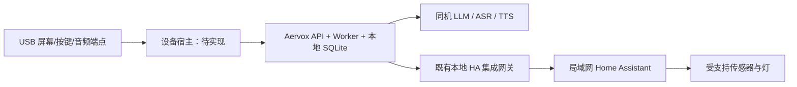
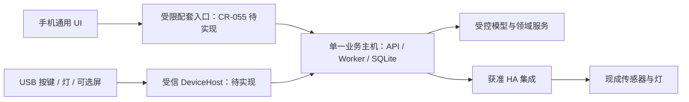

# 配套硬件方向：能力核查、移动协同取舍与原型路线

- 提出人：3yearszhuang · 2026-09-18
- 修改人：WorkBuddy · 2026-09-18

关联：[移动端规划 CR-055](../reference/changes/CR-055-mobile-delivery-plan.md)、[PRD](../reference/PRD.md)、[架构](../reference/ARCHITECTURE.md)、[能力注册表](../reference/capability-registry.md)、[交付追踪](../reference/REQUIREMENTS_TRACEABILITY.md)、[早期 ESP32 设计输入](esp32-s3-hardware-extension.md)

**建议把手机作为通用交互端，把硬件投入集中到手机不擅长的物理交互、低干扰显示和常在线主机。** 首轮只验证一个 USB 实体入口，把桌宠与控制台合并；语音、扫描、佩戴和家庭设备先复用现成产品。电子纸按低干扰价值决定是否继续，独立算力主机按“原电脑关机后仍可用”的需求决定是否提前。

Aervox 已具备学习业务、桌面表现与本地服务基础，适合把“开始、继续、复习、提醒和陪伴反馈”变成实体交互。本文整合 AVX-EXPL-005 的 ESP32 设计输入、AVX-EXPL-011 早期九方向工作稿与 CR-055，成为硬件规划的单一阅读入口：既保留源码核查得出的能力现状，也记录手机协同下的方向取舍、工程边界与停止条件。硬件方向、预算和验收目标均为建议，未新增 CAP、冻结设备协议或承诺产品发布日期；当前产品选择与验证顺序统一维护在根目录 [plan.md](../../plan.md)。

本文是截至 2026-09-18 的源码核查与方案比较，交付的是选型依据。源码与测试文件用于判断已有结构和覆盖意图；本次未执行实物、声学、功耗、厂商沙箱或模型性能测试，也未开展供应商询价、电气测试或固件构建。

## 1. 当前能力能支撑什么

### 1.1 有实现基础的能力

“有实现”表示存在可复用的代码路径；不等于任意模型、操作系统和实体设备组合都已通过交付验收。CAP 正式状态仍以[交付追踪](../reference/REQUIREMENTS_TRACEABILITY.md)为准，能力注册表只登记交付载体和启用方式。

| 能力 | 核查结果与实现入口 | 对硬件的意义 | 仍需确认的边界 |
|---|---|---|---|
| 对话、练习、复习与学习记录 | [共享 API 客户端](../../packages/api-client/src/useAervoxApi.ts)已有开始练习、完成复习等请求；[练习集成测试](../../apps/api/test/practice-session.test.ts)覆盖业务路径 | 按键可以调用现有业务动作；设备无需自建学习数据库 | 设备按钮须绑定当前任务上下文，不能把“已按下”当成“答题正确”或“掌握知识” |
| 桌宠与视觉反馈 | [表现契约](../../packages/contracts/src/schemas.ts)定义 `speak/emote/gesture/move/react`；[桌面主进程](../../apps/desktop/src/main/index.ts)转发 `emote`；[主动表现映射](../../apps/desktop/src/main/proactive-events.ts)复用桌宠指令 | 可将既有语义映射为小屏动画、灯光和短音效 | 现有 `PetCommand` 是表现语义，缺少设备确认等线协议要素；Live2D 运行在桌面渲染端 |
| 实时与异步处理 | [流式协议](../reference/STREAMING_PROTOCOL.md)、API/Worker 与本地 SQLite 的分工已建立 | 主机接收流式回复，设备展示经过筛选的状态；通知和复习排期仍由主机负责 | 设备 ACK 只能证明端点处理情况；业务成功仍由 API 确认 |
| 语音输入 | [录音控制器](../../packages/api-client/src/voice-input-recorder.ts)使用 Web Audio、静音断句和 WAV 切片；[SenseVoice Provider](../../apps/api/src/modules/platform/voice/asr-providers.ts)使用 `sherpa-onnx-node` 执行离线识别，另有 Whisper 兼容接口 | USB 麦克风或音频底座可复用转写入口 | 需准备真实模型、兼容的原生运行库和输入设备；当前是音频切片转写，不代表硬件唤醒词、全双工或远场声学已完成 |
| 语音输出接口 | [GPT-SoVITS 适配器](../../apps/api/src/modules/platform/voice/gpt-sovits.ts)的 HTTP Provider 会调用合成服务；[语音测试](../../apps/api/test/voice.test.ts)覆盖请求与配置 | 可连接用户主机上单独部署的 GPT-SoVITS HTTP 服务 | `GptSovitsLocalProvider.synthesize()` 当前返回带 `GPT-SOVITS-LOCAL:` 前缀的文本字节，却标为 WAV，属于占位实现；不能宣称已具备可播放的本地 TTS。HTTP Provider 的“remote”名称也不等于必须使用云端，实际边界取决于端点 |
| 附件与内容解析扩展 | [二进制附件测试](../../apps/api/test/attachment-binary.test.ts)覆盖上传与回读；[解析 Port](../../apps/api/src/modules/knowledge/content/parser-port.ts)支持替换 Provider | 文档摄像头可以先接入“拍摄、预览、明确提交”的入口 | 默认 `ocr.mock` 返回固定题目和随机置信度，不能识别真实图片；附件登记与 SPI 注册不等于 OCR 已工作 |
| 本地模型管理 | [模型运行时服务](../../apps/api/src/modules/ecosystem/model-runtime/service.ts)有 GGUF 下载、目录、队列与状态；[进程驱动](../../apps/api/src/modules/ecosystem/model-runtime/llama-server.ts)启动并探测 `llama-server`；[运行时测试](../../apps/api/test/model-runtime-api.test.ts)覆盖编排流程 | 可为独立算力主机复用模型安装、启停、状态及普通对话模型入口 | 二进制与模型仍需部署；测试使用注入式进程/网络替身，不证明特定芯片的速度、模型质量、显存占用或离线体验 |
| 家庭环境连接 | [HA Provider](../../apps/api/src/modules/proactive/proactive/providers/home-assistant-provider.ts)实现 REST/WS、实体默认禁用与 service 白名单；[受控工具](../../apps/api/src/modules/proactive/proactive/integration-tools.ts)包括读实体和调用服务 | 可借 Home Assistant 承接已支持的灯、温湿度和存在传感器 | 这是 Aervox 到 HA 的连接，不是自研 Zigbee、Matter、BLE 驱动；还依赖 CAP-033 状态和来源/动作授权 |
| 运动健康连接 | [健康 Provider](../../apps/api/src/modules/proactive/proactive/providers/xiaomi-health-provider.ts)规范化每日步数、睡眠分钟和静息心率；[集成测试](../../apps/api/test/proactive-integrations.test.ts)覆盖同步、工具及撤销 | 可用每日活动信息调整提醒强度或生成回顾 | 依赖用户获准使用的厂商端点和凭据；当前工具读取步数/睡眠，代码不代表手环蓝牙直连、连续心率或医疗判断 |
| 主动智能基础设施 | [桌面 Host](../../apps/desktop/src/main/proactive-host.ts)、[来源适配器](../../apps/desktop/src/main/proactive-source-adapters.ts)、本地 Vault、授权/lease 和 Worker 已有代码 | 后续硬件信号有明确的授权与处理框架可对接 | CAP-033 仍是 `Specified`、生产能力默认关闭；默认广域适配器主要采集元数据，不能将适配器存在等同 OS 已授权或全部来源可采集 |

### 1.2 平台与真机待验证项

以下缺口决定了产品能否从演示进入真实使用，不应由“接口返回成功”代替验证。

| 范围 | 现有证据 | 缺少的交付证据 |
|---|---|---|
| 主动感知与后台恢复 | [ADR-018](../reference/adr/ADR-018-proactive-local-privacy-host.md)与[来源适配器测试](../../apps/desktop/test/proactive-source-adapters.test.ts)明确权限和可用性分离 | 生产签名 Privacy Host、OS Permission Broker、真实系统授权、出网阻断、撤权删除与恢复演练 |
| HA 与健康 | [ADR-019](../reference/adr/ADR-019-proactive-integrations-local-gateway.md)及[集成测试](../../apps/api/test/proactive-integrations.test.ts)证明授权、最小化和调用流程的设计与测试覆盖 | HA 真实版本/断线恢复矩阵、真实 LLAT/OAuth 撤销、小米厂商沙箱与账户准入；测试中的本地模拟服务不证明厂商已开放权限 |
| 声音 | ASR 推理代码与 HTTP TTS 路径存在 | 真麦克风的口音/噪声识别、完整可解码音频、播放中断、回声、硬件静音、音量和连续运行 |
| 本地算力 | 运行时驱动、模型路由和状态接口存在 | 同一整机并发运行 LLM、ASR、TTS、UI、Worker 的内存峰值、延迟、温升、耗电、异常恢复 |
| 物理连接 | 桌面 IPC 与表现映射可复用 | USB 热插拔、串口独占、设备枚举、驱动分发、固件烧录与升级、掉电恢复、生产一致性 |

### 1.3 提案或未支持的部分

- 未在当前 `apps/desktop/src/main/`、`apps/`、`packages/` 中发现硬件 DeviceHost、USB CDC 设备传输或专用固件实现；[AVX-EXPL-005](esp32-s3-hardware-extension.md)是 ESP32-S3 设计输入，不能作为设备已交付的证据。
- 设备身份、配网、密钥注入、OTA、离线同步、恢复出厂和遗失撤销尚无完整产品闭环；不能把“安装一个插件”视为这些能力自动具备。
- 未发现 Aervox 自有 BLE 手环直连、HealthKit/Health Connect、唤醒词、硬件 AEC、机器人运动控制或 ESP32 上的主模型/Live2D 实现。
- 默认 OCR 和本地 GPT-SoVITS 路径的占位实现，需要真实 Provider 与实际媒体验收；插件市场条目、配置页面或 Provider SPI 只能证明扩展入口存在。
- [ADR-016](../reference/adr/ADR-016-base-boundaries.md)已用于底座依赖边界，不能复用为硬件决策编号。后续硬件 CR/ADR 必须重新核对可用编号；[AVX-EXPL-005](esp32-s3-hardware-extension.md)中的设备协议内容继续作为设计输入，不能当作冻结标准。

## 2. 手机能替代什么，尚不能替代什么

### 2.1 分开看现状、计划与物理能力

| 层次 | 当前状态与证据 | 对硬件取舍的意义 |
|---|---|---|
| Aervox 移动端现状 | [Capacitor 包](../../apps/mobile/package.json)与[配置](../../apps/mobile/capacitor.config.json)存在，尚无原生交付链；客户端鉴权、恢复与历史接线缺口见 CR-055 | 不能写成“手机已经全能”，也不能为了填软件缺口立刻开发专用硬件 |
| CR-055 首版候选 | 移动 Web/Capacitor 配套端：普通对话、学习/复习、历史操作、获准日记只读；仍依赖在线主机 | 小屏聊天机、便携复习屏与多数状态显示高度重复；只读日记也须通过来源边界验证 |
| CR-055 后续候选 | 图片选择/上传、分享、通知；语音与系统权限需逐项验证；独立手机运行时另行研究 | 手机拍照、音频、振动是现成物理能力，但接入 Aervox 的软件尚不能视作完成 |
| 手机原生物理优势 | 屏幕、相机、麦克风、扬声器、触控、振动、电池与成熟整机 | 先用已有手机验证输入/显示/提醒；避免重复开发相同部件及充电、无线、系统维护 |
| 手机不直接提供的价值 | 盲操作大按键/脚踏、固定桌面角色、电子纸静态显示、稳定纸面拍摄工位、校准环境传感 | 可以保留，但必须证明具体场景优于手机或现成配件 |
| 手机配套端不等于主机 | 当前 API/Worker/SQLite/模型服务在电脑，手机壳不携带这些运行时 | 常在线小主机有独立价值；无需同时附加大屏、扬声器和机械外壳 |

### 2.2 本轮重新核验的软件基础

代码核验采用 `0a12ea4` 业务代码与移动规划分支 `dff68b8` 的文档。两份合并输入包含原工作区的未提交规划；其中部分 SPI 路径不在该基线中，以下使用本分支真实入口，不把旧工作稿的描述当作已合入实现。

| 可复用部分 | 核验入口 | 对硬件的限制 |
|---|---|---|
| 学习、复习、会话请求 | [API 客户端](../../packages/api-client/src/useAervoxApi.ts)、[传输](../../packages/api-client/src/transport.ts) | 按键是业务请求；收到按键不等于答对、掌握或提交成功 |
| 表现语义 | [PetCommand](../../packages/contracts/src/schemas.ts)、[桌面主动表现](../../apps/desktop/src/main/proactive-events.ts) | 有 `speak/emote/gesture/move/react`，没有设备线协议；`speak` 可携带正文，不能原样广播给外设 |
| 语音入口 | [录音控制器](../../packages/api-client/src/voice-input-recorder.ts)、[ASR Provider](../../apps/api/src/modules/platform/voice/asr-providers.ts)、[TTS](../../apps/api/src/modules/platform/voice/gpt-sovits.ts) | 有录音与识别路径；本地 TTS 仍以文本字节充当 WAV，占位路径不能证明可播放；HTTP TTS 需验证实际端点与声音 |
| 拍题入口 | [内容路由](../../apps/api/src/modules/knowledge/content/routes.ts) | 当前 `mockOcrParse` 返回固定内容和随机置信度；换摄像头不会解决 OCR 软件缺口 |
| 主机部署 | [模型服务](../../apps/api/src/modules/ecosystem/model-runtime/service.ts)、[进程驱动](../../apps/api/src/modules/ecosystem/model-runtime/llama-server.ts) | 可复用模型管理，但芯片兼容、并发内存、模型质量、耗电和无界面运行需实测 |
| 家庭/健康边界 | [能力登记](../reference/capability-registry.md)、[ADR-019](../reference/adr/ADR-019-proactive-integrations-local-gateway.md) | 不等于已有自研 BLE 手环、手机健康授权或通用 IoT 网关；CAP-033 尚不代表生产可用 |
| 实体硬件接入 | 当前 `apps/`、`packages/` 未找到专用 DeviceHost、USB CDC 传输与固件 | USB 宿主、设备权限和恢复都是新增工作；插件配置页不替代可信 I/O 层 |

### 2.3 九个旧方向与手机的重合及处置

“过度设计”指在当前场景和证据下，新增成本没有对应的独有收益，不等于永远禁止某类设备。手机路线尚未完成的部分，优先补软件或做现成外设实验；不能据此声称专用硬件已被实际替代。

| 原方向 | 与手机的重合 | 手机较难替代的部分 | 本轮建议 | 重新投入条件 |
|---|---|---|---|---|
| USB 实体桌宠 | 角色动画、对话显示、状态与提醒 | 固定物理角色、无需解锁的桌面存在感 | **保留并缩小**：与控制台合为一个 USB 实体入口；不做第二个完整聊天屏 | 相比手机支架和软件入口，用户持续选择实体交互，且打扰/维护成本可接受 |
| 专注旋钮控制台 | 任务切换、暂停、提示、复习操作 | 盲操作、触觉、大按键/脚踏无障碍 | **合并**：同一宿主与固件，按键先于屏幕/旋钮 | 键鼠/手机对照中减少误操作或降低操作负担；不是只觉得新鲜 |
| 电子纸复习卡 | 题干、答案、复习列表和日记阅读 | 离开手机的低干扰阅读、静态低功耗显示 | **条件保留**：先 USB 桌面只读卡；移除日记和自动离线计分 | 用户确有“避免拿起手机”的需求，中文/公式可读性与残留画面风险可接受 |
| PTT 语音底座 | 麦克风、扬声器、近场提问与朗读 | 固定拾音位置、大 PTT 键、真实硬件静音 | **降为外设实验**：手机/耳机与现成 USB Audio 对照；暂不自研声学硬件 | 真实 ASR/TTS 完成后仍有可测的拾音、无障碍或隐私操作优势 |
| 文档摄像头学习台 | 拍照、裁剪、上传、题目识别 | 双手空闲、固定视角、重复纸面拍摄 | **先做无源手机支架**；不足再用 UVC 摄像头，暂不做带算力/屏幕扫描机 | 真实 OCR 已通过，支架仍不能满足批量拍摄/书页定位；瓶颈确实在光学工位 |
| 家庭环境网关 | 手机能显示数据、控制场景 | CO₂/温湿度等真实环境测量，现成家庭总线 | **保留集成，取消自研通用网关**：优先现有 HA 与认证设备 | 发现现成集成不覆盖的具体传感需求，且 CAP-033/034 权限与生产门禁满足 |
| 触觉佩戴设备 | 手机振动、系统提醒；现有手表亦可能覆盖 | 无声、免手持、佩戴可达性 | **搁置自研腕带**：先验证手机/现成手表通道，不假定任意手表可接入 | 提醒通道已完成且现成产品无法满足明确的无障碍或持续佩戴需求 |
| 独立本地算力盒 | 与独立手机运行时目标部分相交 | 电脑关机后仍提供服务、散热/容量、稳定供电 | **保留部署选项**：先现成小主机，无屏也可；与手机配套使用 | 主机可用性是实测阻断，且手机独立运行尚未满足同等任务/功耗要求 |
| 机械桌宠 | 情绪/动作表达与角色形象 | 身体运动和可触摸的物理表达 | **搁置首轮**：不同时开发电机、追踪、轮式移动 | 静态实体入口已证明持续价值，进一步身体表达值得承担机电可靠性和安全成本 |

由此，将旧稿依次评估的桌宠、控制台、电子纸前三个方向进一步收敛为：**一个最小实体入口 → 有证据再选电子纸或常在线主机 → 按需求验证专门外设**。旧稿已要求选择一个主方向，本次进一步合并桌宠与控制台的原型范围。常在线主机与实体入口是不同问题，可独立取舍，不要求先做完桌宠才验证主机。

## 3. 运行拓扑与端、主机、数据分工

### 3.1 三种运行拓扑

| 拓扑 | 业务与模型在哪里 | 终端职责 | 适合方向 | 离线含义 |
|---|---|---|---|---|
| USB 依附终端 | 用户现有电脑运行 API、Worker、SQLite 和模型；Electron 承担设备宿主 | 按键、灯、屏、音频等输入输出，不保存业务真源 | 实体桌宠、控制台、电子纸底座、语音底座、扫描台、机械桌宠 | 断公网可以依靠已安装的本地模型继续；电脑休眠/关机后只保留明确设计的设备自身功能 |
| LAN 网关与分布式终端 | 同机 Aervox 网关连接局域网中的 HA；传感器接 HA；未来自有终端网关另行设计 | 接入多设备并执行有限的本地物理逻辑 | 家庭环境设备、后续无线终端 | 断公网且 HA 设备本身不依赖云端时可继续；断 LAN 则停止远端控制，不将断连解释为无人或异常健康 |
| 独立算力主机 | 专用 x86 或 ARM 主机承载完整应用、数据库、模型和设备宿主 | 独立启动与恢复，提供屏幕/音频或服务少量附属终端 | 离线伴学盒、一体机 | 预装齐模型与资产并验证后，可离开原有电脑工作；联网下载、厂商健康同步和远程模型仍不可用 |

图中应用和模型可以运行在用户电脑，也可以全部迁到独立主机。两种部署使用同一个业务真源，不设计两份可同时写入的 SQLite。LAN 设备不是同机 loopback；不得把 CAP-033 的 `local_only` 数据自动发往另一台局域网算力机。普通远程客户端接入须遵循[架构](../reference/ARCHITECTURE.md)的显式非 loopback 开启与认证约束，CAP-033 跨设备边界若需改变则另走 CR。

ESP32-S3 适合承担显示、输入、短音效和低级控制；它不能替代承载主 LLM、数据库、完整 Live2D 与高层授权的主机。型号、电源和引脚评估延用 [AVX-EXPL-005](esp32-s3-hardware-extension.md)，本文不复制其协议与电气表。

### 3.2 端、主机与数据的分工

业务主机可选现有电脑或经验证的专用小主机；不是两个同时写入的副本。手机负责通用浏览/输入，MCU 负责有限物理交互，HA 负责已支持的设备接入；设备和模型均不能直写领域表。

- **共用业务**：复习、会话、通知频控、免打扰、撤权、来源删除、业务幂等仍由现有领域服务负责；硬件不能自己推断当前会话或重复生成学习事实。
- **分开处理传输**：手机 HTTPS/SSE、USB 帧和未来 BLE 的恢复模型不同。可以复用授权与业务规则，不能把 SSE 直接当串口协议或让 MCU 持有手机 API 凭据。
- **输出也有数据边界**：USB 设备同样可被携走或记录内容。首轮仅发送获准的预定义状态/表情 ID，不发送对话正文、`speak` 文本、画像、日记或健康内容；来源未知及主动私密派生输出默认拒绝，低敏外观不自动解除来源限制。
- **输入带任务范围**：输入关联设备实际呈现的任务修订或交互令牌；主机确认其与当前任务、会话和操作能力一致，不能按接收时的任务重新归属迟到输入。换会话、休眠、解绑后旧输入失效。传输 ACK 只表示设备处理状态，业务完成需要 API 回执。
- **手机作为外设网关是后续选项**：目前 CR-055 没有手机 USB Host/BLE 固件网关。Android/iOS 的 USB 权限、BLE 支持和后台行为需独立验证，不能用现有电脑串口能力推导两端都支持。
- **先具体后抽象**：一个真实终端加模拟端点即可验证状态机；只有第二种实际产品证明共享需求后，再抽取稳定接入层。插件可提供受限配置/资产，不获取串口句柄、任意网络调用或运动控制权限。

## 4. 九个硬件方向

### 4.1 USB 实体桌宠：把软件状态变成陪伴感

用户在电脑旁看到思考、鼓励、复习到期等状态，按键即可回到当前任务。价值在于减少打开窗口的成本，并让 Aervox 的桌宠定位拥有直接可感知的实体载体。

- **硬件组成**：ESP32-S3 开发板、小尺寸 SPI LCD、RGB 指示灯、两至三个按键、可选短音效扬声器、USB-C 供电与外壳；首版不装麦克风、电池或电机。
- **复用与拓扑**：USB 依附终端；复用 `CAP-001/018` 的表现语义及 `CAP-006/030` 的复习/提醒结果。Desktop 消费 `emote`，待实现的设备宿主映射为预制动画，主机保留通知策略。
- **需补软件**：USB 宿主、表现映射、有限队列、重连、设备状态与按键命令；固件使用精灵图或简短逐帧动画，设备 ACK 与业务完成分别展示。设备协议走新 CR/ADR 收敛。
- **离线、功耗与隐私**：无公网且同机模型就绪时可用；主机不在线则显示明确离线状态。原型按 USB 5 V、约 1～3 W 工作预算测量峰值，不承诺电池续航。默认只传表情/状态编号和少量提示，不复制完整会话。
- **BOM 粗估**：人民币 120～300 元/套，含开发板、屏、按键、线材与简单外壳；不含电脑与工装。
- **主要风险**：低帧率动画观感、串口驱动、主机休眠、重复提醒；装饰价值可能高于学习价值。
- **最小 PoC 与验收**：三个状态、一种提醒、一个“继续”按钮。连续发送 1,000 个含重复/过期命令的测试序列，要求重复副作用为 0；热插拔 20 次均可恢复；运行 24 小时记录 ACK 延迟/断连；用户完成同一复习任务，比较软件入口与实体入口的用时和使用偏好。

### 4.2 专注旋钮控制台：低分心的学习操作器

用户旋转选择任务，按下开始练习，通过大按键完成“显示提示、下一步、稍后提醒、结束”。它服务高频操作和无障碍需求，形态可做成桌面旋钮、三键板或脚踏板。

- **硬件组成**：支持 USB 的 MCU、带按压编码器、三至五个大按键、状态灯；可选微型 OLED。首版用有线连接，避免引入无线配对。
- **复用与拓扑**：USB 依附终端；复用 `CAP-002/003/006` 与[学习 API 客户端](../../packages/api-client/src/useAervoxApi.ts)。输入交给宿主当前任务的命令处理器，学习记录仍由 API 写入。
- **需补软件**：显式命令映射、焦点/任务校验、长按防误触、状态回显；优先专用受限设备通道，避免将任意全局键盘宏作为产品授权机制。插件只配置允许的动作，不取得任意串口写权限。
- **离线、功耗与隐私**：已加载的控制界面可工作，但新练习生成仍依赖可用模型；主机离线不提交学习结果。约 0.1～1 W USB 预算；不采音像，不记录完整按键流，仅上报确定性命令。
- **BOM 粗估**：人民币 70～200 元/套；编码器 10～40 元、大按键/灯与小屏 20～70 元，余量用于 MCU、板材、线材和外壳。
- **主要风险**：错误任务上下文、按键连击、左右手/视障可达性；用户误把“翻页”当作“正确作答”。
- **最小 PoC 与验收**：三键对应继续、提示、暂停；跑 100 次包含切换窗口、切换会话和休眠恢复的输入序列，误投到其它任务为 0。邀请至少五位试用者完成键鼠与控制台对照流程，记录任务完成时间、误操作次数和可达性问题。

### 4.3 电子纸复习卡：低干扰的随手回忆终端

设备摆在桌面或随身携带，显示一道已经生成的复习题或当天摘要。翻面/按键查看答案，强调主动回忆，而不是持续播放角色动画。

- **硬件组成**：2.9～4.2 英寸电子纸、低功耗 MCU、两个按键、可选 RTC；首版做 USB 更新的无电池桌面卡，第二步再加电池与保护充电电路。
- **复用与拓扑**：首版为 USB 依附终端，复用 `CAP-006/004/009` 的复习内容、错题和可选择的日记摘要。首版离线只阅读有限缓存，回到主机后才由用户确认作答结果。
- **需补软件**：内容压缩排版、中文字体子集、缓存失效、同步确认。离线作答若要自动回写，须另补事件幂等、时间来源、版本冲突和删除传播；现有客户端接口不等于已有离线同步协议。
- **离线、功耗与隐私**：断开后保留最后画面是电子纸特性，适合只读；撤权时主机不能擦除已断电的屏幕，因此可携带版本默认不缓存私人日记或健康数据。电池版本以休眠微安级、刷新/传输瞬态为设计方向，实际整板漏电决定续航，需实测，不能直接承诺“数月”。
- **BOM 粗估**：人民币 180～450 元/套；其中屏幕约 80～220 元；电池版本的电池、保护/充电、结构增加约 30～80 元。
- **主要风险**：中文密度、公式渲染、刷新残影、内容过期、遗失后画面泄露；小屏不适合长对话。
- **最小 PoC 与验收**：主机发送三道已生成题目，设备可显示题干/答案并清空内容；在选定屏幕测试 30 张含中文和简单公式的卡片，关键内容无遮挡；断电重启不伪造完成记录；测一个完整“同步、十次翻页、待机 24 小时”的电量预算，再决定是否加电池。

### 4.4 按住说话的语音底座：自然问答与口语复述

用户按住实体键提出问题，松开后由 Aervox 转写、回答并朗读；也可让用户复述一个知识点，再自行确认转写内容。先聚焦近场、轮流说话，不把全天候唤醒和远场全双工作为首轮范围。

- **硬件组成**：标准 USB Audio 声卡/麦克风、扬声器、小功放、实体 PTT 键、独立麦克风静音开关、采集状态灯；可另用 MCU 上报按键。标准 USB Audio 可减少首版自研音频固件范围。
- **复用与拓扑**：USB 依附终端；复用 `CAP-002/007/008`、[语音输入客户端](../../packages/api-client/src/useAervoxVoiceInput.ts)与[语音输出客户端](../../packages/api-client/src/useAervoxVoice.ts)。同机 SenseVoice 转写，普通对话后通过已部署的本地 HTTP TTS 服务播放。
- **需补软件**：PTT 状态机、选择输入输出设备、取消和抢断、播放时避免再次拾音、麦克风授权/拔出收尾；先修复本地 TTS 占位路径或使用经验证的 HTTP TTS 服务。硬件 PTT 采集范围按 [AVX-EXPL-005](esp32-s3-hardware-extension.md)另做专项 CR。
- **离线、功耗与隐私**：离线依赖 ASR、LLM、TTS 三者均在同机可用；任一端使用云服务就不是全离线链路。USB 约 1～5 W 预算，随播放音量变化。麦克风静音应真实切断采集通路，灯与实际采集状态一致；原始音频默认短暂缓冲，用户提交的文本再进入会话。
- **BOM 粗估**：人民币 180～500 元/套，不含承载模型的电脑；用现成 USB 音频模组先验证体验，再考虑集成 PCB。
- **主要风险**：风扇/键盘噪声、回声、吞首字、识别错误、TTS 延迟，以及硬件静音只有 UI 图标而未真正生效。
- **最小 PoC 与验收**：30 条中文短句和十次中途取消；转写可编辑，50 次松键/静音后不继续采集。每次返回音频必须可解码播放；分开报告转写、首个回答和首段音频的 P50/P95 延迟；断公网重跑并核对无出网请求，才称该配置离线可用。

### 4.5 文档摄像头学习台：纸面材料进入学习闭环

用户把作业或书页放在支架下，按键拍摄、校对识别内容，再选择提问或建立练习。价值在于纸面学习与 Aervox 之间更顺畅的输入，不依赖手持手机对焦。

- **硬件组成**：带固定支架的 USB UVC 摄像头、手动快门按钮、物理遮挡盖、漫射补光、可定位的纸面底板；先不做机械翻页或自动批改。
- **复用与拓扑**：USB 依附终端；复用 `CAP-012/025/007/004`、附件上传与[内容解析 Port](../../apps/api/src/modules/knowledge/content/parser-port.ts)。摄像头画面在主机预览，由用户确认拍摄和提交。
- **需补软件**：真实 OCR Provider、透视/裁剪/旋转、题目边界和公式处理、识别纠错界面、来源关联；默认 `ocr.mock` 必须退出该产品运行路径。低置信识别不自动转为学习事实或掌握度。
- **离线、功耗与隐私**：本地 OCR 与后续模型都可用才可离线；如果选择云视觉模型，需要明确该次上传行为。摄像头与照明合计约 2～8 W 预算，补光按额定要求独立供电；默认快门式采集，避免持续保存周围人物、姓名或学籍信息。
- **BOM 粗估**：人民币 250～800 元/套；镜头、支架刚度和均匀照明优先于额外屏幕；不含电脑。
- **主要风险**：弯曲书页、反光、手写体/数学公式、低质量图像导致“识别成功但题意错误”；仅看 HTTP 成功无法发现。
- **最小 PoC 与验收**：先用现成 UVC 摄像头接真实解析器，对 30 页预先整理的印刷中文/简单公式样本逐页核对。建议印刷文字字符准确率目标不低于 95%，公式单独报告；低于门槛必须可纠正/重拍，禁止随机置信度；来源删除后解析缓存同步失效。

### 4.6 家庭环境伴学网关：让空间响应学习状态

用户明确启用学习场景后，系统显示光照、温湿度或 CO₂ 趋势，并在授权范围内调整台灯。它主要改善学习环境，不通过传感器推断用户是否“自律”，也不把存在传感器当作身份识别。

- **硬件组成**：优先使用 HA 已支持的温湿度/光照/CO₂ 传感器与灯；自研可从一个温湿度节点和一盏低压灯开始。若无现成 HA，可选低功耗主机承载 HA，避免首版自制市电控制板。
- **复用与拓扑**：LAN 网关；复用 `CAP-034`、`CAP-030` 及相应 `CAP-033` 授权。传感器先进入 HA，Aervox 在同机 API 网关消费已启用实体，写操作使用 `ha_call_service` 的实体/service 白名单与动作审计。
- **需补软件**：真实 HA 版本与重连测试、设备实体配置指导、过期数据标记、用户可解释的场景规则；如启用主动观察，先完成 CAP-033 对应生产门禁。把传感器接入 HA 的固件/集成单独验证，不能假设任意 ESP32 上电就会被识别。
- **离线、功耗与隐私**：无公网时可用性取决于具体 HA 集成是否本地化；使用云依赖设备则仍受断网影响。传感器节点约 0.1～2 W，含 CO₂ 的连续测量按 1～3 W 预算；另计 HA 主机约 3～15 W。屋内存在、作息和环境历史属于敏感上下文，按来源授权最小化保留。
- **BOM 粗估**：人民币 180～700 元/套传感器/控制原型；新增 HA 主机再计约 400～1,500 元，已有主机可复用；CO₂ 传感器是明显成本项。
- **主要风险**：传感器漂移、LAN 中断、状态滞后、授权撤销未即时停止、设备过多带来的维护成本；不承诺消防、医疗或室内空气安全认证。
- **最小 PoC 与验收**：接入一个温湿度实体和一个灯实体，完成只读展示及用户授权后的亮度调整；十次 HA 重启/断网均能正确显示离线并恢复；未启用实体、未授权服务、撤销后请求必须全部拒绝，旧事件不得触发迟到开灯。

### 4.7 触觉佩戴设备：安静的休息与节奏提示

用户在图书馆或移动学习时，用轻振提醒休息、回到任务或确认通知。首版以提示和用户按键回执为主；运动健康只是后续可选输入，不在首版自研心率/睡眠算法。

- **硬件组成**：低功耗 BLE MCU、振动马达/驱动、按键、电池与保护充电、可选 IMU、可更换腕带或夹持外壳；先在开发板验证，再做贴肤结构。
- **复用与拓扑**：初期由电脑上的待实现 BLE 宿主桥接，属于依附终端；手机网关是另一个尚需开发的部署方案。复用 `CAP-030/006` 的提醒结果；若消费既有健康汇总，使用 `CAP-035` 已授权数据路径。
- **需补软件**：BLE 配对/身份、重连、通知优先级、免打扰同步、遗失解绑、设备固件和低电量策略。自研 IMU 数据若要形成健康来源，应增加相应 Provider/来源授权与验收，不能伪装成已支持的小米云数据。
- **离线、功耗与隐私**：离开网关后仅保留用户明确设置的本地计时提醒，不接受离线高风险动作；不会自动拥有随身 AI 对话能力。按平均 0.5～5 mA、振动另计的设计目标实测整机电量；续航受连接间隔和振动次数影响。默认设备仅接收提醒类别，不显示健康数值或私人正文。
- **BOM 粗估**：人民币 120～350 元/套开发原型；小型化、密封、贴肤材料和可靠充电的量产开发费用另计。
- **主要风险**：佩戴舒适度、皮肤材料、电池安全、丢失、断连以及过度提醒；静息心率/睡眠数据不得被用于诊断或治疗建议。
- **最小 PoC 与验收**：三种振动模式、一个确认键和硬件暂停；按一天的真实提醒脚本测 24 小时电量。20 次离开/返回网关范围正确处理连接，免打扰和撤销后振动为 0；至少五人试戴两小时，收集舒适度与打扰感，不收集生理原始数据。

### 4.8 独立本地算力盒：不依赖原有电脑的 Aervox 主机

用户把专用盒子放在书桌上，连接屏幕和语音底座即可学习；原有笔记本关机后仍可用。它解决的是部署和常驻算力，而不仅是增加一个外观终端。

- **硬件组成**：x86 小主机或经过运行库验证的 ARM 主机、16～32 GB 内存起步、256 GB 以上 SSD、有线网络、USB、散热、电源；按模型并发评估更高内存或 GPU。可配独立显示屏，不预设所有 SBC 都满足性能。
- **复用与拓扑**：独立算力主机；承载 API、Worker、本地 SQLite、模型运行时和可选桌面 UI，复用 `CAP-002/007/018/027`。同机接 USB 外设，HA 仍可通过既有 LAN 网关连接。
- **需补软件**：目标架构运行库与驱动兼容、可重复系统镜像、服务自启/健康检查、模型许可与版本管理、散热降载、磁盘容量告警、应用升级与回滚。无界面服务和有界面 Electron 部署须分别验证；不能把跑通 Linux API 视为所有桌面 OS 权限能力也已支持。
- **离线、功耗与隐私**：预装并校验模型、字库和全部运行依赖后可离线；云端健康同步、联网搜索仍不可用。整机先按空闲 5～15 W、推理 15～65 W 预算；GPU 配置另算。数据库与 CAP-033 Host 必须位于明确的同机边界，迁移需沿既有[换库与回滚流程](../how-to/run-database-migration-drill.md)，不做双主同步。普通业务资料迁移与 Privacy Host 换机需分开评审：CAP-033 的设备授权、激活租约和访问令牌不能随库复制后在新主机继续生效，涉及 Vault/私密来源时按对应数据边界重新授权，不能沿用旧设备身份替代新主机授权。
- **BOM 粗估**：人民币 1,500～4,500 元/套无独立 GPU 主机，含内存、SSD、电源与散热；加屏/音频约 300～1,000 元。GPU 或大统一内存平台可能明显超出此范围，需另做实测与预算。
- **主要风险**：小模型能力与延迟、模型/语音并发抢内存、噪声温升、断电损坏、系统镜像维护；参数量或硬盘上的 GGUF 大小不能直接等同运行内存需求。
- **最小 PoC 与验收**：先用现有小主机部署，选定一个模型、固定上下文长度和 20 个代表性学习任务。记录首 Token 延迟、生成速度、任务质量、ASR/TTS 延迟、峰值内存与墙插功耗；建议交互试验目标为首 Token P95 不超过 3 秒、持续输出至少 10 Token/秒，达不到则调整模型/预算而不伪报。断公网连续运行 24 小时，并完成重启、磁盘不足、备份恢复和模型崩溃恢复。主机可无显示器；有界面 Electron、无界面服务、目标系统权限与 USB DeviceHost 是不同验证项。

### 4.9 机械桌宠：有身体动作的陪伴装置

通过缓慢点头、转向或耳朵动作表达回应，适合重视角色表达和实体陪伴的用户。机械结构带来独立于小屏的体验，也带来显著更高的安全与维护成本。

- **硬件组成**：MCU、一个至两个低扭矩舵机/执行器、限位/电流检测、独立急停或电机断电、软性外壳、稳定底座和独立电源；首版固定底座，不做轮式移动。
- **复用与拓扑**：USB 依附终端；仅复用 `CAP-001/018/008` 的情绪/手势语义。宿主选择经过验证的有限动作库，控制器执行受限轨迹；`PetCommand.move` 的桌面坐标不得直接变成舵机角度或速度。
- **需补软件**：独立运动控制契约、动作仲裁、角度/速度/电流边界、机械零位、看门狗和掉线停机；通过专项 CR/ADR 明确动作授权、安全状态及恢复方式。模型不能输出任意电机指令。
- **离线、功耗与隐私**：无主机时只进入安全静止态，不能重放旧动作；断公网不影响已授权的本地表现。原型约 3～10 W 工作、按 15～30 W 短时峰值选电源并实测堵转，禁止从普通 USB 口盲目取电。首版不增加摄像头或持续人脸跟踪。
- **BOM 粗估**：人民币 350～1,000 元/套，包括执行器、驱动、传感器、电源和简单机械件；精密模具、可靠性工装不在范围内。
- **主要风险**：夹伤、堵转发热、桌面倾倒、噪声、齿轮寿命与运动惊扰；难度主要在机电可靠性，而不是表现指令映射。
- **最小 PoC 与验收**：一个执行器、一个慢速点头动作，先在隔离测试台测边界。100 次重复/过期/断线指令测试不越界，连续 1,000 次动作记录温升与磨损；急停及通信超时进入已定义安全状态，建议断电停止目标在 200 毫秒内并用仪器测量，未通过前不进入用户接触试验。

## 5. 方向比较与优先顺序

本节是方向比较证据，当前选型、排序和投入决定只在根目录 [plan.md](../../plan.md) 的 ITER-009/016/018 维护；尚未选择硬件产品。

### 5.1 同一尺度比较

以下 BOM 是开发板加单套原型零件的工程估算，单位为人民币；不是供应商报价、零售价或量产成本。未包含设计人力、模具、认证、运输、渠道与售后。功耗和进度同样是设计/安排目标，不能作为产品规格宣传。“本轮预算策略”一列继承旧工作稿的粗估口径，未做新询价，精简后的 BOM 需按实际方案重报，不能把两套旧预算相加。

| 方向  |  主要价值  |  首轮拓扑  |  原型 BOM  |  软件增量  |  关键依赖/门禁 | 本轮预算策略 |
| --- | --- | --- | --- | --- | --- | --- |
| USB 实体桌宠  |  强化角色陪伴与任务入口  |  USB  |  120～300  |  中  |  设备宿主、固件与表现映射 |  一个原型分配置验证；先复用开发板和现成外壳，再决定是否加屏 |
| 专注控制台  |  高频操作与无障碍  |  USB  |  70～200  |  小至中  |  任务上下文、确定性命令、误触控制 |  与桌宠共用同一原型，不另分配预算 |
| 电子纸复习卡  |  低干扰回忆与离线阅读  |  USB 起步  |  180～450  |  中  |  内容排版、缓存/删除策略；自动离线回写另议 |  电池不进入首轮；先评估显示与排版，不能按屏幕标称功耗推整机续航 |
| PTT 语音底座  |  自然提问与口头复述  |  USB Audio  |  180～500  |  中至大  |  真实可播放 TTS、音频设备与隐私验证 |  优先借用手机、耳机与现成 USB Audio；只在体验差距明确后采购 |
| 文档摄像头学习台  |  纸面内容导入  |  USB UVC  |  250～800  |  大  |  真实 OCR、公式与纠错质量 |  先用手机与现成 UVC 验证；瓶颈确认在光学工位再采购 |
| 家庭环境网关  |  学习空间联动  |  LAN + HA  |  180～700，主机另计  |  中至大  |  CAP-033 门禁、HA 真机、授权/重连 |  复用现有网关与实体；不为一个场景同时新造网关、节点和协议 |
| 触觉佩戴设备  |  安静随身提醒  |  BLE 依附网关  |  120～350  |  大  |  无线生命周期、电池/佩戴；手机网关未有 |  旧估算留存，本轮不分配研发或采购预算 |
| 独立本地算力盒  |  脱离原有电脑、常驻离线  |  独立主机  |  1,500～4,500  |  大  |  整机性能、部署、断电/恢复 |  先借用已有机器，按固定任务实测选型；先不加屏幕/音频/自研主板 |
| 机械桌宠  |  身体动作与情感表现  |  USB + 独立电源  |  350～1,000  |  大  |  运动契约、急停、机电可靠性 |  旧估算留存，本轮不分配研发或采购预算 |

“软件增量小”相对于其它硬件方案，不表示现有代码已经具备硬件支持。即使使用现成 USB Audio/UVC，仍需验证应用设备选择、系统权限与热插拔。

### 5.2 本轮收敛后的推荐组合

在九个方向的比较之上，本轮进一步按“手机能替代什么”收敛范围：**一个最小实体入口 → 有证据再选电子纸或常在线主机 → 按需求验证专门外设**。

#### 一个 USB 实体入口，两种实验配置

最小配置为现成 MCU 开发板、两至三个大按键、一个状态灯与 USB 供电。按键先映射“回到当前任务、暂停/稍后、确认明确选项”，禁止把一次点击直接当成答对或知识掌握。

第二配置在同一设备上增加小型 SPI LCD 和可替换角色外壳，验证物理桌宠是否比单纯按键更有价值；不另建第二套宿主。旋钮、脚踏可针对可达性选择，不默认全部装入。短音效仅在静音控制和用户实验需要时增加。

主机断连时，若设备仍有独立供电则显示失联并停止动作；USB 同时断电时设备会直接熄灭，不能承诺显示离线。可选本地计时器必须明确是设备自身功能，不伪装成主机已记录的学习进度。

#### 先利用手机本体的三个低成本方向

| 新设想 | 先验证的收益 | 刻意收窄的范围 | 决定是否升级 |
|---|---|---|---|
| 无源手机桌面底座/角色外壳 | 稳定摆放、固定角色位置、减少拿起手机 | 支架与软件轻量显示；无 MCU、无电池、无自研充电协议 | 与 USB 实体入口做相同任务对照；若体验接近则保留低成本方案 |
| 无源拍题支架与纸面定位板 | 双手空闲、固定视角、稳定重复拍摄 | 手机相机与显式上传；不加第二块屏幕或 OCR 算力板 | 先定位反光、透视、对焦、遮挡和装夹问题，再决定是否购买 UVC 外设 |
| 现成大按键/脚踏开关 | 盲操作和无障碍输入，验证是否真的需要新 MCU | 仅在 Aervox 已聚焦且显示目标任务时使用受限映射；不使用全局任意宏授权 | 证明操作收益后才设计自定义外壳/固件；确认系统可达性与误触情况 |

这些是候选使用实验，不意味着已有手机桌宠常亮模式、自动拍题或手机 USB 配件支持。手机常亮的耗电、发热、锁屏、来电和后台中断需记录；不能靠系统悬浮权限或绕过后台限制维持体验。

#### 电子纸作为可选显示件

只在“避免接触手机”是明确需求时制作电子纸样机。先以 USB 更新少量、用户选择的低敏复习材料，只读题干/答案；不带日记、健康信息、自动评分、跨设备离线写队列或电池承诺。字体、公式、换页速度和残影须用真实卡片验证。

电子纸断电保留画面，主机无法远程擦除失联设备上的内容。因此“撤权后清空”只对设备在线且执行成功有效；内容选择必须事先考虑永久残留。便携/电池版本应在阅读价值验证之后另评遗失、删除与续航。

#### 常在线主机与手机配套

先用已有 x86/ARM 小主机验证 API、Worker、模型、备份和恢复，不按处理器名称或 GGUF 文件大小推算体验。输入任务、上下文长度和模型版本固定后，记录首 Token、生成速度、质量、峰值内存、墙插功耗、温升与崩溃恢复；性能目标延用 PRD 与 CR-055 的测量要求，另行冻结整机预算。

普通手机访问复用 CR-055 的受限入口；该方案不自动扩张 `local_only` 例外。如果把现有电脑资料迁到盒子，应选择一个业务主机，显式备份、迁移和验证；原电脑成为客户端，不把两个 SQLite 目录实时同步成双主。

#### 专门外设的继续投入条件

PTT 先用现成 USB Audio/耳机验证，必须得到真实可解码 TTS、可编辑 ASR、采集状态一致的硬件静音及取消恢复。扫描台先用手机/现成 UVC 与真实 OCR 验证，逐页核对印刷中文、公式和手写体，不以 HTTP 成功或随机置信度验收。

HA 优先复用已有网关与受支持实体，实体/service 白名单、断线过期状态和撤权后零动作必须通过；不要重新实现 Zigbee/Matter 通用网关。手机/手表提醒、健康来源分别按平台 API 和授权验收，不把日步数接口视为自研腕带或连续生理监测能力。

机械动作只留后续方向：有限轨迹、角度/速度/电流边界、限位、断线安全静止与可物理断电的急停必须先定义。`PetCommand.move` 是表现语义，不是舵机坐标；模型输出不能直达执行器。未完成隔离测试台验证前不进入用户接触试验。

#### 与旧稿“先做前三项”的对应关系

原九方向工作稿曾建议先做桌宠、控制台、电子纸三项，理由是：**USB 实体桌宠**直接复用当前桌宠表现、最贴近 Aervox 的定位，有线小屏且无捕获传感器，范围可控，重点衡量用户是否更愿意回来学习而非仅评价外观；**专注控制台**与桌宠共享同一 USB 宿主和按键通道、成本低，可快速分辨用户真正需要的物理动作；**电子纸复习卡**更贴近间隔复习业务且不依赖补齐语音/OCR，首版只读缓存即可先验证阅读体验。

本轮据此调整为：桌宠与控制台合并为**一个 USB 实体入口**（先验证产品辨识度与操作效率，共享同一宿主与固件），电子纸降级为**条件性显示件**（只在“避免接触手机”的需求被证实后投入，日记与自动离线计分移出首版）；原第三项让位于“常在线主机”这一独立部署问题。独立算力盒适合需要“不开电脑也能用”的场景；语音底座适合重视口头交互的场景，但要先证明真实 TTS 与音频链路。机械桌宠、贴肤佩戴和广域传感不应与首版设备协议一起打包定案，以免把首次硬件验证扩大成多个产品同时交付。

### 5.3 应移除或后移的过度设计

| 旧设想或容易膨胀的配置 | 在当前前提下的问题 | 新的最小选择 |
|---|---|---|
| 首轮冻结 `ESP32-S3-WROOM-2-N32R16V`、32 MB Flash/16 MB PSRAM | 按键/状态灯未证明需要大内存和无线；把特定模组能力当作产品需求 | 优先现有开发板；测固件/资产占用后选容量。已有该板可继续用，无需为省参数重购 |
| LCD、音箱、旋钮、麦克风、摄像头全部上板 | 复制手机且难以判断哪项带来价值；增加电源、声学和隐私工作 | 第一个版本只有按键与状态灯；屏幕/角色是一个可拆换实验配置 |
| 单独开发桌宠和控制台两套宿主 | 传输、按键、重连高度相同，却按两个产品支付维护成本 | 一个 USB 宿主和同一原型配置；暂不提炼万能设备框架 |
| 无线、电池、BLE 配网、云中继一开始就做 | 桌面场景无明确无线需求，却提前承担配对、续航、凭据与恢复 | 有线供电 + USB；芯片含无线不代表启用无线 |
| 无联网原型必须通过 RF、双分区 OTA 和工厂密钥注入 | 旧 R0 验收混入了后续无线/量产目标；无法对应当前威胁与交付形态 | 首轮做受控 USB 烧录、恢复与基本电气验证；启用无线/分发固件时再补其适用门禁 |
| 用 ESP32 运行主模型、完整 Live2D、长期会话库 | 混淆端点和主机；与手机、电脑和既定数据边界重复 | MCU 只处理有限输入与预制表现；模型、业务记录在受控主机 |
| 多设备离线作答、通用事件同步、自动合并数据 | 小按键引出了第二套业务副本与冲突/删除传播系统 | 断连不提交业务写入；复连取当前状态，不补交旧按键 |
| 自研扫描机、双麦远场全双工、健康算法 | 软件基础尚有占位路径；手机或现成外设已能提供验证输入 | 先用真实 OCR/ASR/TTS 验证任务，再定位硬件瓶颈 |
| 大屏一体机、独立主机与机械外壳捆绑 | 将常在线部署需求和表现需求混为一项采购 | 小主机作为单独部署选项，手机承担主要屏幕 |

分阶段缩小范围不豁免基本电气保护、模型/固件许可、撤权、可恢复性或面向真实用户的适用安全要求；对应部件或分发方式进入范围时，其门禁必须同时进入。

## 6. 从早期 ESP32 方案继承并修订的工程边界

本节吸收早期 ESP32 设计输入中仍然成立的部分，并撤销其中与当前交付形态不匹配的冻结项。器件级事实仍以 [AVX-EXPL-005](esp32-s3-hardware-extension.md)为准，本文不复制其协议与电气表。

### 6.1 保留 ESP32 为候选，不冻结模组和引脚

ESP32-S3 可以用于小屏与输入原型；若仅按键/灯，具有合适 USB 能力的现有 MCU 即可。旧稿 `N32R16V` 的大容量 Flash/PSRAM、候选 240×240/320×240 LCD 与 I²S 短音效属于可选设计输入，不构成最小需求。

| 旧稿主题 | 本轮保留的要求 | 本轮不再冻结的部分 |
|---|---|---|
| USB 与引脚复用 | 核对实际开发板、模组封装、USB 接线、启动绑带、调试口与 Flash/PSRAM 占用 | 旧 GPIO 分配表不能直接用于 PCB；尤其原文“扩展/ADC1 GPIO1/2/21/38”不得解释为 GPIO21/38 支持 ADC1 |
| I/O 电压 | 核对电源域、模组/屏幕/按键电平与是否需要转换，优先用已验证开发板 | 旧稿 GPIO47/48、Octal 内存相关电压描述须按具体料号与数据手册重核，不泛化到所有 ESP32-S3 板 |
| 电源与保护 | USB-C 角色/CC、协商电流、3.3 V 稳压、去耦、ESD、复位与启动稳定性；实测屏幕/功放峰值 | 旧稿 RF 峰值与“1 A 原型电源”不是整机规格；首轮无线关闭，不用未启用 RF 的测试替代实际负载验证 |
| PCB 与机械 | 开发板价值验证后才评审供电、接口应力、散热、外壳、天线禁布和可维修性 | 不预先采购量产模组、开模或按旧 RC/尺寸/温度数字设计成品 |
| 固件资源 | 记录程序/资产实际占用、帧率、RAM 峰值与看门狗恢复；资源可替换 | 不按 32 MB 默认规划双 OTA、完整音库和会话存储；不在 MCU 跑主模型/完整 Live2D |

本轮未重新查验厂商数据手册或实测上述器件。进入原理图与采购评审时，必须记录具体模组/开发板版本、手册版本、负载测试与替代料；不能引用旧稿“模组级事实”作为新物料已核验的证明。

### 6.2 USB 原型所需的最小协议语义

保留版本协商、帧大小/队列上限、明确类型、序号、命令关联、错误与回执。开发板可用 JSON Lines 验证，但具体字段、大小和线协议由后续设备 CR/Reference 定义；本文不提前创建 `DEVICE_PROTOCOL.md` 或固定固件目录。

旧稿的可靠性表述调整为以下可实现边界：

1. 连接/启动身份参与序号和去重范围；设备重启建立新会话，清空旧动作，不宣称掉电前后的物理副作用严格只执行一次。
2. 主机在发送前检查当前任务与语义过期；设备使用本地单调计时处理收到后的租期、超时与看门狗。无可信 RTC/时间同步时不依赖绝对 UTC `expiresAt`，接收后 TTL 也不能证明帧在链路里没有迟到。
3. 状态采用“覆盖为最新值”，断线清空动作队列，重新握手后仅同步当前获准状态；不补播旧提醒、不补交离线按键。
4. 主机将输入请求绑定到当前任务并使用业务幂等机制；设备 ACK、宿主收到输入、API 提交成功是不同状态。重试业务前确认既有结果。
5. 未知版本/类型、大包、失效连接、队列满、撤权和任务切换均有明确拒绝路径；Renderer/插件只能调用受限方法，不能写任意串口字节或刷固件。

### 6.3 固件更新与后续能力分开验收

| 阶段 | 应完成的验证 | 尚不因此进入范围的能力 |
|---|---|---|
| 受控开发板 USB 实验 | 工具链版本、可信固件来源、USB 烧录/恢复、烧录失败可恢复、看门狗、断电安全状态；保留可重建固件 | 无线配网、生产密钥、OTA 服务与对外产品发布 |
| 分发工程样机 | 明确可信更新渠道、签名/完整性验证、兼容版本、恢复与回退、设备身份、损坏设备处理 | 工厂规模注入和联网 OTA 不因分发自动开启，按更新设计补充 |
| 无线版本 | 配对/绑定、凭据、撤销/遗失与恢复；IP 网络按方案验证 TLS，BLE 验证其配对/加密及必要的应用层认证，不能无条件套用 TLS | 连续捕获、永久后台执行或多主同步 |
| 电池版本 | 保护/充电、实际负载续航、低电量/掉电恢复、结构与适用认证；若无无线，不额外要求无线配对或网关 | 无线、离线业务回写或持久私密缓存 |
| 带麦克风/传感器/电机 | 来源/动作授权、采集指示与硬件停止、音频质量或运动边界、撤权后停止；独立专项验收 | 默认扩大既有用户授权 |

## 7. 建议共享的硬件接入层

这里描述后续设计方向，不定义新接口字段或冻结包名。现有插件契约、底座边界与 [AVX-EXPL-005](esp32-s3-hardware-extension.md)仍分别负责各自范围；具体硬件协议需在新 CR/ADR 评审后建立单一 Reference。

| 接入层职责 | 建议归属 | 复用价值与约束 |
|---|---|---|
| 业务动作与事实 | API/Worker 与既有领域 Port | 复习、记忆、日记、撤权等仍由业务层拥有；硬件输入是请求，不是绕过校验的数据库写入 |
| 表现与输入映射 | 受信设备宿主 | 把 `PetCommand` 和当前任务映射成有限指令；将按键映射成已允许的命令。控制屏/灯/电机的机制与内容策略分离 |
| 传输适配 | 受限 USB/BLE/LAN 适配器 | 共用生命周期、超时、撤权与观测入口；不将串口句柄或任意网络调用开放给插件页面 |
| 设备状态与生命周期 | 宿主控制面 + 固件 | 将发现、配对、能力协商、连接、升级和恢复明确建模；设备运行状态不复制为第二份用户身份或学习事实 |
| 权限与本地处理 | 现有策略、来源授权与 Privacy Host | 传感器/动作接入分别授权；固件版本升级不能自动扩大采集范围；CAP-033 不因“同一 Wi-Fi”而放宽本地边界 |
| 可靠性与安全状态 | 宿主和端点协作 | 区分接收确认、实际执行结果和业务提交；对断线、撤销、重复、过期和重启采用有限、可测的行为 |
| 可选插件内容 | 既有插件 Host 与配置机制 | 插件可提供受限表现资源或用户可选配置；可信原生 I/O/运动控制属于宿主能力，不能藏在插件页面里直接执行 |

[ADR-016](../reference/adr/ADR-016-base-boundaries.md)冻结的是依赖边界，硬件接入也应遵循宿主单向消费契约、能力层不直接访问数据库与宿主 Shell 的规则。[ADR-018](../reference/adr/ADR-018-proactive-local-privacy-host.md)决定观察/动作的本地边界，[ADR-019](../reference/adr/ADR-019-proactive-integrations-local-gateway.md)决定现有家庭/健康连接如何管理凭据与授权；硬件开发不能借新插件绕过这些已经接受的约束。

首版可以只支持一种 USB 终端，但应同时用模拟设备验证核心状态机。先证明两种具体产品确实共享生命周期，再抽取稳定接入层；不要先造一个支持所有无线协议、所有传感器和所有机器人的框架。

## 8. 分阶段路线、成本与停止条件

### 8.1 阶段准入与继续投入条件

以下是候选硬件从概念验证到工程化的准入检查表，不代表这些阶段已排入当前迭代；活动任务统一见 [plan.md](../../plan.md)。阶段编号仅属于本硬件规划，不复用 PRD 的 R1～R5 或 CR-055 的 M0～M6。

| 阶段 | 工作与产物 | 退出条件（继续投入条件） |
|---|---|---|
| 阶段 0：手机/现成外设对照与能力实证 | 核实目标主机、OS、模型和既有 USB 外设；修复准备采用路径的占位实现；用现有软件和可明确标为模拟的界面，比较手机支架、键鼠/现成按键与实体原型概念，选定一个场景 | 把能用、不能用和需付出的成本逐项量化；5～10 位成人、顺序平衡的同任务比较，明确手机未解决的操作负担及进入原型的理由；不以接口或市场条目代替实物证据，模拟结果不能证明真实持续使用、网络或提醒能力 |
| 阶段 1：一个 USB 原型 | 先设备专项 CR，必要的 ADR 和最小协议契约；按键+灯与可选角色屏；固件/宿主可重复构建；形成开发板原型与接口评审 | 不依赖 CR-055 手机完整发布，可经桌面现有业务验证；无设备时核心流程可用，误投任务/重复业务副作用为 0；断连/重复/撤权测试与五至十人使用记录齐备 |
| 阶段 2：针对性分支与共享底座验证 | 根据真实原型使用证据只选电子纸、常在线主机或专门外设之一；加入第二种终端并抽取真正共有的宿主部分；可以停止硬件投入而保留软件改进 | 完成 §8.3 的真实使用评估；电子纸须证明减少手机干扰，主机须证明原电脑在线限制，音频/OCR 须先解除占位实现；两个产品不靠复制宿主实现维持，更新/回滚与数据删除可测 |
| 阶段 3：工程样机 | 做 PCB、结构、电源、系统镜像、更新恢复、安装与维护；按实际部件补无线/电池/机电测试 | USB 热插拔、24 小时功能运行和 72 小时长稳、温升/功耗与升级回滚证据齐备；工程样机不等同生产发布 |
| 阶段 4：小批验证 | 单一形态的工装、追溯、可信更新、维修/解绑、适用认证与交付文件 | 通过适用认证与真实使用验收；产品/架构/硬件负责人核验全部证据后另行登记发布状态，不能从“代码实现”自动升级为“已发布” |

阶段 0 可安排一周使用研究；阶段 1 先预留二至四周净工程验证窗口，不含采购等待、定制 PCB、认证或全部移动端工作。阶段 1 的设备协议不能沿用已占用的 `ADR-016` 或历史 `CR-013` 编号，实施时按[现行 CR 流程](../how-to/cr-workflow.md)和 [ADR 索引](../reference/adr/README.md)分配。

统一记录任务完成率、复习完成情况、入口使用频次和主动关闭比例；设备侧记录连接成功率、迟到/重复动作、恢复时间、功耗与温升。只有当一种形态改善了真实学习或陪伴体验，且维护成本可接受，才进入下一阶段。

### 8.2 成本与排期口径

成本只用于方向比较，暂不形成采购承诺：§5.1 的 BOM 与“本轮预算策略”继承旧工作稿的单套开发板原型粗估，未做新询价，不含人力、模具、认证、物流、售后和已有手机/电脑；精简后的 BOM 需按实际方案重报，不能把两套旧预算相加。腕带与机械桌宠的旧估算仅作留存。

工程排期需在选定主机平台、现成模组、自研 PCB 范围及参与人员后制定。具体实验窗口在计划条目认领时填写，不在本证据文档维持第二份日期承诺。

### 8.3 决策使用的数据与停止规则

首轮少量试用只用于发现任务价值和可用性问题，不宣称证明 WELS 或 D1/D7 提升。阶段 0 的概念/交互原型只检验需求与操作负担；阶段 1 形成可实际使用的设备后，连续使用一周，观察使用是否持续、任务完成时间、误触、主动静音/关闭和维护时间；更长期的学习效果再按 PRD 的实验要求验证。

对照尽量使用相同任务、内容、后端和模型，并平衡使用顺序；模拟界面使用固定样本，单独记录其可验证范围，避免把模型质量或网络差异误记为硬件收益。

建议在阶段 1 实际使用评估前冻结局部通过条件：至少 5 人完成真实设备对照，至少 3 人在一周后仍愿意为同一场景使用该形态，并能指出手机方案未解决的具体负担；同时核心任务成功率不下降，新增严重误操作为 0。该条件用于决定是否进入阶段 2，不是市场成功或量产结论；只做模拟的手机路径不能用于证明真实连接和运行优势。

若手机支架/现成外设体验接近、自研设备没有持续使用、主要问题仍在软件，或维护/打扰超过收益，则停止专用硬件投入。硬件价值不成立时，不通过追加传感器、无线或机械动作掩盖问题。

## 9. 最小验证矩阵与回退

| 验证层 | 首轮最少覆盖 | 失败时处理 |
|---|---|---|
| 业务与任务范围 | 会话切换、休眠恢复、连续按键、重复请求；尤其覆盖旧任务按下、新任务生效后才送达；显示业务成功只能来自 API | 拒绝失效请求，保留手机/桌面入口；不补交离线输入 |
| USB 与协议 | 1,000 条含重复/乱序/未知类型/大包/队列满的序列；20 次热插拔；设备/宿主重启 | 清队列并重新协商，只同步当前状态；不将 ACK 当作学习记录 |
| 数据与权限 | 主动私密来源、未知来源、`speak` 正文、撤权/解绑/主机切换、日志脱敏 | 阻断输出和新输入，清除宿主队列/在线缓存；断电电子纸残留按预先内容限制处理 |
| 电气与运行 | 选定板卡的供电、屏幕负载、复位、看门狗、24 小时运行；工程样机再做 72 小时长稳 | 回到已验证开发板/固件或移除部件；不继续集成未经验证的电源负载 |
| 可用性与无障碍 | 手机/键鼠对照，左右手、大按键/脚踏、静音、错误提示与断连 | 改映射或停止硬件方向；不能用“增强沉浸”代替任务收益 |
| 专项能力 | 真实声音可解码、音频取消；真实 OCR 逐页核对；HA 断网/撤权；机械台架边界 | 未通过则保持该能力关闭，不把模拟数据或占位返回当成成功 |
| 迁移/发布 | 专用主机备份恢复、单主切换；样机固件更新/回退；适用认证 | 按[换库与回滚流程](../how-to/run-database-migration-drill.md)恢复；关闭设备通道，不删除学习数据 |

## 10. 合并记录与后续维护

| 合并来源 | 已吸收的内容 | 本文去向 |
|---|---|---|
| AVX-EXPL-005，ESP32 早期方案及其工作稿修订 | USB 端点分层、有限表现/输入、恢复、数据边界、硬件输入与参考资料 | 第 6 章保留必要工程边界；撤销首轮型号/引脚冻结、无条件 OTA/RF 门禁与跨重启恰好一次承诺；器件级事实仍由该文档维护 |
| AVX-EXPL-011 0.1.0，配套硬件九方向工作稿 | 当前能力核查、九类产品、拓扑、粗估成本、真机缺口与实验思路 | 第 1、3.1、4 章保留能力核查与九方向实证，第 5 章保留比较与预算来源 |
| AVX-EXPL-011 0.2.0，移动端协同硬件规划 | 手机重合分析、过度设计取舍、推荐组合、端/主机/数据分工、验证矩阵与停止条件 | 第 2 章记录手机前提，第 5.2、5.3 节收敛范围，第 8、9 章给出阶段、停止规则与回退；原先依次评估的前三项进一步收敛为一个 USB 原型与条件性电子纸实验 |
| CR-055，移动端规划 | 手机能力阶段、主机依赖、跨设备数据与恢复边界 | 第 2.1 节明确手机未交付与后续能力，第 2.3 节用作重复能力比较；移动实现顺序与契约仍只在 CR-055 维护 |

本次只合并和更新规划，未创建设备协议、固件仓库、硬件 CR/ADR 或新 CAP。进入实施时，在对应事实源维护产品范围、协议、安全与数据契约，再按[追踪基线 §4.2](../reference/REQUIREMENTS_TRACEABILITY.md#42-落地实现登记)登记实际代码和测试；本页只保留选型依据、实验结果和阶段取舍。

保留的厂商入口：[ESP32-S3-WROOM-2 数据手册](https://www.espressif.com/sites/default/files/documentation/esp32-s3-wroom-2_datasheet_en.pdf)、[ESP32-S3 系列数据手册](https://www.espressif.com/sites/default/files/documentation/esp32-s3_datasheet_en.pdf)、[ESP-IDF 指南](https://docs.espressif.com/projects/esp-idf/en/latest/esp32s3/)。这些链接用于后续器件核验，本轮未重新核对在线版本。
