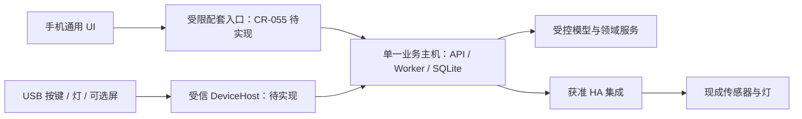

# 移动端协同下的硬件规划：能力去重、最小原型与投入条件

- 提出人：3yearszhuang · 2026-09-18
- 修改人：Codex · 2026-09-18

关联：[移动端规划 CR-055](../reference/changes/CR-055-mobile-delivery-plan.md) · [PRD](../reference/PRD.md) · [架构](../reference/ARCHITECTURE.md) · [交付追踪](../reference/REQUIREMENTS_TRACEABILITY.md) · [早期 ESP32 方案迁移入口](esp32-s3-hardware-extension.md)

**建议把手机作为通用交互端，把硬件投入集中到手机不擅长的物理交互、低干扰显示和常在线主机。** 首轮只验证一个 USB 实体入口，将桌宠与控制台合并；语音、扫描、佩戴和家庭设备先复用现成产品。电子纸按低干扰价值决定是否继续，独立算力主机按“原电脑关机后仍可用”的需求决定是否提前。

本文整合 AVX-EXPL-005 的 ESP32 设计输入、AVX-EXPL-011 0.1.0 的九方向工作稿与 CR-055，成为硬件规划的单一阅读入口。内容是待评审的投入建议，不是已批准的设备协议、BOM、采购单或硬件交付承诺；CAP 状态仍以交付追踪为准。本次未进行供应商询价、电气/声学测试、固件构建或真机验收。

## 1. 比较前提：手机能替代什么，尚不能替代什么

### 1.1 分开看现状、计划与物理能力

| 层次 | 当前状态与证据 | 对硬件取舍的意义 |
|---|---|---|
| Aervox 移动端现状 | [Capacitor 包](../../apps/mobile/package.json)与[配置](../../apps/mobile/capacitor.config.json)存在，尚无原生交付链；客户端鉴权、恢复与历史接线缺口见 CR-055 | 不能写成“手机已经全能”，也不能为了填软件缺口立刻开发专用硬件 |
| CR-055 首版候选 | 移动 Web/Capacitor 配套端：普通对话、学习/复习、历史操作、获准日记只读；仍依赖在线主机 | 小屏聊天机、便携复习屏与多数状态显示高度重复；只读日记也须通过来源边界验证 |
| CR-055 后续候选 | 图片选择/上传、分享、通知；语音与系统权限需逐项验证；独立手机运行时另行研究 | 手机拍照、音频、振动是现成物理能力，但接入 Aervox 的软件尚不能视作完成 |
| 手机原生物理优势 | 屏幕、相机、麦克风、扬声器、触控、振动、电池与成熟整机 | 先用已有手机验证输入/显示/提醒；避免重复开发相同部件及充电、无线、系统维护 |
| 手机不直接提供的价值 | 盲操作大按键/脚踏、固定桌面角色、电子纸静态显示、稳定纸面拍摄工位、校准环境传感 | 可以保留，但必须证明具体场景优于手机或现成配件 |
| 手机配套端不等于主机 | 当前 API/Worker/SQLite/模型服务在电脑，手机壳不携带这些运行时 | 常在线小主机有独立价值；无需同时附加大屏、扬声器和机械外壳 |

### 1.2 本轮重新核验的软件基础

代码核验采用移动规划分支的 `0a12ea4` 业务代码及 `dff68b8` 文档。两份合并输入包含原工作区的未提交规划；其中部分 SPI 路径不在该基线中，以下使用本分支真实入口，不把旧工作稿的描述当作已合入实现。

| 可复用部分 | 核验入口 | 对硬件的限制 |
|---|---|---|
| 学习、复习、会话请求 | [API 客户端](../../packages/api-client/src/useAervoxApi.ts)、[传输](../../packages/api-client/src/transport.ts) | 按键是业务请求；收到按键不等于答对、掌握或提交成功 |
| 表现语义 | [PetCommand](../../packages/contracts/src/schemas.ts)、[桌面主动表现](../../apps/desktop/src/main/proactive-events.ts) | 有 `speak/emote/gesture/move/react`，没有设备线协议；`speak` 可携带正文，不能原样广播给外设 |
| 语音入口 | [录音控制器](../../packages/api-client/src/voice-input-recorder.ts)、[ASR Provider](../../apps/api/src/modules/platform/voice/asr-providers.ts)、[TTS](../../apps/api/src/modules/platform/voice/gpt-sovits.ts) | 有录音与识别路径；本地 TTS 仍以文本字节充当 WAV，占位路径不能证明可播放；HTTP TTS 需验证实际端点与声音 |
| 拍题入口 | [内容路由](../../apps/api/src/modules/knowledge/content/routes.ts) | 当前 `mockOcrParse` 返回固定内容和随机置信度；换摄像头不会解决 OCR 软件缺口 |
| 主机部署 | [模型服务](../../apps/api/src/modules/ecosystem/model-runtime/service.ts)、[进程驱动](../../apps/api/src/modules/ecosystem/model-runtime/llama-server.ts) | 可复用模型管理，但芯片兼容、并发内存、模型质量、耗电和无界面运行需实测 |
| 家庭/健康边界 | [能力登记](../reference/capability-registry.md)、[ADR-019](../reference/adr/ADR-019-proactive-integrations-local-gateway.md) | 不等于已有自研 BLE 手环、手机健康授权或通用 IoT 网关；CAP-033 尚不代表生产可用 |
| 实体硬件接入 | 当前 `apps/`、`packages/` 未找到专用 DeviceHost、USB CDC 传输与固件 | USB 宿主、设备权限和恢复都是新增工作；插件配置页不替代可信 I/O 层 |

## 2. 九个旧方向与手机的重合及处置

“过度设计”指在当前场景和证据下，新增成本没有对应的独有收益，不等于永远禁止某类设备。手机路线尚未完成的部分，优先补软件或做现成外设实验；不能据此声称专用硬件已被实际替代。

| 原方向 | 与手机的重合 | 手机较难替代的部分 | 本轮建议 | 重新投入条件 |
|---|---|---|---|---|
| USB 实体桌宠 | 角色动画、对话显示、状态与提醒 | 固定物理角色、无需解锁的桌面存在感 | **保留并缩小**：与控制台合为一个 USB 实体入口；不做第二个完整聊天屏 | 相比手机支架和软件入口，用户持续选择实体交互，且打扰/维护成本可接受 |
| 专注旋钮控制台 | 任务切换、暂停、提示、复习操作 | 盲操作、触觉、大按键/脚踏无障碍 | **合并**：同一宿主与固件，按键先于屏幕/旋钮 | 键鼠/手机对照中减少误操作或降低操作负担；不是只觉得新鲜 |
| 电子纸复习卡 | 题干、答案、复习列表和日记阅读 | 离开手机的低干扰阅读、静态低功耗显示 | **条件保留**：先 USB 桌面只读卡；移除日记和自动离线计分 | 用户确有“避免拿起手机”的需求，中文/公式可读性与残留画面风险可接受 |
| PTT 语音底座 | 麦克风、扬声器、近场提问与朗读 | 固定拾音位置、大 PTT 键、真实硬件静音 | **降为外设实验**：手机/耳机与现成 USB Audio 对照；暂不自研声学硬件 | 真实 ASR/TTS 完成后仍有可测的拾音、无障碍或隐私操作优势 |
| 文档摄像头学习台 | 拍照、裁剪、上传、题目识别 | 双手空闲、固定视角、重复纸面拍摄 | **先做无源手机支架**；不足再用 UVC 摄像头，暂不做带算力/屏幕扫描机 | 真实 OCR 已通过，支架仍不能满足批量拍摄/书页定位；瓶颈确实在光学工位 |
| 家庭环境网关 | 手机能显示数据、控制场景 | CO₂/温湿度等真实环境测量，现成家庭总线 | **保留集成，取消自研通用网关**：优先现有 HA 与认证设备 | 发现现成集成不覆盖的具体传感需求，且 CAP-033/034 权限与生产门禁满足 |
| 触觉佩戴设备 | 手机振动、系统提醒；现有手表亦可能覆盖 | 无声、免手持、佩戴可达性 | **搁置自研腕带**：先验证手机/现成手表通道，不假定任意手表可接入 | 提醒通道已完成且现成产品无法满足明确的无障碍或持续佩戴需求 |
| 独立本地算力盒 | 与独立手机运行时目标部分相交 | 电脑关机后仍提供服务、散热/容量、稳定供电 | **保留部署选项**：先现成小主机，无屏也可；与手机配套使用 | 主机可用性是实测阻断，且手机独立运行尚未满足同等任务/功耗要求 |
| 机械桌宠 | 情绪/动作表达与角色形象 | 身体运动和可触摸的物理表达 | **搁置首轮**：不同时开发电机、追踪、轮式移动 | 静态实体入口已证明持续价值，进一步身体表达值得承担机电可靠性和安全成本 |

由此，将旧稿依次评估的桌宠、控制台、电子纸前三个方向进一步收敛为：**一个最小实体入口 → 有证据再选电子纸或常在线主机 → 按需求验证专门外设**。旧稿已要求选择一个主方向，本次进一步合并桌宠与控制台的原型范围。常在线主机与实体入口是不同问题，可独立取舍，不要求先做完桌宠才验证主机。

## 3. 应移除或后移的过度设计

| 旧设想或容易膨胀的配置 | 在当前前提下的问题 | 新的最小选择 |
|---|---|---|
| 首轮冻结 `ESP32-S3-WROOM-2-N32R16V`、32 MB Flash/16 MB PSRAM | 按键/状态灯未证明需要大内存和无线；把特定模组能力当作产品需求 | 优先现有开发板；测固件/资产占用后选容量。已有该板可继续用，无需为省参数重购 |
| LCD、音箱、旋钮、麦克风、摄像头全部上板 | 复制手机且难以判断哪项带来价值；增加电源、声学和隐私工作 | 第一个版本只有按键与状态灯；屏幕/角色是一个可拆换实验配置 |
| 单独开发桌宠和控制台两套宿主 | 传输、按键、重连高度相同，却按两个产品支付维护成本 | 一个 USB 宿主和同一原型配置；暂不提炼万能设备框架 |
| 无线、电池、BLE 配网、云中继一开始就做 | 桌面场景无明确无线需求，却提前承担配对、续航、凭据与恢复 | 有线供电 + USB；芯片含无线不代表启用无线 |
| 无联网原型必须通过 RF、双分区 OTA 和工厂密钥注入 | 旧 R0 验收混入了后续无线/量产目标；无法对应当前威胁与交付形态 | 首轮做受控 USB 烧录、恢复与基本电气验证；启用无线/分发固件时再补其适用门禁 |
| 用 ESP32 运行主模型、完整 Live2D、长期会话库 | 混淆端点和主机；与手机、电脑和既定数据边界重复 | MCU 只处理有限输入与预制表现；模型、业务记录在受控主机 |
| 多设备离线作答、通用事件同步、自动合并数据 | 小按键引出了第二套业务副本与冲突/删除传播系统 | 断连不提交业务写入；复连取当前状态，不补交旧按键 |
| 自研扫描机、双麦远场全双工、健康算法 | 软件基础尚有占位路径；手机或现成外设已能提供验证输入 | 先用真实 OCR/ASR/TTS 验证任务，再定位硬件瓶颈 |
| 大屏一体机、独立主机与机械外壳捆绑 | 将常在线部署需求和表现需求混为一项采购 | 小主机作为单独部署选项，手机承担主要屏幕 |

分阶段缩小范围不豁免基本电气保护、模型/固件许可、撤权、可恢复性或面向真实用户的适用安全要求；对应部件或分发方式进入范围时，其门禁必须同时进入。

## 4. 推荐组合与新增设想

### 4.1 一个 USB 实体入口，两种实验配置

最小配置为现成 MCU 开发板、两至三个大按键、一个状态灯与 USB 供电。按键先映射“回到当前任务、暂停/稍后、确认明确选项”，禁止把一次点击直接当成答对或知识掌握。

第二配置在同一设备上增加小型 SPI LCD 和可替换角色外壳，验证物理桌宠是否比单纯按键更有价值；不另建第二套宿主。旋钮、脚踏可针对可达性选择，不默认全部装入。短音效仅在静音控制和用户实验需要时增加。

主机断连时，若设备仍有独立供电则显示失联并停止动作；USB 同时断电时设备会直接熄灭，不能承诺显示离线。可选本地计时器必须明确是设备自身功能，不伪装成主机已记录的学习进度。

### 4.2 先利用手机本体的三个低成本方向

| 新设想 | 先验证的收益 | 刻意收窄的范围 | 决定是否升级 |
|---|---|---|---|
| 无源手机桌面底座/角色外壳 | 稳定摆放、固定角色位置、减少拿起手机 | 支架与软件轻量显示；无 MCU、无电池、无自研充电协议 | 与 USB 实体入口做相同任务对照；若体验接近则保留低成本方案 |
| 无源拍题支架与纸面定位板 | 双手空闲、固定视角、稳定重复拍摄 | 手机相机与显式上传；不加第二块屏幕或 OCR 算力板 | 先定位反光、透视、对焦、遮挡和装夹问题，再决定是否购买 UVC 外设 |
| 现成大按键/脚踏开关 | 盲操作和无障碍输入，验证是否真的需要新 MCU | 仅在 Aervox 已聚焦且显示目标任务时使用受限映射；不使用全局任意宏授权 | 证明操作收益后才设计自定义外壳/固件；确认系统可达性与误触情况 |

这些是候选使用实验，不意味着已有手机桌宠常亮模式、自动拍题或手机 USB 配件支持。手机常亮的耗电、发热、锁屏、来电和后台中断需记录；不能靠系统悬浮权限或绕过后台限制维持体验。

### 4.3 电子纸作为可选显示件

只在“避免接触手机”是明确需求时制作电子纸样机。先以 USB 更新少量、用户选择的低敏复习材料，只读题干/答案；不带日记、健康信息、自动评分、跨设备离线写队列或电池承诺。字体、公式、换页速度和残影须用真实卡片验证。

电子纸断电保留画面，主机无法远程擦除失联设备上的内容。因此“撤权后清空”只对设备在线且执行成功有效；内容选择必须事先考虑永久残留。便携/电池版本应在阅读价值验证之后另评遗失、删除与续航。

### 4.4 常在线主机与手机配套

先用已有 x86/ARM 小主机验证 API、Worker、模型、备份和恢复，不按处理器名称或 GGUF 文件大小推算体验。输入任务、上下文长度和模型版本固定后，记录首 Token、生成速度、质量、峰值内存、墙插功耗、温升与崩溃恢复；性能目标延用 PRD 与 CR-055 的测量要求，另行冻结整机预算。

主机可无显示器；有界面 Electron、无界面服务、目标系统权限与 USB DeviceHost 是不同验证项。普通手机访问复用 CR-055 的受限入口；该方案不自动扩张 `local_only` 例外。如果把现有电脑资料迁到盒子，应选择一个业务主机，显式备份、迁移和验证；原电脑成为客户端，不把两个 SQLite 目录实时同步成双主。

普通业务资料迁移与 Privacy Host 换机需分开评审。CAP-033 的设备授权、激活租约和访问令牌不能随库复制后在新主机继续生效；涉及 Vault/私密来源时，按对应数据边界评估迁移与重新授权，不能沿用旧设备身份替代新主机授权。

### 4.5 专门外设的继续投入条件

PTT 先用现成 USB Audio/耳机验证，必须得到真实可解码 TTS、可编辑 ASR、采集状态一致的硬件静音及取消恢复。扫描台先用手机/现成 UVC 与真实 OCR 验证，逐页核对印刷中文、公式和手写体，不以 HTTP 成功或随机置信度验收。

HA 优先复用已有网关与受支持实体，实体/service 白名单、断线过期状态和撤权后零动作必须通过；不要重新实现 Zigbee/Matter 通用网关。手机/手表提醒、健康来源分别按平台 API 和授权验收，不把日步数接口视为自研腕带或连续生理监测能力。

机械动作只留后续方向：有限轨迹、角度/速度/电流边界、限位、断线安全静止与可物理断电的急停必须先定义。`PetCommand.move` 是表现语义，不是舵机坐标；模型输出不能直达执行器。未完成隔离测试台验证前不进入用户接触试验。

## 5. 端、主机与数据的分工

业务主机可选现有电脑或经验证的专用小主机；不是两个同时写入的副本。手机负责通用浏览/输入，MCU 负责有限物理交互，HA 负责已支持的设备接入；设备和模型均不能直写领域表。

- **共用业务**：复习、会话、通知频控、免打扰、撤权、来源删除、业务幂等仍由现有领域服务负责；硬件不能自己推断当前会话或重复生成学习事实。
- **分开处理传输**：手机 HTTPS/SSE、USB 帧和未来 BLE 的恢复模型不同。可以复用授权与业务规则，不能把 SSE 直接当串口协议或让 MCU 持有手机 API 凭据。
- **输出也有数据边界**：USB 设备同样可被携走或记录内容。首轮仅发送获准的预定义状态/表情 ID，不发送对话正文、`speak` 文本、画像、日记或健康内容；来源未知及主动私密派生输出默认拒绝，低敏外观不自动解除来源限制。
- **输入带任务范围**：输入关联设备实际呈现的任务修订或交互令牌；主机确认其与当前任务、会话和操作能力一致，不能按接收时的任务重新归属迟到输入。换会话、休眠、解绑后旧输入失效。传输 ACK 只表示设备处理状态，业务完成需要 API 回执。
- **手机作为外设网关是后续选项**：目前 CR-055 没有手机 USB Host/BLE 固件网关。Android/iOS 的 USB 权限、BLE 支持和后台行为需独立验证，不能用现有电脑串口能力推导两端都支持。
- **先具体后抽象**：一个真实终端加模拟端点即可验证状态机；只有第二种实际产品证明共享需求后，再抽取稳定接入层。插件可提供受限配置/资产，不获取串口句柄、任意网络调用或运动控制权限。

## 6. 从早期 ESP32 方案继承并修订的工程边界

### 6.1 保留 ESP32 为候选，不冻结模组和引脚

ESP32-S3 可以用于小屏与输入原型；若仅按键/灯，具有合适 USB 能力的现有 MCU 即可。旧稿 `N32R16V` 的大容量 Flash/PSRAM、候选 240×240/320×240 LCD 与 I²S 短音效属于可选设计输入，不构成最小需求。

| 旧稿主题 | 本轮保留的要求 | 本轮不再冻结的部分 |
|---|---|---|
| USB 与引脚复用 | 核对实际开发板、模组封装、USB 接线、启动绑带、调试口与 Flash/PSRAM 占用 | 旧 GPIO 分配表不能直接用于 PCB；尤其原文“扩展/ADC1 GPIO1/2/21/38”不得解释为 GPIO21/38 支持 ADC1 |
| I/O 电压 | 核对电源域、模组/屏幕/按键电平与是否需要转换，优先用已验证开发板 | 旧稿 GPIO47/48、Octal 内存相关电压描述须按具体料号与数据手册重核，不泛化到所有 ESP32-S3 板 |
| 电源与保护 | USB-C 角色/CC、协商电流、3.3 V 稳压、去耦、ESD、复位与启动稳定性；实测屏幕/功放峰值 | 旧稿 RF 峰值与“1 A 原型电源”不是整机规格；首轮无线关闭，不用未启用 RF 的测试替代实际负载验证 |
| PCB 与机械 | 开发板价值验证后才评审供电、接口应力、散热、外壳、天线禁布和可维修性 | 不预先采购量产模组、开模或按旧 RC/尺寸/温度数字设计成品 |
| 固件资源 | 记录程序/资产实际占用、帧率、RAM 峰值与看门狗恢复；资源可替换 | 不按 32 MB 默认规划双 OTA、完整音库和会话存储；不在 MCU 跑主模型/完整 Live2D |

本轮未重新查验厂商数据手册或实测上述器件。进入原理图与采购评审时，必须记录具体模组/开发板版本、手册版本、负载测试与替代料；不能引用旧稿“模组级事实”作为新物料已核验的证明。

### 6.2 USB 原型所需的最小协议语义

保留版本协商、帧大小/队列上限、明确类型、序号、命令关联、错误与回执。开发板可用 JSON Lines 验证，但具体字段、大小和线协议由后续设备 CR/Reference 定义；本文不提前创建 `DEVICE_PROTOCOL.md` 或固定固件目录。

旧稿的可靠性表述调整为以下可实现边界：

1. 连接/启动身份参与序号和去重范围；设备重启建立新会话，清空旧动作，不宣称掉电前后的物理副作用严格只执行一次。
2. 主机在发送前检查当前任务与语义过期；设备使用本地单调计时处理收到后的租期、超时与看门狗。无可信 RTC/时间同步时不依赖绝对 UTC `expiresAt`，接收后 TTL 也不能证明帧在链路里没有迟到。
3. 状态采用“覆盖为最新值”，断线清空动作队列，重新握手后仅同步当前获准状态；不补播旧提醒、不补交离线按键。
4. 主机将输入请求绑定到当前任务并使用业务幂等机制；设备 ACK、宿主收到输入、API 提交成功是不同状态。重试业务前确认既有结果。
5. 未知版本/类型、大包、失效连接、队列满、撤权和任务切换均有明确拒绝路径；Renderer/插件只能调用受限方法，不能写任意串口字节或刷固件。

### 6.3 固件更新与后续能力分开验收

| 阶段 | 应完成的验证 | 尚不因此进入范围的能力 |
|---|---|---|
| 受控开发板 USB 实验 | 工具链版本、可信固件来源、USB 烧录/恢复、烧录失败可恢复、看门狗、断电安全状态；保留可重建固件 | 无线配网、生产密钥、OTA 服务与对外产品发布 |
| 分发工程样机 | 明确可信更新渠道、签名/完整性验证、兼容版本、恢复与回退、设备身份、损坏设备处理 | 工厂规模注入和联网 OTA 不因分发自动开启，按更新设计补充 |
| 无线版本 | 配对/绑定、凭据、撤销/遗失与恢复；IP 网络按方案验证 TLS，BLE 验证其配对/加密及必要的应用层认证，不能无条件套用 TLS | 连续捕获、永久后台执行或多主同步 |
| 电池版本 | 保护/充电、实际负载续航、低电量/掉电恢复、结构与适用认证；若无无线，不额外要求无线配对或网关 | 无线、离线业务回写或持久私密缓存 |
| 带麦克风/传感器/电机 | 来源/动作授权、采集指示与硬件停止、音频质量或运动边界、撤权后停止；独立专项验收 | 默认扩大既有用户授权 |

## 7. 分阶段计划、成本和停止条件

### 7.1 先证明价值，再形成产品

阶段编号仅属于本硬件规划，不复用 PRD 的 R1～R5 或 CR-055 的 M0～M6。

| 阶段 | 工作与产物 | 依赖与退出条件 |
|---|---|---|
| 硬件阶段 0：手机/现成外设对照 | 用现有软件和可明确标为模拟的界面，比较手机支架、键鼠/现成按键与实体原型概念；选择一个场景 | 5～10 位成人、顺序平衡的同任务比较；明确手机未解决的操作负担及进入原型的理由。模拟结果不能证明真实持续使用、网络或提醒能力 |
| 硬件阶段 1：一个 USB 原型 | 先设备专项 CR，必要的 ADR 和最小协议契约；按键+灯与可选角色屏；固件/宿主可重复构建 | 不依赖 CR-055 手机完整发布，可经桌面现有业务验证；无设备时核心流程可用，误投任务/重复业务副作用为 0 |
| 硬件阶段 2：针对性分支 | 根据真实原型使用证据只选电子纸、常在线主机或专门外设之一；可以停止硬件投入而保留软件改进 | 完成 §7.3 的真实使用评估；电子纸须证明减少手机干扰；主机须证明原电脑在线限制；音频/OCR 须先解除占位实现 |
| 硬件阶段 3：工程样机 | 通过价值验证后做 PCB、结构、电源、更新恢复、安装与维护；按实际部件补无线/电池/机电测试 | 24 小时功能运行、72 小时长稳、温升/功耗与升级恢复证据；工程样机不等同生产发布 |
| 硬件阶段 4：小批验证 | 单一形态的工装、追溯、可信更新、维修/解绑、适用认证与交付文件 | 产品/架构/硬件负责人核验全部证据后另行登记发布状态 |

阶段 0 可安排一周使用研究；阶段 1 先预留二至四周净工程验证窗口，不含采购等待、定制 PCB、认证或全部移动端工作。阶段 1 的设备协议不能沿用已占用的 `ADR-016` 或历史 `CR-013` 编号，实施时按[现行 CR 流程](../how-to/cr-workflow.md)和 [ADR 索引](../reference/adr/README.md)分配。

### 7.2 成本只用于比较，暂不形成采购承诺

以下金额继承旧工作稿的单套开发板原型粗估，单位人民币，未做新询价；不含人力、模具、认证、物流、售后和已有手机/电脑。精简后的 BOM 需按实际方案重报，不能把两套旧预算相加。

| 路线 | 旧稿成本参考 | 本轮预算策略 |
|---|---|---|
| 按键控制台 / 小屏桌宠 | 70～200 / 120～300 元 | 一个原型分配置验证；先复用开发板和现成外壳，再决定是否加屏 |
| 电子纸 | 180～450 元 | 电池不进入首轮；先评估显示与排版，不能按屏幕标称功耗推整机续航 |
| PTT / 文档摄像头 | 180～500 / 250～800 元 | 优先借用手机、耳机、UVC/USB Audio；只在体验差距明确后采购 |
| 家庭环境 | 节点 180～700 元；新增 HA 主机另计 400～1,500 元 | 复用现有网关/实体；不为一个场景同时新造网关、节点和协议 |
| 常在线小主机 | 1,500～4,500 元，无独立 GPU | 先借用已有机器，按固定任务实测选型；先不加屏幕/音频/自研主板 |
| 腕带 / 机械桌宠 | 120～350 / 350～1,000 元 | 作为旧估算留存，不分配本轮研发或采购预算 |

### 7.3 决策使用的数据与停止规则

首轮少量试用只用于发现任务价值和可用性问题，不宣称证明 WELS 或 D1/D7 提升。阶段 0 的概念/交互原型只检验需求与操作负担；阶段 1 形成可实际使用的设备后，连续使用一周，观察使用是否持续、任务完成时间、误触、主动静音/关闭和维护时间；更长期的学习效果再按 PRD 的实验要求验证。

对照尽量使用相同任务、内容、后端和模型，并平衡使用顺序；模拟界面使用固定样本，单独记录其可验证范围，避免把模型质量或网络差异误记为硬件收益。

建议在阶段 1 实际使用评估前冻结局部通过条件：至少 5 人完成真实设备对照，至少 3 人在一周后仍愿意为同一场景使用该形态，并能指出手机方案未解决的具体负担；同时核心任务成功率不下降，新增严重误操作为 0。该条件用于决定是否进入阶段 2，不是市场成功或量产结论；只做模拟的手机路径不能用于证明真实连接和运行优势。

若手机支架/现成外设体验接近、自研设备没有持续使用、主要问题仍在软件，或维护/打扰超过收益，则停止专用硬件投入。硬件价值不成立时，不通过追加传感器、无线或机械动作掩盖问题。

## 8. 最小验证矩阵与回退

| 验证层 | 首轮最少覆盖 | 失败时处理 |
|---|---|---|
| 业务与任务范围 | 会话切换、休眠恢复、连续按键、重复请求；尤其覆盖旧任务按下、新任务生效后才送达；显示业务成功只能来自 API | 拒绝失效请求，保留手机/桌面入口；不补交离线输入 |
| USB 与协议 | 1,000 条含重复/乱序/未知类型/大包/队列满的序列；20 次热插拔；设备/宿主重启 | 清队列并重新协商，只同步当前状态；不将 ACK 当作学习记录 |
| 数据与权限 | 主动私密来源、未知来源、`speak` 正文、撤权/解绑/主机切换、日志脱敏 | 阻断输出和新输入，清除宿主队列/在线缓存；断电电子纸残留按预先内容限制处理 |
| 电气与运行 | 选定板卡的供电、屏幕负载、复位、看门狗、24 小时运行；工程样机再做 72 小时长稳 | 回到已验证开发板/固件或移除部件；不继续集成未经验证的电源负载 |
| 可用性与无障碍 | 手机/键鼠对照，左右手、大按键/脚踏、静音、错误提示与断连 | 改映射或停止硬件方向；不能用“增强沉浸”代替任务收益 |
| 专项能力 | 真实声音可解码、音频取消；真实 OCR 逐页核对；HA 断网/撤权；机械台架边界 | 未通过则保持该能力关闭，不把模拟数据或占位返回当成成功 |
| 迁移/发布 | 专用主机备份恢复、单主切换；样机固件更新/回退；适用认证 | 按[换库与回滚流程](../how-to/run-database-migration-drill.md)恢复；关闭设备通道，不删除学习数据 |

## 9. 合并记录与后续维护

| 合并来源 | 已吸收的内容 | 本次变化与去向 |
|---|---|---|
| AVX-EXPL-005，ESP32 早期方案及 0.2.3 工作稿修订 | USB 端点分层、有限表现/输入、恢复、数据边界、硬件输入与参考资料 | §5～6 保留必要工程边界；撤销首轮型号/引脚冻结、无条件 OTA/RF 门禁与跨重启恰好一次承诺；旧路径仅保留迁移入口 |
| AVX-EXPL-011 0.1.0，配套硬件九方向工作稿 | 九类产品、拓扑、粗估成本、真机缺口与实验思路 | §2 对九类逐项处置，§4 增加手机/现成配件组合，§7 保留预算来源与停止条件；原先依次评估的前三项进一步收敛为一个 USB 原型与条件性电子纸实验 |
| CR-055，移动端规划 | 手机能力阶段、主机依赖、跨设备数据与恢复边界 | §1 明确手机未交付与后续能力；§2 用作重复能力比较；移动实现顺序与契约仍只在 CR-055 维护 |

本次只合并和更新规划，未创建设备协议、固件仓库、硬件 CR/ADR 或新 CAP。进入实施时，在对应事实源维护产品范围、协议、安全与数据契约，再按[追踪基线 §4.2](../reference/REQUIREMENTS_TRACEABILITY.md#42-落地实现登记)登记实际代码和测试；本页只保留选型依据、实验结果和阶段取舍。

保留的厂商入口：[ESP32-S3-WROOM-2 数据手册](https://www.espressif.com/sites/default/files/documentation/esp32-s3-wroom-2_datasheet_en.pdf)、[ESP32-S3 系列数据手册](https://www.espressif.com/sites/default/files/documentation/esp32-s3_datasheet_en.pdf)、[ESP-IDF 指南](https://docs.espressif.com/projects/esp-idf/en/latest/esp32s3/)。这些链接用于后续器件核验，本轮未重新核对在线版本。
