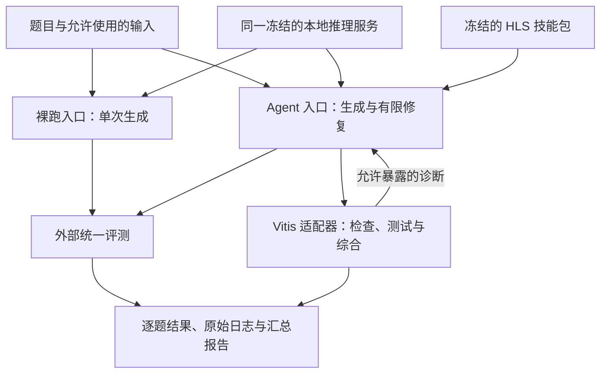
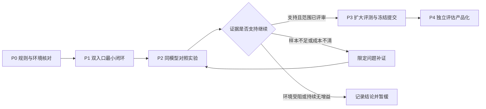

# HLS 本地智能体竞赛：能力拓展与验证规划

- 提出人：3yearszhuang · 2026-09-22
- 修改人：3yearszhuang · 2026-09-22

本文把 AMD「RTL/HLS 本地智能体设计赛道」评估转化为可审阅的验证路径，供三人团队开展范围复核、实验设计和后续交付。**建议优先选择 HLS，先验证同模型条件下的工具反馈增益，再决定正式参赛方案与产品化。** 当前交付是规划文档，尚无 Radeon/Vitis 实测结果，不表示已经选定模型、批准新增能力或承诺获奖。

当前排序、认领、状态与日期只维护在根 [plan.md](../../plan.md)：[ITER-020](../../plan.md#iter-020) 跟踪本次文档交付，[ITER-021](../../plan.md#iter-021) 跟踪可行性验证建议，[ITER-022](../../plan.md#iter-022) 跟踪验证成立后的参赛交付候选。本文中的阶段表示技术前后条件，时间表示估算，角色表示分工建议，不构成第二份活动队列。实现与验证证据统一回填[追踪基线 §4.2](../reference/REQUIREMENTS_TRACEABILITY.md#42-落地实现登记)。

## 1. 目标、已知条件与能力边界

### 1.1 团队条件与选择理由

| 条件 | 已知事实或建议 | 对方案的影响 |
|---|---|---|
| 人员 | 用户确认三人，主要熟悉 C++ | 优先 HLS，指定一人学习和负责可综合 C++、接口、位宽、流水线与数据依赖 |
| 本地算力 | 用户确认有 RX 9070 XT；标准型号显存为 16 GB | 先以较小或量化模型验证闭环，实际显存、系统与后端组合在 P0 记录 |
| 云资源 | 用户说明可使用官方环境；所附指南将云资源描述为验证窗口，配额另行公告 | 先确认账号、开放日期、额度及工具许可，不能据此假设有持续开发或训练额度 |
| 时间 | 尚未提供可投入周数、每周工时或比赛截止日 | 建议先给 P0～P2 预留 1～2 周探索预算，按可用工时复核，不倒推官方赛程 |
| 当前系统 | Aervox 已有 Agent Loop 与本地模型接入端口 | 复用编排内核，新增硬件工具反馈与评测适配，不依赖整个桌面产品启动 |

熟悉 C++ 不等于熟悉 HLS。先用手写例题理解静态资源、整数宽度、接口协议和循环依赖，确保团队能区分功能错误、不可综合构造及性能问题。否则模型容易把错误归因带偏，团队也无法判断生成代码为何通过或失败。

### 1.2 目标与首期范围

研究问题是：在同一模型、量化和推理配置下，加入 Vitis 诊断、领域技能和有界修复后，能否稳定提高可综合代码的通过率，并控制总墙钟时间。

首期只覆盖 HLS 题目、一个选定模型、一条推理后端路径、固定工具集合、离线批量运行与可追溯证据。模型候选比较可以并行准备，但每次实验固定一个配置。RTL、模型微调、复杂多 Agent、桌宠交互、移动端、在线技能自改、通用第三方执行 Host 和 FPGA 板级原型均不属于首轮验证范围。

长期可回馈 Aervox 的能力是工具验证、错误解释和复盘。教学模式与竞赛自动解题模式应分别评估；竞赛通过率不能替代 [PRD](../reference/PRD.md#12-产品定位) 定义的学习效果。当前不新增 CAP，不改变本地 SQLite、模块所有权或已接受 ADR。

## 2. 赛规基线与待确认事项

### 2.1 已从选题指南核对的约束

以下是所附指南的摘要，官方后续《评分细则》优先；来源定位见第 9 节。

| 项目 | 指南口径 | 对实现的约束 |
|---|---|---|
| 比赛目标 | RTL/HLS 独立排名、独立评奖，推荐只选其一 | 本规划以 HLS 为建议方向；切换方向需重估工具链与数据集 |
| 评分结构 | 能力 30、相对同模型裸跑增益 40、墙钟效率 10、Agent 与技能包工程质量 20 | 同时报告绝对能力、增益和代价；不能只展示修复成功案例 |
| 判定链 | HLS 可解析→可编译→可运行且通过全部测试→可综合；全部由 Vitis HLS 完成 | 逐级记录结果，前级失败不进入后级；本地普通 C++ 编译器只能辅助开发 |
| 工具与目标 | Vivado / Vitis 2025.2；器件 `xczu3eg-sbva484-1-e`；时钟约束 5 ns | 锁定版本与约束，不套用其他赛道推荐的 2026.1；设置约束不等于时序已收敛 |
| 指标 | 同时报告 `pass@1` 与 `pass@5`，优先提高末级通过率 | 内部修复次数与独立采样次数分开；正式计数以评分器定义为准 |
| 推理资源 | 模型须完整容纳于单张 32 GB 卡，不允许跨卡 | 记录权重、上下文缓存与运行开销的峰值，不能只按权重文件估算 |
| 环境差异 | 验证资源 W7900 48 GB、RDNA 3；决赛 R9700 32 GB、RDNA 4 | 同时验证 GPU 后端兼容与显存；W7900 上限制显存不能替代 R9700 实测 |
| 离线运行 | 基于官方基础镜像构建容器，断网完成读题到产出代码 | 预置运行依赖、模型和技能，运行中不下载或调用远程模型 |
| 裸跑入口 | `run_baseline.sh` 与 `run.sh` 使用同一推理服务、同一上下文配置，并在同一次运行中产出结果 | 裸跑只含题目、单次生成，不调用工具、技能或重试；不得夹带 Aervox 人格与记忆 |
| 提交冻结 | 隐藏题集评测窗口内不得修改方案代码、技能包、模型权重，哈希与提交包一致 | 公开集迭代结束后冻结；失败经验仅用于事后分析，不在评测中改方案 |
| 提交内容 | 容器、模型声明、推理配置、Agent、技能包、双入口与报告 | 第 8 节的目录为拟交付路径，不是当前已存在的运行入口 |

按 §3.1 当前要求，首期不需要上板。具身智能赛道的机器申请日期与实物闭环要求不适用于本规划。指南只提供 Vivado / Vitis EDA 环境，方案不能依赖未声明的第三方 EDA 工具；是否允许自带其它工具须另行确认。

### 2.2 P0 必须澄清的外部条件

| 待确认项 | 所需证据 | 未确认时的处理 |
|---|---|---|
| 报名资格、当前报名/提交状态与赛程 | 官方资格说明、报名确认、提交及隐藏评测窗口 | 先确认仍有参赛与完成验证的时间条件；无法满足时仅保留研究验证目标 |
| 官方镜像、ROCm/驱动、CPU/内存/磁盘、Node/Python 与工具许可 | 镜像摘要、环境清单与可用命令的实测记录 | 可以开发本地原型，不能宣称官方环境可复现 |
| 云资源可用时间、配额、最终 GPU 验证机会 | 账号实际访问记录及赛事公告 | 先用现有显卡；配额不足时减少候选与重复实验 |
| 单题/总时间、显存、输出、采样与增益公式 | 最新评分细则、官方样例和评分器接口 | 使用明确标注的内部预算；参数集中配置，不能写成赛事固定值 |
| Agent 可见的测试、诊断与评分反馈 | 允许访问的文件列表和正式调用契约 | 私有测试与参考实现隔离；完整公开反馈实验只作为开发参考 |
| 入口输入/输出、模型文件装载和冻结包要求 | 官方入口样例、提交规范与截止日 | 先冻结内部格式，再做薄适配；最终包以官方契约校验 |

外部条件的确认记录是阶段证据，实际状态仍由 ITER 条目维护。遇到未确定条件只阻止依赖它的承诺，不阻止不依赖它的阅读、样例准备与本地实验。

## 3. 可复用基础与需要补齐的缺口

本节为 2026-09-22 对 Git 基线 `da602ac` 的静态核验。源工作区另有 ITER-002 未提交修改，本规划在独立工作树编写，不据此更新其它条目的交付状态。源码路径是核查入口，不代表 GPU、工具链或端到端验收已经通过。

| 能力 | 核查入口 | 复用方式与限制 |
|---|---|---|
| Agent 内核 | [包依赖](../../packages/agent-loop/package.json)、[执行器](../../packages/agent-loop/src/executor.ts)、[端口](../../packages/agent-loop/src/ports.ts) | `@aervox/agent-loop` 只声明 `@aervox/contracts` 为运行依赖；可以包级复用，但须提供上下文、工具和证据存储适配 |
| 本地模型请求 | [兼容 Provider](../../packages/agent-loop/src/openai-compat-provider.ts) | 复用请求与流解析；首轮核实工具调用历史配对和推理内容回传，不能以模拟测试代替真实模型多轮成功 |
| 工具发现 | [运行时工具提供者](../../apps/api/src/modules/companion/conversation/tool-providers.ts) | 当前返回 `tools: []`；竞赛执行器显式提供固定工具 Schema，避免等待整个动态插件发现链路完成 |
| 文件和命令 | [DSH MCP 桥](../../apps/api/src/modules/ecosystem/mcp/dsh-bridge.ts) | 可参考文件操作；现有命令执行最长 60 秒、输出 1 MiB，不足以直接承载长时 Vitis 作业，工作目录限制也不构成进程隔离 |
| 模型进程 | [模型运行时](../../apps/api/src/modules/ecosystem/model-runtime/service.ts)、[llama-server](../../apps/api/src/modules/ecosystem/model-runtime/llama-server.ts) | 已有通用启动接线；未发现 Radeon/ROCm 专项实测证据，竞赛使用冻结的推理服务配置 |
| 执行轨迹 | [SQLite 执行存储](../../packages/host-agent/src/sqlite-execution-store.ts) | 可参考工具账本；实验另存模型/数据/环境版本、原始工具产物与逐题结果，内存事件不能单独作为交付证据 |
| 硬件评测 | `apps/`、`packages/`、`scripts/` 静态检索 | 尚未发现 HLS-Eval/Vitis 专项实现；需要题集适配、批跑、分级判定和对照实验 |

复用路径上的协议、取消、超时或证据缺口应独立修复并做必要回归。ITER-007/008/013 的相关问题可按实际接线切片处理；首轮不要求先完成整个队列，也不依赖 ITER-009/016 的硬件设备探索。

## 4. 最小方案及一次任务如何运行

### 4.1 组件边界

采用独立命令行竞赛执行器，复用 Aervox 的公开 Loop/Provider 端口。Vitis 由专门适配器启动并管理，不把任意 Shell 暴露给模型。每道题使用独立工作目录；允许写入候选代码与自建测试，官方参考实现、评分器和私有测试由外部评测层持有。候选程序作为不受信代码在受限进程或容器中运行；允许使用的测试夹具只读，原始私有测试、参考实现和评分器配置不可被 Agent 或候选程序读取、改写。验收应包含越界读文件、修改夹具和改评分结果的失败用例，不能只验证工作目录不同。



模型推理主要使用 GPU，Vitis 编译和综合还受 CPU、内存及磁盘影响。并发数先以实测峰值决定，不因有三名队员就并行启动三个重型作业。

### 4.2 任务控制流程

1. 校验题目、配置和冻结清单，创建任务目录；记录模型、技能、镜像、代码、工具及数据集版本。
2. 分别建立裸跑与 Agent 分支；以下描述不规定二者的实际运行先后，顺序按实验协议平衡。裸跑入口直接调用同一推理服务一次，保存原始输出。禁止走默认可能重试的 Agent Loop，禁止注入技能、历史记忆或错误反馈。
3. Agent 根据题目和固定技能生成候选；适配器执行允许的 Vitis 阶段，保留原始报告，并提供有限长度的结构化诊断。
4. 根据失败类型决定修复：编译错误定位语法/类型；测试失败分析功能与数值；综合失败分析不可综合构造、资源和接口。先修根因，避免无依据地整段重写。
5. 先执行较便宜的检查，达到前级要求后再执行后级。记录内容哈希，识别相同候选和重复失败；达到单题预算、取消或连续无进展阈值时终止。
6. 保留历史通过阶段最多的候选及其来源；修改后重新验证所有受影响阶段，不能沿用旧版本的通过结果。最终选择仅依据 Agent 获准看到的信息。
7. 外部评分器独立判定最终代码；超时、显存不足、工具崩溃或缺失产物均保留记录，不能从通过率分母剔除。

适配器必须管理子进程组、总截止时间、有限日志和产物目录。取消应确认模型请求及 Vitis 子进程结束；出现未知结果时标为未知/失败，不自动认作通过。资源与终止参数是待实测配置，不沿用当前内核的默认短工具超时或无限总时长。

## 5. 从验证到交付的阶段路径



P0～P2 对应 ITER-021 的验证范围；P3 对应 ITER-022 的候选范围。P4 是未来条件路径，只有证据成立后才考虑在唯一队列新增产品化条目。本次 ITER-020 只交付本文及治理登记。

| 阶段 | 进入条件 | 核心工作与输出 | 退出判定与失败去向 |
|---|---|---|---|
| P0 规则与环境核对 | 明确验证范围、团队可投入工时；新增模块/工具契约按 CR 流程评审 | 完成 §2.2 核对；固定本地配置；用一份手写 HLS 正例和错误例验证工具；产出 `environment.json`、`rules.md` 与样例日志 | 真正运行本地模型和 Vitis，能区分代码失败与环境失败；官方环境未开放时明确保留缺口，不进入最终兼容验收 |
| P1 双入口最小闭环 | P0 本地基础链可用，输入/输出和可见反馈范围明确 | 固定一个模型；接好裸跑与 Agent；跑 5～10 道不同类型题；验证至少一次真实多轮工具修复、超时终止和逐题留证 | 同题可重复运行，裸跑不夹带增强，错误归因与产物可追溯；若协议或取消不可靠，先修该路径再扩大题量 |
| P2 同模型对照实验 | P1 通过；划分调试集与留出集，提前冻结预算、指标与去留标准 | 从 HLS-Eval 及合法补充题中选 30～50 道不重复任务作为探索规模，按题型分层；比较 §6 四组；产出逐题结果、失败分类、耗时和去留说明 | 按 §6.3 给出继续、补证或暂缓结论；不能仅凭几个修复案例或高 `pass@5` 宣称方案有效 |
| P3 扩大评测与冻结提交 | P2 支持继续；正式参赛范围与必要 CR 已评审；最新细则可取得 | 在更广题集与官方环境验证；做模型/策略消融；冻结技能和容器；由另一队员从干净环境复现；整理 §8 提交包 | 最终 32 GB 环境满足预算，断网可运行，双入口及全部声明可复核，哈希一致；缺项就保留交付限制，不以本地通过代替正式验收 |
| P4 产品化判断 | 竞赛证据完整，存在硬件学习/调试的真实使用需求 | 比较错误解释、学习引导与复盘价值；确认 CAP、数据权利、模块和部署边界；通过独立 CR 决定是否接入产品 | 有用户任务证据与维护责任再纳入自选能力；仅有竞赛增益时保留独立研究工具 |

探索估算是在环境基本可用、三人可以连续协作的条件下，P0 约 1～2 个工作日、P1 约 2～3 个工作日、P2 约 3～5 个工作日；各角色可并行准备，但阶段验收仍按依赖推进。它只解释前述 1～2 周试验预算，不是排期承诺。云排队、首次 HLS 学习、工具安装和许可证问题会增加日历时间。P3 的工期须由 P2 测得的单题成本、题量、配额及官方截止日重新估算。

## 6. 实验协议与去留依据

### 6.1 四组对照与数据隔离

| 实验组 | 组成 | 回答的问题 |
|---|---|---|
| B0 官方口径裸跑 | 题目本身、同一服务与上下文配置，单次生成，无技能/工具/重试 | 相对同模型裸跑究竟提升多少 |
| A1 简单反馈 | 与 B0 相同模型，增加允许的工具反馈和有限重试，无领域技能包 | 普通反馈闭环已经能得到多少收益 |
| A2 完整方案 | 与 A1 相同预算上限，增加结构化诊断、固定技能与停止策略 | 所设计策略是否比简单反馈更有效 |
| C1 资源对照 | 无反馈的多次独立生成，匹配 A2 的预设计算或墙钟预算 | 增益是否主要来自额外计算；此组不替代官方 B0 |

所有组共享模型权重/量化、服务版本、上下文上限、输出上限及采样配置。B0 不加载 Agent 专用系统提示；推理服务必需的模型聊天模板保持一致并记录。分别报告实际 token、模型调用数、工具时间和总墙钟，不能用相同上限假装实际消耗相同。C1 的预算匹配口径在实验前写明，无法同时匹配 token 与时间时分别报告；没有可用验证信号时，不把 C1 的事后最优样本冒充可部署的选择策略。

调试题可用于诊断与技能提炼；留出题在模型和策略选定后才运行，不能用其失败持续调参再仍称留出集。存在同源变体时按题目家族隔离。公开数据可能进入模型训练，公开集成绩只支持内部比较，泛化仍由官方隐藏题集检验。参考实现与私有测试不进入模型上下文、技能检索或可读目录。

内部探索把一次完整 Agent 运行视为一个样本，其中可包含预算内修复；每个样本独立初始化历史、目录和随机种子，不共享前一次失败记忆。`pass@1`/`pass@5` 的样本统计与内部修复数分开保存；正式采样与估计公式采用赛事评分器。P2 先比较固定预算下的单次完整运行，P3 再按正式口径补齐多样本统计。公开完整反馈与正式受限反馈的结果须分列。

### 6.2 必须保存的指标与证据

每道题至少保存以下信息；字段是实验清单建议，具体机器格式在实现 CR 中确定，不在本文定义新的核心 API 契约。

- 身份与配置：实验组、题目/家族 ID、输入哈希、样本序号与种子、模型/量化/服务/技能/代码/镜像版本、目标器件和工具版本。
- 原始轨迹：模型输入输出、每个候选、修复差量、工具参数、退出码、原始报告、诊断摘要、最终候选来源。
- 结果：各判定级别是否通过、未执行原因、最终失败类别、超时/显存不足/环境失败和缺失产物。
- 成本：模型与工具调用次数、输入/输出 token、各阶段时间、总墙钟、GPU 峰值显存及 CPU/内存资源配置。
- 汇总：固定分母下的分级通过率、绝对提升百分点、相对提升、每道成功题平均成本、耗时分位数和失败分类。

计时前固定起止点，明确模型启动、预热、工具启动及最终评分是否计入墙钟；冷启动与预热结果分列，正式计时以赛事口径优先。按题交错或平衡实验组顺序，控制缓存状态并避免重型任务相互抢占资源，不能固定先跑 B0 再跑 A2 而忽略缓存收益。

同一题在 B0/A1/A2 上配对比较；分别统计修复成功和增强后退化的题数。按题目而非每个重试作为独立统计单位，提供样本量和不确定性区间。基线通过率为零时不报告无定义的相对提升。所有运行结果都进入总表；若另报排除基础设施故障的诊断统计，必须同时保留未排除版本和排除理由。

### 6.3 继续、补证与暂缓

以下是团队内部建议门槛，须在 P2 前结合预算确认并固定，不是官方获奖分数或保证。30～50 道探索题的结论可能不稳定，不因点估计为正就认定泛化成立。

| 决定 | 所需证据 | 后续动作 |
|---|---|---|
| 继续扩大验证 | 环境和双入口可复现；留出题可综合率相对 B0 有可重复的正增益；A2 相对 A1/C1 在质量或成本上有明确价值；预算内完成且证据无缺失 | 进入 P3；记录提升、退化、置信区间与剩余风险，不提前声明竞赛竞争力 |
| 限定补证 | 提升方向不稳定、区间覆盖零、样本太少，或资源匹配不足以说明策略收益 | 固定当前方案，增加独立样本或补一项明确消融；预算用尽后重新作去留决定，不无限延长 |
| 暂缓或缩减 | 环境持续不可复现；在预定实验预算内无稳定正增益；收益主要是额外采样且耗时明显不划算；关键规则/资源无法满足 | 留存负结果，简化模型/策略或保留研究工具；不启动完整产品集成 |

P3 之前须把“可接受耗时”量化为官方预算内的单题与总运行上限；若细则尚未发布，可先登记内部秒数、样本数与资源额度，结论只适用于该内部预算。技能收益成立后才评估微调，不能先以训练成本替代闭环证据。

## 7. 三人分工与资源使用

以下为角色建议，具体姓名、分支、认领与当前状态只写入 ITER 队列。

| 角色 | 主责 | 交给其它角色的成果 | 交叉复核 |
|---|---|---|---|
| A：模型与环境 | ROCm、模型候选、量化、推理服务、离线容器、资源测量 | 固定配置、环境摘要、模型声明、显存和服务样例 | 由 C 在干净环境复现推理与裸跑 |
| B：HLS 与工具链 | 可综合 C++、Vitis 执行、测试、综合、错误分类 | 正反样例、工具适配、诊断格式与原始报告 | 由 A 复跑手写样例并区分环境失败 |
| C：Agent 与评测 | Loop 适配、技能、预算、批跑和四组实验 | 双入口、逐题轨迹、汇总与去留报告 | 由 B 抽查候选、判定与参考实现隔离 |

RX 9070 XT 用于日常小规模迭代；先比较少量 7～8B 或 14B 量化候选，实际可用上下文和显存以实测为准。官方云用于环境对齐和固定方案复现，不承担未经确认的持续训练预算。W7900 与 R9700 的驱动、架构与量化内核须分别验证；按最终 32 GB 显存设计并保留运行余量。

优先投入 HLS 诊断、实验质量和环境稳定性。首期不采购新 GPU 或 FPGA 板卡；若资源缺口确实阻塞实验，先用测量记录比较缩小模型、减少并发和申请额度，再提出采购建议。

## 8. 交付路径、冻结与产品回接

### 8.1 拟交付的竞赛方案包

以下是未来方案包的目标结构，仅作职责分配；仓库中当前没有这些竞赛入口。最终文件名和输入输出以官方规范为准。

```text
hls-agent/
  Dockerfile
  README.md
  model/MODEL.md
  serve/
  agent/
  tools/vitis/
  skill/
  eval/
  metrics/
  run.sh
  run_baseline.sh
  REPORT.md
  manifest.sha256
```

`serve/` 管理同一推理服务；`agent/` 管理控制流；`tools/vitis/` 管理受控外部进程；`skill/` 写清来源、适用场景、失效条件和验证结果；`eval/` 保存开发评测与正式接口适配；`metrics/` 保存可追溯的逐题结果。模型声明包含来源、固定版本或哈希、量化、实测显存、上下文配置；若以后采用微调，再补基座、数据来源、方式及开放权重地址。

冻结时保存提交包文件清单与哈希（清单自身不自包含）、基础镜像摘要、锁文件和运行说明。另一名队员从干净环境构建，在断网条件下运行双入口并比对产物和配置。构建期依赖获取与运行期断网分开验证；EDA 工具及模型如何进入官方镜像按其许可和提交规范处理，不擅自再分发工具安装包。

报告同时展示失败与成功、被放弃模型及原因、技能的提炼过程、各组结果和成本、复现限制及统计口径。保留 Aervox `AGPL-3.0-or-later` 来源与适用义务，并分别核对模型、数据集及参考代码的许可证和引用要求。

### 8.2 与主项目的关系

独立竞赛执行器优先通过公开端口复用内核，避免依赖私有 API 目录或复制另一套 Loop。代码验证开始前，按[CR 流程](../how-to/cr-workflow.md)明确新增工具、运行边界、实验格式和最小回归；既有协议缺陷修复可以独立提交，不将此次规划当成架构变更批准。

如决定将 HLS 作为独立可选业务能力，遵循[能力组合规范](../reference/capability-composition.md#模块化交付不变量)：先建立独立仓库，再通过 `modules/*` 子模块消费；不能把主仓 `packages/` 中新增同仓实现称作已经符合可选模块规范。具体仓库名、CAP、端口和产品入口在后续 CR 决定。`plugins/*` 可承载声明、技能和展示资源，当前插件包本身并不自动获得 Vitis 执行能力。

首轮退出可以只保留独立研究工具和实验报告。产品回接时另验学习价值、启停/取消、数据导出与删除、权限及安装成本，不把竞赛成绩直接升格为产品发布证据。所有阶段完成情况回到 §4.2 登记，再更新相应 ITER 状态。

## 9. 来源、复核与证据边界

| 来源 | 定位 | 本文用途 |
|---|---|---|
| S1：用户提供的《全国大学生嵌入式芯片与系统设计竞赛'2026 FPGA 赛道选题指南（AMD）》PDF，共 28 页 | 文件第 7 页（印刷第 4 页）§2.5；文件第 9～12 页（印刷第 6～9 页）§3.1；文件第 26 页（印刷第 23 页）§4.3；文件第 28 页（印刷第 25 页）其它 | 平台、赛道、评分、基线、冻结与云资源要求 |
| S2：[赛事官网](http://www.fpgachina.cn/) | 最新评分细则、窗口和提交条件的发布入口 | P0/P3 再核对；本规划未取得最终细则 |
| S3：[HLS-Eval](https://github.com/sharc-lab/HLS-Eval) | 公开数据集与评测框架；ICLAD 2025 论文引用见其 README | 开发自测来源，正式判定仍以官方工具链和评分器为准 |
| S4：[AMD Radeon ROCm Linux 兼容矩阵](https://rocm.docs.amd.com/projects/radeon-ryzen/en/latest/docs/compatibility/compatibilityrad/native_linux/native_linux_compatibility.html) | 2026-09-22 查阅的页面含 RX 9070 XT、W7900 和 R9700 | 支持范围参考；不代表本项目选定的模型/后端已经实测 |
| S5：2026-09-22 用户说明与当前源码 | 三人、C++、RX 9070 XT、官方云；源码基线见 §3 | 范围和资源假设 |

S1 原始文件名为 `全国大学生嵌入式芯片与系统设计竞赛'2026FPGA赛道选题指南-AMD.pdf`，SHA-256 为 `c6ad82acd4f7bdcd13bd412e232ed85d05f2a87dd5e2cdd04f9d219f88b569fc`。该文件由用户提供，本规划记录其身份和页码，不将个人下载目录当作仓库内链接，也未把附件复制进仓库。

本次完成赛题阅读、源码静态核对和规划交付；没有下载模型、运行 GPU/Vitis、取得通过率或确认最终提交环境。阶段估算、模型规模和内部实验门槛均为建议。后续源代码、赛规或资源变化时复核本文，只更新证据和技术路径，当前排期仍回到根计划。
