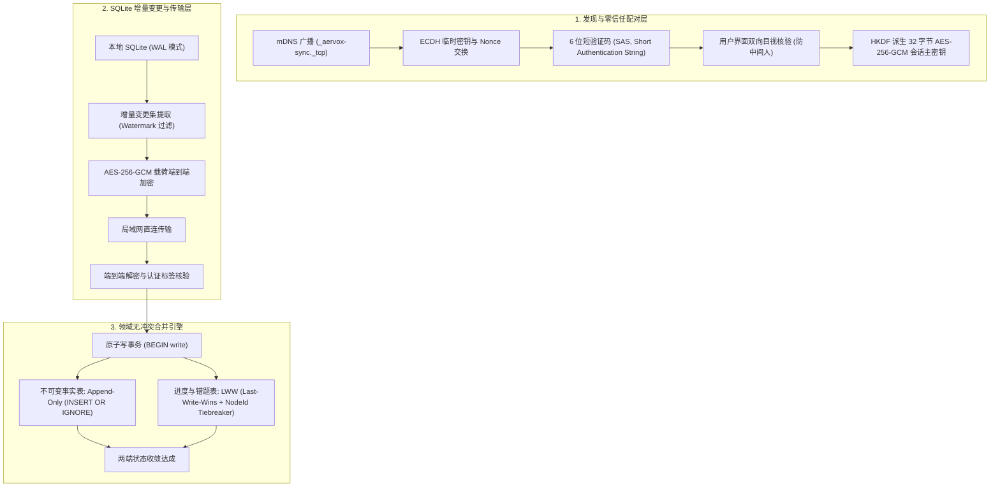

# 纯本地多端点对点加密同步架构探索

- 提出人：3yearszhuang · 2026-09-29
- 修改人：3yearszhuang · 2026-09-29

本文档为当前迭代计划 `ITER-028` 的技术架构探索交付件，记录纯本地单用户场景下，桌面端（Electron）与移动端（Capacitor）之间基于局域网发现、零信任配对与 SQLite 增量变更集（Changeset）双向对齐的设计与 PoC 验证成果。

---

## 1. 为什么选择纯本地 P2P，坚决拒绝云端中心化数据库

在 `CR-030`（已归档）架构决议中，Aervox｜思隅确立了**“纯本地单用户永久真源”**的最高架构原则：全面移除历史租户体系、外部云端关系数据库与中央服务依赖。

伴随 `CR-055` 移动端配套路线的确立，用户对“在桌面端（Electron）使用伴学工作台，在通勤期间使用移动端（Capacitor）刷错题与复习”的跨端数据流动提出了迫切需求。若采用传统中心化同步方案，势必破坏以下底线：

1. **隐私与数据主权丧失**：用户的学习日志、私人对话与记忆画像将被迫暴露于第三方云端服务器；
2. **中心化运维成本与可用性依赖**：在无网络或飞行模式等离线场景下，端侧体验受阻；
3. **架构复杂性与双源漂移**：在本地 SQLite 与远端云库之间维护双写一致性成本极高。

因此，Aervox 采用**局域网点对点（P2P, Peer-to-Peer）直连加密同步**方案：数据仅在用户自有同网设备间流动，双端均为完整的本地 SQLite 独立单用户真源，通过增量 Changeset 与确定性冲突解决策略达成强最终一致性。

---

## 2. 核心架构与三层协议设计



### 2.1 第一层：局域网发现与 6 位 SAS 零信任配对握手

双端设备在同一 Wi-Fi 或局域网下时，通过如下流程建立受密码学保护的安全信道：

1. **设备身份（Device Identity）**：每台终端首次启动时独立生成不可导出的 Ed25519 签名密钥对与永久设备标识（如 `desktop_xxx`、`mobile_xxx`）；
2. **同网发现（Local Discovery）**：服务通过 mDNS（`_aervox-sync._tcp`）或 UDP Multicast 广播设备描述符，内含设备公钥、服务端口与公钥 SHA-256 指纹（前 12 字符）；
3. **临时密钥交换（ECDH Handshake）**：发起方（Initiator）生成临时 `prime256v1` 密钥对与随机 Nonce，向响应方（Responder）发送配对邀请；
4. **防中间人目视核验（SAS Verification）**：两端基于双方公钥、临时公钥与随机 Nonce 进行哈希运算，独立派生出 6 位十进制验证码（如 `428 915`）。用户在桌面端与手机屏幕上核对数字一致并点击确认；
5. **对称密钥派生**：通过 HKDF（HMAC-based Extract-and-Expand Key Derivation Function）派生出 32 字节 AES-256-GCM 会话主密钥，后续所有网络通信均为端到端强加密。

### 2.2 第二层：基于 SQLite Session 思想的增量 Changeset 提取

为杜绝全库快照传输对带宽和性能的浪费，同步机制借鉴 SQLite Session 扩展的增量设计：

- **表级白名单**：明确划分参与跨端同步的核心表集（`learning_goals`、`questions`、`question_attempts`、`mistake_dispositions`、`knowledge_items`、`sessions`、`turns`）；
- **时间水位线（Watermark）**：记录上一次与目标设备成功对齐的高水位时间戳 `sinceWatermark`，仅提取在此之后变更的行记录；
- **自描述变更集格式（P2PSyncBundle）**：

  ```json
  {
    "bundleId": "sync_m1k9x_8f2a",
    "sourceDeviceId": "desktop_a9b1c2",
    "targetDeviceId": "mobile_d3e4f5",
    "sinceWatermark": "2026-09-29T10:00:00.000Z",
    "generatedAt": "2026-09-29T12:00:00.000Z",
    "tables": [
      {
        "tableName": "learning_goals",
        "primaryKey": "id",
        "strategy": "lww",
        "records": [...]
      }
    ]
  }
  ```

### 2.3 第三层：领域感知型双向冲突自愈策略

在去中心化网络中，双端离线修改是常态。Aervox 拒绝无脑覆盖，而是按领域数据语义分别采取对策：

| 数据类别 | 典型数据表 | 合并策略 | 冲突裁决规则 |
|---|---|---|---|
| **不可变学习事实** | `question_attempts`, `turns` | `append_only` | 采用 `INSERT OR IGNORE` 语义。学习与对话发生即为确定事实，不随外部覆盖，两端做并集累加，零丢失 |
| **可变进度与配置** | `learning_goals`, `sessions` | `lww` | 对比 `updated_at` 时间戳。以较晚更新者为准；若时间戳完全相同，以 `sourceDeviceId` 字典序作为确定性仲裁（Tiebreaker） |
| **错题标记与处置** | `mistake_dispositions`, `knowledge_items` | `lww` | 掌握状态与错因笔记遵循最后修改者获胜，确保在手机端温习后标记的状态完整回流至桌面端 |

---

## 3. PoC 验证与测试落地证据

在本次切片实施中，已在 `packages/repositories` 构建完整的实现代码与自动化验证套件：

- **实现代码**：
  - `packages/repositories/src/sync/p2p-pairing.ts`：设备身份、发现描述符、6 位 SAS 配对握手与 AES-256-GCM 加解密；
  - `packages/repositories/src/sync/p2p-changeset.ts`：Changeset 提取、原子事务合并、LWW 冲突裁决与双向对齐调度器；
  - `packages/repositories/src/sync/index.ts`：导出 P2P 同步基础设施接口。
- **测试套件**：
  - `packages/repositories/test/p2p-changeset-sync.test.ts`：3 项端到端测试均 100% 通过（耗时 < 1s）：
    1. *局域网发现描述符与 6 位 SAS 安全配对握手（端到端 AES-256-GCM 会话建立）*：验证双方独立计算的 6 位验证码完全一致，且对称密钥成功互通；
    2. *单向 SQLite 增量 Changeset 提取与应用（支持不可变事实与状态覆盖）*：验证学习目标、题目、作答历史与错题处置由桌面端同步至移动端；
    3. *桌面端与移动端双向离线变更增量同步与 LWW 冲突自愈收敛*：模拟桌面端修改错题、移动端完成学习目标并产生新答题记录的离线并发场景，执行双向同步后两端达成完全收敛与强一致性。

---

## 4. 后续演进建议（面向移动端落地）

1. **Capacitor 原生网络插件集成**：在移动端封装 `@capacitor-community/zeroconf` 插件，负责监听局域网内桌面端发出的 `_aervox-sync._tcp` 广播；
2. **WebSocket / HTTP 本地传输中继**：在桌面端内嵌轻量级受限本地 HTTP/WS 服务器（仅监听局域网 IP，并校验配对 Token），移动端扫码连接后直接推送加密 payload；
3. **同步状态持久化记录**：在本地数据库增加 `sync_watermarks` 系统表，记录各对端设备的上次同步位点，实现断点续传与完全免人工干预的后台自动增量对齐。
