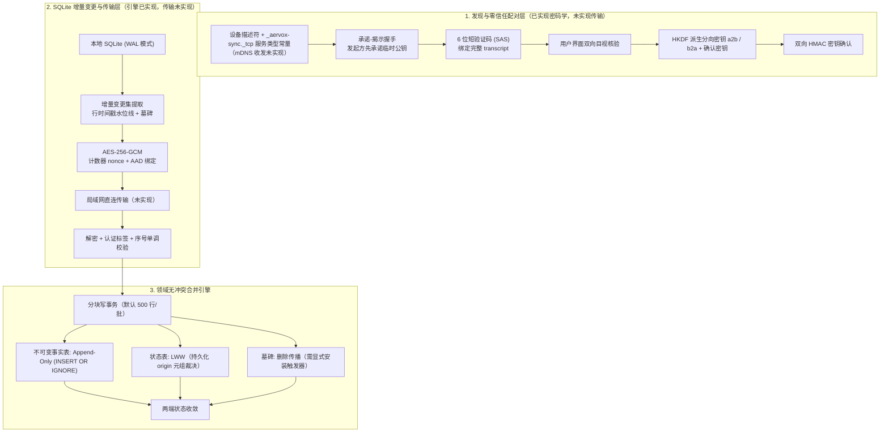

# 纯本地多端点对点加密同步架构探索

- 提出人：3yearszhuang · 2026-09-29
- 修改人：3yearszhuang · 2026-09-29

本文档是当前迭代计划 `ITER-028` 的技术架构探索交付件，记录纯本地单用户场景下，桌面端（Electron）与移动端（Capacitor）之间基于局域网发现、零信任配对与 SQLite 增量变更集（Changeset）双向对齐的**设计输入、已实现范围与未实现清单**。

> **范围声明（重要）**：本探索交付的是**密码学原语、变更集引擎与配对协议**，并**未接线**到任何产品路径（无 mDNS 收发、无局域网传输、无 UI、无后台自动同步调度）。因此本文**不构成**"跨端同步能力已可用"的结论，也不提升任何 CAP 的验收状态。当前状态以根 [plan.md](../../plan.md) 与[追踪基线](../reference/REQUIREMENTS_TRACEABILITY.md)为准。

---

## 1. 为什么选择纯本地 P2P，坚决拒绝云端中心化数据库

在 `CR-030`（已归档）架构决议中，Aervox｜思隅确立了**"纯本地单用户永久真源"**的最高架构原则：全面移除历史租户体系、外部云端关系数据库与中央服务依赖。

伴随 `CR-055` 移动端配套路线的确立，用户对"在桌面端（Electron）使用伴学工作台，在通勤期间使用移动端（Capacitor）刷错题与复习"的跨端数据流动提出了迫切需求。若采用传统中心化同步方案，势必破坏以下底线：

1. **隐私与数据主权丧失**：用户的学习日志、私人对话与记忆画像将被迫暴露于第三方云端服务器；
2. **中心化运维成本与可用性依赖**：在无网络或飞行模式等离线场景下，端侧体验受阻；
3. **架构复杂性与双源漂移**：在本地 SQLite 与远端云库之间维护双写一致性成本极高。

因此，Aervox 探索**局域网点对点（P2P, Peer-to-Peer）直连加密同步**方案：数据仅在用户自有同网设备间流动，双端均为完整的本地 SQLite 独立单用户真源，通过增量 Changeset 与确定性冲突解决策略逼近最终一致性。

---

## 2. 核心架构与三层协议设计



### 2.1 第一层：局域网发现与 6 位 SAS 零信任配对握手

**已实现（`packages/repositories/src/sync/p2p-pairing.ts`）**

1. **设备身份（Device Identity）**：Ed25519 签名密钥对与永久设备标识（如 `desktop_xxx`）。身份通过 `loadOrCreateDeviceIdentity` **落盘持久化**（私钥文件始终 `0600`；专用身份目录按 `0700` 创建，若复用已存在的目录——例如默认的仓库 `data/`（通常 0755）——则不改动其模式；可用 `AERVOX_P2P_IDENTITY_PATH` 覆盖路径），跨进程重启保持稳定；当前**未**使用 OS Keychain / 安全隔区托管。
2. **承诺-揭示握手（Commit-Reveal）**：这是防中间人的关键。
   - 消息 1：发起方只发送临时公钥的**承诺** `sha256(临时公钥, nonce)`，**不发送临时公钥本身**；
   - 消息 2：响应方校验邀请新鲜度后揭示自己的临时公钥与 nonce，并对握手 transcript 签名；
   - 消息 3：发起方揭示临时公钥，附上**对完整 transcript 的身份签名**（响应方据此确认对端确实持有发起方公钥对应的私钥）与域分离的会话密钥确认；响应方校验"揭示值 == 承诺值"、身份签名与密钥确认后才继续。
   - 由于发起方在看到响应方密钥之前已经锁定自己的密钥，任何一方都无法在看到对方密钥后反复挑选密钥去"碰"出同一个 6 位 SAS。
3. **6 位 SAS 目视核验**：两端基于完整 transcript（邀请 ID、双方身份公钥、承诺、双方临时公钥与 nonce）独立派生 6 位十进制验证码。用户在两端核对一致后调用 `markSessionVerified`；**未确认前会话禁止用于加密**（fail-closed）。
4. **会话密钥派生与双向确认**：由 ECDH（P-256）共享秘密经 HKDF-SHA256 派生**分向密钥**（发起方→响应方 `a2b`、响应方→发起方 `b2a`）与确认密钥。两侧确认值使用不同的域分离标签（`i2r` / `r2i`），因此把对端确认值原样回传（回声）无法通过校验。

**遗留路径（不推荐，保留仅为兼容）**：`createPairingInvitation` / `acceptPairingInvitation` / `completePairingAsInitiator` 为无承诺的两消息握手，临时公钥与 nonce 明文交换，攻击者可离线爆破约 2×10^6 次哈希使两端看到相同 SAS。它们已被标记 `@deprecated`，产出的会话为 `legacy_uncommitted`，**默认禁止参与加密**（需显式 `allowUncommittedSession`）。

#### 传输层加密（两条路径共用）

- AES-256-GCM，nonce = 4 字节随机会话前缀 + 8 字节递增计数器，计数器随报文传递；
- AAD 绑定 `协议版本 | sessionId | 方向 | 序号`，杜绝跨会话、跨方向重放；
- 接收端要求序号**严格递增**（可靠有序通道假设：unix socket / TCP），重放与乱序一律拒绝；
- 载荷带独立协议版本号，不兼容版本 fail-closed 拒绝。

### 2.2 第二层：增量 Changeset 提取（非 SQLite Session Extension）

为杜绝全库快照传输对带宽和性能的浪费，同步机制采用**行时间戳水位线 + 显式墓碑**的增量设计。需要明确：**未使用** SQLite Session Extension，也没有 LSN / 逻辑时钟游标。

- **表级白名单（顺序即合并顺序，必须满足外键拓扑）**：`sessions` → `knowledge_items` → `learning_goals` → `questions` → `question_attempts` → `mistake_dispositions` → `turns`。顺序由 `assertSyncTableOrder` 与测试共同看护。
- **时间水位线（Watermark）**：调用方传入 `sinceWatermark`，仅提取该水位之后的变更。语义为**闭区间（`>=`）**——恰好位于水位上的行走变更也必须重传，否则"插入后立即删除"的墓碑会永远丢失；代价是边界行可能重复传输（合并端幂等）。
- **行级权威元数据（`sync_row_state`）**：每个被同步行登记 `(origin_timestamp, origin_device_id)` 与删除墓碑 `deleted_at`，用于跨设备确定性裁决与删除传播。表结构见 [DATABASE.md §8.1](../reference/DATABASE.md)。
- **自描述变更集格式（P2PSyncBundle）**：

```json
{
  "bundleId": "sync_m1k9x_8f2a",
  "protocolVersion": "v1",
  "changesetSchemaVersion": "v1",
  "sourceDeviceId": "desktop_a9b1c2",
  "targetDeviceId": "mobile_d3e4f5",
  "sinceWatermark": "2026-09-29T10:00:00.000Z",
  "generatedAt": "2026-09-29T12:00:00.000Z",
  "tables": [
    {
      "tableName": "learning_goals",
      "primaryKey": "id",
      "strategy": "lww",
      "timestampColumn": "updated_at",
      "deleted": [
        { "primaryKey": "goal_old", "originDeviceId": "desktop_a9b1c2", "originTimestamp": "2026-09-29T11:00:00.000Z", "deletedAt": "2026-09-29T11:00:00.000Z" }
      ],
      "records": []
    }
  ]
}
```

### 2.3 第三层：领域感知型双向冲突自愈策略

在去中心化网络中，双端离线修改是常态。Aervox 拒绝无脑覆盖，而是按领域数据语义分别采取对策：

| 数据类别 | 典型数据表 | 合并策略 | 冲突裁决规则 |
|---|---|---|---|
| **不可变学习事实** | `question_attempts` | `append_only` | `INSERT OR IGNORE`：学习事实发生即确定，不随外部覆盖，两端并集累加 |
| **状态型数据** | `learning_goals`, `questions`, `mistake_dispositions`, `knowledge_items`, `sessions`, `turns` | `lww` | 比较**持久化的** `(origin_timestamp, origin_device_id)` 元组；相同时间戳时按来源设备 ID 字典序裁决 |
| **删除** | 白名单内任意表 | 墓碑 + LWW | 删除写入 `deleted_at` 墓碑；较新的写入可以复活较旧的删除，反之亦然 |

**为什么裁决不能比较"本次中继设备 ID"**：旧实现用 `bundle.sourceDeviceId > localDeviceId` 决胜，导致结果依赖同步拓扑与同步次数——同一份数据第二次同步仍会产生 UPDATE，经第三方设备中继还会来回震荡。修复后一律比较持久化来源元组，因此重复同步产生**零次**更新，中继不改变归属。

**`turns` 为何是 LWW 而不是 append-only**：`turns` 是可变状态机（`status` / `last_sequence` / `error` / `accepted_at` / `cancelled_at` / `completed_at`），把它当不可变事实会导致 Turn 终态**永远同步不过去**（旧实现的缺陷）。

### 2.4 合并写入与原子性权衡

- 合并按 `SYNC_MERGE_CHUNK_SIZE`（默认 500）行分批，**每批一个短写事务**，避免长时间持有写锁（仓库硬约束）。
- 代价：**整包不再原子**。中途失败时已提交批次不回滚，调用方必须按批重放（每行都是幂等 upsert）；分批跑不完时抛 `SyncPartialMergeError`，其 `partialResult.partial`/`appliedChunks`/`totalChunks` 让"本地已被部分应用"可被调用方直接判定。
- 单行遇到非主键 UNIQUE 冲突（如 `mistake_dispositions.question_id`）时只跳过该行并计入 `uniqueConflicts`（**不再重复计入** `skippedCount`），不中断整包。
- 单行遇到本地缺列 / 绑定失败（schema 漂移）或其它行级约束失败时同样**逐行隔离**，分别计入 `schemaDriftRows` / `constraintViolations`，同批正常行照常落库；只有基础设施级错误（锁超时、IO 失败）才中断批次。
- 接收端的安全边界：有效白名单一律取 `options.tables ?? DEFAULT_SYNC_TABLES`，白名单外的表整表拒绝（`rejectedTables`）；对端声明的 `primaryKey`/`strategy`/`timestampColumn` 只用于比对，不符即整表拒绝；合并顺序按本地白名单（本地外键拓扑）重排，绝不采用对端包顺序。

---

## 3. 验证证据与未实现清单

### 3.1 已实现并验证（`packages/repositories`）

P2P 相关用例合计 **51 项**（下表），`@aervox/repositories` 全量 57 套件 / 339 项通过。

| 测试文件 | 用例数 | 覆盖内容 |
|---|---|---|
| `test/p2p-pairing-security.test.ts` | 21 | 承诺-揭示握手、SAS 绑定、承诺不可抵赖、中间人替换承诺被拒、发起方身份签名（伪造签名/他人密钥被拒）、过期邀请/版本拒绝、指纹固定、分向密钥、方向绑定、重放与乱序拒绝、篡改检测、nonce 不重复、密钥确认域分离（回声不通过）、遗留路径默认拒绝、身份落盘（私钥 0600；目录仅新建时 0700） |
| `test/p2p-changeset-merge.test.ts` | 27 | turns LWW、外键拓扑、UNIQUE 冲突隔离、timestampColumn 一致、水位线方向、版本门禁、schema 漂移显式上报、墓碑传播与不复活、零冗余更新、分块合并；对抗性复审残余缺陷回归（F1 接收端白名单/元数据拒绝与本地顺序重排、F2 漂移行逐行隔离与部分合并报告、F3 写入 vs 墓碑四向元组裁决、F4 墓碑设备 ID 决胜、F6 计数自洽与设备 ID 参数化、F7 级联删除墓碑实测） |
| `test/p2p-changeset-sync.test.ts` | 3 | 端到端加密会话建立、单向增量提取与应用、双向离线并发收敛 |

实现代码：

- `packages/repositories/src/sync/p2p-pairing.ts`：设备身份（含落盘）、承诺-揭示配对、分向密钥、计数器 nonce、重放拒绝、密钥确认；
- `packages/repositories/src/sync/p2p-changeset.ts`：变更集提取（含墓碑）、分块幂等合并、领域感知裁决、版本门禁、触发器维护元数据；
- `packages/repositories/src/schema/ddl/sync-metadata.ts`：`sync_row_state` 表与索引（由 `initDatabaseSchema` 建表，触发器需显式安装）。

### 3.2 明确**未实现**（勿默认已覆盖）

1. **局域网发现与传输**：只有 `_aervox-sync._tcp` 服务类型常量与设备描述符构造函数；**没有** mDNS 收发、UDP 广播、Socket 服务器或 WebSocket 中继。跨端同步当前只在同进程内以两份 SQLite 文件模拟。
2. **接线与调度**：没有任何生产代码导入 P2P 模块；无路由、无 UI、无后台自动同步、无 `sync_watermarks` 持久水位表。
3. **schema 迁移传播**：只同步行数据与墓碑。目标端缺表时整表记入 `skippedTables`（显式暴露），缺列时该行被**逐行隔离**并计入 `schemaDriftRows`，同批正常行照常落库；分批未能跑完时抛 `SyncPartialMergeError`，其 `partialResult.appliedChunks`/`partial` 明确标出已提交的批次。
4. **级联删除传播**：外键声明 `ON DELETE CASCADE` 且子表已安装同步触发器时，SQLite 的级联删除**会**触发子表 `AFTER DELETE` 触发器并写入墓碑（实测 `DELETE FROM sessions` 级联到 `turns` 后，`turns` 留下 `deleted_at` 墓碑）；**未实现**的是对此的保证：模块不承诺级联顺序，也不会为未安装触发器的子表补墓碑，"父行删除后子行复活"的风险仅在触发器覆盖到时才被消除。
5. **字段级三方合并 / CRDT**：LWW 落败方直接丢弃，不保留双版本供人工仲裁。
6. **精确增量游标**：没有 LSN / 逻辑时钟，仍按行时间戳过滤，因此依赖设备时钟单调（时钟大幅回拨会丢弃"较新"写入）。
7. **密钥生命周期**：无密钥轮换、无前向保密（DH 棘轮）、无设备撤销列表；身份私钥保存在 `0600` 文件而非 OS Keychain。
8. **真实多设备验收**：未在真实 Electron/Capacitor 设备间验证过配对与同步。

---

## 4. 后续演进建议（面向移动端落地）

1. **Capacitor 原生网络插件集成**：在移动端封装 `@capacitor-community/zeroconf` 插件，监听桌面端 `_aervox-sync._tcp` 广播并实现二维码/SAS 配对 UI；
2. **本地传输中继**：桌面端内嵌仅监听局域网 IP 的受限 HTTP/WS 服务器（校验配对 Token），移动端连接后推送加密载荷；
3. **同步状态持久化**：新增 `sync_watermarks` 表记录各对端上次同步位点，实现断点续传；
4. **删除与级联语义补齐**：级联删除已被子表触发器记为墓碑，但顺序与覆盖面仍无保证——需为级联路径补**顺序/覆盖**保证（或引入软删除白名单），把"父行删除后子行复活"的残余风险从"实测可行"提升为"契约保证"；
5. **数据权利联动**：同步引入后需按 [DATABASE.md](../reference/DATABASE.md) 与隐私契约补齐删除传播、导出与回滚演练。
