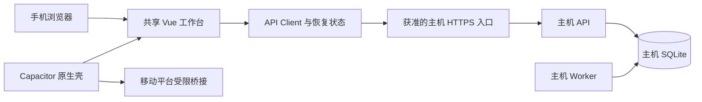

# CR-055 移动端落地范围与分阶段交付规划

- 提出人：3yearszhuang · 2026-09-18
- 修改人：Codex · 2026-09-18

关联：[PRD](../PRD.md) · [架构设计](../ARCHITECTURE.md) · [ADR-015](../adr/ADR-015-vue-full-stack.md) · [数据与隐私规范](../DATA_PRIVACY.md) · [需求追踪基线](../REQUIREMENTS_TRACEABILITY.md)

- 状态：Proposed / Planned；本次交付为规划文档，未实现或发布移动端能力。
- 代码核验基线：`0a12ea4`（2026-09-18 获取的 `origin/main`，含 PR #217）；规划分支：`docs/mobile-landing-plan`。
- 关联：主能力 `CAP-002`；协同 `CAP-001/003/004/006/007/009/010/012/013/019/020/026/027/030`，`NFR-COMPAT-001`、`NFR-A11Y-001`、`NFR-PERF-001`、`SEC-LOC-001`、`TC-RES-STREAM-001`。
- 决策边界：沿用 Vue + Capacitor 已接受选型；配套端优先、Android 先行和下文范围均为建议，需在 M0 确认。本提案不修改 CAP 优先级，也不把 CAP-018 的桌面交付等同于移动交付。

## 1. 变更原因与现状证据

移动端首先要让用户在短时间内完成“继续对话 → 作答 → 查看反馈或今日复习”，再扩展到日记和内容输入。[PRD 的兼容性要求](../PRD.md#68-可用性与非功能要求)已要求移动 Web 支持浏览、对话和答题，但仓库当前仅具备部分跨端基础，不能据此承诺可安装、可离线或电脑关机后可用。

| 当前证据 | 已有基础 | 待补差量 |
|---|---|---|
| [移动包](../../../apps/mobile/package.json)、[Capacitor 配置](../../../apps/mobile/capacitor.config.json) | 已有 `@aervox/mobile`、Capacitor 8、`webDir=../web/dist` 和应用标识 | 尚无受版本控制的 Android/iOS 原生工程；`build` 的 Web 同步脚本不能证明 APK/IPA 可交付 |
| [移动忽略规则](../../../apps/mobile/.gitignore)、[Turbo 配置](../../../turbo.json) | 移动构建已配置依赖上游构建并关闭缓存 | Android/iOS 目录当前整体忽略；需确定原生工程纳管方式、构建脚本、SDK 与签名流程 |
| [Web 宿主](../../../apps/web/src)、[共享 UI](../../../packages/ui/src) | Vue 工作台、主题、对话和领域界面可复用 | 手机导航、软键盘、安全区、返回栈与窄屏弹窗需要专项适配；响应式样式不等于手机闭环已验收 |
| [会话状态](../../../packages/ui/src/composables/useWorkbenchConversation.ts)、[历史面板](../../../packages/ui/src/components/workbench/drawers/HistoryDrawer.vue) | 已有内存消息、当前回复和历史面板 | 当前消息身份为局部编号，历史面板消费内存状态；完整列表、持久化历史加载、服务端消息映射与消息级引用/删除需新增接线 |
| [日记客户端](../../../packages/api-client/src/useAervoxDiary.ts)、[Web 页面入口](../../../apps/web/index.html) | 日记列表/读取/生成/重写已封装；已有角色渲染入口 | 尚无完整日记编辑/删除 UI；页面同步加载外部 Live2D 脚本，需验证资源不可达时核心界面可进入 |
| [API Client](../../../packages/api-client/src/transport.ts) | Fetch 请求、创建 Turn、流式消费及附件上传 | 普通请求、SSE 和上传缺少统一鉴权注入；缺少客户端游标续传、去重和前后台恢复 |
| [对话路由](../../../apps/api/src/modules/companion/conversation/routes.ts) | 服务端已支持 SSE 游标校验、存量重放与实时流 | 需要手机网络故障、重复提交、恢复和取消的端到端证据 |
| [API 认证](../../../apps/api/src/shared/auth.ts)、[配置](../../../packages/config/src/index.ts) | 默认本机监听；非本机开放受 Token 配置约束 | 尚无面向手机的连接引导、独立设备凭据与撤销闭环；当前 CORS 反射来源不能作为设备认证 |
| [API](../../../apps/api/src)、[Worker](../../../apps/worker/src)、[仓储](../../../packages/repositories/src) | Node.js 服务、SQLite 与后台任务组成现有业务运行时 | Capacitor 只封装前端，不能把上述进程和原生依赖直接放进手机 WebView |
| [ADR-018](../adr/ADR-018-proactive-local-privacy-host.md)、[ADR-019](../adr/ADR-019-proactive-integrations-local-gateway.md) | 主动智能本地处理、设备授权与凭据隔离有既定约束 | 手机属于另一设备；普通内容访问与 `local_only` 内容必须明确分界，健康来源另行立项 |
| [对话执行器](../../../apps/api/src/modules/companion/conversation/agent-executor.ts)、[对话 Schema](../../../packages/schema/src/conversations.ts) | 主动智能开启时，普通 Turn 可注入画像并强制使用本地模型 | 本地模型限制不等于输出可跨设备；当前会话/消息缺少跨设备可见性标记，普通历史与 SSE 输出尚不能证明安全开放 |

以上是静态代码与文档核验，未运行原生构建、真机性能测试或应用商店审核。

## 2. 路线比较与建议

| 路线 | 用户能得到什么 | 数据与运行时 | 代价与限制 | 本提案建议 |
|---|---|---|---|---|
| 移动 Web 配套端 | 手机浏览器继续电脑上的对话与学习 | 电脑运行 API/Worker，电脑 SQLite 为唯一业务真源 | 电脑须在线且可达；需要安全连接，不能靠手机 `localhost` 找到电脑 | 先验证核心交互和连接 |
| Capacitor 配套端 | 同一工作台可安装，逐步增加分享、文件选择与系统体验 | 复用 Web 产物与主机 API；手机只保留获准草稿、设置和必要游标 | 原生权限、生命周期、签名和双平台测试新增维护成本；壳本身不带来离线推理 | Android 内测先行，iOS 随后 |
| 独立手机端 | 电脑关闭后仍有本机数据与业务闭环 | 手机拥有独立数据库和可在移动平台执行的领域服务、模型连接与调度 | 需验证 SQLite 驱动、仓储、文件系统、模型调用与系统后台限制；不是前端打包任务 | M0 确认优先级，单列运行时研究包 |
| 桌面与手机双向同步 | 两端独立工作后合并状态 | 新增跨设备复制、冲突、删除与授权传播协议 | 两个可写副本改变当前单库拓扑，不能复制 SQLite/WAL 或用最后写入直接覆盖 | 不纳入首版，另建 CR/ADR |

建议顺序为 **移动 Web 核心闭环 → Android 配套内测 → iOS 配套内测 → 按使用证据决定独立端与同步**。理由是现有资产集中在共享 Vue UI 和主机领域服务，先验证手机使用价值能减少运行时迁移与交互改造同时推进的风险。

若选择独立手机端优先，M1 的交互工作仍可复用；M2 的主机连接不再是首发关键路径，改由第 7 节的运行时研究结果决定实施顺序。不得沿用配套端估算承诺独立端日期。

配套硬件与手机的能力重合、ESP32 最小原型和常在线主机取舍统一见[移动端协同下的硬件规划](../../explanation/companion-hardware-directions.md)。手机配套端仍需业务主机；本 CR 不包含手机 USB/BLE 外设网关，也不因此要求先开发专用硬件。

## 3. 首版体验和能力范围

### 3.1 推荐的手机任务流

1. 首次进入：说明“连接你的电脑”，展示连接状态和主机身份，完成授权后进入会话；电脑不可达时保留连接引导和本机草稿入口。
2. 对话：全宽消息列表与底部输入，历史会话放入抽屉；发送、停止、重试、引用和错误恢复均可触达，不依赖悬停。
3. 学习：从当前对话进入短练习、逐题作答、结果反馈与今日复习；退出或后台恢复后不得重复计分。
4. 回顾：查看获准的历史与日记；消息删除前显示影响并确认服务端结果。日记首版仅阅读，纠错/删除先说明由主机管理，完成后手机刷新失效；完整日记编辑和资料管理另列增量。
5. 设置：手机连接、主题、人格和已有偏好可见；主机进程、路径、模型下载与桌面权限仍由主机管理。

首版默认采用标准工作台单列布局。角色形象使用轻量状态或可关闭的动画；Live2D 为后续按设备能力启用的表现增强。移动端视觉继续遵循[设计规范](../DESIGN.md)，不另建一套组件风格。

### 3.2 范围与验收映射

下表是移动发布切片，不宣称相应 CAP 全量完成。`M-AC-*` 为本提案局部验收编号，M0 采纳后映射到 SRS/追踪基线的正式 AC/TC。

| 移动切片 | CAP / 要求 | 首版范围 | 验收建议 |
|---|---|---|---|
| 连接与退出 | `SEC-LOC-001`、`CAP-027` | 主机身份、授权、连接状态、解除绑定 | `M-AC-01`：错误主机、无效/撤销凭据拒绝访问；解除绑定清理本机内容和凭据 |
| 对话与历史 | `CAP-001/002/007/013` | 新建/继续会话、完整消息列表、流式回复、取消、重试、消息引用/删除；持久化历史与消息身份接线为新增工作 | `M-AC-02`：重启后载入历史并切换会话，引用/删除命中正确消息；流中切换不串会话，断网恢复不丢终态、不重复执行 Turn |
| 练习与复习 | `CAP-003/004/006` | 作答、反馈、错题、今日复习 | `M-AC-03`：连续完成“提问→练习→反馈→复习”闭环；响应丢失后的重试不重复计分 |
| 人格与偏好 | `CAP-010/019` | 选择现有人格与获准偏好 | `M-AC-04`：人格切换保持服务端隔离规则；界面配置不得提升权限 |
| 日记阅读 | `CAP-009` | 只读获准普通日记；完整编辑/删除 UI、生成与资料管理后续单列，不宣称完整 CAP-009/026 | `M-AC-05`：缺少跨设备可见依据的日记不返回；主机修改/删除后重进页面不显示陈旧正文 |
| 界面兼容 | `NFR-COMPAT-001`、`NFR-A11Y-001` | 单列导航、触控、键盘、安全区、无障碍 | `M-AC-06`：320 CSS px 回流、放大字体、屏幕阅读器可完成核心操作；IME 确认候选不误提交；无全页横向溢出 |
| 图片与附件 | `CAP-012` | 后续使用系统选择器、显式上传、进度与失败恢复 | `M-AC-07`：拒绝权限/取消选择可返回原任务；超限失败不丢文字草稿 |
| 通知与分享 | `CAP-030`、`CAP-012/026` | 原生内测后按专项需求加入 | `M-AC-08`：关闭权限或免打扰后不再提醒；点击通知经鉴权取得内容 |
| 插件能力 | `CAP-020` | 首版仅列入已审查、可通过普通 API 使用的能力 | `M-AC-09`：未适配页面/桌面工具不可执行；隐藏按钮不是服务端授权措施 |

范围外包括：系统悬浮桌宠、全设备观察、手机常驻后台 Agent、HealthKit/Health Connect、手机运行桌面 MCP/子进程、任意插件安装、离线自动提交业务写入、公共互联网中继与多主同步。它们按独立需求进入后续 CR，不能以“已有桌面能力”为由默认开放。

## 4. 推荐配套端的技术边界

### 4.1 宿主与共享代码

图中的移动桥接和受限 HTTPS 入口是待实现设计。手机没有通向 SQLite 或主机私密控制面的直接连接。

| 位置 | 规划职责 |
|---|---|
| `apps/web` | 复用现有 Web 入口，接入平台能力与连接配置；桌面布局保持回归覆盖 |
| `packages/ui` | 响应式工作台、可访问的公共控件与平台 Port；不直接导入 Capacitor/Electron |
| `packages/api-client` | 统一连接/鉴权提供者、游标和重连状态、取消与重复请求恢复；不嵌入原生密钥存储实现 |
| `apps/mobile` | 原生工程、生命周期与安全存储 Adapter、权限、分享/文件入口、签名配置；继续消费 Web 构建产物 |
| `apps/api`、`packages/contracts` | 受限设备访问、能力/版本协商、输出数据边界；新增行为先定义契约再接线 |
| `packages/schema`、`packages/repositories` | 仅在设备凭据/撤销持久化确有需要时新增表和 Repository；领域写入仍经写者连接 |

现有 UI 平台枚举只有 `desktop | web`，需扩展宿主能力声明与 Port，按“是否支持文件选择/安全存储/通知”判断功能，不到处以 `isMobile` 分叉业务；尤其检查 `!isWeb` 分支，避免错误启用桌面桥。原生依赖与 SDK 的精确版本、Android 最低版本/iOS 部署目标在 M0 原型后锁定，不把现有 Capacitor 依赖范围当作完整支持矩阵。

### 4.2 主机发现、鉴权与网络

配套端首版建议限定同一局域网内的显式连接；本地网络也需要加密与对端验证。手机 `127.0.0.1` 指向手机自身，现有 Web 本机默认地址必须改为可配置的主机连接，界面需明确显示所连接的电脑。

- M0 比较受信任 HTTPS 入口、原生证书绑定和配对体验；选择一种可在浏览器与 WebView 验证的闭环。浏览器不允许应用自行绕过证书校验，不能把点击证书警告作为生产步骤。
- 建议主机显式启用配套访问，使用短时、一次性配对材料换取可撤销的设备凭据。二维码不携带长期 API Token 或模型密钥；设备 ID 只用于认证/审计，不成为新的业务分区键。
- 原生凭据经 Keychain/Keystore 等受限 Adapter 保存。Web 的会话机制需与服务端一并决策，长期凭据不写 `localStorage`，不写入构建环境变量、URL、日志或错误上报。
- 请求、SSE、附件和取消共用鉴权；限制来源并验证预检、凭据撤销、重定向与连接切换。CORS 不能代替鉴权，也不能保护原生客户端。
- 受限入口只暴露首版获准能力。主机配置、模型进程、插件安装、文件路径及主动智能私密控制面默认不暴露；普通 API 中的工具执行同样需要后端能力限制。

当前[隐私规范 §10](../DATA_PRIVACY.md#10-安全控制)描述 Web Cookie 与桌面/移动 OIDC + PKCE，而当前本机 API 使用 Token。**M0 必须由维护者裁定本地配套认证契约并同步规范/威胁模型**；本规划不静默改写这项差异，也不把现有 Token 直接认定为发布方案。

### 4.3 数据、断网与恢复

配套端以主机为业务真源，手机默认只持久化未发送草稿、设置和恢复所需标识；草稿须按主机与会话分开，并提供清除入口。发出但未确认的写入显示“结果待确认”，先查询既有结果或按同一幂等标识重试，不能自动生成新 Turn。

SSE 恢复复用[流式协议](../STREAMING_PROTOCOL.md)：消费并记录事件 ID/序号，从最后已应用事件恢复并去重；游标过期按契约重新取得权威状态，不能把重放文本追加成第二份回复。锁屏和后台后按“连接可能被系统终止”处理，恢复时重新校验认证、Turn 状态与终态。退出订阅和停止生成是两种不同操作，停止必须发送服务端取消请求。

首版断网只允许在已加载的 Web 页面或内置资产的原生壳内编辑草稿和查看连接信息，不承诺新消息、作答或工具执行可离线完成；默认不建业务离线写队列。当前无 PWA 离线壳，移动 Web 离线冷启动另列需求。若增加历史内容缓存，必须单独补充分类、期限、加密、删除和撤权传播策略，再进入范围。

跨设备传输是数据离开主机的行为。[ADR-018](../adr/ADR-018-proactive-local-privacy-host.md) 的 `local_only` 内容及其派生输出不能因为同一用户或同一 Wi-Fi 而开放：除私密端点外，必须检查普通对话上下文、SSE、历史、日记、附件、检索与插件输出是否携带此类来源。不能证明边界的能力暂不开放；包含混合来源的会话应整体拒绝或走已评审的安全投影，不能只在 UI 隐藏来源标签。

M0 要验证含画像的既有会话与无来源标记的历史，而非只验证新建普通会话。旧记录的来源未知时拒绝跨设备读取，不自动标为普通内容；若采用专供配套端的清洁会话，服务端必须在每次 Turn 与工具调用中阻止本地私密上下文进入，并持久化可见性/来源判断，不能仅依据客户端声明。其具体传播字段、迁移和拒绝行为经契约评审后进入 M2；代价超出原型预算时先收缩可见范围或重估阶段。

当前[日记素材收集](../../../packages/diary/src/material.ts)跨会话汇集消息和记忆；清洁会话不能自动使已有日记可见。M0/M2 的拒绝路径至少覆盖“画像 → 普通回复 → 日记/工具结果 → SSE/历史”，并验证撤权后重连仍拒绝。无法证明来源的日记首版不可读，界面说明须在主机查看。

### 4.4 系统能力与分发

原生阶段先做返回栈、键盘、安全区、应用恢复和必要安全存储；媒体、通知、分享等能力按需授权。前后台限制、通知延迟和系统杀进程是运行条件，不能承诺永久后台 SSE 或常驻模型进程。

通知区分本地排期与服务端推送。APNs/FCM、中继、设备令牌与外部服务将形成新的网络/隐私边界，需要专项评审；首版不因接入 Capacitor 自动引入推送服务。锁屏通知默认不显示对话、日记或健康内容正文。

Android/iOS 原生工程建议纳入版本控制，忽略构建产物与本机配置；如选择可重复生成，必须提交模板和补丁并由干净环境验证。SDK、应用标识、签名材料保管、内部渠道、隐私清单、依赖许可和升级回退由各平台发布任务明确。应用商店通过与否不以 Web 构建成功替代。

## 5. 分阶段任务、依赖和估算

估算为一名熟悉仓库的工程师的净工作日区间，用于排优先级，未含硬件采购、证书申请、商店等待和未知缺陷；M0 后重估。阶段编号是本 CR 的局部里程碑，不替代 PRD 的 R1～R5。

| 阶段 / 建议 PR 切片 | 依赖 | 工作与产物 | 退出条件 | 初估 |
|---|---|---|---|---|
| M0：范围与风险原型 | 本提案评审 | 确认配套/独立优先级、平台顺序、连接/认证与数据边界；验证真机 HTTPS + 鉴权 SSE；生成一份原生调试包；固定 SDK/设备矩阵和客户端性能预算；将 AC/TC 写入正式规格 | 维护者采纳范围；认证规范差异解决；主机不可达行为明确；连接与新旧数据边界原型有证据 | 3～5 日 |
| M1：手机核心交互与历史接线 | M0 的范围/契约；可与 M2 并行 | 分两 PR：单列壳/抽屉/键盘/安全区/触控；完整消息列表、持久化历史加载、服务端消息身份与引用/删除、会话切换隔离；学习正常路径回归 | `M-AC-04/06` 与对话/学习正常路径通过；故障恢复待 M1+M2 集成验证；桌面/Web 无交互回归 | 7～11 日 |
| M2：连接与恢复 | M0 认证/隐私裁定 | 统一鉴权、受限入口、配对/撤销；SSE 游标/去重/恢复、取消、重复写入处理；API 权限与内容边界测试 | `M-AC-01/02/09` 通过；失败/断网/撤权不会产生重复副作用或私密输出 | 6～10 日 |
| M3：移动 Web 集成与小范围试用 | M1 + M2；先通过鉴权/恢复故障验收再试用 | 两类手机浏览器端到端，学习闭环、普通日记只读、草稿清理、异常提示；形成反馈与缺陷清单 | `M-AC-01～06/09` 含故障场景达标；达到已冻结性能预算；完成可用性记录 | 3～5 日 |
| M4：Android 配套内测 | M3 | 原生工程与 CI、桥接、安全存储、系统返回/恢复、安装升级；文件输入作为独立可选 PR | 签名内测包可从干净环境重建；安装/升级/退出/撤权及真机恢复通过 | 4～7 日 |
| M5：iOS 配套内测 | M3；复用 M4 经验 | iOS 工程与签名、WKWebView 网络/键盘、前后台、隐私声明；内部测试分发 | 真机与签名包全流程通过；平台差异已归档 | 4～7 日 |
| M6：独立端或原生增强 | M3 反馈 + 单项立项 | 按价值选择图片/分享、通知、独立运行时、健康或同步；每项独立 CR/验收 | 不以“端扩展”打包成一次无边界重构 | 另估 |

M0～M4 的单人净投入约 **23～38 工作日**，加 iOS 约 **27～45 工作日**；M1/M2 可由两人并行，但认证与数据边界仍是关键依赖。若必须新增身份基础设施、解决复杂证书分发或实现跨设备内容投影，须在 M0 拆分追加工作，不能压入原估算。该区间以来源未知内容默认拒绝、日记只读、不提供资料管理和同步为前提。

每个实施 PR 必须关联本 CR、限定 CAP 切片、补齐正式测试映射，并在[§4.2 落地登记](../REQUIREMENTS_TRACEABILITY.md#42-落地实现登记)记录实际结果。M1 不要求等待全部原生能力，但未通过 M2 的网络边界不得进入用户试用。

## 6. 验证与发布门禁

| 维度 | 最少验证内容 | 证据与退出标准 |
|---|---|---|
| 代码与契约 | API Client 恢复状态机、后端拒绝路径、写入幂等、取消竞态、UI 平台 Port | 单元/集成测试；修改契约时更新 OpenAPI；仓储断言遵循写者连接规则 |
| 浏览器兼容与无障碍 | Android Chrome、iOS Safari 当前及前一主版本；320/360/390/430 CSS px、横屏、放大字体、IME、VoiceOver/TalkBack、焦点与标签 | Playwright 视口回归加两平台真机记录；满足 `NFR-A11Y-001` 核心流程；操作不被键盘遮挡；长代码/公式只在内容区域滚动 |
| 网络与生命周期 | SSE 分段中断、切网、锁屏、后台终止、重启、过期游标、主机休眠/重启、取消后恢复 | 每种场景运行中与终态均覆盖；无重复消息/计分/工具副作用；可恢复或有明确失败状态 |
| 认证与隐私 | 首次绑定、错误主机、证书失效、重放配对、Token 撤销、跨来源请求、敏感混合来源和导出 | 无授权即拒绝；普通 API/SSE 无 `local_only` 派生泄漏；日志/通知/包内无长期密钥 |
| 数据权利 | 主机删除后刷新、手机草稿清理、解除绑定、主机切换 | 已删除数据不复现；本机数据不串主机；导出继续走用户显式路径 |
| 性能与可用性 | 冷启动、长消息滚动、流式输入、30 分钟资源/耗电、弱网首次可操作时间、Live2D CDN 不可达 | 延续 `NFR-PERF-001` 的 API/TTFT 门槛；M0 固定设备/网络和首屏/滚动/资源预算，M3 未达不得退出；建议触控区至少 44 CSS px，角色资源失败不阻断核心 UI |
| 原生发布 | 全新安装、旧版升级、权限拒绝、应用恢复、签名包校验、依赖许可、商店资料 | Android/iOS 分别登记证据；无真机或签名构建证据不标记该平台可发布 |

仓库当前 Playwright 以 API 端到端为主，移动视口测试、浏览器交互闭环与原生真机测试需显式建立，不能用已有 API E2E 数量替代手机验收。

本次文档提交验证使用 `mise tasks run ci-docs` 与 `mise tasks run check-affected`；实施阶段按变更运行定向测试，推送前按仓库要求运行 `./aervox ci all`。UI 模拟器结果不替代网络、系统生命周期与原生包真机证据。

## 7. 独立手机端研究包

如果首要目标是“电脑关机也可用”，先以 5～8 工作日的限时研究决定可行边界，后续实现另估。沿用 Vue/Capacitor，原生渲染框架不是解决后端运行时的捷径。

- **最小垂直闭环**：手机本机新建会话、落盘、调用获准模型、流式展示、重启恢复，并完成一次作答；证明不依赖电脑 API。
- **运行时划分**：盘点 Node.js 内置模块、原生 SQLite/文件系统、Fastify、子进程与插件依赖；区分可复用的纯领域逻辑和需移动 Adapter 的 Port。可选内嵌运行时或本机服务改造必须经过测量与 ADR。
- **数据库与附件**：验证移动 SQLite 的事务/FTS、加密密钥、备份恢复、附件访问及模式迁移；保留 Schema/Repository 职责，不能在 UI 直写表。
- **模型边界**：独立运行不等于离线推理。区分“手机本地受控领域运行时经 ProviderPort 调用获准远程模型”和“手机本机模型”；WebView 不直接持有模型密钥或绕过上下文、安全检查与流式持久化。后者须补设备内存、模型许可、温升、耗电和中断恢复证据；`local_only` 内容不能降级到远程模型。改变现有模型调用边界需单独 ADR。
- **后台任务**：将到期复习/日记任务设计成可持久化、可补偿的调度，接受系统唤醒时机限制；不能照搬桌面常驻 Worker 的时间保证。
- **数据关系**：首个原型使用独立测试库。桌面资料导入必须显式选范围、备份和验证；双向同步需另建冲突、墓碑、删除、撤权与密钥协议，不在原型中自动合并用户数据。

研究退出时给出可复用包、阻断依赖、两平台限制、实测数据和新的实施估算；无法证明核心闭环时记录“证据不足”，不把安装成功记为独立端落地。

## 8. 风险、兼容与回退

| 风险 | 应对与回退 |
|---|---|
| 电脑休眠或网络不可达，用户误认为手机应用坏了 | 首屏明确配套关系与连接状态；保留草稿和手动恢复；若多数目标场景要求无电脑可用，转入独立端决策 |
| 开放主机入口扩大权限或暴露私密派生内容 | 默认关闭、按设备撤销和最小能力；边界失败即关闭配套入口、撤销设备凭据，保留桌面本机使用 |
| M1 改造影响桌面或既有插件页面 | 共享控件回归、手机布局可回退；未适配插件不进入移动发布清单 |
| 两端版本不兼容或事件无法恢复 | 启动进行协议/能力协商；不兼容时阻止写入并说明升级要求，不能静默降低鉴权或重复执行 |
| 凭据元数据需要新表 | 优先 Expand 迁移，旧桌面仍可运行；回退停用配套服务并撤销凭据，不删除用户会话与学习记录 |
| 原生升级问题 | 发布前验证上一版兼容窗口；暂停分发并提供修复版本，平台允许时回到已签名兼容包；不假定商店可即时降级 |
| 后续独立端或同步导致数据损坏 | 单独走[SQLite 换库演练](../../how-to/run-database-migration-drill.md)，备份、staging 校验、原子换库并保留回滚包 |

## 9. 待决策与文档联动

| 决策项 | 建议 / 所需证据 | 决策时点 |
|---|---|---|
| 首版配套端还是独立端 | 建议配套端先验证；若电脑关闭是必需场景，优先运行时研究 | M0 开始 |
| Android/iOS 顺序与支持版本 | 建议 Android 先内测、iOS 接续；根据用户设备与原型记录确认 | M0 |
| 同网连接、证书与认证 | 维护者裁定与现有隐私规范的一致方案；两类客户端真机验证 | M0 退出前 |
| 普通资料跨设备可见范围 | 明确授权、来源分类与混合内容拒绝策略；不扩张 `local_only` 例外 | M0 退出前 |
| 原生通知、图片、分享优先级 | 按核心闭环试用反馈逐项选择；通知不作为首版可用前提 | M3 退出后 |
| 独立端与同步是否立项 | 以电脑不可用场景频率和运行时研究结果决策 | M3 后或独立端优先时提前 |

本次仅新增 CR 并同步索引、入口、生命周期登记、机器目录和规划完成登记；不推进能力矩阵的交付状态。采纳后由维护者将产品范围归入 PRD，原子行为归入 SRS，正式 AC/TC 和实施证据归入追踪基线；部署/平台 Port 归入架构，认证/跨设备数据边界归入 DATA_PRIVACY 与 THREAT_MODEL，新增不可逆决策归入 ADR。本文保持差量与实施顺序，不成为第二份长期契约。

## 10. 发布后结果

尚未进入实施或发布。后续逐平台记录版本、验证证据、实际范围、试用反馈和已知限制；`implemented`、`verified`、`released` 分别据实推进。
