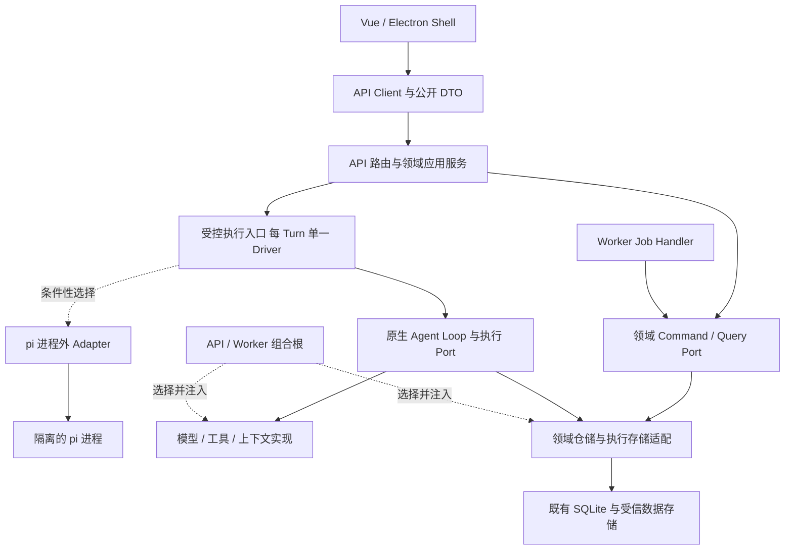

# CR-056 引入 Build to Delete 与类 pi 分层架构

- 提出人：3yearszhuang · 2026-09-28
- 修改人：3yearszhuang · 2026-09-29

关联：[当前迭代计划](../../../plan.md) · [架构设计](../ARCHITECTURE.md) · [能力组合规范](../capability-composition.md) · [Agent Loop 规范](../agent-harness-loop.md) · [架构实现评估](../../explanation/architecture-implementation-review.md) · [实现登记](../REQUIREMENTS_TRACEABILITY.md#42-落地实现登记)

- 状态：Accepted / Implemented（部分实现，合并前复核未通过）；2026-09-29 PR #230 复核发现 BTD-02/04 的生命周期缺陷和 BTD-07 的动态导入漏检，详见 §10.1。ITER-014 撤回移交，保留阶段二 BTD-05/06 和条件性 BTD-08 的既有范围；不表示 Verified 或 Released。
- Aervox 核验基线：`e5297fe549cfff4f8eedf51bbb4c0da010a57787`，2026-09-28 本地 `main`；规划分支 `docs/build-to-delete-pi-architecture-plan`。
- 参考基线：`PI-01`，`reference/pi` 的 `c49906ec77788625aacbdc53ebca6fbe65bd20f5`，MIT；不将本快照描述为上游最新版本。
- 关联能力：`CAP-002/005/007/018/020/027/033` 与架构基础设施；不改变 CAP 优先级、标准产品必选集或数据权利。
- 排期边界：`ITER-023` 只登记本次规划交付；架构评审与实施认领进入 `ITER-014` 及第 7 节对应的既有条目。本 CR 的 `BTD-*` 仅为切片和验收标识，不持有独立执行状态、人员认领或日历排期。

## 1. 目标、定义与范围

本提案建议采用 **Build to Delete（为易于删除而构建）**：一个实现能在受控范围内退出或被替换，剩余系统继续满足原有契约，且不遗留活跃资源或失去用户数据的管理能力。衡量对象是替换影响、资源残留和数据责任连续性，不能仅以文件变短、目录增多或关闭开关证明完成。

“类 pi 架构”在此具体指：模型接入、执行循环、会话与产品编排、扩展生命周期、界面与传输各有明确责任；具体实现由组合根选择；上下文转换和协议映射集中在边界；扩展有归属、释放和失效机制。沿用 Aervox 的 Port、Host 和领域事实，不复制 pi 的产品范围或会话存储格式。

本轮建议成果是两条可替换切片及一套可复用验收：MemoryStore 工具贡献、单个本地模型 Driver。后续按真实变化压力扩展到其他模块；真实 pi 运行时接入是条件成立后另行认领的实验。

保持[架构基线](../ARCHITECTURE.md)与[数据契约](../DATABASE.md)：本地单用户 SQLite 业务真源、现有 API/Worker 进程分工、Vue/Electron、HTTP/SSE、P0 学习陪伴闭环、权限/撤权、导出/删除、审计与恢复责任。受信隐私存储仍遵循既有隔离规则。以上责任不能随功能退出被关闭，但承担这些责任的代码也可以在等价验证后替换。

本提案不包含微服务化、替换数据库、全局 Event Sourcing、统一全能插件框架、所有能力拆仓、生产数据迁移或把 pi 变为应用内核。不因本次规划自动开启自动续跑、第三方可执行插件或时态事实生产召回。

## 2. 固定基线与需要解决的差量

### 2.1 Aervox 当前实现

| 核验对象 | 当前事实与源码 | 本提案差量 |
|---|---|---|
| Loop 与存储 | [执行 Port](../../../packages/agent-loop/src/ports.ts)已隔离数据库，[Host](../../../packages/host-agent/src/agent-host.ts)已有生命周期基础 | 复用已有边界，优先修真实装配；不从零重写 Loop 或创建第二套持久执行状态 |
| API 模块 | [ModuleContext](../../../apps/api/src/modules/context.ts)暴露 `db/client` 与具体 Service；[Conversation 装配](../../../apps/api/src/modules/companion/conversation/index.ts)创建多个领域仓储 | 消费方改依赖窄 Port，数据拥有者提供实现；公开依赖由组合根连接，逐步退出可变服务袋 |
| 边界门禁 | [检查器](../../../scripts/import-boundary.mjs)按工作区包归属，同包相对引用直接放行；解析失败也跳过 | 对试点模块强制所有权和公开入口；保持已有包级规则，报告纳管范围内解析失败 |
| 工具与 Memory | [ToolRuntime](../../../apps/api/src/modules/ecosystem/tools/runtime.ts)强制依赖 Memory/Embedding 仓储和 LibSQL，并内置 MemoryStore；Conversation 还通过 Tools 获取 Embedding Provider | 工具注册执行与具体 Memory 实现分离；写入与召回共同使用有明确归属的 Embedding Provider |
| 本地模型 | [Driver SPI](../../../apps/api/src/modules/ecosystem/model-runtime/driver.ts)已存在；[Service](../../../apps/api/src/modules/ecosystem/model-runtime/service.ts)仍默认创建 `LlamaServerManager`，接口使用 `Llama*` 类型 | 具体默认实现移到组合根；先证明现有 SPI 能替换，再按实际差异收敛类型 |
| 插件退出 | [启动扫描](../../../apps/api/src/modules/ecosystem/plugins/index.ts)把磁盘缺少 builtin 映射成卸载；[清理](../../../apps/api/src/modules/ecosystem/plugins/config-service.ts)会删配置、Secret、Page | 代码缺席先阻断相关执行并保留恢复信息；显式卸载/数据清理按批准语义单独处理 |
| 注册释放 | [工具注册](../../../apps/api/src/modules/ecosystem/tools/runtime.ts)不返回释放句柄；持久注销不清理内存 handler；[Turn 插件](../../../apps/api/src/modules/ecosystem/plugins/turn-plugins/types.ts)暴露具体仓储且通用结果含刷题字段 | 实例拥有注册与资源，旧句柄不能影响新实例；逐步用受限领域接口取代大仓储访问 |
| 已交付工作 | `ITER-002` 已登记接单/Outbox 修复；[时态事实规则](../../../packages/repositories/src/temporal-fact-policy.ts)与[投影](../../../packages/repositories/src/temporal-fact-projection.ts)已交付实验，尚未接入生产写入/召回；[DDL 入口](../../../packages/repositories/src/schema/ddl/index.ts)已建其表 | 保留实现与回归，不重做、不移除表，也不把“实验未启用”解释为数据不存在；完整恢复仍按 ITER-010 处理 |

本次可重复验证的边界夹具是：在内存中让 Conversation 导入 Plugins 的私有 `service.ts`，现有检查器返回零违规；让 `agent-loop` 导入 `@aervox/repositories` 则触发既有规则。它证明包内边界缺口，不证明生产发生了越权。其它条目为源码复核；没有在真实用户数据上做删除、换库或故障实验。

### 2.2 pi 中采纳与保留研究的部分

| 参考机制 | 借鉴方式 | 成熟度与限制 |
|---|---|---|
| [Agent Loop](https://github.com/earendil-works/pi/blob/c49906ec77788625aacbdc53ebca6fbe65bd20f5/packages/agent/src/agent-loop.ts)的 `transformContext`、`convertToLlm`、`StreamFn` | 产品消息在边界转换；执行器不认识具体 UI、数据库或外部扩展 | 当前 CLI 路线可供源码参考；Aervox 仍保留自己的控制与持久化合同 |
| [模型注册](https://github.com/earendil-works/pi/blob/c49906ec77788625aacbdc53ebca6fbe65bd20f5/packages/ai/src/models.ts)的实例 Map、取消与 generation | 替换/删除 Provider 后，迟到刷新不能恢复旧状态 | 只迁移行为与测试思路，不引入全局 Provider 注册表 |
| [扩展上下文](https://github.com/earendil-works/pi/blob/c49906ec77788625aacbdc53ebca6fbe65bd20f5/packages/coding-agent/src/core/extensions/loader.ts)的失效与订阅清理 | 生命周期按实例归属，旧上下文不可继续使用 | pi 默认有宿主权限；这套扩展 API 不是 Aervox 的隔离边界 |
| [协议映射](https://github.com/earendil-works/pi/blob/c49906ec77788625aacbdc53ebca6fbe65bd20f5/packages/server/src/protocol.ts)与[客户端状态](https://github.com/earendil-works/pi/blob/c49906ec77788625aacbdc53ebca6fbe65bd20f5/packages/client/src/state.ts) | 内部类型与对外 DTO 分开；权威快照与进度事件分开，拒绝旧 revision | 新 server/client 属实验路线；不因此迁移到新的二进制协议 |
| [新 AgentHarness](https://github.com/earendil-works/pi/blob/c49906ec77788625aacbdc53ebca6fbe65bd20f5/packages/agent/src/harness/agent-harness.ts)与 SessionStorage | 仅研究可恢复操作记录与后端边界 | `prompt/resume/abort` 等未完成；[CHANGELOG](https://github.com/earendil-works/pi/blob/c49906ec77788625aacbdc53ebca6fbe65bd20f5/packages/agent/CHANGELOG.md)明示 scaffold，不能作为现成内核依赖 |

实际 CLI/SDK 仍通过 [SDK 装配](https://github.com/earendil-works/pi/blob/c49906ec77788625aacbdc53ebca6fbe65bd20f5/packages/coding-agent/src/core/sdk.ts)创建 `Agent + AgentSession + SessionManager`。不得以包已导出或模拟器测试通过，宣称真实 pi 持久执行、权限或恢复已接入。

## 3. 建议的分层与代码落点

下面是已接受的目标依赖关系；箭头表示依赖或受控调用，具体实现通过组合根注入。图中领域服务、Host 和存储仍在既有进程与工作区包内，不表示新增服务进程。



| 责任 | 优先使用的现有位置 | 调整边界 |
|---|---|---|
| 公开业务契约 | `packages/contracts`、各模块 `index.ts` 导出的内部 Port | 外部 DTO 保持单一真源；内部 Port 只包含实际消费者需要的命令、查询与错误，不泄漏具体仓储或 pi 类型 |
| 执行机制 | `packages/agent-loop` | 工具循环、模型调用边界与现有执行状态规则；不加入教学模式、插件安装或 UI 判断 |
| 宿主适配 | `packages/host-agent` 与 API/Worker 组合根 | 绑定存储、控制上下文与具体 Driver；避免原生与 Adapter 各维护一套相互漂移的策略 |
| 产品编排 | `apps/api/src/modules/<domain>/<module>`、已有领域包 | Memory、教学、人格、主动智能等拥有自己的规则；按最小消费者需要暴露 Port |
| 具体实现 | 当前模块的私有文件 | 首轮不建整套 `providers/*`、Resolver 或新包；真实独立发行需求成立后再按交付规则处理 |
| 表现与传输 | `packages/api-client`、`packages/ui`、`apps/web`、`apps/desktop` | 界面只消费 Aervox 契约；运行进度不得覆盖持久终态，重连恢复来自权威状态 |

组合根可以构造具体类；普通跨模块消费者仅使用公开 Port。模块 `index.ts` 作为唯一公开入口，不在 import 时注册全局实例、启动定时器或进程；必要的 `public.ts`、`register.ts` 只是模块内部组织，不增加第二套公共入口。Port 由需求拥有者定义，禁止为未来假想消费者暴露通用 SQL、任意仓储访问或万能 `execute(name, payload)`。

## 4. 需要接受的决策差量

| 决策 | 当前基线或缺口 | 本提案建议 | 接受后联动文档 |
|---|---|---|---|
| D1：跨模块通信 | ADR-014 要求进程内 pub/sub；ARCHITECTURE 同时存在 Outbox 限制、公开接口和旧拆服务表述 | 同步业务请求用窄 Query/Command Port；需要持久可靠投递的事实/后台工作用 Outbox；可丢通知仅作唤醒或表现，不承担提交证明。跨模块事务不由调用者拼接，原子需求由领域命令明确承担 | [ADR-014](../adr/ADR-014-modular-monolith-structure.md)、[ARCHITECTURE](../ARCHITECTURE.md)、[能力组合规范](../capability-composition.md) |
| D2：公开入口与装配 | 包级门禁无法约束模块私有引用，可变 Context 暴露具体实现 | 保留 `index.ts` 公开入口，限定组合根装配权；为试点建立模块所有权门禁和逐条过渡例外 | ADR-014、边界冻结 ADR、架构模块表 |
| D3：资源退出与数据清理 | 缺 builtin 会触发卸载；内存注册与持久记录生命周期混合 | 区分停用、撤权、代码缺席、显式卸载及数据清理；明确缺席状态和恢复行为，保留数据权利执行者 | [插件规范](../plugin-config-and-pages.md)、能力组合规范、数据隐私及相关 CR |
| D4：执行控制一致性 | 原生与 Adapter 接线不同；现有 Adapter 请求和协议无法承载完整授权工具往返 | 先冻结所有 Driver 不可绕过的控制合同；按实际能力准入，必要时版本化 Adapter 协议，不把事件格式一致当行为等价 | [ADR-010](../adr/ADR-010-dsh-pi-adapters.md)、Agent Loop、流式协议与安全契约 |
| D5：模块交付载体 | 独立可选非核心能力必须子仓；核心闭环与部分已收回能力保留主仓 | 首轮仅替换内部实现，沿用现行载体。是否改为“按独立发行/所有权需要拆仓”作为单独待决策项，不是本轮实施前置 | 能力组合规范、[能力注册表](../capability-registry.md)，仅在批准改变政策时修改 |

D1～D4 已随 2026-09-28 的实施授权接受；规则同步到对应 Living 契约，代码按切片验证。现有正确性修复按既有授权继续，不必等待整份 CR 或其它切片。D5 保持现状，也不自动将 P0 或已收回主仓的能力改为可选。

## 5. 实施切片与 PR 边界

以下为建议的技术拆分。新增文件名均是候选落点，尚未创建；每个 PR 开始时核对基线变化，并在唯一队列认领。涉及同一文件的切片串行合并，不并行改同一装配入口。

### 5.1 BTD-00：冻结决策与首轮范围

- 输入：本 CR 的源码证据、D1～D4、现有 ITER-014；建议责任为架构与领域维护者。
- 交付：接受相关决策，明确首批模块、公开 Port、数据 Owner、跨模块原子性和过渡引用清单；批准后更新对应 ADR/Living 契约。选择 MemoryStore 与单个模型 Driver，保留标准产品能力集。
- 验收：每个业务写入有唯一受控入口；每个生命周期动作能说明保留/释放哪些资源及数据；每条临时兼容边有责任、消费者和删除条件。
- 退出：如替换需求或收益不足，可只接受已证实的边界修复；不以本 CR 为由开启所有目标目录和能力平台。

### 5.2 BTD-01：模块公开 Port 与边界门禁

- 前置：BTD-00 中 D1/D2；落点为 `scripts/import-boundary.mjs`、`scripts/import-boundary.test.mjs`、`modules/context.ts` 与试点模块入口。
- 工作：识别 `modules/<domain>/<module>` 归属，检查同域和跨域私有引用；覆盖 type import、re-export、动态字面量、`.js` 到 `.ts`、相对绕行及解析失败；组合根例外精确到调用方与目标。现存引用先清点，试点强制阻断；未纳管范围不得被描述为全仓已闭合。
- 迁移：消费者接收实际需要的 Port；Context 只为尚未迁移入口保留过渡字段。例外按边登记，禁止整目录永久豁免；现有“未解析目标忽略”的测试应随纳管范围有意修订。
- 验收：公开入口夹具通过、私有入口夹具失败；试点用 Fake Port 测试，无需启动其他业务模块；既有包级禁入规则仍通过。
- 回滚：还原该切片装配和检查规则；不得关闭原有包级门禁或扩大豁免以掩盖失败。无数据库变更。

### 5.3 BTD-02：实例生命周期与 builtin 缺席处理

- 前置：D3；贡献公开接口使用 BTD-01；Config/Secret 一致提交仍依赖 ITER-004 的必要切片。
- 落点：Tools Runtime、Plugins 注册/安装/配置服务、MCP 断开/重连路径、`app.ts` 的注册表注入；沿用现有关闭钩子。
- 工作：注册返回绑定实例身份/代际的释放句柄；旧 disposer 不能删除同 ID 新实例，重复释放幂等。先阻断新调用，再取消或有截止地排空在途任务；持久授权、配置和审计不跟随内存 handler 释放。两个 App 实例不得共享不可控的默认注册表。
- 调用一致性：工具定义、handler 和可调用快照绑定同一实例/代际；注册完成前不发布可调用状态，替换或释放使旧快照失效，执行时重验代际与当前授权。增加 A 为只读、B 为写操作且发生并发调用的夹具，禁止用 A 的安全元数据执行 B；动态工具开放仍归 ITER-007。
- 缺席语义：单包缺失、根目录不可读或清单无效均不能解释为用户主动卸载；受影响能力不可执行，保留配置/Secret/恢复信息并给出可诊断状态。恢复包后重新校验版本和当前授权，不能恢复已撤销权限。
- 数据责任：显式卸载沿用批准语义；若导出、迁移或删除尚未完成，保留必要的受信清理实现。不得先删掉唯一能管理旧数据的代码。
- 测试：新增候选 `tool-runtime-lifecycle.test.ts`、`builtin-plugin-absence.test.ts`；复用 `tools-plugins.test.ts`、`plugin-config.test.ts`、`proactive-plugin-lifecycle.test.ts`、`builtin-plugins-market.test.ts`。模拟缺包、恢复、重复启动、中途失败、旧异步结果、同 ID 重注册和双 App 隔离。
- 验收/回滚：无残留 handler、监听器或任务；缺包前后受保护数据校验一致；回滚不能重新触发缺包自动清理，需保留修正后的扫描保护或恢复已验证版本。

### 5.4 BTD-03：MemoryStore 与召回装配分离

- 前置：BTD-01、BTD-02 的工具释放边界；动态工具可见性与授权修复继续归 ITER-007。
- 落点：Tools 的 `runtime.ts/index.ts/memory-store-tool.ts`、Memory 模块入口、Conversation 的 `index.ts/memory-recall.ts`。候选贡献文件为 Memory 模块私有 `tool-contribution.ts`。
- 工作：通用 Runtime 不再依赖 Memory/Embedding/LibSQL，也不内置具体工具名；Memory 拥有工具定义和实现，通过受控 `MemoryWritePort` 提供贡献；复用已有 `MemoryRecallPort`，将 SQLite 召回装配归还数据拥有者。
- 一致性：写入和召回注入同一个明确的 Embedding 空间与配置；去掉 Tools getter 后不得静默换模型、维度或降级。候选/已确认、FTS、Embedding 返回语义在本切片保持；索引与资格修复归 ITER-003/012。
- 测试：候选 `memory-tool-contribution.test.ts`，复用 `tools-plugins.test.ts`、`conversation-tool-loop.test.ts`、`memory-embedding.test.ts`；证明 Fake ToolRegistry 即可构造通用 Runtime，不创建 Memory 表。
- 验收：移除这一工具贡献后 MCP/其他工具仍可用，Memory 数据仍可查询/导出/删除；标准产品装配该贡献时行为保持。恢复贡献仅改装配，不迁移用户数据。
- 回滚：恢复旧装配与单一 Embedding 绑定；不并存两套工具注册，不重建或清空 Memory、时态事实表。

### 5.5 BTD-04：单个模型 Driver 的替换试点

- 前置：D2；依赖 ITER-008 中本切片实际触及的代际/停止正确性修复，不等待所有下载优化。
- 落点：Model Runtime 的 `driver.ts/service.ts/index.ts/llama-server.ts` 与现有 `model-runtime-driver-spi.test.ts`。
- 工作：复用已有 SPI，把默认 `new LlamaServerManager()` 移到组合根；Service 接收明确 Driver。先用 Fake 验证所需语义，再收敛泄漏的 `Llama*` 参数/状态；对外 HTTP DTO 若变化须另列兼容差量，不能借重命名静默改协议。
- 测试：扩展 SPI 测试实际覆盖 start、stop、dispose、重复关闭、错误和缺 Driver；复用 `model-runtime-llama-server.test.ts`、`model-runtime-api.test.ts`，仅触及下载路径时增加下载回归。迟到 exit/探针结果不能改变新实例状态。
- 验收：在临时检出中移除具体 llama 实现及装配引用，以 Fake 完成服务契约；原生执行器通过测试模型 Provider 完成普通 Turn。受限本地任务缺少合规 Provider 时明确不可用，不自动转远程；模型文件与 sidecar 保留。
- 回滚：恢复 Driver 绑定；先关闭旧实例再启动新实例，禁止同一模型双进程持有。整个模型模块/UI 的构建可选化是后续范围，不以此试点宣布完成。

### 5.6 BTD-05：薄执行宿主与统一控制合同

- 前置：D4 与 BTD-01；父子任务控制和工具授权归 ITER-007，有界运行归 ITER-013；自动恢复仍受 ITER-010 门槛约束。
- 落点：`packages/agent-loop/src/ports.ts/executor.ts`、`packages/host-agent/src/agent-host.ts/adapter-turn.ts`、Conversation 执行器与组合根。
- 工作：先抽取所有执行路径必须继承的控制输入：根/父执行身份、取消信号、绝对截止时间、权限与删除修订、本地处理限制、资源预算和事件关联。子任务只能收紧；重试、恢复不能重置预算或权限水位。
- 编排：Model Provider 负责一次模型响应；Loop Driver 负责完整循环；每 Turn 只选择一个 Driver，禁止双层 Agent Loop。宿主前置准入覆盖全部 Driver，原生 `executeTurn` 中已有 claim/fencing、工具账本、原子结果和终态逻辑保持单一负责者，未经等价测试不外移或复制。
- API 迁移：将可复用编排从路由依赖中收敛到应用服务/Host；路由仍负责解析、响应和调用。先迁移一条原生路径，保留稳定 HTTP/SSE；业务教学策略通过领域 Port 注入，不将其分支搬进通用 Loop。
- 验收：同一 Fake 模型/工具轨迹下，原生迁移前后持久事件、终态和副作用次数一致；取消、过期、撤权、租约丢失均阻止后续派发。结果未知的外部副作用不可盲重放。
- 回滚：只让新 Turn 选择旧路径；在途 Turn 由原拥有者排空或明确中断，禁止另一个 Driver 接管并重复动作。涉及续跑合同的变更另经 ITER-010 验收。

### 5.7 BTD-06：客户端投影与进度边界

- 前置：BTD-05 的事件语义；复用 ITER-013 的安全持久窗口/背压，认证接线归 ITER-006。
- 落点：`packages/api-client/src/transport.ts`、会话 Composable、共享 UI 的会话状态；不另建 RPC/二进制协议。
- 工作：区分暂态进度、已提交内容和权威终态；复用已有 sequence/revision 字段定义去重和旧响应拒绝规则。若现有契约缺少必要水位，先列精确 Schema 变化，经流式契约评审后实现，不能由客户端自造权威版本。
- 验收：断连重连、重复/乱序事件、取消后迟到消息、切换会话的旧请求均不能复活旧状态或覆盖终态；Web/Electron 使用同一投影规则；输出可见仍受安全检查与持久提交约束。
- 回滚：恢复旧客户端实现，兼容窗口内保留已有协议；先验证旧客户端能读新服务响应，不通过则停止发布。该切片不建立第二套会话真源。

### 5.8 BTD-07：可删除性演练与推广门槛

- 前置：对应试点切片；涉及真实插件资源缺席时必须先完成 BTD-02。切片测试可以提前编写，不需要等待所有模块迁移。
- 候选落点：`scripts/check-removable-implementation.mjs` 与最小 fixture、相关包契约测试；接入现有增量选择和 CI，不建立第二套测试入口。
- 演练方法：建立临时检出和临时数据根，显式选择目标及其装配项；从构建输入物理移除实现，清除该试验的缓存/生成物，执行剩余构建和核心烟测。禁止操作共享工作树的 `plugins/`、真实数据库或模型目录。
- 资产处理：核对 workspace 导出、Turbo 输入/输出、插件生成物和锁文件引用，避免缓存掩盖残留依赖；默认构建和移除构建分别验证，不通过删除断言获得绿灯。
- 数据处理：实现目录、配置、模型文件、派生索引、权威数据分别列清单。需要清理索引时证明可从当前有效源重建；旧数据仍可由受信入口导出/删除。未满足清理责任时不可删除唯一实现。
- 验收：实现边界外的改动仅限声明的装配/导出/构建清单和必要测试，不修改业务消费者；未声明私有引用为零、残留活跃资源为零、核心与数据权利回归通过。退出后再接回实现无需数据转换。
- 推广：两个试点完成后比较替换改动范围、契约复杂度和排错成本。若为支持假想变化新增大量通用配置/分支，停止推广并收窄；不以一次试点批准全仓平台重构。

### 5.9 BTD-08：条件性真实 pi Adapter 实验

- 启动条件：有原生扩展不能满足的具体用例，BTD-05/07 的边界证据成立，经 ITER-019 认领；来源、隔离和资源预算已评审。缺少用例时停留在参考设计，不安装真实运行时。
- 初始范围：固定 SHA 的进程外、无工具副作用的文本实验；禁用 pi 默认文件/进程工具和任意扩展加载，通过受信宿主限制文件、网络、凭据与资源。单独进程本身不等于沙箱。使用真实可用 SDK 路线，不调用尚未实现的 AgentHarness。
- 协议差量：现有 `adapter-contract.ts` 只有简化输入和单向事件；完整集成前必须版本化 canonical history、取消、能力声明、结构化错误和 Host 权威工具请求/结果往返。来源 commit 与产物 digest 分开记录；消息/工具/错误映射集中在 Adapter，pi 类型不得进入 Aervox DTO 或表。
- 权限：模型仅提出调用，Host 重新验证工具定义、参数、授权修订和执行策略；pi 自报 `tool_result` 不能替代 Host 工具账本。不能满足本地处理、删除、取消或安全输出合同的能力不准入；不静默回退到另一 Driver。
- 验收：无 Adapter 时原生路径完整；固定轨迹下明确报告文本、流式、取消、工具、恢复的能力矩阵及不支持项。真实模型 smoke 与协议/Fake 测试分开报告，模拟器通过不等于真实运行时通过。
- 退出：合同无法满足、维护成本超过用例价值或上游仍不成熟时禁用/移除 Adapter；不转换 Aervox 历史、不保留第二套权威会话库。完整工具闭环与产品发布另列范围和估算。

## 6. 共同契约与测试矩阵

### 6.1 生命周期动作的目标语义

本表为 D3 的提议语义，实际用户卸载流程仍以批准后的差量为准。

| 动作 | 执行资格与资源 | 数据与恢复 |
|---|---|---|
| 停用 | 停止新调用，按批准的截止/取消规则结束在途工作，释放实例资源 | 保留配置、授权历史和用户数据；重新启用须重验当前授权 |
| 撤权 | 立即失去对应执行资格，旧上下文/快照不能继续授权 | 记录撤权事实并遵循既有传播规则；恢复备份不得复活权限 |
| 代码缺席/移出构建 | 对应实现不可执行，不用旧 handler 假装可用 | 保留可诊断安装记录及数据管理入口；不自动推导用户删除意图 |
| 显式卸载 | 移除代码载体与注册，清理在途资源 | 先按批准规则完成导出、迁移或清理；未完成前保留受信数据处理能力 |
| 显式清理用户数据 | 按指定范围拒绝后续使用并执行清理 | 遵循数据权利与删除证据合同；不是代码退出的隐式步骤 |

### 6.2 必须能重复执行的验证

| 验收标识 | 夹具/场景 | 必须观察到的结果 |
|---|---|---|
| BTD-T01 | 跨模块私有引用、type/re-export 绕行、解析错误 | 纳管范围内失败且能定位；公开 Port 与声明装配通过 |
| BTD-T02 | Runtime 仅注入 Fake Port；不初始化其它领域 | 单元行为可验证；移除实现不要求消费者修改 |
| BTD-T03 | 注册 A、替换 B、释放 A、重复释放 B；并发调用与安全元数据变化 | 定义/handler/授权快照代际一致；A 的迟到结果/旧 disposer 不影响 B；资源最终归零 |
| BTD-T04 | 缺 builtin、不可读根、非法清单、恢复包、双 App | 无授权旁路、无暗中清理 Config/Secret；实例状态互不污染 |
| BTD-T05 | Memory 工具存在/缺席及默认 Profile | 其他工具独立运行；默认学习闭环不变；写入与召回空间一致 |
| BTD-T06 | Driver start/stop/dispose、旧 exit、悬挂探针 | 有界关闭、无孤儿进程；没有合规本地 Provider 时不出网 |
| BTD-T07 | 原生/适配路径取消、预算、撤权、租约丢失 | 不派发后续动作；持久终态唯一，未知副作用不重放 |
| BTD-T08 | 重连、重复/乱序、切换会话后旧响应 | 不重复呈现已提交内容、不复活旧会话、不覆盖终态 |
| BTD-T09 | 临时检出物理移除实现、冷构建、移除后再接回 | 无隐藏依赖/缓存假绿；非目标能力和数据权利继续成立 |
| BTD-T10 | 首轮：已有数据、受信管理入口与实验投影；后续恢复：旧备份/账本追平 | 首轮保护既有读取/导出/删除行为，不删历史 Schema/迁移；新增恢复能力按 ITER-010/011 验收，不以 Fake 证明生产恢复已成立 |

复用既有测试，新增用例只证明新的边界或故障行为。涉及 Memory/来源归属时，保留 `temporal-fact-policy.test.ts`、`temporal-fact-projection.test.ts`、`schema-index-parity.test.ts`；这不批准时态事实进入生产。SQLite 写后断言使用写者连接，故障 I/O 不放在持锁事务内。

## 7. 依赖、队列归属与估算

本表是技术依赖和评审估算；当前顺序、认领、状态仅在 [plan.md](../../../plan.md)。同一既有 ITER 可分多个 PR，原有完成条件继续成立，本 CR 不自动替代它们。

| 切片 | 唯一队列归属 | 必要前置 | 建议责任 | 初步有效人日 |
|---|---|---|---|---|
| BTD-00 决策 | ITER-014；本次规划由 ITER-023 交付 | 当前证据复核 | architecture/platform | 1～2 |
| BTD-01 模块边界 | ITER-014 | D1/D2 | platform/quality | 2～3 |
| BTD-02 生命周期 | ITER-005，资源控制协同 ITER-013 | D3；Config 原子性依赖 ITER-004 必要切片 | ecosystem/data | 3～5 |
| BTD-03 Memory 工具 | ITER-014；工具资格协同 ITER-007 | BTD-01 与工具生命周期；资格修复仍归 ITER-003/012 | platform/data | 2～4 |
| BTD-04 模型 Driver | ITER-008；边界协同 ITER-014 | D2；相关进程正确性 | platform | 2～3 |
| BTD-05 执行宿主 | ITER-007；有界运行协同 ITER-013 | D4、BTD-01；已受理执行依赖 ITER-002，自动恢复另依赖 ITER-010 | platform | 3～5 |
| BTD-06 客户端投影 | ITER-013，认证协同 ITER-006 | 稳定事件/水位与安全持久窗口 | desktop/platform | 2～4 |
| BTD-07 退出演练 | ITER-014，按对象协同 ITER-005/007/008/013 | 对应试点；真实缺包前完成 BTD-02 | quality/platform | 2～3 |
| BTD-08 pi 实验 | ITER-019 条件性范围 | 用例成立、BTD-05/07、隔离与协议评审 | ecosystem/security | 文本实验另估；完整工具/恢复暂不承诺 |

BTD-00～07 合计约 17～29 个有效人日，是单名熟悉仓库的工程师加相应评审配合的初步量级。其中两试点及配套边界/生命周期/退出演练约 12～20 人日，后续宿主与客户端约 5～9 人日；不含评审等待、真实 Provider、平台签名/发布、历史数据修复或真实 pi 集成。已有 ITER 修复与本表重叠的工作应扣重，不能将人日相加作为新增总预算或日历工期。

建议的技术依赖是 BTD-00 → BTD-01 → 两个试点与生命周期切片 → 各自退出演练；执行宿主和客户端随后在各自必要合同成立时推进。模型试点可与 Memory 试点并行，但共享组合根和契约文件的修改应串行。遵守当前最多三个在制工作包，不新增第二套全项目排期，也不要求正确性修复先完成所有架构工作。

## 8. 迁移、回滚与删除条件

每个 PR 先记录旧路径契约和最小故障夹具，再引入新边界、只切换一个装配点、验证后删除旧实现。需要兼容桥时记录消费者、支持范围和删除条件；同一 Turn 不双跑有副作用的实现。切换前后输出或账本不一致时先回到已验证路径，不能通过忽略事件或跳过安全检查解决。

纯边界/装配 PR 不修改 Schema；BTD-02 为持久区分实现可用性与用户开关，兼容新增 plugins.availability（默认 available），不删除原列或数据，其余切片、不删除历史迁移、不清理真实数据。未来若确需破坏性转换，另列显式范围并遵循[停写→备份→选择数据范围→staging→校验→原子换库→保留回滚包](../../how-to/run-database-migration-drill.md)；本 CR 不授权执行该操作。

删除旧实现前需同时满足：所有生产消费者已迁移；无私有引用与旧注册；在途执行处理完毕；历史数据处理路径存在；兼容窗口和支持版本已确认；退出与恢复测试通过。代码回滚若会丢失撤权/删除水位，或恢复缺包自动卸载行为，则不能作为可用回滚方案。

每次演练保留基线 SHA、目标实现、移除清单、装配差量、依赖/资源快照、测试命令、数据校验摘要和结果。对“易于删除”的评估以两次真实切片的外部改动范围和维护成本为依据，不承诺未经测量的性能提升。

## 9. 本次规划交付与后续门禁

本次只修改 CR、当前队列、文档导航/登记和实现追踪；`ITER-023` 的完成只代表计划可审阅，规划阶段 CR 保持 Proposed / Planned；2026-09-28 后续实施授权已将决策改为 Accepted，各 CAP 不晋级。静态源码核验与内存边界夹具不替代第 6 节的实施测试。

规划交付检查使用现有命令：

```bash
mise tasks run plan-render
mise tasks run docs-sync
mise tasks run docs-catalog
mise tasks run ci-docs
git diff --check
```

代码实施时按切片执行相关包的契约/故障测试与 `./aervox ci`；提交前双门禁、PR 推送前 `./aervox ci all`，具体遵循[工程流程](../../how-to/engineering-process.md)。模型、供应商、跨平台进程、真实 Adapter 和发布演练分别报告，测试通过不自动表示 Released。

本次已完成源码与内存边界夹具复核，文档全量门禁通过；具体验证结果登记在[追踪基线 §4.2](../REQUIREMENTS_TRACEABILITY.md#42-落地实现登记)，ITER-023 仅移交规划成果。后续实施授权已覆盖 BTD-00～07；实施认领及剩余差量以队列为准，BTD-08 保持条件性。

## 10. 评审与实施结论

评审应逐项接受或调整 D1～D4，确认两个试点和各自必要正确性前置；明确缺包时的数据保留/执行阻断、在途任务截止与数据管理 Owner。D5 的拆仓政策可以保持现状；真实 pi 实验可继续作为条件性候选，不阻塞内部边界改进。

通过架构评审后，先把接受的规则固化到既有 Living 契约和 ADR，再按唯一队列实施。若评审只接受部分切片，保留其余差量为待决策，不把整份规划改为已实现。引用来源统一登记 `PI-01`，后续实际移植代码另按许可证保留版权和来源，当前未复制参考运行时代码。

BTD-00：D1～D4 已同步 ADR-014、ARCHITECTURE、能力组合、插件规范、ADR-010 与 Agent Loop；任务完成即更新文档的要求已写入 AGENTS.md 与文档治理。代码验收尚未完成，不能据本项提升 delivery_status。

BTD-01 模块门禁切片：scripts/import-boundary.mjs 与测试、scripts/module-boundary-exceptions.json；API src 模块所有权与公开入口检查，45 条历史边逐条登记 Owner/退出条件，后续试点迁移时删除对应例外。验证：19/19 门禁测试通过；全仓扫描通过；原有五条规则保留；未宣称历史私有边已迁移。其余验收保持执行中。

BTD-02 工具生命周期与 BTD-03 Memory 装配：Tools Runtime 仅依赖 ToolRegistryPort；注册定义与 handler 代际绑定，释放幂等、在途信号取消、迟到结果失效；Memory 拥有工具贡献、Embedding 与召回；Diary/Skills/主动工具启动登记改为 await；Context 与工具消费者使用公开 Port。验证：API typecheck 通过；工具生命周期 6、工具与插件 9、对话工具循环 2，共 17 用例通过；原 memory-embedding 文件不在 API 测试目录，本记录不计入该验证；缺包保护与物理退出演练仍待完成。其余验收保持执行中。

BTD-02 缺包保护切片：新增 plugins.availability 兼容列；扫描缺包/非法/不可读根不卸载；工具/Skill/会话切面/Worker 规则检查可用性；默认注册表按 App 创建，插件注册返回幂等代际句柄；Config/Secret/撤权与用户开关保留。验证：API typecheck；缺包恢复和注册表隔离 2 用例、插件相关 19 用例；仓储 Embedding/时态事实/索引等价 16 用例通过；缺席数据快照包含实际 Config/Secret/Page/撤权记录；跨平台与生产发布尚未验收。其余验收保持执行中。

BTD-04 模型 Driver 替换与代际生命周期：Service 仅依赖 ModelRuntimeDriver SPI，具体 LlamaServerManager 默认移至组合根；缺省提供 unavailable 驱动，受限本地模型缺失合规 Provider 时明确拒绝并保留模型文件/侧车，禁止静默走远程；落地 start/stop/dispose 幂等编排与超时有界关闭；增加代际计数防迟到采样污染。验证：API typecheck 通过；扩展 SPI 测试 4 用例通过（验证注入编排、unavailable 拒绝与文件保留、生命周期与幂等释放、代际防污染）；原模型运行时 API 与子进程测试 22 用例全绿。其余验收保持执行中。

BTD-07 已交付静态私有引用守卫与 Fake 注册表退出夹具；2026-09-29 复核确认动态导入漏检，物理移除、冷构建和真实存量数据权利验证未完成，不能登记为全量退出演练。详见 §10.1。

阶段一原移交记录更正：既有测试通过仅证明已覆盖路径，不能据此关闭 BTD-02/04/07；2026-09-29 合并前复核按 §10.1 保留缺陷和未执行验收，ITER-014 回到待评审。BTD-05/06/08 继续沿用既有队列归属。

### 10.1 PR #230 合并前复核（2026-09-29）

复核基线为 `ad91dbfc6678c98c062dcd31d205a869d6646c59`。文档 CI 的八个失效链接依赖未纳入检出的 `reference/pi`；已改为上游固定提交链接，并核对提交及全部源码路径存在。无需拉取参考仓库即可校验本仓文档。

| 验收 | 实际复现与差量 | 结论 |
|---|---|---|
| BTD-T03 工具实例释放 | 对同一贡献依次执行 `registerContribution → setEnabled(true) → 原 disposer`，`exportRegistry` 仍返回工具且 `callTool` 仍成功；`runtime.ts` 的开关操作创建新注册，但释放句柄仍指向旧注册 | 未通过；需保持贡献所有权并覆盖开关后释放 |
| BTD-T06 Driver 关闭 | 注入异步 Driver，挂起 `start` 后等待 `dispose` 完成，再放行启动；启动请求虽报 `model_runtime_start_cancelled`，Driver 仍进入 running，未被再次停止 | 未通过；需覆盖启动与关闭并发、迟到启动资源回收 |
| BTD-T01/09 可移除守卫 | Worker 临时夹具静态引用 Memory 私有贡献时报告违规，改为同路径字面量动态 `import()` 后 `auditTarget` 返回零违规；API 模块门禁不会覆盖 Worker | 未通过；需覆盖实际解析器的动态导入节点及跨包反向夹具 |
| BTD-T09/10 物理退出与数据权利 | 现有 Memory 测试使用 Fake 注册表，退出用例的数据数组从未写入；源码未物理移除，也没有冷构建、真实存量读取/导出/删除的退出与接回证据 | 未验证；不能把静态扫描或空数组断言登记为全量退出演练 |

前三项在临时隔离工作树中以 Node 24 加载本次构建产物复现；异步 Driver、Fake 注册表与临时 Worker 夹具均已清理。修复文档 CI 不修复这些实现缺陷，本次不合并 PR #230。相关 Living 契约的目标不变；本节与追踪基线仅更正完成范围，不降低原验收要求。

本次标准验证：隔离工作树冷构建通过；补齐 DSH 参考子模块后 `./aervox ci all` 全量通过，79 文件文档门禁与严格治理通过，仅保留既有 S5 依赖提示。三项定向故障复现仍失败，标准门禁绿色不构成这些验收已完成的证据。
