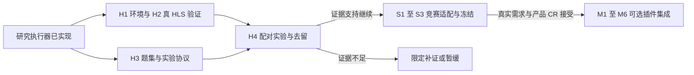

# Aervox 当前迭代计划

本文件是**当前项目迭代建议、排序、依赖和待决策项的唯一权威入口**。维护字段、状态、分支协调与归档规则见[计划治理](docs/reference/document-governance.md#31-当前迭代计划的唯一入口)；产品范围见 [PRD](docs/reference/PRD.md)，决策见 [ADR/CR](docs/reference/adr/README.md)，实现与发布证据见[追踪基线](docs/reference/REQUIREMENTS_TRACEABILITY.md)。计划的优先级不改写这些契约，也不自动批准所有条目实施。

## 1. 本轮目标与起点

本轮建议聚焦“可信的本地执行底座 + 可验证的插件生命周期 + 配套设备方向选择”。继续采用本地单用户 SQLite 和模块化单体，先处理已确认的正确性问题，再以固定负载决定性能优化是否值得。没有测量依据时不启动数据库替换、全局单写者或整体微服务化。

当前工作状态只读 §2 生成表。历史评估保留在[架构评估](docs/explanation/architecture-implementation-review.md)，不能将其中的“尚未实现”直接当作当前缺陷。2026-10-08 审计已核实 ITER-038 随 PR #247 合入并同步队列；本次文档收敛由 ITER-049 承接，后续获授权的行为修复与验证由 ITER-050 承接。

认领时写明责任、分支与状态，最多同时在制三个工作包。建议条目不代表实施授权，已移交不等于 Released。涉及新合同先完成 CR；无日期承诺不推算截止时间。设备与移动决策见 §3，HLS 的真实验证、冻结和有条件产品化见 §4.1。

## 2. 当前建议工作

下表是唯一活动队列，**由 `docs/_meta/plan-queue.json` 渲染生成**（改条目请改真源后运行 `mise tasks run plan-render`，校验见 `plan-check`）。每行“建议”表示尚未开工；“依赖”约束实际启用/交付顺序，前置设计与测试夹具可并行。证据编号 `FND-*` 与 `ARC-*` 均见[架构实现与演进评估](docs/explanation/architecture-implementation-review.md)（FND 已并入其 §9），不创建另一份问题正文。

<!-- plan-queue:begin · 本区由 `mise tasks run plan-render` 从 docs/_meta/plan-queue.json 生成，请勿手改 -->

### 2.1 第一批：正确性、验证入口与方向决策

| 条目 / 状态 | 最小交付与依据 | 依赖及 CR 门槛 | 完成判定 | 建议责任（待认领） |
|---|---|---|---|---|
| ITER-001 · 已移交 | 冷 CI、插件产物恢复与可重现验证；ARC-14/FND-10；CAP-020。 | 已移交切片；新范围另按现行需求与 CR 门槛评审。 | 切片验收见 [PR #221](https://github.com/3yearsZhuang/Aervox-harness/pull/221)；适用限制见本条移交摘要。（校验：scripts/ci-scope.test.mjs；scripts/export-plugins.test.mjs） | quality/release（分支 `fix/iter-001-ci-verification-entry`；冷检出、包外输入触发与产物重建均有证据。） |
| ITER-002 · 已移交 | 可靠接单剩余差量：Inbox 确认、Turn/Outbox 与 Attempt 的原子接单或可重放恢复；ARC-01；CAP-007。 | PR #228 的消费隔离、死信与已有 Attempt 恢复保留；修改接单或重放合同先 CR。 | 切片验收见 [PR #265](https://github.com/3yearsZhuang/Aervox-harness/pull/265)；适用限制见本条移交摘要。（校验：`packages/repositories/test/turn-acceptance.test.ts`；`apps/api/test/conversation-dispatch-resilience.test.ts`；`packages/host-agent/test/subagent-executor.test.ts`） | platform（分支 `fix/iter-002-orphan-turn-recovery`；2026-10-09 收口：原子接单与幂等由 PR #258 交付（Turn/消息/Outbox/首个 Attempt 单写者事务 + 五写点故障注入与并发回归）；本轮补「Turn 已提交而首个 Attempt 从未创建」的孤儿 Turn 恢复（recoverOrphanTurns → Interrupted + done，不自动重放，接入 Worker 恢复周期）与子任务委托原子接单 + 崩溃重试复用。适用限制：subagent_runs 行自身的中断恢复与跨进程同幂等键的 HTTP 语义不在本切片，重复副作用仍由唯一索引兜底。） |
| ITER-003 · 建议 | 删除效果与召回资格：先做 Memory 及其索引的完整清理/独立验证切片，检查期限、用途、撤权与 Restricted；ARC-06/08；CAP-005/013/027/033 | 已有隐私契约的修复先做；扩大删除范围或改变保留/恢复语义先 CR；失败继续拒绝受影响范围 | completed 有可重做的清理证据；空目标有明确依据；失败/未知不解闸；混合夹具越权结果为零 | data/privacy（2026-10-08 ITER-050（PR #258）交付显式 Memory 目标清理/独立验证、失败不解闸与迟到索引/压缩副本阻断；ITER-051（PR #259）补自动召回期限/敏感度资格检查；范围解析、用途/授权修订、恢复账本与全来源传播仍保留。） |
| ITER-004 · 已移交 | 三个独立修复：消息版本短事务/CAS，Config 与同库 Secret 一致提交，会话锁尾链回收；ARC-07、FND-02/07；CAP-013/020 | 不引入全局通用事务框架；外部 Secret 补偿或历史数据转换单独评审 | 故障仅留完整旧/新版；同 revision 最多一次成功；409 不改 Secret；一万个 key 完成后锁缓存清空（校验：packages/repositories/test/message-edit-atomic.test.ts；packages/repositories/test/plugin-config.test.ts；apps/api/test/plugin-config.test.ts；packages/repositories/test/session-lock.test.ts） | data（分支 `docs/repository-audit-and-docs-slimming`；2026-10-08 PR #258 合入：消息短事务/CAS、同库 Config/Secret 一致提交与会话锁尾链回收均有故障/并发回归；外部 SecretStore 不在范围；PR #259 的重叠实现按已合入版本收敛。） |
| ITER-005 · 暂停 | 插件可恢复升级：全部入口校验、展开配额、staging 验证与激活、旧配置/Secret/授权保留；FND-02/04、插件规范；CAP-020。2026-09-18 追加差量：导出分发包可重现（细节见 §4.2 剩余差量，不在本表复述） | 激活依赖 ITER-004；限制资源可先做；升级/卸载状态和迁移语义先 CR | 成功意味着全部声明入口可用；超额包有界失败；任一安装阶段中断后可恢复完整旧/新版；同源码导出分发包的字节与校验和稳定 | ecosystem（分支 `docs/build-to-delete-pi-architecture-plan`；2026-09-28 CR-056 BTD-02 缺包保护切片：可用性独立于用户开关，新增兼容字段保留数据；原升级验收仍保留；2026-10-03 暂停让位 ITER-035；2026-10-08 ITER-051（PR #259）交付预检/解压配额与 Page 资源导出切片，staging 激活、完整元数据导出和升级回滚仍未交付。） |
| ITER-006 · 建议 | Page 与客户端认证：iframe source/nonce/会话/全部 capability、禁用撤权；附件 Bearer、合法预检与受限 Page 资源通道；FND-03、ARC-13；CAP-018/020 | 既有认证漏接可独立修；新页面凭据及 Origin 信任策略先 CR | 错误窗口/旧响应/无权/禁用访问无副作用；合法 Token 模式的 JSON、SSE、Page、附件可用，凭据不进入 URL | ecosystem/desktop |
| ITER-007 · 已移交 | 三个切片：父子任务/Driver 继承取消、截止、删除/授权修订与 local-only；执行时逐项核对 requiredPermissions/grants 的 scope/revision，由受信宿主映射 guarded/full_access 安全等级；动态工具 Schema 快照进入模型请求并在执行时重验；ARC-02/03、插件规范 §8.1；CAP-007/020/033 | 既有策略接线优先；动态工具开放依赖真实 grant/审批校验及最终输入容量检查；新根预算与 Driver/授权合同先 CR；进一步压缩与成本优化留 ITER-017 | 切片验收见 [PR #267](https://github.com/3yearsZhuang/Aervox-harness/pull/267)；适用限制见本条移交摘要。（校验：`packages/core/test/subagent-contribution.test.ts`；`packages/host-agent/test/subagent-executor.test.ts`；`apps/api/test/conversation-dsh.test.ts`；`apps/api/test/conversation-tool-sandbox.test.ts`） | platform/ecosystem（分支 `fix/iter-007-control-inheritance`；2026-10-08 复核更新：动态工具调用级 signal/controlContext（含 MCP 透传）已随 PR #257/#258 打通；每次实际模型调用（含重试/失败）的消息与工具 Schema 快照由 PR #259 补齐。2026-10-09 本轮收口：Workflow 取消句柄与中止上抛、子任务截止继承与失败原因透出、DSH 本地处理限制/删除闸门 fail-closed、写工具授权 toolVersion 与定义修订核对。适用限制：非 0 根预算与跨重启计量、Driver 合同（取消即进程 kill/能力声明/adapter 工具纳审批账本）、一次性授权与有效期仍留 CR。） |
| ITER-008 · 已移交 | 模型制品与进程：路径/symlink、响应与续传验证；启动 epoch、有界探针/日志/指标请求；ARC-11/12；本地模型基础设施 | 正确性修复可独立进行；制品来源/信任等级变化先 CR | 切片验收见 [PR #266](https://github.com/3yearszhuang/Aervox-harness/pull/266)；适用限制见本条移交摘要。（校验：`apps/api/test/model-runtime-downloader.test.ts`；`apps/api/test/model-runtime-llama-server.test.ts`；`apps/api/test/model-runtime-api.test.ts`） | platform（分支 `fix/iter-008-model-artifact-correctness`；2026-09-28 CR-056 BTD-04 模型 Driver 替换与代际生命周期已落地；2026-10-09 本轮补下载与进程正确性：文件名归一/根包含/symlink 拒绝、416/405 重取复查、206 偏移与实体校验（错位自愈重下）、流式前缀哈希、截断核对与体积/时长上限、autoStart 失败可见、代际归属与有界探针/日志/指标。适用限制：未持久化 ETag/If-Range、磁盘余量与默认时长策略、health-prober 就绪分级；信任摘要与计算摘要区分属制品信任等级变化，先 CR。） |
| ITER-009 · 建议 | 配套形态决策：比较九个硬件方向、电脑依赖、目标 OS、真实 Provider、成本和数据边界；同时登记移动端草稿待决策事项；CAP-001/012/018/025/030/033 | 本项仅探索与样本验证；不默认批准采购、SKU、固件、移动端顺序或工期 | 有候选比较、继续/暂缓证据和一至两个验证方向；明确 §3 的待决策项与 ITER-016 范围 | product-hardware/desktop |
| ITER-020 · 已移交 | HLS 竞赛验证规划；CAP-007/020/027。 | 已移交切片；新范围另按现行需求与 CR 门槛评审。 | 切片验收见 [PR #229](https://github.com/3yearsZhuang/Aervox-harness/pull/229)；适用限制见本条移交摘要。 | platform/docs（分支 `docs/hls-competition-validation-plan`；仅规划交付；真实验证与产品化见 ITER-021/022/043。） |
| ITER-021 · 建议 | HLS 竞赛可行性验证：规则/环境、真实双入口、公开题集与同模型配对报告；研究执行器已实施，详细剩余步骤见 [§4.1](#hls-plugin-delivery) H1～H4；关联 CAP-007/020/027（探索） | 研究范围已由 CR-057 接受；模型服务与 Vitis 镜像待配置；真实验收按 H1→H2→H4，H3 题集/协议可并行准备；只修实际复用路径 | 固定模型/镜像/目标环境后，真实裸跑和 Agent 可复现，正反 HLS 样例及隔离/杀停通过；开发/留出题按家族隔离，四组同配置、固定分母、独立样本、增益区间和成本齐全；官方未公开判定明确留缺；按专项 §6.3 形成继续、限定补证或暂缓结论，§4.2 登记后才整项移交 | platform/competition（分支 `feat/hls-agent-research`；2026-09-29 研究切片实施并通过双门禁（证据见 CR-057 / §4.2）；2026-10-05 移植合流到 main 内核 `@aervox/core`（core 270/270、HLS 合同 14/14）。本条目保持建议：H1～H4 真实环境验收未启动，模型/Vitis 未配置。） |
| ITER-023 · 已移交 | Build to Delete 与类 pi 架构规划；CR-056 历史材料见归档导航。 | 已移交切片；新范围另按现行需求与 CR 门槛评审。 | 切片验收见[交付证据](docs/reference/REQUIREMENTS_TRACEABILITY.md#42-落地实现登记)；保留本条范围与适用限制。 | platform/docs（分支 `docs/build-to-delete-pi-architecture-plan`；规划交付；后续实现与 ADR 差量由各自条目承接。） |
| ITER-030 · 已移交 | DSH、pi、AstrBot 固定版本更新与差异复评；CAP-007/020/027/033。 | 已移交切片；新范围另按现行需求与 CR 门槛评审。 | 切片验收见[交付证据](docs/reference/REQUIREMENTS_TRACEABILITY.md#42-落地实现登记)；保留本条范围与适用限制。 | platform/docs（分支 `docs/update-reference-upstreams-20260929`；仅参考更新及准入复评，不等于真实外部运行时已集成。） |
| ITER-031 · 已移交 | 标准工作台连续对话与雾蓝视觉重构；CAP-001/002/018。 | 已移交切片；新范围另按现行需求与 CR 门槛评审。 | 切片验收见 [PR #233](https://github.com/3yearsZhuang/Aervox-harness/pull/233)；适用限制见本条移交摘要。 | Codex（分支 `feat/workbench-frontend`；功能合入；交付证据见关联 PR。） |
| ITER-029 · 执行中 | 思隅 CLI 连接版首个切片：新增终端宿主 `@aervox/cli`（`siyu`）与 `@aervox/api-client/transport` 纯传输构建出口；提供单次问答、仅 TTY 连续会话、事件补读与终态等待、连接诊断、配置读写、JSON/JSONL 机器输出、Token 与幂等键、审批与用户问题、有界取消；CAP-002/007/020；CR-058 | 只消费本机 API 与共享传输层；不修改服务端路由、授权与恢复合同，不新增数据库 Schema，不引入中心化服务或独立宿主 | 打包产物在真实 API + 文件 SQLite 下完成受理/流式/终态、跨客户端与 API 重启的补读与续会话；非交互路径不自动批准工具；有界取消只在中断时触发，超时或失败不替用户取消已受理回合；架构拓扑、依赖边界与文档治理门禁通过，CLI 不反向依赖共享包，共享包也不反向引用 CLI 宿主（校验：`apps/cli/test/cli.test.ts`；`scripts/cli-smoke.test.mjs`；`packages/api-client/test/transport.test.ts`；`packages/api-client/test/projector.test.ts`；`scripts/import-boundary.test.mjs`） | Codex（分支 `feat/siyu-cli-attached`；2026-09-30 执行中：CLI 单次/连续会话、共享传输加固及端点测试通过；剩余会话详情/分页、模型配置入口及平台矩阵待补，保持执行中） |
| ITER-032 · 建议 | 保真上下文投影与真实摘要压缩：把 Turn 上下文装配改为「模型可见投影从权威历史重建」——先固化伴学必须保真的事实清单（当前学习目标、未解决错因、用户偏好、承诺及其来源），再以真实摘要替换规则压缩的占位文本（现默认关闭，仅保留首尾各两条并插入『已总结若干消息』说明，见 `packages/core/src/context-builder.ts`）；压缩按工具调用/结果组选择边界，超大结果不破坏配对；参考 PI-01 context_edit 投影设计（参考评估 §8.3）；CAP-002/005/007；对话质量基础设施 | 压缩不得伪造摘要或声称记得已压缩事实；模型可见投影不等于用户删除，删除仍须覆盖原文、摘要与索引；必须保真事实清单与压缩策略先评审，涉及对话契约差量先 CR；最终输入窗口验收与 ITER-007 协同、测量口径与 ITER-017 协同，不重复登记 | 固定长伴学对话夹具：压缩后学习目标、错因、承诺与来源保真可追溯，无占位文本；超大工具结果压缩不断开调用/结果配对；最终输入加预留输出不超 Provider 窗口，超额有明确有界处理；每次请求的模型可见上下文可从权威投影重建并复核，展示内容与持久历史分离、旧响应不覆盖终态（校验：`packages/core/test/context-builder.test.ts`；`packages/core/test/context-manifest.test.ts`） | platform/quality |
| ITER-034 · 已移交 | ControlContext、abortable 与 ApprovalPolicyPort 内核构件及 executor 接线；ITER-007/013。 | 已移交切片；新范围另按现行需求与 CR 门槛评审。 | 切片验收见 [PR #241](https://github.com/3yearsZhuang/Aervox-harness/pull/241)；适用限制见本条移交摘要。 | platform（分支 `feat/core-control-approval`；构件现位于 packages/core；生产宿主控制传播仍按关联条目核验。） |
| ITER-035 · 已移交 | 建立独立 @aervox/core、内存 HostToolRuntime、轻量出口与分层许可证；ADR-021。 | 已移交切片；新范围另按现行需求与 CR 门槛评审。 | 切片验收见 [PR #244](https://github.com/3yearsZhuang/Aervox-harness/pull/244)；适用限制见本条移交摘要。 | platform（分支 `feat/core-standalone`；过渡壳已在 ITER-037 移除。） |
| ITER-036 · 已移交 | 伴学 Prompt、工具契约与宿主 guidance 迁出内核，收窄内核导出面；ADR-021。 | 已移交切片；新范围另按现行需求与 CR 门槛评审。 | 切片验收见 [PR #245](https://github.com/3yearsZhuang/Aervox-harness/pull/245)；适用限制见本条移交摘要。 | platform（分支 `feat/core-companion-extraction`；内核通用交互与扩展机制保留；业务实现归属宿主/插件。） |
| ITER-037 · 已移交 | 移除 agent-loop/cli-approval 过渡壳，下游直连 core，内核类型自持与边界守卫；ADR-021。 | 已移交切片；新范围另按现行需求与 CR 门槛评审。 | 切片验收见 [PR #248](https://github.com/3yearsZhuang/Aervox-harness/pull/248)；适用限制见本条移交摘要。 | platform（分支 `feat/core-shell-removal`；以主线合并 PR #248 为证据；原队列 #246 待合并说明已失效。） |
| ITER-038 · 已移交 | Provider stopReason 归一与输入/输出 usage 分账；ITER-033 拆分切片。 | 已移交切片；新范围另按现行需求与 CR 门槛评审。 | 切片验收见 [PR #247](https://github.com/3yearsZhuang/Aervox-harness/pull/247)；适用限制见本条移交摘要。 | platform（分支 `feat/core-provider-contract`；2026-10-08 按主线证据修正状态（PR #247 已合入）；终态消费与缓存分账留 ITER-039。） |
| ITER-041 · 已移交 | 拆分 executor 流式收集、工具管线与终态收口，统一审批裁决。 | 已移交切片；新范围另按现行需求与 CR 门槛评审。 | 切片验收见 [PR #249](https://github.com/3yearsZhuang/Aervox-harness/pull/249)；适用限制见本条移交摘要。 | platform（分支 `refactor/core-executor-split`；终态命名后续由 ITER-042 完成；保留公开端口、SSE 与持久化契约。） |
| ITER-042 · 已移交 | ExecuteResult interrupted 与 AttemptStatus 对齐，保留 reason；持久化枚举不变。 | 已移交切片；新范围另按现行需求与 CR 门槛评审。 | 切片验收见 [PR #251](https://github.com/3yearsZhuang/Aervox-harness/pull/251)；适用限制见本条移交摘要。 | platform（分支 `refactor/core-interrupted-status`；交付项③已完成，不再要求重复实施或另立同内容 CR。） |
| ITER-044 · 已移交 | 2026-10-08 Core 审核整改第 1/5 迭代：执行正确性收口。修复审批等待后的取消/租约竞态、模型截断工具执行、父子控制传播和 next-step Inbox 丢失；结构化工具超时原因；原队列相关范围：ITER-007/ITER-039 | 用户于 2026-10-08 授权五迭代实施；保持本地单用户、现有部署及持久化枚举；新恢复/Provider 合同先登记 CR；公开 npm 发布和生产换库不在本轮 | 取消后不启动新工具；截断批次无副作用；子任务继承控制；模型实际收到 steer（校验：`packages/core/test/audit-regressions.test.ts`；`packages/host-agent/test/subagent-executor.test.ts`；`apps/api/test/tool-approval-policy.test.ts`） | platform（分支 `fix/core-audit-five-iterations`；2026-10-08 PR #257 评审补齐动态贡献工具审批：清单同步安全规格，未知、撤回及刷新失败拒绝派发；静态/动态审批回归通过，完整双门禁与远端检查后合并。） |
| ITER-049 · 已移交 | 项目代码质量、仓库卫生与文档多源偏移审计；收敛入口规则、当前实现和历史证据，压缩重复叙述。 | 本次授权覆盖审计与文档整理；行为修复按已有条目另行实施，保留契约、稳定锚点及发布门槛。 | 审计证据、净缩减与双门禁见 [PR #258](https://github.com/3yearsZhuang/Aervox-harness/pull/258)；本项不宣称行为修复或生产发布完成。（校验：mise tasks run ci-code；mise tasks run ci-docs） | Codex（分支 `docs/repository-audit-and-docs-slimming`；2026-10-08 审计与文档瘦身交付见 PR #258；后续用户授权的代码切片由 ITER-050 承接。） |
| ITER-050 · 已移交 | PR #258 审计发现落地：删除效果验证、原子接单/组合写入、动态工具取消、取消恢复、锁回收与资产单源；关联 ITER-002/003/004/007/010/017。 | 用户已授权在本 PR 落实已接受契约下的修复；不扩展删除范围、不执行生产迁移，不启动架构替换。 | 切片验收见 [PR #258](https://github.com/3yearsZhuang/Aervox-harness/pull/258)；实施边界见审计 §10.2，不提升为 Released。（校验：`mise tasks run ci-code`；`mise tasks run ci-docs`） | Codex（分支 `docs/repository-audit-and-docs-slimming`；2026-10-09 核实 PR #258 已随 15a68e6c 合入；本条修复切片移交，剩余接单、删除范围与授权差量继续由关联条目承接。） |
| ITER-051 · 已移交 | 参考审计首批正确性修复：消息/配置原子写入、锁尾链回收、Memory 清理验证与召回资格、模型异常终止与逐调用快照、插件包预检；对应 ITER-003/004/005/007/039。 | 2026-10-08 用户明确授权按审计建议解决不足；既有合同正确性修复直接实施，新增生命周期或架构合同先 CR；真实用户研究和生产发布分别取证。 | 每个修复有故障回归与适用限制，代码及文档双门禁通过；交付按原条目逐项回填，未验证的外部效果和发布状态不提升（校验：packages/repositories/test/message-edit-atomic.test.ts；packages/repositories/test/plugin-config.test.ts；packages/repositories/test/session-lock.test.ts；apps/api/test/plugin-config.test.ts；apps/worker/test/deletion-worker.test.ts；apps/api/test/memory-recall-eligibility.test.ts；packages/core/test/model-terminal.test.ts；packages/core/test/context-manifest.test.ts；apps/api/test/plugin-distribution.test.ts） | Codex（分支 `fix/audit-trust-chain`；2026-10-08 首批切片合入：自动召回期限/敏感度资格、插件包预检/解压配额与 Page 资源导出、每次实际模型调用（含重试/失败）快照；与 PR #257/#258 重叠的删除、配置、消息、锁与 Provider 实现按已合入版本收敛，未重复计数。） |
| ITER-052 · 已移交 | 框架解耦审计整改：事件传输与平台能力注入、插件实例生命周期、API 窄依赖、日记素材访问、内核提示词策略与边界守卫；CAP-002/007/018/020。 | 2026-10-09 用户授权继续解耦；遵循 ADR-014/016/021 与现行插件合同，保持本地 SQLite、HTTP/数据与权限语义；不执行生产迁移。 | 切片验收见 [PR #262](https://github.com/3yearsZhuang/Aervox-harness/pull/262)；适用限制见本条移交摘要。（校验：scripts/import-boundary.test.mjs；packages/api-client/test/transport.test.ts；plugins/focus-mode/test/ui-components.test.ts） | Codex（分支 `fix/framework-decoupling`；2026-10-09 自 main c9d92cbc：事件流并入 Transport（fetch/IPC 双实现，桌面主进程按 sender 归属与释放）、插件状态按上下文实例化且注销释放监听、模块消费改经公开窄 Port（边界例外清零）、日记素材抽 Port 且发布+版本+游标同事务、平台能力与提示词策略改宿主注入、边界守卫按类型解析且失败阻断；另修类型边界重复声明与 CR-030 端口命名。增量与全量门禁通过，PR #262。2026-10-09 核实 PR #262 已随 76319c26 合入；本轮切片移交，组合根注入无独立渲染用例等适用限制见 §4.2 登记，不提升发布状态。） |

### 2.2 下一批：恢复、生命周期与部署

| 条目 / 状态 | 最小交付与依据 | 依赖及 CR 门槛 | 完成判定 | 建议责任（待认领） |
|---|---|---|---|---|
| ITER-010 · 建议 | 先修 Resume 库覆盖/事件高水位/执行关联/接管；再接审批与答案续跑、撤权账本及恢复水位；ARC-04/06；CAP-007/027/033 | 依赖 ITER-002/003/007 的必要切片；续跑、一次性授权/有效期、跨库恢复和账本保留先 CR；不直接启用现有 Resume Host | 缺账本、多工具、跨进程答案、重复接管与旧备份恢复不重复副作用、不吞答案、不复活撤权；未知结果不盲重放；取消请求提交后进程退出，过期 CancelRequested 能以 fencing 收敛终态并结束重连流 | platform/data |
| ITER-011 · 建议 | 完整 Schema 迁移：排除 FTS shadow 表、真源重建；接线版本 journal、校验和、恢复状态；ARC-09；CAP-027 | 完整库失败夹具可立即补；迁移协调方案先评审，破坏性转换先 CR，生产操作另过门禁 | 每个支持旧版本升级、失败恢复、回滚通过；主库/Vault/账本归属明确；源库不受 staging 失败影响 | data/quality |
| ITER-012 · 建议 | 索引生命周期：dirty/reindex、来源修订、模型/维度版本、可切换投影；修可选回填旧列；中文固定语料；ARC-08；CAP-005/026 | 依赖 ITER-003；当前错误 SQL 可先修；投影切换和模型版本合同先评审，不能恢复旧隔离列 | 故障可追平；A→B→A 可切换；资格零越界；单列中文 Recall@K、空间、重建成本 | data |
| ITER-013 · 建议 | 有界运行和观测：Worker/Host drain、Provider 排队/取消、安全文本窗口、SSE 背压/分页、跨进程终态；复用 metrics；ARC-05/12、FND-05/06/09；CAP-007/018 | 依赖 ITER-002/008 的相关切片；先观测后定参数；跨进程通知/新隔离边界先 CR | 慢源/慢客户端和日志洪泛资源有界；停机有截止；已提交窗口提前可读；故障可定位 | platform/quality |
| ITER-014 · 已移交 | 公开 Port、MemoryStore 试点与实现退出演练；ARC-10；CAP-005/007/020。 | 已移交切片；新范围另按现行需求与 CR 门槛评审。 | 切片验收见 [PR #230](https://github.com/3yearsZhuang/Aervox-harness/pull/230)；适用限制见本条移交摘要。 | platform（分支 `docs/build-to-delete-pi-architecture-plan`；保留数据权利与恢复证据；不扩展生产发布结论。） |
| ITER-015 · 建议 | 单机部署主管：API/Worker/模型归属，数据目录、端口、Token、版本、就绪与退出；ARC-13；CAP-001/018/027 | 依赖 ITER-006/008 与 ITER-011/013 的必要部分；新主管先 CR；与移动端决策协调 | 干净用户目录安装、升级、异常退出、端口占用、磁盘满、卸载保留数据均验证；签名/公证/平台矩阵另过发布门禁 | desktop/release |
| ITER-016 · 建议 | 已选方向单设备 PoC：真实能力样本，模拟器与一块开发板，身份/ACK/幂等/截止/撤权/热插拔；硬件评估；复用所选 CAP | 依赖 ITER-009 决策；先设备 CR/ADR/单一协议；音频/OCR 先证明真实产物；独立算力盒额外依赖 ITER-015 | 设备缺席不破坏核心流程；获得五至十人使用记录及方向对应价值证据；不把接口响应当实物成功 | product-hardware/platform |
| ITER-026 · 待评审 | 伴学业务与会话执行器深度解耦插件化：宿主去领域化——CAP-002/007/016 的实现全部内聚于 `plugins/focus-mode`，宿主只保留通用扩展接缝（插件自有状态、出站 metadata 透传、插件流事件订阅、卡片槽位预设、设置与 Composer 贡献、工具与路由贡献）；清除 Turn 协议失效刷题字段与 `study-mode`/`quiz-mode` 历史别名；内核 `@aervox/core` 出口去除产品域提示词与刷题工具（对齐 Apache-2.0 分层）；建立宿主纯净性棘轮守卫与插件可移除目标（BTD-11，移除演练通过）；CR-060（Accepted / Implemented）；CAP-002/007/016 | 学习闭环为 P0 且属学习事实真源，按 AVX-CAP-001 反向检查保留主仓，故不新增 ADR、不转自选模块、不新建 `modules/*` submodule；不修改 learning 表结构与 CAP-003/004/006 端点；破坏性契约变更（`streamEventTypeSchema`、`@aervox/ui` 发送选项、`@aervox/core` 出口）先落 CR-060 并同步 OpenAPI 生成；插件实现目录不得进入分发包；代码缺席须保留安装记录、配置与数据管理入口 | 宿主（apps/api、apps/worker、apps/web、apps/desktop、packages/ui、packages/api-client、packages/core）零 domain 命中：check-host-domain-purity 零违规且豁免清单已清空，规则已覆盖 B9 迁出的全部样式类名（该守卫为字面量黑名单 + 棘轮：新增领域词汇须同步扩规则，已按此办理）；物理删除 plugins/focus-mode 的实现目录后宿主仍可编译运行，且保留安装记录、配置与数据管理入口：run-removability-drill 三相位通过（API/Worker 冷构建 + 被剥离的 Web/桌面组合根 typecheck）；分发包只含 plugin.manifest.json / config.schema.json / SKILL.md，SHA-256 仍字节可重现；别名体系整体删除（ServerTurnPlugin.aliases、注册表别名映射与候选 id 探测循环），插件 id 唯一；刷新前旧配置由插件自行一次性迁移至 pluginState 命名空间，不静默丢失；插件禁用时模型工具面不含 record_practice_attempt，/v1/terms/explore 不再注册；@aervox/core 公共出口不含产品域提示词与刷题工具；Web 与桌面组合根的插件注入经编译校验（移除演练的 Web/桌面 typecheck 相位）；宿主通用接缝有渲染回归（standard-workbench 用通用插件桩），组合根注入当前无独立渲染用例（校验：`scripts/check-host-domain-purity.test.mjs`（零命中、零豁免）；`scripts/check-removable-implementation.test.mjs`（focus-mode-plugin / BTD-11 / 移除计划 / 剥离正则命中 / 实现清单与磁盘对齐）；`scripts/run-removability-drill.mjs`（三相位，含插件整包移除与 Web/桌面 typecheck）；`scripts/export-plugins.test.mjs`；`apps/api/test/focus-mode-loop.test.ts`；`apps/api/test/study-term-plugins.test.ts`；`apps/api/test/plugin-bundle-allowlist.test.ts`；`packages/core/test/context-builder.test.ts`（提示词内容负向断言）+ `scripts/check-type-boundary.test.mjs`（插件目录纳入扫描根）；`packages/contracts/test/plugin-api-registry.test.ts`（路由冲突/非法路径/投影归属/重置生效负向断言）；`packages/api-client/test/projector.test.ts`（内核事件不下发插件通道）；`packages/ui/test/ui-registry.test.ts`、`packages/ui/test/workbench-startup.test.ts`；`plugins/focus-mode/test/plugin-registration.test.ts`；`packages/ui/test/standard-workbench.test.ts`） | platform/ecosystem（分支 `feat/iter-026-focus-mode-decoupling`；2026-10-03 立项：CR-060 提出（审计基线 169720c，确认 43 个宿主文件含专注模式领域知识）；前置门禁缺陷修复随 3ede34e 独立交付。实施完成 S1–S7：服务端实现（回合切面/术语管线/作答工具/端点/回放夹具）迁入插件包并去宿主硬装配；宿主服务窄端口与装配点唯一实现点建立；内核与共享复习包去产品域内容；插件 API 契约改由登记表扩展；前端接缝通用化（pluginState / pluginEvents / metadata 透传 / applySlotPreset / plugins 注入 / 两个新插槽 / fail-closed 运行时）；插件 UI 与专属样式物理迁入 plugins/focus-mode/src/ui；宿主纯净性棘轮收敛至零命中零豁免；移除演练（BTD-11）删除插件整包并剥离组合根引用后 API/Worker 冷构建通过。评审第二轮修正：专注模式普通发送失效（补变换器回传 metadata 接缝）、quietStartup 不可观测（宿主先 await 插件同步）、applySlotPreset 零调用（插件接续调用）、CR 文档 Vale 红灯、插件 OpenAPI 可劫持内核契约（独立注册表 + 冲突拒绝）、投影白名单失去归属校验（随工具贡献声明 + 宿主代登记）、回合与工具门控 fail-open（统一为 fail-closed，端点门控必填）、别名体系死代码与内核事件外泄、旧配置迁移归插件、check-type-boundary 覆盖 plugins、移除演练纳入 Web/桌面编译。B9 物理搬迁补齐：宿主主题 48 条插件专属规则迁入插件样式表（混合选择器就地拆分，迁出后宿主源码引用数归零）；useWorkbenchCards 的刷题/错题/学习规划状态机与每日一题入口迁入插件自有组合式函数（宿主 752→471 行，保留 CAP-006 复习结果提交）；纯净性样式规则扩至该词汇并保持零豁免；补宿主侧「不再暴露已迁字段」断言与插件侧状态机行为用例。评审第三轮修正：插件端点诊断留痕（warn 与门控同列必填，失败不再静默 500）、复习结果保存失败恢复用户可见提示、槽位预设恢复同步落盘、消息 metadata 键冲突改高优先级胜出、插件学习状态机绑定改 shallowRef 并支持显式解绑、initFocusModeState 初始化标记移至容器守卫之后、清理遗留别名用法与外链 noreferrer。2026-10-03 已开 PR #250 待评审合入。） |
| ITER-027 · 待评审 | 多进程 SQLite 写入并发与 Worker 自适应退避：消除高频空轮询，流式会话写入期间后台任务自适应降频与 IPC 唤醒；ARC-05/FND-07；基础设施 | 依赖 ITER-002 的 Outbox 消费修复；不破坏 WAL 模式快照隔离与单写者约束 | API 执行多轮密集对话与流式写入期间，Worker 自动退避至 3s+ 低频轮询，写锁冲突率降至 0；探索基于本地 Domain Socket 或命名管道的事件驱动触发式唤醒，替代持续空写轮询；长周期运行与压测下无 SQLITE_BUSY 报错与 P99 延迟抖动（校验：`apps/worker/test/outbox-worker.test.ts`；`apps/worker/test/worker-concurrency-backoff.test.ts`；`apps/worker/test/worker-host.test.ts`；`packages/repositories/test/worker-ipc.test.ts`；`packages/repositories/test/turn-store-begin-contention.test.ts`；`packages/repositories/test/client-self-heal.test.ts`；`apps/api/test/worker-pressure-lease.test.ts`；`apps/api/test/conversation-dispatch-resilience.test.ts`） | platform/data（分支 `feat/iter-027-028-sqlite-worker-p2p`；2026-09-29 落地 IPC 唤醒、Worker 写入压力退避、API 侧压力租约与客户端连接自愈；并发与恢复单测全绿。2026-10-02 长周期压测补证（drill:worker-contention，10 分钟×2 轮）：真实单用户节奏（1 写入者 @1s）下验收 1/3 字面达成——写锁冲突率 0（0 换连接）、0 逃逸 busy、0 污染、退避全程生效（轮询 min 5297ms / p50 6005ms）、P99 10.5ms 无抖动、outbox 无积压完整性 OK；双写入者 @200ms 极端持续负载（≈每分钟 570 轮，超出单用户真实负载）下 0 逃逸错误、0 污染、P99 稳定 15.2ms，但存在被自愈吸收的冲突（640 次换连接）与 outbox 吞吐上限（487 条积压，生产 9.6 事件/s 超压力模式消费 8.75 事件/s），属负载边界行为而非锁错误，保持待评审） |
| ITER-033 · 建议 | 统一模型 Provider 抽象面：收敛两套模型接入栈——`@aervox/core` 的 OpenAI 兼容 Provider（对话路径，`src/openai-compat-provider.ts`；原 `@aervox/agent-loop` 过渡壳已移除）与 `apps/api` model-runtime 的 Driver SPI（本地 llama 侧车）；补齐统一 Provider 目录与代际注册、跨栈一致的 stop reason 归一与 usage 分账（复用 T-10）、跨 Provider 上下文交接与标准化测试 Provider；收敛 BTD-04 剩余 `Llama*` 类型泄漏，为多模型路由与成本治理铺路；参考 PI-01 `packages/ai` 设计（参考评估 §8.3）；CAP-002/007；本地模型基础设施 | 保持本地单用户与不出网红线：Driver 缺省仍为 unavailable 明确拒绝，受限本地任务缺合规 Provider 时不静默转远程；新增远程 Provider、改变制品信任等级或合并两栈持久化语义先 CR；不引入第二套 Provider 注册表真源；与 ITER-008 下载/进程正确性协同 | 同一 Fake/Replay Provider 轨迹下，对话与本地模型两条路径产出一致的规范化终止语义与 usage 分账（对照 provider-parity 表）；新增一个 OpenAI 兼容端点 Provider 仅需注册与目录声明，无需改动执行器、路由或宿主装配；临时检出移除 llama 具体实现后核心构建与数据权利回归通过（复用可移除性演练口径）；Driver 关闭与迟到启动语义保持 BTD-04 验收（校验：`packages/core/test/provider-parity.test.ts`；`apps/api/test/model-runtime-driver-spi.test.ts`） | platform（2026-10-03 拆分登记：补全契约归一（stopReason/usage 分账）先行落 ITER-038；剩余项——统一 Provider 目录与代际注册、length/content_filter 终态消费行为、api-client Llama DTO 命名收敛——维持本条目，实施前按 gate 先立 CR） |
| ITER-039 · 已移交 | 内核对标增强（PI-01 pi-ai 对比结论，2026-10-03 内核自查）：①截断 fail-closed——executor 消费 `ModelStopReason=length`，截断 Step 的工具调用整批拒绝升级为可执行（含参数不完整拒绝），补 Provider 边界坏响应夹具；②usage 缓存/成本分账——`ModelUsage` 扩展 cacheRead/cacheWrite（OpenAI prompt_tokens_details.cached_tokens 透传），为 ModelRun 埋点与成本治理铺路（对应 T-10） | 不新增 Provider 与依赖；截断 fail-closed 属安全收敛（更严格方向），length 终态 isFinal 行为变更需同时更新 executor Step 终止测试；不引入 pi 运行时代码（自研重写） | length 截断 Step 的 toolCalls 全部 fail-closed 且有坏响应夹具测试（含部分 JSON 参数）；缓存分账字段在 include_usage 端点透传并有测试；executor/ModelRun 无回归（校验：packages/core/test/openai-compat-provider.test.ts；packages/core/test/executor.test.ts；packages/core/test/model-terminal.test.ts；packages/core/test/context-manifest.test.ts） | platform（分支 `fix/core-audit-five-iterations`；2026-10-08 随 PR #257 合入：截断/异常终态整批拒绝与 usage 缓存分账（cached_tokens / cache_creation_input_tokens）透传；PR #259 的对应实现与 #257 重叠，按已合入版本收敛。） |
| ITER-040 · 建议 | 标准化测试 Provider 与重试面（PI-01 对比结论）：①收敛 replay/scripted/adapter-sim/mock 四套测试桩为带能力声明的标准 faux 型 Provider（声明 reasoning/toolCalls/多模态支持），作为 provider-parity 标准夹具；②可选注入的 Provider 重试面（有界次数+指数退避+jitter+可重试错误分类：429/5xx/overloaded 与配额/计费错误区分），与宿主 CR-034 降级阶梯协同而非替代 | core 运行时零依赖不破坏；重试面为可选注入（默认关闭），不与宿主降级阶梯形成双真源（core 重试单请求内、宿主降级跨 Provider）；不新增 Provider | 标准测试 Provider 有能力声明且 parity 测试经其驱动；四套测试桩收敛或明确各自存续理由；重试面有错误分类与退避测试；默认关闭时现有行为零变化（校验：packages/core/test/provider-parity.test.ts） | platform（2026-10-03 建议：内核与 pi-ai 全面对比后立项（来源 PI-01 faux provider 与 retryAssistantCall 设计）） |
| ITER-045 · 已移交 | 2026-10-08 Core 审核整改第 2/5 迭代：工具运行时与合同收敛。API 复用 core HostToolRuntime，保留 SQLite 注册表和业务授权；跨内存/API 适配验证门控、撤权与取消；原队列相关范围：ITER-007/ITER-040 | 用户于 2026-10-08 授权五迭代实施；保持本地单用户、现有部署及持久化枚举；新恢复/Provider 合同先登记 CR；公开 npm 发布和生产换库不在本轮 | 缺门控/已取消调用不进入 handler；同一工具生命周期合同在两种宿主通过（校验：`packages/core/test/host-tool-runtime.test.ts`；`apps/api/test/tool-runtime-lifecycle.test.ts`） | platform（分支 `fix/core-audit-five-iterations`；2026-10-08 五阶段实现与本地完整门禁通过，PR #257 移交评审；恢复默认关闭，公开发布另行决策） |
| ITER-046 · 已移交 | 2026-10-08 Core 审核整改第 3/5 迭代：上下文与有界流式。动态工具受权快照、最终请求容量检查、工具组完整压缩、有界安全正文窗口与静默源取消；原队列相关范围：ITER-032/ITER-013 | 用户于 2026-10-08 授权五迭代实施；保持本地单用户、现有部署及持久化枚举；新恢复/Provider 合同先登记 CR；公开 npm 发布和生产换库不在本轮 | 模型工具清单与执行权限一致；超窗派发前拒绝；工具调用/结果成组；结束前窗口可见且取消有界（校验：`packages/core/test/context-builder.test.ts`；`packages/core/test/step-collector.test.ts`；`apps/api/test/conversation-tool-loop.test.ts`） | platform（分支 `fix/core-audit-five-iterations`；2026-10-08 五阶段实现与本地完整门禁通过，PR #257 移交评审；恢复默认关闭，公开发布另行决策） |
| ITER-047 · 已移交 | 2026-10-08 Core 审核整改第 4/5 迭代：恢复与 Provider 合同。修复 Resume 完整账本/最新意图/事件高水位并验证宿主接线；统一模型能力、终止与用量合同；原队列相关范围：ITER-010/ITER-033 | 用户于 2026-10-08 授权五迭代实施；保持本地单用户、现有部署及持久化枚举；新恢复/Provider 合同先登记 CR；公开 npm 发布和生产换库不在本轮 | 最新意图与账本/事件完整对应才可续；本机结果恢复显式启用且不派发新工具；未知结果/删除均拒绝；Provider 能力与缓存用量可验证（校验：`packages/core/test/resume-decision.test.ts`；`packages/host-agent/test/sqlite-resume-source.test.ts`；`packages/core/test/provider-parity.test.ts`） | platform（分支 `fix/core-audit-five-iterations`；2026-10-08 五阶段实现与本地完整门禁通过，PR #257 移交评审；恢复默认关闭，公开发布另行决策） |
| ITER-048 · 已移交 | 2026-10-08 Core 审核整改第 5/5 迭代：性能基线与发行边界。建立首段可见/取消/缓冲内存与 SQLite 写竞争可复跑基线；整理 core 稳定公共出口及兼容说明；原队列相关范围：ITER-017/ITER-027 | 用户于 2026-10-08 授权五迭代实施；保持本地单用户、现有部署及持久化枚举；新恢复/Provider 合同先登记 CR；公开 npm 发布和生产换库不在本轮 | 基准可复跑且资源有界；工作区消费者构建通过；包入口合同和 headless 冒烟通过（校验：`scripts/run-headless-agent.mjs`；`scripts/worker-write-contention-drill.mjs`；`packages/core/test/contract.test.ts`；`scripts/benchmark-core.mjs`；`packages/core/test/public-api.test.ts`） | platform（分支 `fix/core-audit-five-iterations`；2026-10-08 五阶段实现与本地完整门禁通过，PR #257 移交评审；恢复默认关闭，公开发布另行决策） |

### 2.3 后续候选：只有证据成立才投入

| 条目 / 状态 | 最小交付与依据 | 依赖及 CR 门槛 | 完成判定 | 建议责任（待认领） |
|---|---|---|---|---|
| ITER-017 · 建议 | 测量后分别决定 Prompt 预算/保真压缩、SQLite 写竞争、向量 topK、计算隔离和资产归属；FND-07/08/10、ARC-05/08/12；相关基础设施 | 依赖正确性修复与 ITER-013 指标；全局单写者、独立执行进程、二进制索引扩展先 CR | 同设备同数据报告延迟分位数、失败率、内存和质量；未达收益门槛即可停止；不承诺未测倍数 | platform/data/quality |
| ITER-018 · 建议 | 第二终端检验共享生命周期，再决策 PCB/结构/电源、样机和小批验证；硬件评估 | 依赖 ITER-016 价值成立；新增无线、电池、采集或运动能力分别评审，不因 PoC 成功自动批准量产 | 两种终端无需复制宿主；更新/回滚/删除可测；24→72 小时稳定性、功耗温升、密钥/追溯/维修验证；发布单列 | product-hardware/release |
| ITER-019 · 建议 | 是否开放第三方可执行插件；若开放，按已接受 [ADR-009](docs/reference/adr/ADR-009-electron-plugin-sandbox.md) 的进程外隔离、默认无权限与撤权要求设计 Host、签名信任根、SDK 与依赖解析 | 先证明声明式/第一方扩展不足，再用 CR 明确实现差量与生命周期；隔离基线不作为自由选项，改变基线须显式 CR；现行规范不代表运行能力已实现 | 有明确用例、威胁与成本比较，并通过 ADR-009 的拒绝/撤权/隔离/兼容验收；未选定前不建通用平台 | ecosystem/security |
| ITER-022 · 建议 | HLS 参赛方案扩大验证与冻结提交：正式评分 ABI、最终 32 GB 环境、离线包与复现报告；详细步骤见 [§4.1](#hls-plugin-delivery) S1～S3；AVX-EXPL-013 P3 | ITER-021 证据支持继续且正式范围/必要 CR 已评审；先取得最新细则与提交窗口；本项不自动包含产品化、微调或硬件采购 | 正式入口与评分/反馈边界适配，官方完整分级判定及独立 pass@1/pass@5 可追溯；最终目标环境满足显存与时间预算，另一队员在干净环境断网复现双入口，冻结哈希一致；提交包、依赖/模型/技能声明、失败与成本报告完整；实际赛事提交按窗口与用户授权执行，产品化另归 ITER-043 | platform/competition |
| ITER-028 · 待评审 | 纯本地多端点对点加密同步探索：局域网发现（mDNS）、SQLite Changeset 增量对齐与去中心化数据同步；CAP-018/027；CR-030/CR-055 | 坚决不引入中心化多租户云端数据库；同步前必须通过端到端加密与用户显式配对授权 | 完成多设备同网发现 PoC（UDP 多播信标 + 静态对端兜底）与承诺-揭示零信任配对（Ed25519 身份签名、SAS 绑定完整 transcript、分向密钥与重放/乱序/篡改拒绝），替代原 TLS 证书配对设计；以行时间戳水位线 + 显式墓碑提取增量 Changeset（替代原 SQLite Session Extension 设计），验证无冲突双向合并与对抗性缺陷回归（接收端白名单、漂移行隔离、墓碑四向裁决）；移动端（Capacitor）与桌面端（Electron）局域网直连同步学习进度与错题本成功（校验：`packages/repositories/test/p2p-pairing-security.test.ts`；`packages/repositories/test/p2p-changeset-merge.test.ts`；`packages/repositories/test/p2p-changeset-sync.test.ts`；`packages/repositories/test/p2p-discovery.test.ts`；`packages/repositories/test/p2p-lan-sync.test.ts`） | desktop/mobile（分支 `feat/iter-027-028-sqlite-worker-p2p`；2026-09-29 已完成：承诺-揭示零信任配对、设备身份 0600 落盘、分向密钥与 Changeset 引擎设计，含 UDP 多播信标发现、分帧传输与真实环回 socket 端到端，P2P 用例合计 69 项通过（见 p2p-local-sync-exploration.md §3.1）；真实 mDNS/DNS-SD、生产接线与真实多设备直连待后续推进。2026-10-02 验收重述裁定（轻量文档裁定，依据 p2p-local-sync-exploration.md §2.2/§3.1 技术论证，维护者复核）：验收 1/2 按实际实现重述——承诺-揭示配对替代 TLS 证书配对、行时间戳水位线替代 Session Extension；验收 3 保留原文，保持待评审） |
| ITER-043 · 建议 | HLS 可选插件产品化：独立模块、真实工具与权限接线、配置/工作台、数据责任及安装升级；详细步骤见 [§4.1](#hls-plugin-delivery) M1～M6；关联 CAP-007/020/027，新增能力编号待 CR | ITER-022 竞赛证据完整且有真实学习/调试需求；产品范围与独立 CR 接受后实施。仅复用 ITER-004/005/006/007/008/013 中所需子合同，关键权限/撤权/生命周期缺口先补齐；本轮只授权写规划 | 非核心实现独立子仓并经 modules/* workspace 包消费，主仓保留单一接口/受信装配，默认不激活且不复制研究内核；公开题导入→生成/验证→诊断→取消/复盘/导出端到端可用，工具声明有真实 handler，缺权限或撤权后无继续执行；安装/升级失败、禁用、缺包、卸载、重装与回滚可验证；实现缺席时产物仍可导出/删除，竞赛双入口回归不变 | platform/ecosystem（A 环境与发布、B HLS 与数据、C Agent 与交互；具体人员待认领）（2026-09-29 纳入有限候选，仅完成落成规划；2026-10-05 随研究执行器合流重登记（原占用的 ITER-029 编号已归属 CLI 条目）。未创建独立仓库、注册业务 CAP、接入产品插件或承诺工期。） |

<!-- plan-queue:end -->

未列入当前队列的长期 CAP 仍以 PRD 的生命周期路线和追踪基线为准，不视为取消。新发现先合并到已有条目或新增稳定编号，再决定是否进入当前批次；不要把旧文档中的所有未勾选项不加核验地搬进来。**发现只登记一次**：实现事实与剩余差量写进[§4.2](docs/reference/REQUIREMENTS_TRACEABILITY.md#42-落地实现登记)，本表只保留目标、门槛与验收，不复述细节。

## 3. 设备与移动端的待决策项

ITER-009 需要给出下面的可审阅结论，目前不替用户选定产品：

| 决策 | 建议起点 | 需要的证据 |
|---|---|---|
| 是否要求电脑关机后独立使用 | 先分别比较依赖现有电脑的配件与独立算力盒 | 典型使用时段、成本/能耗、维护能力与本地模型规格 |
| 首个硬件形态 | USB 桌宠、专注旋钮、电子纸卡可优先做低成本概念比较；语音/扫描由真实能力验证决定 | 用户价值、现有外设替代、Provider 真实性、无设备时流程完整性 |
| 移动端定位与平台 | 先明确配套端还是独立端，再决定 Android/iOS 顺序和版本范围 | 后台/权限限制、目标用户设备、打包与真实平台验收 |
| 同网连接与认证 | 明确发现、证书、设备凭据和撤销；不把同一 Wi-Fi 当作授权 | 当前 Token 与隐私契约中身份要求的差量及威胁评审 |
| 跨设备数据范围 | 普通资料与 local_only/混合来源严格分开 | 导出/同步授权、删除传播、离线期限与来源验证 |
| 第一版交互范围 | 从通知、图片、分享、只读复习中选择最小闭环 | 实际任务完成率与成本，不按接口数量决定范围 |

[CR-055](docs/reference/changes/CR-055-mobile-delivery-plan.md) 已纳入主仓，仍是 Proposed/Planned；平台顺序与工期仅为提案输入，具体取舍在本节维护。

## 4. 实施与移交建议

建议首先交付 ITER-001 的可重现验证入口，然后按独立故障路径建立修复 PR：接单/Outbox、删除/资格、模型文件边界可并行；每个 PR 只关闭能由对应夹具证明的问题。Config CAS、Page、工具发现和进程代际随后按依赖衔接。独立执行 Host、自动恢复、设备主管和新协议保持“先合同、后接线、再故障演练”的顺序。

开始每个条目前先核对其证据是否仍适用于当前 HEAD。提交内容至少包含：最小触发、修复行为、受影响契约、必要测试、回滚与剩余门禁。只改变既有行为的正确性修复可单独推进；涉及决策差量按[CR 工作流](docs/how-to/cr-workflow.md)处理。数据库破坏性操作继续采用[停写→备份→显式范围→staging→校验→换库→保留回滚包](docs/how-to/run-database-migration-drill.md)。

门禁遵循仓库现有流程：相关组件回归、依赖边界、构建/类型检查与文档校验；提交前双门禁，推送前全量终验。历史评估里已经暴露的冷 CI/生成物缺口应如实记录，不得通过删除测试或扩大 SQLite 测试并发来获得绿灯。

性能参数需在 [ARC 测量矩阵](docs/explanation/architecture-implementation-review.md#7-如何测量优化是否值得)规定的同设备/同数据实验中确定；真机、供应商、签名、迁移和发布演练单独记录。每项完成后先在[§4.2](docs/reference/REQUIREMENTS_TRACEABILITY.md#42-落地实现登记)写实现证据，再将计划条目标“已移交”并保留链接。

### 4.1 HLS 插件详细落成规划

本节是 ITER-021/022/043 在当前迭代中的执行分解，编号 H/S/M 只用于引用步骤，不建立第二份状态队列。认领、分支、启停和整项状态维护在 §2 的机器真源；完成证据维护在[追踪基线 §4.2](docs/reference/REQUIREMENTS_TRACEABILITY.md#42-落地实现登记)。赛规和实验原理见[专项规划](docs/explanation/hls-agent-competition-plan.md)，实际命令、产物与已完成测试见 [CR-057 §4～5](docs/reference/changes/CR-057-hls-local-agent-validation.md#4-回滚与交付记录)。

**实施起点**：已有 `scripts/hls-agent/` 的双入口、诊断、Vitis 容器适配、四组批跑和证据汇总，复用公开 Agent Loop（2026-10-05 起随内核迁移由 `@aervox/core` 承接）；已有本地合同测试，不重复搭建。下一缺口是真实模型/工具链验证。独立业务模块、产品工具注册、工作台和安装升级均未交付；本轮只把其路径规划完整。

#### 4.1.1 三人责任与执行方式

| 建议角色，具体人员待认领 | 主责 | 必须交叉复核的成果 |
|---|---|---|
| A：模型、环境与发布 | ROCm/推理服务、镜像、资源实测、模块版本与离线包 | C 从干净环境复现；B 复核 Vitis 版本/目标 |
| B：HLS、题集与产物 | 可综合 C++、公开测试、诊断归类、数据导出/删除验收 | A 复跑正反样例；C 检查题集隔离与指标 |
| C：Agent、权限与交互 | 执行协议、预算、统计、受信工具接线、配置与工作台 | B 抽查修复与评分轨迹；A 复核取消/清理及成本 |

H1 与 H3 的准备可以并行；H2 依赖可用环境，H4 依赖 H2/H3。三人可并行开发和审阅，GPU/Vitis 的重型测量初期串行运行，确认资源余量后再决定并发。产品阶段 M3/M4 仅在接口和权限合同固定后并行，避免先做页面再猜执行语义。

#### 4.1.2 ITER-021：真实验证与去留（H1～H4）

| 步骤 / 依赖 / 主责 | 具体工作与交付产物 | 完成判定 |
|---|---|---|
| H1 规则与环境；先行；A | 确认报名/提交窗口、云配额、反馈可见范围和正式评分接口；配置回环模型服务或显式 SSH 转发，锁定模型摘要/量化/上下文、驱动和本地 Vitis 镜像。补齐 `doctor` 以外的 GPU、峰值显存、许可、CPU/内存/磁盘配额证据 | 环境清单可复核，固定配置下模型有实际响应、Vitis 2025.2 可执行；未知官方条件有明确待办，不把探针成功当成全部验收 |
| H2 真 HLS 双入口；H1；B/C | 先用向量加法正反样例验证 C 仿真/综合，再加入语法错、测试错、不可综合、超时及越界读写样例；核对 `xczu3eg-sbva484-1-e` / 5 ns、只读测试与隔离挂载；执行 B0/A2 并归档原始报告 | 真实 EDA 判定与手工复核一致；裸跑只有题目、一次生成；Agent 反馈确实驱动后续候选；取消/超时后无继续执行或残留容器。当前缺少宿主磁盘配额，须在此补齐，模拟测试不抵扣真机验收 |
| H3 题集与实验冻结；可与 H1 并行，H4 前结束；B/C | 先覆盖向量、归约、滤波、矩阵等公开小核，再按预算组织探索题；固定来源/许可/题目哈希，按家族分开发与留出批次。登记 B0/A1/A2/C1 的同模型参数、调用/检查/时间上限、独立样本数、计时边界及 C1 资源匹配口径 | 私有测试/参考实现不进入模型或候选工作目录；不根据留出题失败持续调参；失败/超时/缺失均有预先固定的分母；实际 token 和字节预算分别记录 |
| H4 配对报告与决定；H2/H3；C，A/B 复核 | 先小批校验报告，再运行固定开发与留出批次；抽查候选/日志，报告分级结果、提升与退化题、配对区间、实际成本及冷/热启动限制。普通诊断、技能和独立采样分别做对照 | 按[专项 §6.3](docs/explanation/hls-agent-competition-plan.md#63-继续补证与暂缓)输出继续/限定补证/暂缓及理由；官方尚未公布的判定不伪造，公开开发结果与正式结果分列；§4.2 登记报告后才关闭 ITER-021 |

环境基本可用后，仍以 H1 约 1～2、H2 约 2～3、H4 约 3～5 个工作日作为首轮探索估算，H3 并行准备；三人可投入工时、云排队与许可等待尚未确定，不能据此承诺日历截止。原有本地执行器不重复计为新开发工作。题量可先参考 30～50 道探索预算，最终按 H2 测得成本缩放；外层计划运行数为“题量 × 独立样本数 × 4 组”，内部修复/检查另计。开发口径 `pass@5` 每题至少五个独立完整样本，样本不足只报告已有证据。

#### 4.1.3 ITER-022：竞赛适配与冻结提交（S1～S3）

| 步骤 / 依赖 / 主责 | 具体工作与交付产物 | 完成判定 |
|---|---|---|
| S1 官方接口适配；H4 支持继续且细则取得；B/C | 对照官方输入/输出、文件布局、采样、反馈及预算定义写薄适配；将可解析、可编译、通过测试、可综合逐级判定接入，保留失败原因；对照样例确认 `run.sh` / `run_baseline.sh` 行为 | 正式入口通过官方样例；B0 与 Agent 使用同一服务/权重/上下文配置，正式私有评分由外部评测层持有；现有内部 CLI 不冒充官方 ABI |
| S2 目标资源与离线复现；S1；A，C 复跑 | 在最终 32 GB 单卡环境测模型、上下文与运行显存峰值；对齐 ROCm/驱动及 CPU/内存/磁盘；预置许可允许分发的依赖，断网跑全流程并核对赛事计时范围 | 最终目标 GPU 有实测且满足预算；RX 9070 XT 或 W7900 上成功不替代最终环境；运行期无下载/远程模型，另一队员在干净环境复现双入口 |
| S3 固定方案与提交包；S2；A/C，B 抽查 | 冻结模型声明、技能、代码/镜像/锁文件、入口、题集声明和哈希；整理公平基线、完整分级 `pass@1/pass@5`、增益/不确定性、墙钟、失败轨迹及复现限制；演练重建与回退 | 冻结清单与提交包一致，隐藏评测期间无方案/权重/技能改动；没有正式评测记录不宣称通过。实际上传/提交按官方窗口和用户授权执行，产品发布仍需 M 阶段 |

S 阶段题量与工期在 H4 后用真实单题耗时、样本数、云配额及官方截止重新估算。环境或比赛窗口不能满足时保留研究工具与负结果，按队列规则记录原因，不以压缩验证代替正式条件。

#### 4.1.4 ITER-043：从研究执行器到可选插件（M1～M6）

产品候选聚焦“公开 HLS 练习/调试 → 生成与验证 → 错误解释 → 复盘与导出”。启动条件是竞赛证据完整、有具体使用需求和维护责任，且独立产品 CR 接受；本次写入计划不自动批准新的 CAP、仓库创建或产品实施。实现需遵循[能力组合规范](docs/reference/capability-composition.md#模块化交付不变量)和[插件契约](docs/reference/plugin-config-and-pages.md#9-验证与发布清单)，不能给现有脚本加一份 Manifest 就宣布插件完成。

| 步骤 / 依赖 / 主责 | 具体工作与交付产物 | 完成判定 |
|---|---|---|
| M1 范围与模块合同；S 阶段证据及需求成立；C/A/B | 收集可复核的学习/调试任务，决定首版范围、CAP、受信 Host、持久数据和维护者；建立产品 CR。明确独立子仓、`modules/*` workspace 包与版本锁定，选定单一 Port/Schema 真源、错误/预算/取消/数据责任，决定哪些研究代码迁移及过渡退出方式 | CR、能力验收与来源/许可证登记齐全；拟定模块名和接口名明确为待定；默认构建/启用策略固定，未启用不产生模型/EDA 运行成本；保持纯本地单用户与既有 SQLite 边界 |
| M2 独立实现与竞赛兼容；M1；C/B | 将 HLS 执行/诊断/评测实现迁入独立子仓，经 `modules/*` 与 workspace 公开入口消费；保留薄研究 CLI 兼容入口及合同回归；主仓负责稳定契约与受信装配，不复制第二套 Loop | 独立模块可构建/测试，主仓固定版本可消费；默认配置和未安装模块的启动均通过；移走模块后内核可启动；迁移前后同夹具的双入口、候选选择和统计口径一致 |
| M3 工具、权限与控制；M2，先补所需宿主合同；C/A | 通过现有扩展面声明并注册真实 handler，接入模型/EDA/目录权限与授权修订、任务启动/查询/取消、截止及检查配额；审计关联运行与产物。保留受限代码输入，不开放任意 Shell/宿主路径；复用 ITER-007/008 的适用接线 | 工具发现、调用和实际结果形成端到端链路；缺授权、错 scope、撤权、停用、旧实例回调均不可继续执行；取消后子进程/容器排空，权限声明或 Skill 文本不能代替执行前检查 |
| M4 配置与工作台；M3 接口稳定后可并行；C，B 验收 | `plugins/*` 承载配置、技能和 UI 声明；首选随宿主构建的受信 Vue 入口，接通环境/题目/进度/错误/候选差异/报告/取消/导出。若选择 iframe Page，先经 CR 扩展任务 Bridge 并验收 ITER-006，现有配置 Bridge 不提供任务执行；凭据使用 Secret 路径 | 能从产品界面完成一条真实公开 HLS 任务；未配置环境有可操作诊断，失败有真实状态；重连不重复提交、旧任务流不污染新任务；公开测试通过不显示为官方得分，未授权页面不能控制任务 |
| M5 生命周期与数据责任；M3/M4；A/B/C | 验证安装→启用→运行→禁用→缺包→恢复→卸载/重装；覆盖升级失败、资源配额、任务清理及回滚，复用已有 availability 机制及 ITER-005 的相关恢复切片；配置/Secret 一致性依赖 ITER-004 的必要切片。按 M1 合同落实题目/代码/轨迹/报告/缓存的保留、导出和显式删除 | 缺包保留数据和用户开关，恢复包不恢复已撤销授权；升级失败可恢复；实现缺席时仍可导出/删除产物；导出不含 Secret，删除覆盖派生副本且可重试，旧实例不能回写；破坏性数据迁移须另行演练 |
| M6 产品发布验收；M5；A/C，B 交叉复现 | 生成声明分发包和模块版本清单，完成模块测试、主仓边界/集成、默认不开启与选择性构建、冷安装、升级回滚及主机平台矩阵；复测冻结的竞赛入口；同步 PRD/CAP/追踪与使用说明 | 新成员可按文档安装并完成真实任务；最小权限、完整生命周期和导出/删除均有证据；子仓与主仓关联 PR 可追溯；产品交付状态按实际验收推进，不能用竞赛成绩替代 Released 门槛 |

M 阶段仅是有条件候选，工期在 M1 明确接口、宿主差量和数据范围后估算。ITER-004/005/006/007/008/013 是关联缺口来源；不要求先完成它们的所有无关工作，但上述验收需要的子合同必须先有通过证据。HLS 任务可能长时占用模型和 EDA，不能沿用研究工具的“只读”标签作为产品权限结论；工具安全等级、允许目录、许可访问与资源策略须由 M1/M3 明确。

#### 4.1.5 下一次接力与移交规则

下次实施从 H1 的环境接力和 H3 的公开题集准备开始：A 交付可用模型端点与镜像摘要，B 准备带预期结果的公开正反样例，C 固定配置/清单并复跑已有合同测试。环境仍不可用时，只推进题集、协议和静态验收准备，不登记真实通过率。

每个 H/S/M 步骤完成后立即在 §4.2 登记实际产物、验证和剩余差量，再更新队列与生成视图。若需要补证，先固定待验证假设、额外样本/费用上限和停止条件；若不满足继续条件，保留负结果并按队列规则记录暂缓原因。所有阶段都保留失败证据，不因进入下一阶段而覆盖已有实验或改变基线口径。

## 5. 同类材料清点与归并结果

此次清点覆盖 Git 文档、根入口、隐藏协作目录及已知移动规划工作树；外部 `reference/` 子模块仅作设计输入，产品学习计划代码不属于项目迭代计划。逐条去向已固定在各文档自身与[§4.2](docs/reference/REQUIREMENTS_TRACEABILITY.md#42-落地实现登记)，本表只保留分类结论，不再随收割增长。

| 材料类别 | 归并结论 | 当前入口 |
|---|---|---|
| 评估类：[底层与架构评估（FND/ARC，FND 已并入 §9）](docs/explanation/architecture-implementation-review.md)、[参考设计迁移](docs/explanation/reference-design-transfer.md)、[Agent Loop 计划](docs/reference/agent-harness-loop.md#15-分阶段落地计划)与历史记录（已归档至 Aervox-docs-archive）、[Web 方案](docs/explanation/web-implementation.md)、[主动智能方案](docs/explanation/proactive-intelligence-mode.md) | 保留源码、实验、风险与方案；撤去独立当前排期，历史优先级只作评估时的风险标签；已实现部分不重做，未接线部分核验后入队 | 队列见 §2；证据与来源见各评估文档自身 |
| 硬件与移动：[硬件方向](docs/explanation/companion-hardware-directions.md)、[ESP32 方案](docs/explanation/esp32-s3-hardware-extension.md)、[CR-055](docs/reference/changes/CR-055-mobile-delivery-plan.md) | 两份硬件方向版本合成为单一文档，ESP32 保留完整正文作器件级事实源；移动规划随收割移入 `main` 并登记（Proposed/Planned），其平台顺序与工期估算只作提案参考 | §3 待决策项；ITER-009、016、018 |
| 需求与决策权威：[追踪基线 §4.1](docs/reference/REQUIREMENTS_TRACEABILITY.md#41-建议交付批次与拆分原则)、PRD/SRS、ADR、CR、数据库与安全契约、覆盖矩阵、[治理规范 §7](docs/reference/document-governance.md#7-分阶段迁移) | 保留各自需求/决策/验收权威，不因计划统一而降级或删除；建议批次转至本文件，§4.2 继续维护实现事实 | 本文件只引用 |
| 非迭代材料：`docs/CR-033-plan.md` 等旧计划（已归档且本地不存在）、`.workbuddy/REFACTOR-PLAN.md`、`.workbuddy/ARCHIVE-CANDIDATES.md`、`.zcode/plans/*.md`（Git 忽略的历史/会话快照）、StudyPlan 与学习/日记/复习排期、迁移与发布操作指南 | 旧计划不重新创建；忽略目录内的快照不删除、不强制纳入 Git、不作为当前队列（后续 Agent 先读本文件，旧建议须重新核验）；产品功能与操作程序保持原有归属 | 不进入本队列 |

## 6. 本次分支与后续维护

历史分支与合并过程由 Git/PR 保留。日常只更新队列条目及必要的手写决策区，再运行 `mise tasks run plan-render`、`plan-check` 和文档同步；完整规则见[计划治理](docs/reference/document-governance.md#31-当前迭代计划的唯一入口)。完成条目保留稳定锚点、交付摘要与证据链接，移除测试耗时、重复日志和已经过期的接力指令。
